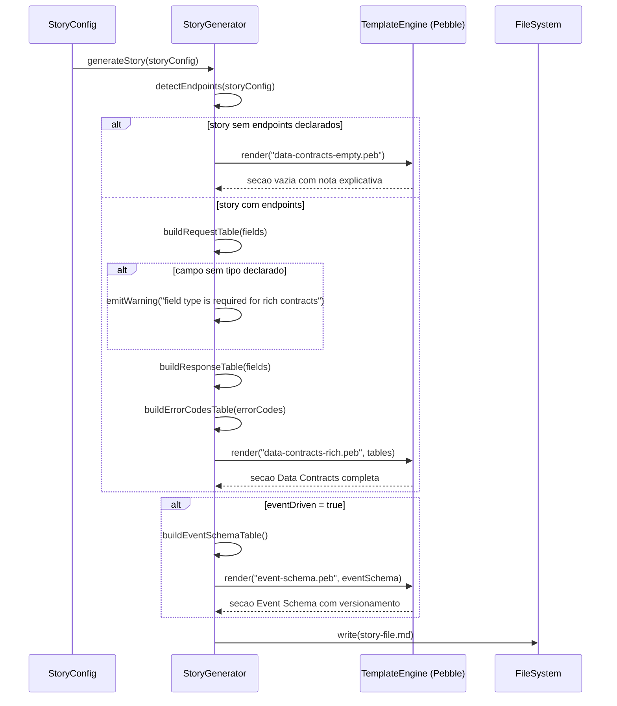
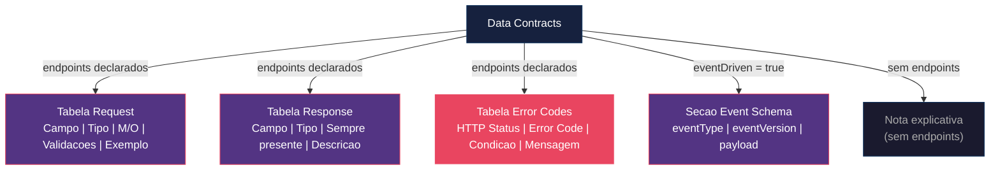

# Historia: Data Contracts Ricos nas Stories Geradas

**ID:** story-0017-0008
**Chave Jira:** —

## 1. Dependencias

| Blocked By | Blocks |
| :--- | :--- |
| -- | story-0017-0007 |

## 2. Regras Transversais Aplicaveis

| ID | Titulo |
| :--- | :--- |
| RULE-010 | Validacao de contratos API por tipo de interface |

## 3. Descricao

Como **Product Owner / Tech Lead**, eu quero ter stories geradas com data contracts que incluem tipos explicitos, validacoes e error codes mapeados, para que desenvolvedores implementem endpoints sem ambiguidade sobre tipos, validacoes e codigos de erro.

### Contexto

As stories geradas atualmente tem data contracts com notacao M/O e nomes de campos. Sem tipos explicitos, validacoes e error codes, o agente inventa. Esta story atualiza o template de story para gerar contratos ricos com informacoes completas para implementacao sem ambiguidade.

### 3.1 Tabela Request (novo formato)

O template de story passa a gerar tabelas Request com colunas expandidas:

| Campo | Tipo | M/O | Validacoes | Exemplo |
| :--- | :--- | :--- | :--- | :--- |
| `{field.name}` | `{field.type}` | `{M ou O}` | `{regras de validacao}` | `{exemplo concreto}` |

Tipos devem ser explicitos com formato: `UUID`, `BigDecimal`, `String(255)`, `Integer`, `List<String>`, etc.

### 3.2 Tabela Response (novo formato)

| Campo | Tipo | Sempre presente | Descricao |
| :--- | :--- | :--- | :--- |
| `{field.name}` | `{field.type}` | `{Sim ou Nao}` | `{descricao do campo}` |

### 3.3 Tabela Error Codes Mapeados (nova secao)

| HTTP Status | Error Code | Condicao | Mensagem (RFC 7807) |
| :--- | :--- | :--- | :--- |
| `{status}` | `{code}` | `{condicao que dispara}` | `{mensagem padrao}` |

Error codes seguem formato RFC 7807 (Problem Details for HTTP APIs) com campos `type`, `title`, `status`, `detail` e `instance`.

### 3.4 Secao Event Schema (para event-driven)

Para stories com `eventDriven: true`, o template gera uma secao adicional:

| Campo | Tipo | Obrigatorio | Descricao |
| :--- | :--- | :--- | :--- |
| `eventType` | `String` | Sim | Tipo do evento |
| `eventVersion` | `String` | Sim | Versao do schema do evento |
| `payload` | `Object` | Sim | Payload do evento |

Notas de versionamento incluem: backward compatibility, schema evolution strategy e deprecation policy.

## 3.5 Entrega de Valor

- **Valor Principal:** Stories geradas com tipos, validacoes e error codes precisos, eliminando ambiguidade na implementacao
- **Metrica de Sucesso:** Template de story inclui tabelas com colunas Tipo/Validacoes/Exemplo e Error Codes Mapeados
- **Impacto no Negocio:** APIs produzidas sao consistentes entre servicos, reduzindo bugs de integracao

## 4. Definicoes de Qualidade Locais

### DoR Local

- [ ] Template de story atual analisado (formato de data contracts existente documentado)
- [ ] Formato RFC 7807 (Problem Details) documentado e exemplificado
- [ ] Lista de tipos suportados definida (UUID, BigDecimal, String(N), Integer, List, etc.)
- [ ] Regras de validacao padrao catalogadas (min/max, regex, enum values, etc.)
- [ ] Formato de Event Schema com versionamento definido

### DoD Local

- [ ] Tabela Request gerada com colunas Campo/Tipo/M-O/Validacoes/Exemplo
- [ ] Tabela Response gerada com colunas Campo/Tipo/Sempre-presente/Descricao
- [ ] Tabela Error Codes Mapeados gerada com HTTP Status/Error Code/Condicao/Mensagem RFC 7807
- [ ] Story sem endpoints declarados gera secao Data Contracts vazia com nota explicativa
- [ ] Story com campo sem tipo declarado emite warning
- [ ] Story com eventDriven true gera secao Event Schema com eventVersion
- [ ] Golden file parity tests passam para stories com e sem endpoints
- [ ] Test plan gerado via `/x-test-plan` antes do inicio da implementacao
- [ ] Todo @GK-N da secao 7 mapeado para >= 1 AT-N na secao 8
- [ ] Cenarios Gherkin ordenados por TPP (degenerate -> happy -> error -> boundary)
- [ ] Todo AT-N com status GREEN antes de marcar DoD como concluido
- [ ] Commits seguem padrao test-first (teste precede ou acompanha implementacao no git log)

### Global DoD

- **Cobertura:** >= 95% Line, >= 90% Branch
- **Testes Automatizados:** Unit + Integration + Golden file parity
- **TDD Compliance:** Commits test-first, refactoring explicito
- **Backward Compatibility:** Zero regressao em profiles existentes
- **Double-Loop TDD:** Acceptance tests derivados dos cenarios Gherkin (outer loop), unit tests guiados por TPP (inner loop)
- **Rastreabilidade:** Todo @GK-N mapeia para >= 1 AT-N, todo AT-N referencia um @GK-N valido

## 5. Contratos de Dados

| Campo | Tipo | Obrigatorio | Descricao |
| :--- | :--- | :--- | :--- |
| `request.fields[].name` | `String` | Sim | Nome do campo no request |
| `request.fields[].type` | `String` | Sim | Tipo com formato (UUID, BigDecimal, String(255)) |
| `request.fields[].mandatory` | `boolean` | Sim | Obrigatoriedade do campo |
| `request.fields[].validations` | `String` | Sim | Regras de validacao (min/max, regex, enum values) |
| `request.fields[].example` | `String` | Sim | Exemplo concreto do valor |
| `errorCodes[].httpStatus` | `integer` | Sim | HTTP status code |
| `errorCodes[].code` | `String` | Sim | Codigo de erro (INVALID_AMOUNT, etc.) |
| `errorCodes[].condition` | `String` | Sim | Condicao que dispara o erro |
| `errorCodes[].message` | `String` | Sim | Mensagem padrao RFC 7807 |

## 6. Diagramas

### 6.1 Fluxo de Geracao de Data Contracts Ricos



### 6.2 Estrutura do Template de Data Contracts



## 7. Criterios de Aceite (Gherkin)

```gherkin
@GK-1
Cenario: Story sem endpoints declarados gera secao Data Contracts vazia com nota explicativa
  DADO que a story nao possui endpoints declarados
  E nao possui eventDriven configurado
  QUANDO o StoryGenerator gera o arquivo de story
  ENTAO a secao Data Contracts deve estar presente
  E deve conter uma nota explicativa indicando "Nenhum endpoint declarado nesta story"
  E NAO deve conter tabelas Request, Response ou Error Codes

@GK-2
Cenario: Story com endpoint REST gera tabela Request com colunas Tipo/Validacoes/Exemplo
  DADO que a story possui um endpoint REST com campos declarados
  E cada campo possui name, type, mandatory, validations e example
  QUANDO o StoryGenerator gera o arquivo de story
  ENTAO a tabela Request deve conter as colunas "Campo", "Tipo", "M/O", "Validacoes" e "Exemplo"
  E o campo type deve estar no formato explicito (UUID, BigDecimal, String(255))
  E o campo validations deve conter regras especificas (min/max, regex, enum values)
  E o campo example deve conter um valor concreto

@GK-3
Cenario: Story com endpoint REST gera tabela Error Codes Mapeados
  DADO que a story possui um endpoint REST com error codes declarados
  E cada error code possui httpStatus, code, condition e message
  QUANDO o StoryGenerator gera o arquivo de story
  ENTAO a tabela Error Codes Mapeados deve conter as colunas "HTTP Status", "Error Code", "Condicao" e "Mensagem (RFC 7807)"
  E as mensagens devem seguir o formato RFC 7807 (Problem Details)
  E cada error code deve ter uma condicao especifica que o dispara

@GK-4
Cenario: Story com campo sem tipo declarado emite warning
  DADO que a story possui um endpoint REST com campos declarados
  E pelo menos um campo NAO possui tipo (type) definido
  QUANDO o StoryGenerator processa os campos do endpoint
  ENTAO deve emitir um warning com a mensagem "field type is required for rich contracts"
  E o warning deve indicar o nome do campo sem tipo
  E a geracao da story deve continuar com o campo sem tipo marcado como pendente

@GK-5
Cenario: Story com eventDriven true gera secao Event Schema com versionamento
  DADO que a story possui eventDriven configurado como true
  QUANDO o StoryGenerator gera o arquivo de story
  ENTAO deve conter uma secao "Event Schema"
  E a tabela deve incluir o campo "eventVersion" com tipo String
  E deve conter notas de versionamento sobre backward compatibility
  E deve conter orientacoes sobre schema evolution strategy
```

### 7.1 Scenario Ordering (TPP)

> TPP: degenerate (story sem endpoints gera secao vazia, @GK-1) -> happy path (endpoint REST gera tabela Request rica, @GK-2; endpoint REST gera tabela Error Codes, @GK-3) -> error (campo sem tipo emite warning, @GK-4) -> boundary (eventDriven true gera Event Schema com versionamento, @GK-5).

### 7.2 Mandatory Scenario Categories

- [x] Degenerate cases (story sem endpoints gera secao vazia com nota, @GK-1)
- [x] Happy path (endpoint REST gera tabela Request, @GK-2; endpoint REST gera Error Codes, @GK-3)
- [x] Error paths (campo sem tipo emite warning, @GK-4)
- [x] Boundary values (eventDriven true gera Event Schema com versionamento, @GK-5)

## 8. Sub-tarefas

### Ciclos TDD

> Sub-tarefas TDD serao populadas apos geracao do test plan via `/x-test-plan`.
> Cada AT-N e UT-N do test plan gerara entradas [TDD] com ciclos RED/GREEN/REFACTOR.

### Tarefas nao-TDD

- [ ] [Doc] Documentar formato de Data Contracts ricos no README do template de story
- [ ] [Doc] Atualizar CHANGELOG.md com entrada na secao `Added` para tabelas Request/Response/Error Codes expandidas
- [ ] [Doc] Documentar formato RFC 7807 e secao Event Schema no guia de geracao de stories
