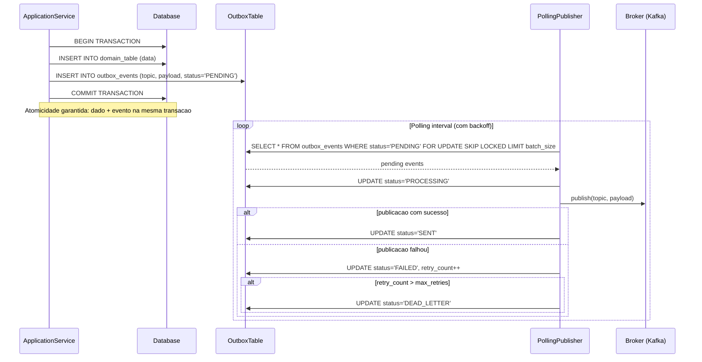
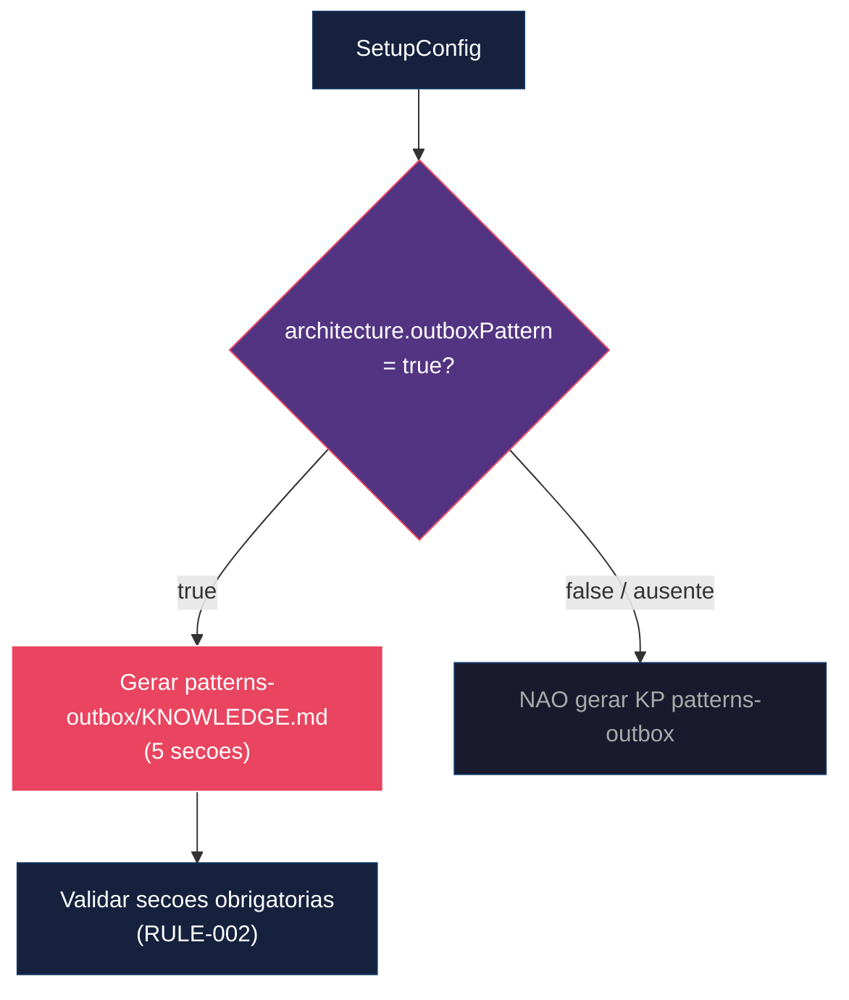

# Historia: KP patterns-outbox (Transactional Outbox Pattern)

**ID:** story-0017-0009
**Chave Jira:** —

## 1. Dependencias

| Blocked By | Blocks |
| :--- | :--- |
| story-0017-0003, story-0017-0004 | -- |

## 2. Regras Transversais Aplicaveis

| ID | Titulo |
| :--- | :--- |
| RULE-001 | Estrutura e convencoes de Knowledge Packs |
| RULE-002 | Validacao obrigatoria de secoes em KPs |

## 3. Descricao

Como **Desenvolvedor assistido por IA**, eu quero receber knowledge pack dedicado ao Transactional Outbox Pattern com polling publisher e CDC, para que o agente implemente garantia de entrega de eventos corretamente, sem publicar diretamente no broker dentro da transacao.

### Contexto

O Outbox pattern e critico para garantia de entrega em sistemas event-driven. Publicar eventos diretamente no broker dentro de uma transacao de banco de dados nao garante consistencia: se a transacao comita mas a publicacao falha, o evento se perde; se a publicacao ocorre mas a transacao falha, o evento e fantasma.

O KP `patterns-outbox` resolve este problema fornecendo ao agente conhecimento estruturado sobre o padrao Transactional Outbox com duas estrategias de publicacao (Polling Publisher e CDC).

### 3.1 Estrutura do KP patterns-outbox (5 secoes)

O Knowledge Pack contem 5 secoes obrigatorias:

1. **O Problema:** Por que save+publish nao garante consistencia. Cenarios de falha (commit sem publish, publish sem commit). Consequencias em producao (eventos perdidos, eventos fantasma).

2. **Solucao Transactional Outbox:** Schema SQL da tabela `outbox_events` com campos `id` (UUID PK), `topic` (VARCHAR(255)), `payload` (JSONB), `status` (VARCHAR(20)), `retry_count` (INTEGER), `created_at` (TIMESTAMP), `updated_at` (TIMESTAMP). Indice parcial em `status = 'PENDING'` para performance do polling.

3. **Polling Publisher:** Implementacao com locking otimista (SELECT FOR UPDATE SKIP LOCKED). Intervalo de polling com exponential backoff. Batch processing com tamanho configuravel. Transicoes de status: PENDING -> PROCESSING -> SENT (ou FAILED).

4. **CDC com Debezium:** Alternativa ao polling. Configuracao basica do Debezium connector. Vantagens (latencia menor, sem polling) e desvantagens (complexidade operacional). Quando usar CDC vs Polling Publisher.

5. **Anti-patterns do Outbox:** Publicar diretamente no broker dentro da transacao. Tabela outbox sem indice parcial. Polling sem backoff exponencial. Sem dead letter para eventos que excedem retry. Sem monitoramento de lag entre outbox e broker.

### 3.2 Ativacao Condicional

O KP e gerado apenas quando `architecture.outboxPattern = true` na configuracao do projeto. Configuracoes sem este campo ou com valor `false` nao geram o KP.

### 3.3 Schema SQL da Tabela outbox_events

```sql
CREATE TABLE outbox_events (
    id UUID PRIMARY KEY DEFAULT gen_random_uuid(),
    topic VARCHAR(255) NOT NULL,
    payload JSONB NOT NULL,
    status VARCHAR(20) NOT NULL DEFAULT 'PENDING',
    retry_count INTEGER NOT NULL DEFAULT 0,
    created_at TIMESTAMP NOT NULL DEFAULT NOW(),
    updated_at TIMESTAMP NOT NULL DEFAULT NOW()
);

CREATE INDEX idx_outbox_pending ON outbox_events (created_at)
    WHERE status = 'PENDING';
```

## 3.5 Entrega de Valor

- **Valor Principal:** Agente implementa garantia de entrega de eventos corretamente, evitando perda silenciosa de eventos em producao
- **Metrica de Sucesso:** KP contem 5 secoes; schema SQL da tabela outbox_events incluso; polling publisher com locking otimista
- **Impacto no Negocio:** Sistemas event-driven gerados garantem entrega de eventos, eliminando inconsistencias entre banco e broker

## 4. Definicoes de Qualidade Locais

### DoR Local

- [ ] Transactional Outbox Pattern documentado e exemplificado (referencia: Microservices Patterns, Chris Richardson)
- [ ] Schema SQL da tabela outbox_events definido e revisado
- [ ] Estrategias de publicacao (Polling Publisher e CDC) documentadas com trade-offs
- [ ] Anti-patterns do Outbox catalogados com exemplos de consequencias
- [ ] Story-0017-0003 e story-0017-0004 (dependencias) concluidas

### DoD Local

- [ ] KP patterns-outbox gerado em `skills/patterns-outbox/KNOWLEDGE.md`
- [ ] KP contem exatamente 5 secoes (Problema, Solucao, Polling, CDC, Anti-patterns)
- [ ] Schema SQL inclui tabela outbox_events com indice parcial em status PENDING
- [ ] Polling Publisher documenta locking otimista (SELECT FOR UPDATE SKIP LOCKED)
- [ ] Secao de anti-patterns presente e validada (RULE-002)
- [ ] Config sem `architecture.outboxPattern` NAO gera o KP
- [ ] Config com `outboxPattern: true` gera o KP completo
- [ ] Golden file parity tests passam para profile java-spring-event-driven
- [ ] Test plan gerado via `/x-test-plan` antes do inicio da implementacao
- [ ] Todo @GK-N da secao 7 mapeado para >= 1 AT-N na secao 8
- [ ] Cenarios Gherkin ordenados por TPP (degenerate -> happy -> error -> boundary)
- [ ] Todo AT-N com status GREEN antes de marcar DoD como concluido
- [ ] Commits seguem padrao test-first (teste precede ou acompanha implementacao no git log)

### Global DoD

- **Cobertura:** >= 95% Line, >= 90% Branch
- **Testes Automatizados:** Unit + Integration + Golden file parity
- **TDD Compliance:** Commits test-first, refactoring explicito
- **Backward Compatibility:** Zero regressao em profiles existentes
- **Double-Loop TDD:** Acceptance tests derivados dos cenarios Gherkin (outer loop), unit tests guiados por TPP (inner loop)
- **Rastreabilidade:** Todo @GK-N mapeia para >= 1 AT-N, todo AT-N referencia um @GK-N valido

## 5. Contratos de Dados

| Campo | Tipo | Obrigatorio | Descricao |
| :--- | :--- | :--- | :--- |
| `architecture.outboxPattern` | `boolean` | Nao | Ativa geracao do KP. Default: false |
| `outbox_events.id` | `UUID` | Sim | PK da tabela outbox |
| `outbox_events.topic` | `VARCHAR(255)` | Sim | Topico do broker destino |
| `outbox_events.payload` | `JSONB` | Sim | Payload serializado do evento |
| `outbox_events.status` | `VARCHAR(20)` | Sim | PENDING, PROCESSING, SENT, FAILED, DEAD_LETTER |
| `outbox_events.retry_count` | `INTEGER` | Sim | Contador de retentativas de publicacao |

## 6. Diagramas

### 6.1 Fluxo do Transactional Outbox com Polling Publisher



### 6.2 Geracao Condicional do KP



## 7. Criterios de Aceite (Gherkin)

```gherkin
@GK-1
Cenario: Config sem architecture.outboxPattern nao gera KP patterns-outbox
  DADO que o arquivo de configuracao NAO possui o campo "architecture.outboxPattern"
  QUANDO o gerador processa a configuracao
  ENTAO o diretorio "skills/patterns-outbox/" NAO deve existir no output
  E nenhum arquivo KNOWLEDGE.md deve ser gerado para patterns-outbox

@GK-2
Cenario: Config com outboxPattern true gera KP patterns-outbox com 5 secoes
  DADO que o arquivo de configuracao possui "architecture.outboxPattern" com valor true
  QUANDO o gerador processa a configuracao
  ENTAO o arquivo "skills/patterns-outbox/KNOWLEDGE.md" deve ser gerado
  E deve conter a secao "O Problema" explicando por que save+publish nao garante consistencia
  E deve conter a secao "Solucao Transactional Outbox" com schema SQL
  E deve conter a secao "Polling Publisher" com locking otimista
  E deve conter a secao "CDC com Debezium" como alternativa
  E deve conter a secao "Anti-patterns do Outbox" com pelo menos 5 anti-patterns

@GK-3
Cenario: KP gerado inclui schema SQL da tabela outbox_events com indice parcial
  DADO que o arquivo de configuracao possui "architecture.outboxPattern" com valor true
  QUANDO o gerador gera o KP patterns-outbox
  ENTAO o schema SQL deve conter a tabela "outbox_events"
  E a tabela deve ter os campos id (UUID), topic (VARCHAR), payload (JSONB), status (VARCHAR), retry_count (INTEGER)
  E deve conter um indice parcial "idx_outbox_pending" com clausula WHERE status = 'PENDING'

@GK-4
Cenario: KP gerado sem secao de anti-patterns falha validacao RULE-002
  DADO que o KP patterns-outbox foi gerado
  E a secao "Anti-patterns do Outbox" esta ausente ou vazia
  QUANDO o validador de KP executa a verificacao de secoes obrigatorias (RULE-002)
  ENTAO deve retornar erro de validacao
  E a mensagem deve indicar que a secao "Anti-patterns do Outbox" e obrigatoria
  E o KP deve ser marcado como invalido

@GK-5
Cenario: Profile java-spring-event-driven inclui KP patterns-outbox no golden file
  DADO que o profile "java-spring-event-driven" possui "architecture.outboxPattern: true"
  QUANDO o gerador processa o profile java-spring-event-driven
  ENTAO o golden file deve conter o arquivo "skills/patterns-outbox/KNOWLEDGE.md"
  E o conteudo do golden file deve passar na validacao de 5 secoes obrigatorias
  E o golden file test deve passar com byte-for-byte parity
```

### 7.1 Scenario Ordering (TPP)

> TPP: degenerate (config sem outboxPattern nao gera KP, @GK-1) -> happy path (outboxPattern true gera KP com 5 secoes, @GK-2; schema SQL com indice parcial, @GK-3) -> error (KP sem secao anti-patterns falha validacao, @GK-4) -> boundary (profile java-spring-event-driven inclui KP no golden file, @GK-5).

### 7.2 Mandatory Scenario Categories

- [x] Degenerate cases (config sem outboxPattern nao gera KP, @GK-1)
- [x] Happy path (outboxPattern true gera KP completo, @GK-2; schema SQL com indice, @GK-3)
- [x] Error paths (KP sem secao anti-patterns falha validacao RULE-002, @GK-4)
- [x] Boundary values (profile java-spring-event-driven no golden file, @GK-5)

## 8. Sub-tarefas

### Ciclos TDD

> Sub-tarefas TDD serao populadas apos geracao do test plan via `/x-test-plan`.
> Cada AT-N e UT-N do test plan gerara entradas [TDD] com ciclos RED/GREEN/REFACTOR.

### Tarefas nao-TDD

- [ ] [Doc] Documentar KP patterns-outbox no README de Knowledge Packs
- [ ] [Doc] Atualizar CHANGELOG.md com entrada na secao `Added` para KP patterns-outbox (Transactional Outbox Pattern)
- [ ] [Doc] Documentar campo `architecture.outboxPattern` no guia de configuracao do gerador
