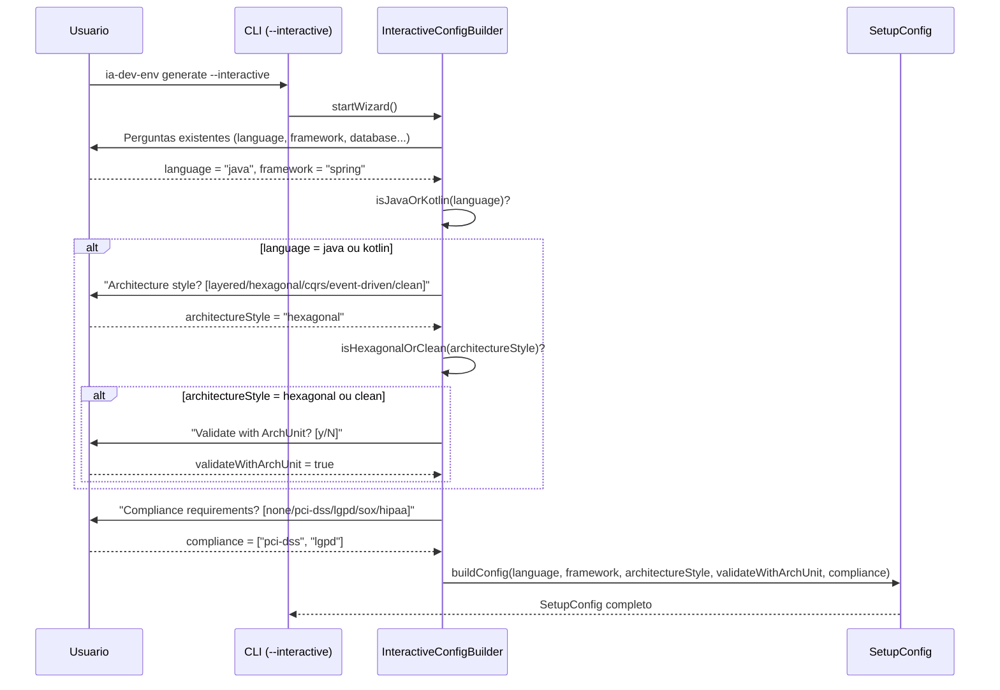
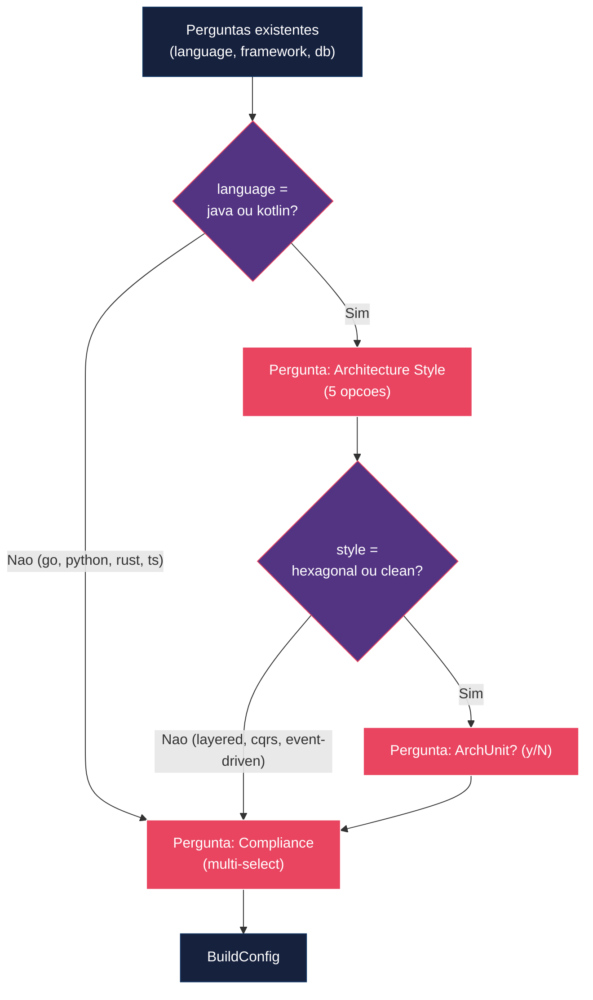

# Historia: Modo Interativo com Selecao de Estilo Arquitetural

**ID:** story-0017-0010
**Chave Jira:** —

## 1. Dependencias

| Blocked By | Blocks |
| :--- | :--- |
| story-0017-0002, story-0017-0003, story-0017-0006 | -- |

## 2. Regras Transversais Aplicaveis

| ID | Titulo |
| :--- | :--- |
| RULE-008 | Checklist condicional por flags de config |

## 3. Descricao

Como **Engenheiro de software**, eu quero selecionar estilo arquitetural e requisitos de compliance via wizard interativo do CLI, para que descubra e configure profiles avancados sem precisar conhecer os campos YAML manualmente.

### Contexto

O modo interativo atual (`--interactive`) coleta language, framework e database, mas nao oferece opcoes para `architecture.style` nem `compliance`. Usuarios que desconhecem a estrutura YAML perdem acesso a configuracoes avancadas que impactam diretamente a qualidade dos artefatos gerados.

Esta story adiciona 3 perguntas condicionais ao `InteractiveConfigBuilder`:

### 3.1 Pergunta 1: Architecture Style

- **Visivel apenas para:** `language = java` ou `language = kotlin`
- **Tipo:** Single-select
- **Opcoes:** `layered`, `hexagonal`, `cqrs`, `event-driven`, `clean`
- **Default:** `layered`
- **Mapeamento:** Resposta escrita em `architecture.style` no SetupConfig

### 3.2 Pergunta 2: Validate with ArchUnit

- **Visivel apenas se:** Architecture style selecionado e `hexagonal` ou `clean`
- **Tipo:** Confirmacao (y/N)
- **Default:** `N`
- **Mapeamento:** Resposta escrita em `architecture.validateWithArchUnit` no SetupConfig

### 3.3 Pergunta 3: Compliance Requirements

- **Visivel sempre** (independente de language)
- **Tipo:** Multi-select
- **Opcoes:** `none`, `pci-dss`, `lgpd`, `sox`, `hipaa`
- **Default:** `none`
- **Regra:** Selecao de `none` exclui todas as outras opcoes. Selecao de qualquer opcao diferente de `none` remove `none` da lista.
- **Mapeamento:** Resposta escrita em `compliance[]` no SetupConfig (lista vazia se `none`)

### 3.4 Fluxo Condicional

O wizard segue o fluxo:

1. Perguntas existentes (language, framework, database, etc.)
2. **Se** `language` e `java` ou `kotlin` **ENTAO** apresenta pergunta de Architecture Style
3. **Se** architecture style e `hexagonal` ou `clean` **ENTAO** apresenta pergunta de ArchUnit
4. Apresenta pergunta de Compliance Requirements (sempre)
5. Gera SetupConfig com todos os campos mapeados

## 3.5 Entrega de Valor

- **Valor Principal:** Usuarios descobrem e configuram estilos arquiteturais via wizard interativo, aumentando adocao de profiles avancados
- **Metrica de Sucesso:** Wizard apresenta pergunta de architectureStyle para java/kotlin; nao apresenta para go/python; respostas mapeadas corretamente para ArchitectureConfig
- **Impacto no Negocio:** Mais equipes adotam configuracoes avancadas do gerador, aumentando qualidade dos ambientes gerados

## 4. Definicoes de Qualidade Locais

### DoR Local

- [ ] InteractiveConfigBuilder atual analisado (fluxo de perguntas existente documentado)
- [ ] Estilos arquiteturais suportados definidos (layered, hexagonal, cqrs, event-driven, clean)
- [ ] Regras de visibilidade condicional das perguntas definidas e aprovadas
- [ ] Mapeamento de respostas para campos do SetupConfig definido
- [ ] Story-0017-0002, story-0017-0003 e story-0017-0006 (dependencias) concluidas

### DoD Local

- [ ] Pergunta de Architecture Style apresentada para java e kotlin
- [ ] Pergunta de Architecture Style NAO apresentada para go, python, rust, typescript
- [ ] Pergunta de ArchUnit apresentada apenas quando architecture style e hexagonal ou clean
- [ ] Pergunta de Compliance Requirements apresentada para todas as linguagens
- [ ] Selecao de architectureStyle mapeada corretamente para `architecture.style` no SetupConfig
- [ ] Selecao de ArchUnit mapeada corretamente para `architecture.validateWithArchUnit`
- [ ] Selecao de compliance mapeada corretamente para `compliance[]`
- [ ] Selecao de `none` resulta em lista vazia de compliance
- [ ] Golden file parity tests passam para todas as combinacoes testadas
- [ ] Test plan gerado via `/x-test-plan` antes do inicio da implementacao
- [ ] Todo @GK-N da secao 7 mapeado para >= 1 AT-N na secao 8
- [ ] Cenarios Gherkin ordenados por TPP (degenerate -> happy -> error -> boundary)
- [ ] Todo AT-N com status GREEN antes de marcar DoD como concluido
- [ ] Commits seguem padrao test-first (teste precede ou acompanha implementacao no git log)

### Global DoD

- **Cobertura:** >= 95% Line, >= 90% Branch
- **Testes Automatizados:** Unit + Integration + Golden file parity
- **TDD Compliance:** Commits test-first, refactoring explicito
- **Backward Compatibility:** Zero regressao em profiles existentes
- **Double-Loop TDD:** Acceptance tests derivados dos cenarios Gherkin (outer loop), unit tests guiados por TPP (inner loop)
- **Rastreabilidade:** Todo @GK-N mapeia para >= 1 AT-N, todo AT-N referencia um @GK-N valido

## 5. Contratos de Dados

| Campo | Tipo | Obrigatorio | Descricao |
| :--- | :--- | :--- | :--- |
| `interactiveStep.architectureStyle` | `enum(layered, hexagonal, cqrs, event-driven, clean)` | Nao | Estilo arquitetural selecionado no wizard. Visivel para java/kotlin |
| `interactiveStep.validateWithArchUnit` | `boolean` | Nao | Confirmacao de validacao com ArchUnit. Visivel para hexagonal/clean |
| `interactiveStep.compliance` | `List<enum(none, pci-dss, lgpd, sox, hipaa)>` | Nao | Selecao multi de requisitos de compliance |
| `interactiveStep.language` | `String` | Prerequisito | Linguagem ja selecionada nas perguntas anteriores do wizard |

## 6. Diagramas

### 6.1 Fluxo do Wizard Interativo com Perguntas Condicionais



### 6.2 Arvore de Decisao das Perguntas Condicionais



## 7. Criterios de Aceite (Gherkin)

```gherkin
@GK-1
Cenario: Wizard com language go nao apresenta pergunta de architectureStyle
  DADO que o usuario executa "ia-dev-env generate --interactive"
  E seleciona language "go" e framework "gin"
  QUANDO o InteractiveConfigBuilder processa as perguntas condicionais
  ENTAO a pergunta de "Architecture style" NAO deve ser apresentada
  E a pergunta de "Validate with ArchUnit" NAO deve ser apresentada
  E o wizard deve ir diretamente para a pergunta de "Compliance requirements"

@GK-2
Cenario: Wizard com language java apresenta pergunta de architectureStyle com 5 opcoes
  DADO que o usuario executa "ia-dev-env generate --interactive"
  E seleciona language "java" e framework "spring"
  QUANDO o InteractiveConfigBuilder processa as perguntas condicionais
  ENTAO a pergunta "Architecture style?" deve ser apresentada
  E deve oferecer as opcoes "layered", "hexagonal", "cqrs", "event-driven" e "clean"
  E o default deve ser "layered"

@GK-3
Cenario: Selecao de hexagonal com ArchUnit yes mapeia corretamente para ArchitectureConfig
  DADO que o usuario executa "ia-dev-env generate --interactive"
  E seleciona language "java" e framework "spring"
  E seleciona architectureStyle "hexagonal"
  E confirma validateWithArchUnit como "yes"
  QUANDO o InteractiveConfigBuilder gera o SetupConfig
  ENTAO o campo "architecture.style" deve ser "hexagonal"
  E o campo "architecture.validateWithArchUnit" deve ser true

@GK-4
Cenario: Selecao de compliance pci-dss e lgpd mapeia lista corretamente
  DADO que o usuario executa "ia-dev-env generate --interactive"
  E seleciona compliance ["pci-dss", "lgpd"]
  QUANDO o InteractiveConfigBuilder gera o SetupConfig
  ENTAO o campo "compliance" deve conter exatamente ["pci-dss", "lgpd"]
  E o campo "compliance" NAO deve conter "none"

@GK-5
Cenario: Selecao simultanea de none e pci-dss em compliance resulta em erro de validacao
  DADO que o usuario executa "ia-dev-env generate --interactive"
  E tenta selecionar compliance ["none", "pci-dss"] simultaneamente
  QUANDO o InteractiveConfigBuilder valida a selecao
  ENTAO uma mensagem de erro "Cannot select 'none' with other compliance options" deve ser exibida
  E o wizard deve solicitar nova selecao de compliance

@GK-6
Cenario: Selecao de hexagonal mostra pergunta de ArchUnit e selecao de layered nao mostra
  DADO que o usuario executa "ia-dev-env generate --interactive"
  E seleciona language "kotlin" e framework "ktor"
  QUANDO o usuario seleciona architectureStyle "hexagonal"
  ENTAO a pergunta "Validate with ArchUnit?" deve ser apresentada
  QUANDO o usuario seleciona architectureStyle "layered" em outra execucao
  ENTAO a pergunta "Validate with ArchUnit?" NAO deve ser apresentada
  E o campo "architecture.validateWithArchUnit" NAO deve existir no SetupConfig
```

### 7.1 Scenario Ordering (TPP)

> TPP: degenerate (language go nao apresenta architectureStyle, @GK-1) -> happy path (language java apresenta 5 opcoes, @GK-2; hexagonal + ArchUnit mapeia corretamente, @GK-3; compliance multi-select mapeia lista, @GK-4) -> error (none + pci-dss simultaneo, @GK-5) -> boundary (hexagonal mostra ArchUnit, layered nao mostra, @GK-6).

### 7.2 Mandatory Scenario Categories

- [x] Degenerate cases (language go nao apresenta architectureStyle, @GK-1)
- [x] Happy path (java apresenta 5 opcoes, @GK-2; hexagonal + ArchUnit, @GK-3; compliance multi-select, @GK-4)
- [x] Error paths (selecao invalida de none + pci-dss simultaneo, @GK-5)
- [x] Boundary values (hexagonal mostra ArchUnit, layered nao mostra, @GK-6)

## 8. Sub-tarefas

### Ciclos TDD

> Sub-tarefas TDD serao populadas apos geracao do test plan via `/x-test-plan`.
> Cada AT-N e UT-N do test plan gerara entradas [TDD] com ciclos RED/GREEN/REFACTOR.

### Tarefas nao-TDD

- [ ] [Doc] Documentar perguntas condicionais do wizard interativo no README do CLI
- [ ] [Doc] Atualizar CHANGELOG.md com entrada na secao `Added` para perguntas de architectureStyle, ArchUnit e compliance no modo interativo
- [ ] [Doc] Documentar mapeamento de respostas do wizard para campos do SetupConfig
