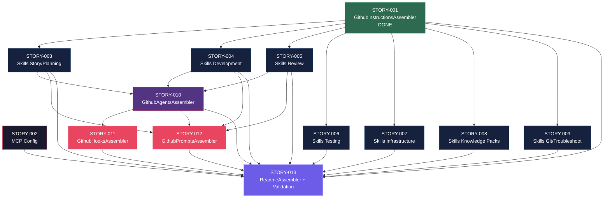

# Mapa de Implementacao — Estrutura `.github/` para GitHub Copilot

**Gerado a partir das dependencias BlockedBy/Blocks de cada historia do EPIC-001.**

---

## 0. Contexto Tecnico do Gerador

O `ia_dev_env` e um gerador Python que produz **AMBAS** as estruturas `.claude/` e `.github/` como saida. Nenhuma delas e mantida manualmente — ambas sao gitignored e regeneradas pelo pipeline.

**Arquitetura do pipeline:**

```
assembler/__init__.py
  -> _build_assemblers(resources_dir)   # lista ordenada de (name, assembler)
  -> run_pipeline(config, resources_dir, output_dir)
       -> _execute_assemblers()         # chama assembler.assemble() em sequencia
       -> atomic_output()               # escrita atomica no output_dir
```

**Padrao de cada assembler:**

```python
class XxxAssembler:
    def assemble(self, config: ProjectConfig, output_dir: Path, engine: TemplateEngine) -> List[Path]:
        # Le templates de resources/xxx-templates/
        # Renderiza com TemplateEngine + ProjectConfig
        # Escreve arquivos no output_dir
        # Retorna lista de caminhos gerados
```

**Cada historia desta epic envolve:**

1. **Assembler** — classe Python em `src/ia_dev_env/assembler/`
2. **Templates** — arquivos Jinja2 em `resources/<xxx>-templates/`
3. **Pipeline** — registro em `_build_assemblers()` no `__init__.py`
4. **Golden files** — arquivos de referencia em `tests/golden/<xxx>/`
5. **Testes** — cenarios byte-for-byte em `tests/test_byte_for_byte.py`

**Assemblers existentes (referencia):**

| Assembler | Saida | Status |
| :--- | :--- | :--- |
| `RulesAssembler` | `.claude/rules/` | Implementado |
| `SkillsAssembler` | `.claude/skills/` | Implementado |
| `AgentsAssembler` | `.claude/agents/` | Implementado |
| `HooksAssembler` | `.claude/hooks/` | Implementado |
| `ReadmeAssembler` | `.claude/README.md` | Implementado |
| `GithubInstructionsAssembler` | `.github/copilot-instructions.md`, `.github/instructions/` | **Done (STORY-001)** |

---

## 1. Matriz de Dependencias

| Story | Titulo | Blocked By | Blocks | Status |
| :--- | :--- | :--- | :--- | :--- |
| STORY-001 | Instructions globais e contextuais | — | STORY-003, 004, 005, 006, 007, 008, 009 | **Done** |
| STORY-002 | Configuracao MCP | — | STORY-013 | Pending |
| STORY-003 | Skills de Story/Planning | STORY-001 | STORY-010, 012 | Pending |
| STORY-004 | Skills de Development | STORY-001 | STORY-010, 012 | Pending |
| STORY-005 | Skills de Review | STORY-001 | STORY-010, 012 | Pending |
| STORY-006 | Skills de Testing | STORY-001 | STORY-013 | Pending |
| STORY-007 | Skills de Infrastructure | STORY-001 | STORY-013 | Pending |
| STORY-008 | Skills Knowledge Packs | STORY-001 | STORY-013 | Pending |
| STORY-009 | Skills de Git e Troubleshooting | STORY-001 | STORY-013 | Pending |
| STORY-010 | Custom Agents | STORY-003, 004, 005 | STORY-011, 012 | Pending |
| STORY-011 | Hooks | STORY-010 | STORY-013 | Pending |
| STORY-012 | Prompts de Composicao | STORY-003, 004, 005, 010 | STORY-013 | Pending |
| STORY-013 | README e Validacao Final | STORY-001..012 (todas) | — | Pending |

> **Nota:** STORY-001 era o gargalo estrutural — bloqueava 7 historias diretamente e esta **Done**. O `GithubInstructionsAssembler` implementado serve como referencia para todos os demais assemblers `.github/`. STORY-002 (MCP) e independente e pode ser executada em paralelo com qualquer fase. STORY-013 e o convergence point final que depende de todas as outras.

---

## 2. Fases de Implementacao

> As historias sao agrupadas em fases. Dentro de cada fase, as historias podem ser implementadas **em paralelo**. Uma fase so pode iniciar quando todas as dependencias das fases anteriores estiverem concluidas. Cada historia segue o padrao: assembler + templates + pipeline + golden files + testes.

```
+========================================================================================+
|                   FASE 0 — Foundation (paralelo)                                       |
|                                                                                        |
|   +-------------+                                           +-------------+            |
|   |  STORY-001  |  GithubInstructionsAssembler [DONE]       |  STORY-002  |  MCP       |
|   +------+------+                                           +------+------+            |
+==========#================================================================#=============+
           |                                                         |
           v                                                         |
+========================================================================================+
|                   FASE 1 — Core Skills (paralelo: 7 historias)                         |
|                   Cada skill: GithubSkillsAssembler + templates + golden files         |
|                                                                                        |
|   +-------------+  +-------------+  +-------------+  +-------------+                  |
|   |  STORY-003  |  |  STORY-004  |  |  STORY-005  |  |  STORY-006  |                  |
|   |  Story/Plan |  |  Dev Skills |  |  Review     |  |  Testing    |                  |
|   +------+------+  +------+------+  +------+------+  +-------------+                  |
|   +-------------+  +-------------+  +-------------+                                   |
|   |  STORY-007  |  |  STORY-008  |  |  STORY-009  |                                   |
|   |  Infra      |  |  Knowledge  |  |  Git/Trblsh |                                   |
|   +-------------+  +-------------+  +-------------+                                   |
+==========#================#================#============================================+
           |               |               |
           v               v               v
+========================================================================================+
|                   FASE 2 — Agents (1 historia)                                         |
|                   GithubAgentsAssembler + resources/github-agents-templates/            |
|                                                                                        |
|   +--------------------------------------------------------------------+               |
|   |  STORY-010  Custom Agents (.agent.md)                              |               |
|   |  Assembler: github_agents_assembler.py                             |               |
|   |  Templates: resources/github-agents-templates/*.agent.md.j2        |               |
|   |  (<- STORY-003, 004, 005)                                          |               |
|   +----------------------------------+---------------------------------+               |
+==================================#======================================================+
                                   |
                                   v
+========================================================================================+
|                   FASE 3 — Compositions/Cross-cutting (paralelo)                       |
|                                                                                        |
|   +-------------+                                           +-------------+            |
|   |  STORY-011  |  GithubHooksAssembler                     |  STORY-012  |            |
|   |  Hooks      |  resources/github-hooks-templates/        |  Prompts    |            |
|   |  (<- 010)   |  *.json.j2                                |  (<- 003,   |            |
|   +------+------+                                           |  004,005,   |            |
|          |                                                  |  010)       |            |
|          |                                  GithubPromptsAssembler       |            |
|          |                                  resources/github-prompts-templates/        |
|          |                                  *.prompt.md.j2  +------+------+            |
+==========+#================================================================#============+
           |                                                         |
           +-------------------------+-------------------------------+
                                     v
+========================================================================================+
|                   FASE 4 — Governanca e Validacao                                      |
|                                                                                        |
|   +--------------------------------------------------------------------+               |
|   |  STORY-013  ReadmeAssembler (estendido) + validate-github-structure.py             |
|   |  Estende template README para cobrir .claude/ E .github/           |               |
|   |  (<- todas as anteriores)                                          |               |
|   +--------------------------------------------------------------------+               |
+========================================================================================+
```

---

## 3. Caminho Critico

```
STORY-001 -> STORY-003 --+
             [DONE]       |
                          +---> STORY-010 -> STORY-011 --+
STORY-001 -> STORY-004 --+     github_     github_       +---> STORY-013
  [DONE]                  |     agents_    hooks_         |     ReadmeAssembler
                          |     assembler  assembler      |     (estendido)
STORY-001 -> STORY-005 --+     STORY-010 -> STORY-012 --+
  [DONE]                                    github_
                                            prompts_
                                            assembler
  Fase 0       Fase 1            Fase 2       Fase 3        Fase 4
```

**5 fases no caminho critico, 5 historias na cadeia mais longa (STORY-001 [Done] -> STORY-003 -> STORY-010 -> STORY-011 -> STORY-013).**

Qualquer atraso nas historias do caminho critico impacta diretamente o prazo final. STORY-010 (Agents / `GithubAgentsAssembler`) e o ponto de convergencia: depende de 3 historias da Fase 1 e bloqueia 2 da Fase 3.

---

## 4. Grafo de Dependencias (Mermaid)



---

## 5. Resumo por Fase

| Fase | Historias | Camada | Paralelismo | Pre-requisito |
| :--- | :--- | :--- | :--- | :--- |
| 0 | STORY-001 (**Done**), STORY-002 | Foundation | 2 paralelas | — |
| 1 | STORY-003, 004, 005, 006, 007, 008, 009 | Core Skills | 7 paralelas | STORY-001 (Done) |
| 2 | STORY-010 | Agents (`GithubAgentsAssembler`) | 1 | STORY-003, 004, 005 |
| 3 | STORY-011, STORY-012 | Compositions (`GithubHooksAssembler`, `GithubPromptsAssembler`) | 2 paralelas | STORY-010 |
| 4 | STORY-013 | Governanca (`ReadmeAssembler` estendido + validacao) | 1 | Todas as anteriores |

**Total: 13 historias em 5 fases. STORY-001 Done.**

> **Nota:** STORY-002 (MCP) e transversal — pode ser executada a qualquer momento entre Fase 0 e Fase 3, pois so e dependencia de STORY-013. Historias da Fase 1 que nao bloqueiam STORY-010 (STORY-006, 007, 008, 009) tambem sao folhas parciais e podem absorver atrasos.

---

## 6. Detalhamento por Fase

### Fase 0 — Foundation

| Story | Assembler | Templates | Artefatos Gerados |
| :--- | :--- | :--- | :--- |
| STORY-001 | `GithubInstructionsAssembler` | `resources/github-instructions-templates/` | `.github/copilot-instructions.md`, `.github/instructions/*.instructions.md` (5 arquivos) |
| STORY-002 | (a definir) | `resources/mcp-templates/` | `.github/copilot-mcp.json` |

**Entregas da Fase 0:**

- Base de contexto do Copilot operacional (instructions carregando automaticamente)
- Configuracao de MCP servers para integracoes externas
- Padrao de adaptacao (nao duplicacao) de conteudo validado
- **`GithubInstructionsAssembler` como referencia para todos os demais assemblers `.github/`**

### Fase 1 — Core Skills

| Story | Assembler | Templates | Artefatos Gerados |
| :--- | :--- | :--- | :--- |
| STORY-003 | (extensao do skills pipeline) | `resources/github-skills-templates/story-*` | `.github/skills/x-story-*/SKILL.md`, `story-planning/SKILL.md` |
| STORY-004 | (extensao do skills pipeline) | `resources/github-skills-templates/dev-*` | `.github/skills/x-dev-*/SKILL.md`, `layer-templates/SKILL.md` |
| STORY-005 | (extensao do skills pipeline) | `resources/github-skills-templates/review-*` | `.github/skills/x-review*/SKILL.md` |
| STORY-006 | (extensao do skills pipeline) | `resources/github-skills-templates/test-*` | `.github/skills/x-test-*/SKILL.md`, `run-*/SKILL.md` |
| STORY-007 | (extensao do skills pipeline) | `resources/github-skills-templates/infra-*` | `.github/skills/setup-environment/SKILL.md`, `k8s-*/SKILL.md`, etc. |
| STORY-008 | (extensao do skills pipeline) | `resources/github-skills-templates/knowledge-*` | `.github/skills/architecture/SKILL.md`, `coding-standards/SKILL.md`, etc. |
| STORY-009 | (extensao do skills pipeline) | `resources/github-skills-templates/git-*` | `.github/skills/x-git-push/SKILL.md`, `x-ops-troubleshoot/SKILL.md` |

**Entregas da Fase 1:**

- 36 skills geradas com frontmatter YAML valido e progressive disclosure
- Templates Jinja2 criados e golden files validados
- Padrao canonico de skill estabilizado (STORY-003 como referencia)
- Maximo paralelismo: 7 historias podem ser implementadas simultaneamente

### Fase 2 — Agents

| Story | Assembler | Templates | Artefatos Gerados |
| :--- | :--- | :--- | :--- |
| STORY-010 | `GithubAgentsAssembler` | `resources/github-agents-templates/*.agent.md.j2` | `.github/agents/*.agent.md` (10 agents) |

**Entregas da Fase 2:**

- `GithubAgentsAssembler` implementado e registrado no pipeline
- 10 templates Jinja2 criados em `resources/github-agents-templates/`
- 10 agents gerados com tool boundaries explicitas (whitelist + blacklist)
- Golden files criados e testes byte-for-byte passando

### Fase 3 — Compositions/Cross-cutting

| Story | Assembler | Templates | Artefatos Gerados |
| :--- | :--- | :--- | :--- |
| STORY-011 | `GithubHooksAssembler` | `resources/github-hooks-templates/*.json.j2` | `.github/hooks/*.json` (3 hooks) |
| STORY-012 | `GithubPromptsAssembler` | `resources/github-prompts-templates/*.prompt.md.j2` | `.github/prompts/*.prompt.md` (4 prompts) |

**Entregas da Fase 3:**

- `GithubHooksAssembler` e `GithubPromptsAssembler` implementados e registrados no pipeline
- Templates Jinja2 criados para hooks e prompts
- Hooks cobrindo os mesmos checkpoints de `.claude/hooks/` (gerado) + adicionais
- Prompts orquestrando workflows completos (feature, decomposicao, review, troubleshoot)
- Golden files criados e testes byte-for-byte passando para ambos

### Fase 4 — Governanca e Validacao

| Story | Assembler | Templates | Artefatos Gerados |
| :--- | :--- | :--- | :--- |
| STORY-013 | `ReadmeAssembler` (estendido) | `resources/readme-templates/` (atualizado) | README.md cobrindo `.claude/` e `.github/`, Relatorio Go/No-Go |

**Entregas da Fase 4:**

- Template README estendido para documentar AMBAS as estruturas geradas
- README gerado com arvore, mapeamento e convencoes de `.claude/` e `.github/`
- Script `scripts/validate-github-structure.py` para validacao end-to-end
- Validacao transversal de 100% dos artefatos gerados (ambas saidas)
- Relatorio Go/No-Go com decisao de adocao
- Golden files atualizados e testes passando

---

## 7. Observacoes Estrategicas

### STORY-001 Done — Referencia Estabelecida

**STORY-001** (Instructions) era o maior gargalo estrutural e esta **Done**. O `GithubInstructionsAssembler` implementado serve como padrao de referencia para todos os demais assemblers `.github/`:

- Padrao de `assemble()` com `ProjectConfig`, `output_dir`, `TemplateEngine`
- Uso de templates Jinja2 em `resources/github-instructions-templates/`
- Registro em `_build_assemblers()` no `assembler/__init__.py`
- Golden files e testes byte-for-byte

### Padrao de Implementacao por Historia

Cada historia segue o mesmo ciclo:

1. Criar assembler em `src/ia_dev_env/assembler/github_<xxx>_assembler.py`
2. Criar templates em `resources/github-<xxx>-templates/`
3. Registrar em `_build_assemblers()` no `__init__.py`
4. Criar golden files em `tests/golden/github-<xxx>/`
5. Adicionar cenarios em `tests/test_byte_for_byte.py`

### Historias Folha (sem dependentes diretos)

- **STORY-002** (MCP) — independente, pode ser executada a qualquer momento
- **STORY-006** (Testing), **STORY-007** (Infra), **STORY-008** (Knowledge), **STORY-009** (Git/Troubleshoot) — bloqueiam apenas STORY-013 (validacao final)

Estas historias sao candidatas a absorver atrasos sem impactar o caminho critico. Se houver restricao de recursos, podem ser priorizadas abaixo de STORY-003, 004, 005 (que bloqueiam STORY-010).

### Otimizacao de Tempo

- **Fase 1 e o ponto de maximo paralelismo** com 7 historias simultaneas. A alocacao ideal e 3+ desenvolvedores focados em STORY-003/004/005 (caminho critico) e os demais em STORY-006..009 (skills complementares)
- **STORY-002** pode comecar imediatamente (STORY-001 Done)
- **Fase 3** permite 2 streams paralelos (Hooks e Prompts)

### Dependencias Cruzadas

**STORY-010** (Agents / `GithubAgentsAssembler`) e o principal ponto de convergencia — depende de 3 skills core (003, 004, 005) e bloqueia tanto Hooks (011) quanto Prompts (012). Qualquer atraso em STORY-003, 004 ou 005 impacta STORY-010 e cascateia para Fases 3 e 4.

**STORY-012** (Prompts / `GithubPromptsAssembler`) tem a maior fan-in: depende de STORY-003, 004, 005 e 010 — converge 4 ramos de dependencia. Note que `GithubPromptsAssembler` nao tem equivalente no lado `.claude/` — e exclusivo para `.github/`.

### Marco de Validacao Arquitetural

**STORY-003** (Skills de Story/Planning) deve servir como checkpoint arquitetural. Ela estabelece:
- O padrao de frontmatter YAML (name + description)
- A estrategia de progressive disclosure (3 niveis)
- A abordagem de referencia vs duplicacao (RULE-003)
- A excecao de idioma pt-BR (RULE-004)
- O padrao de templates Jinja2 + golden files para skills

Uma vez que STORY-003 esta validada, todas as demais skills (STORY-004..009) podem seguir o mesmo padrao com confianca. Validar STORY-003 antes de expandir para as demais skills reduz retrabalho significativamente.
