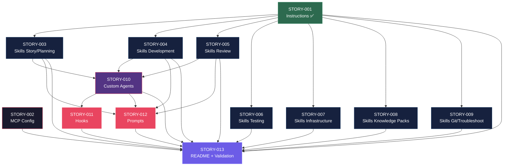

# Mapa de Implementação — Estrutura `.github/` para GitHub Copilot

**Gerado a partir das dependências BlockedBy/Blocks de cada história do EPIC-001.**

---

## 0. Contexto Técnico do Gerador

Este mapa descreve a implementação da estrutura `.github/` **dentro do gerador `claude_setup`** — um CLI Python que produz tanto `.claude/` quanto `.github/` a partir de templates e `ProjectConfig`.

### Arquitetura do Gerador

```
src/claude_setup/
├── assembler/              # Assemblers: cada um gera um grupo de artefatos
│   ├── __init__.py         # _build_assemblers() → run_pipeline()
│   ├── agents.py           # AgentsAssembler (.claude/agents/)
│   ├── hooks_assembler.py  # HooksAssembler (.claude/hooks/)
│   ├── readme_assembler.py # ReadmeAssembler (.claude/README)
│   ├── github_instructions_assembler.py  # ← STORY-001 (já implementado)
│   ├── github_agents_assembler.py        # ← STORY-010
│   ├── github_hooks_assembler.py         # ← STORY-011
│   └── github_prompts_assembler.py       # ← STORY-012
├── __main__.py             # CLI entry point + _classify_files()
├── models.py               # ProjectConfig, PipelineResult
└── template_engine.py      # Jinja2 + {placeholder} replacement
resources/                  # Templates de entrada
├── agents-templates/       # Templates .claude/agents/
├── hooks-templates/        # Templates .claude/hooks/
├── github-instructions-templates/  # ← STORY-001 (já implementado)
├── github-agents-templates/        # ← STORY-010
├── github-hooks-templates/         # ← STORY-011
└── github-prompts-templates/       # ← STORY-012
tests/
├── test_byte_for_byte.py   # Golden file tests (byte-for-byte comparison)
├── test_pipeline.py        # Pipeline integration tests (contagem de artefatos)
└── golden/                 # Arquivos esperados para comparação
```

### Padrão de Implementação por Story

Cada story envolve **4 artefatos de código**:

1. **Assembler class** — `src/claude_setup/assembler/github_*_assembler.py` com `assemble(config, output_dir, engine) -> List[Path]`
2. **Resource templates** — `resources/github-*-templates/` com placeholders `{VARIABLE}`
3. **Pipeline registration** — Registrar assembler em `assembler/__init__.py` → `_build_assemblers()` e classificação em `__main__.py` → `_classify_files()`
4. **Golden files + tests** — Regenerar `tests/golden/`, atualizar contagens em `test_pipeline.py`

### Status de STORY-001

**STORY-001 (Instructions) já está implementada.** O `GithubInstructionsAssembler` em `src/claude_setup/assembler/github_instructions_assembler.py` serve como **referência de implementação** para todas as demais stories `.github/`. Ele:

- Recebe `resources_dir` no construtor
- Implementa `assemble(config, output_dir, engine) -> List[Path]`
- Usa `TemplateEngine.replace_placeholders()` para processar templates
- Gera arquivos em `output_dir/github/`
- Está registrado em `_build_assemblers()`

---

## 1. Matriz de Dependências

| Story | Título | Blocked By | Blocks | Status |
| :--- | :--- | :--- | :--- | :--- |
| STORY-001 | Instructions globais e contextuais | — | STORY-003, 004, 005, 006, 007, 008, 009 | **Done** |
| STORY-002 | Configuração MCP | — | STORY-013 | Pending |
| STORY-003 | Skills de Story/Planning | STORY-001 | STORY-010, 012 | Pending |
| STORY-004 | Skills de Development | STORY-001 | STORY-010, 012 | Pending |
| STORY-005 | Skills de Review | STORY-001 | STORY-010, 012 | Pending |
| STORY-006 | Skills de Testing | STORY-001 | STORY-013 | Pending |
| STORY-007 | Skills de Infrastructure | STORY-001 | STORY-013 | Pending |
| STORY-008 | Skills Knowledge Packs | STORY-001 | STORY-013 | Pending |
| STORY-009 | Skills de Git e Troubleshooting | STORY-001 | STORY-013 | Pending |
| STORY-010 | Custom Agents | STORY-003, 004, 005 | STORY-011, 012 | Pending |
| STORY-011 | Hooks | STORY-010 | STORY-013 | Pending |
| STORY-012 | Prompts de Composição | STORY-003, 004, 005, 010 | STORY-013 | Pending |
| STORY-013 | README e Validação Final | STORY-001..012 (todas) | — | Pending |

> **Nota:** STORY-001 é o gargalo estrutural — bloqueia 7 histórias diretamente. **Já está implementada**, desbloqueando toda a Fase 1. STORY-002 (MCP) é independente e pode ser executada em paralelo com qualquer fase. STORY-013 é o convergence point final que depende de todas as outras.

---

## 2. Fases de Implementação

> As histórias são agrupadas em fases. Dentro de cada fase, as histórias podem ser implementadas **em paralelo**. Uma fase só pode iniciar quando todas as dependências das fases anteriores estiverem concluídas.

```
╔══════════════════════════════════════════════════════════════════════════════════════╗
║                   FASE 0 — Foundation (paralelo)                                    ║
║                                                                                     ║
║   ┌─────────────┐                                           ┌─────────────┐         ║
║   │  STORY-001  │  Instructions globais e contextuais  ✅   │  STORY-002  │  MCP    ║
║   └──────┬──────┘                                           └──────┬──────┘         ║
╚══════════╪══════════════════════════════════════════════════════════╪═════════════════╝
           │                                                         │
           ▼                                                         │
╔══════════════════════════════════════════════════════════════════════════════════════╗
║                   FASE 1 — Core Skills (paralelo: 7 histórias)                      ║
║                                                                                     ║
║   ┌─────────────┐  ┌─────────────┐  ┌─────────────┐  ┌─────────────┐               ║
║   │  STORY-003  │  │  STORY-004  │  │  STORY-005  │  │  STORY-006  │               ║
║   │  Story/Plan │  │  Dev Skills │  │  Review     │  │  Testing    │               ║
║   └──────┬──────┘  └──────┬──────┘  └──────┬──────┘  └─────────────┘               ║
║   ┌─────────────┐  ┌─────────────┐  ┌─────────────┐                                ║
║   │  STORY-007  │  │  STORY-008  │  │  STORY-009  │                                ║
║   │  Infra      │  │  Knowledge  │  │  Git/Trblsh │                                ║
║   └─────────────┘  └─────────────┘  └─────────────┘                                ║
╚══════════╪═══════════════╪═══════════════╪══════════════════════════════════════════╝
           │               │               │
           ▼               ▼               ▼
╔══════════════════════════════════════════════════════════════════════════════════════╗
║                   FASE 2 — Agents (1 história)                                      ║
║                                                                                     ║
║   ┌──────────────────────────────────────────────────────────────────┐               ║
║   │  STORY-010  Custom Agents (.agent.md)                           │               ║
║   │  (← STORY-003, 004, 005)                                       │               ║
║   └──────────────────────────────┬───────────────────────────────────┘               ║
╚══════════════════════════════════╪═══════════════════════════════════════════════════╝
                                   │
                                   ▼
╔══════════════════════════════════════════════════════════════════════════════════════╗
║                   FASE 3 — Compositions/Cross-cutting (paralelo)                    ║
║                                                                                     ║
║   ┌─────────────┐                                           ┌─────────────┐         ║
║   │  STORY-011  │  Hooks (.json)                            │  STORY-012  │ Prompts ║
║   │  (← 010)   │                                           │  (← 003,    │         ║
║   └──────┬──────┘                                           │  004,005,   │         ║
║          │                                                  │  010)       │         ║
║          │                                                  └──────┬──────┘         ║
╚══════════╪══════════════════════════════════════════════════════════╪═════════════════╝
           │                                                         │
           └─────────────────────────┬───────────────────────────────┘
                                     ▼
╔══════════════════════════════════════════════════════════════════════════════════════╗
║                   FASE 4 — Governança e Validação                                   ║
║                                                                                     ║
║   ┌──────────────────────────────────────────────────────────────────┐               ║
║   │  STORY-013  README + Validação End-to-End                       │               ║
║   │  (← todas as anteriores)                                        │               ║
║   └──────────────────────────────────────────────────────────────────┘               ║
╚══════════════════════════════════════════════════════════════════════════════════════╝
```

---

## 3. Caminho Crítico

```
STORY-001 → STORY-003 ──┐
                         ├──→ STORY-010 → STORY-011 ──┐
STORY-001 → STORY-004 ──┤                             ├──→ STORY-013
                         │                             │
STORY-001 → STORY-005 ──┘    STORY-010 → STORY-012 ──┘
  Fase 0       Fase 1            Fase 2       Fase 3        Fase 4
  (Done)
```

**5 fases no caminho crítico, 5 histórias na cadeia mais longa (STORY-001 → STORY-003 → STORY-010 → STORY-011 → STORY-013).**

Qualquer atraso nas histórias do caminho crítico impacta diretamente o prazo final. STORY-010 (Agents) é o ponto de convergência: depende de 3 histórias da Fase 1 e bloqueia 2 da Fase 3.

---

## 4. Grafo de Dependências (Mermaid)



---

## 5. Resumo por Fase

| Fase | Histórias | Camada | Paralelismo | Pré-requisito | Artefatos de Código por Story |
| :--- | :--- | :--- | :--- | :--- | :--- |
| 0 | STORY-001 (**Done**), STORY-002 | Foundation | 2 paralelas | — | Assembler + templates + pipeline registration + golden files |
| 1 | STORY-003, 004, 005, 006, 007, 008, 009 | Core Skills | 7 paralelas | STORY-001 (**Done**) | Assembler + templates + pipeline registration + golden files |
| 2 | STORY-010 | Agents | 1 | STORY-003, 004, 005 | `github_agents_assembler.py` + `github-agents-templates/` + pipeline + golden files |
| 3 | STORY-011, STORY-012 | Compositions/Cross-cutting | 2 paralelas | STORY-010 | `github_hooks_assembler.py` / `github_prompts_assembler.py` + templates + pipeline + golden files |
| 4 | STORY-013 | Governança | 1 | Todas as anteriores | Extensão de `ReadmeAssembler` + `validate_github_structure.py` + testes de integração |

**Total: 13 histórias em 5 fases.**

> **Nota:** STORY-002 (MCP) é transversal — pode ser executada a qualquer momento entre Fase 0 e Fase 3, pois só é dependência de STORY-013. Histórias da Fase 1 que não bloqueiam STORY-010 (STORY-006, 007, 008, 009) também são folhas parciais e podem absorver atrasos. **STORY-001 já está implementada**, desbloqueando imediatamente toda a Fase 1.

---

## 6. Detalhamento por Fase

### Fase 0 — Foundation

| Story | Escopo Principal | Artefatos Chave (Gerador) |
| :--- | :--- | :--- |
| STORY-001 (**Done**) | Instructions globais e contextuais | `GithubInstructionsAssembler` + `resources/github-instructions-templates/` + golden files |
| STORY-002 | Configuração MCP | Novo assembler MCP + templates JSON + pipeline registration + golden files |

**Entregas da Fase 0:**

- `GithubInstructionsAssembler` operacional e registrado no pipeline (**concluído**)
- Base de contexto do Copilot operacional (instructions carregando automaticamente)
- Padrão de adaptação (não duplicação) de conteúdo de `.claude/` validado
- **Referência de implementação** estabelecida para todas as demais stories

### Fase 1 — Core Skills

| Story | Escopo Principal | Artefatos Chave (Gerador) |
| :--- | :--- | :--- |
| STORY-003 | Skills de Story/Planning (5 skills) | Skills assembler(s) + `resources/github-skills-templates/story-planning/` + golden files |
| STORY-004 | Skills de Development (3 skills) | Skills assembler(s) + `resources/github-skills-templates/development/` + golden files |
| STORY-005 | Skills de Review (6 skills) | Skills assembler(s) + `resources/github-skills-templates/review/` + golden files |
| STORY-006 | Skills de Testing (6 skills) | Skills assembler(s) + `resources/github-skills-templates/testing/` + golden files |
| STORY-007 | Skills de Infrastructure (5 skills) | Skills assembler(s) + `resources/github-skills-templates/infrastructure/` + golden files |
| STORY-008 | Skills Knowledge Packs (9 skills) | Skills assembler(s) + `resources/github-skills-templates/knowledge/` + golden files |
| STORY-009 | Skills de Git e Troubleshooting (2 skills) | Skills assembler(s) + `resources/github-skills-templates/git-ops/` + golden files |

**Entregas da Fase 1:**

- 36 skills geradas pelo pipeline com frontmatter YAML válido e progressive disclosure
- Padrão canônico de skill estabilizado (STORY-003 como referência)
- Máximo paralelismo: 7 histórias podem ser implementadas simultaneamente
- Assemblers registrados no pipeline, golden files e `test_pipeline.py` atualizados

### Fase 2 — Agents

| Story | Escopo Principal | Artefatos Chave (Gerador) |
| :--- | :--- | :--- |
| STORY-010 | 10 Custom Agents | `GithubAgentsAssembler` em `src/claude_setup/assembler/github_agents_assembler.py` + `resources/github-agents-templates/` (10 templates) + pipeline registration + golden files |

**Entregas da Fase 2:**

- `GithubAgentsAssembler` gera 10 agents com tool boundaries explícitas (whitelist + blacklist)
- Templates com frontmatter YAML contendo `tools` / `disallowed-tools`
- Coerência persona-tools validada via testes unitários
- Assembler registrado em `_build_assemblers()`, contagem atualizada em `test_pipeline.py`

### Fase 3 — Compositions/Cross-cutting

| Story | Escopo Principal | Artefatos Chave (Gerador) |
| :--- | :--- | :--- |
| STORY-011 | 3 Hooks determinísticos | `GithubHooksAssembler` em `src/claude_setup/assembler/github_hooks_assembler.py` + `resources/github-hooks-templates/` (3 templates JSON) + pipeline registration + golden files |
| STORY-012 | 4 Prompts de composição | `GithubPromptsAssembler` em `src/claude_setup/assembler/github_prompts_assembler.py` + `resources/github-prompts-templates/` (4 templates) + pipeline registration + golden files |

**Entregas da Fase 3:**

- `GithubHooksAssembler` gera hooks JSON referenciando mesmos scripts de `.claude/hooks/`
- `GithubPromptsAssembler` gera prompts orquestrando workflows completos
- Ambos assemblers registrados no pipeline, golden files regenerados

### Fase 4 — Governança e Validação

| Story | Escopo Principal | Artefatos Chave (Gerador) |
| :--- | :--- | :--- |
| STORY-013 | README + Validação End-to-End | Extensão de `ReadmeAssembler` + `scripts/validate_github_structure.py` + testes de integração em `test_pipeline.py` |

**Entregas da Fase 4:**

- `ReadmeAssembler` estendido para documentar toda a estrutura `.github/` gerada
- Script de validação automatizada com relatório Go/No-Go
- Testes de integração que executam `run_pipeline()` e validam 100% dos artefatos
- Golden files finais incluindo `.github/README.md` com árvore completa

---

## 7. Observações Estratégicas

### STORY-001 Já Implementada

**STORY-001** (Instructions) — o maior gargalo estrutural — **já está implementada**. O `GithubInstructionsAssembler` está operacional e registrado no pipeline. Isso:

- **Desbloqueia imediatamente** toda a Fase 1 (7 stories de skills)
- **Estabelece o padrão de implementação** que todas as demais stories `.github/` devem seguir
- **Valida a arquitetura** do gerador para estrutura `.github/` (path conventions, template engine integration, pipeline registration)

### Padrão Canônico por Story

Toda story `.github/` segue o mesmo padrão de implementação:

1. Assembler class com `assemble(config, output_dir, engine) -> List[Path]`
2. Resource templates em `resources/github-*-templates/`
3. Registration em `_build_assemblers()` + classificação em `_classify_files()`
4. Golden files em `tests/golden/github/` + contagem em `test_pipeline.py`

### Histórias Folha (sem dependentes diretos)

- **STORY-002** (MCP) — independente, pode ser executada a qualquer momento
- **STORY-006** (Testing), **STORY-007** (Infra), **STORY-008** (Knowledge), **STORY-009** (Git/Troubleshoot) — bloqueiam apenas STORY-013 (validação final)

Estas histórias são candidatas a absorver atrasos sem impactar o caminho crítico. Se houver restrição de recursos, podem ser priorizadas abaixo de STORY-003, 004, 005 (que bloqueiam STORY-010).

### Otimização de Tempo

- **Fase 1 é o ponto de máximo paralelismo** com 7 histórias simultâneas. A alocação ideal é 3+ desenvolvedores focados em STORY-003/004/005 (caminho crítico) e os demais em STORY-006..009 (skills complementares)
- **STORY-002** pode começar imediatamente (STORY-001 já concluída)
- **Fase 3** permite 2 streams paralelos (Hooks e Prompts)

### Dependências Cruzadas

**STORY-010** (Agents) é o principal ponto de convergência — depende de 3 skills core (003, 004, 005) e bloqueia tanto Hooks (011) quanto Prompts (012). Qualquer atraso em STORY-003, 004 ou 005 impacta STORY-010 e cascateia para Fases 3 e 4.

**STORY-012** (Prompts) tem a maior fan-in: depende de STORY-003, 004, 005 e 010 — converge 4 ramos de dependência.

### Marco de Validação Arquitetural

**STORY-003** (Skills de Story/Planning) deve servir como checkpoint arquitetural. Ela estabelece:
- O padrão de frontmatter YAML (name + description)
- A estratégia de progressive disclosure (3 níveis)
- A abordagem de referência vs duplicação (RULE-003)
- A exceção de idioma pt-BR (RULE-004)

Uma vez que STORY-003 está validada, todas as demais skills (STORY-004..009) podem seguir o mesmo padrão com confiança. Validar STORY-003 antes de expandir para as demais skills reduz retrabalho significativamente.
