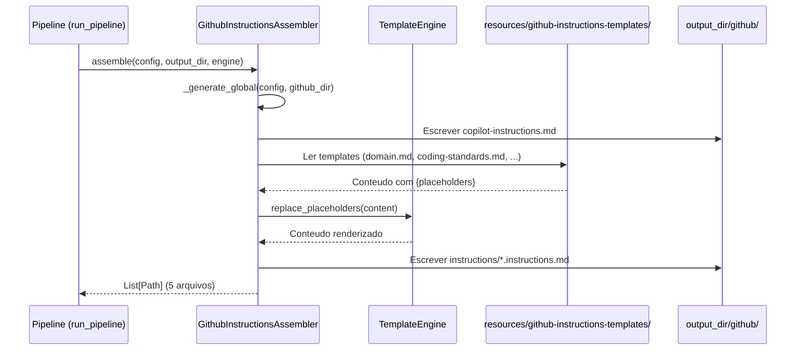

# Historia: Instructions Globais e Contextuais do Copilot

**ID:** STORY-001
**Status:** IMPLEMENTADA

## 1. Dependencias

| Blocked By | Blocks |
| :--- | :--- |
| — | STORY-003, STORY-004, STORY-005, STORY-006, STORY-007, STORY-008, STORY-009 |

## 2. Regras Transversais Aplicaveis

| ID | Titulo |
| :--- | :--- |
| RULE-001 | Paridade funcional |
| RULE-002 | Convencoes do Copilot |
| RULE-003 | Sem duplicacao de conteudo |
| RULE-004 | Idioma |

## 3. Descricao

Como **Tech Lead de Plataforma**, eu quero que o gerador `claude_setup` produza `copilot-instructions.md` e `instructions/*.instructions.md` adaptando as 5 rules de `.claude/rules/`, garantindo que o Copilot carregue contexto global e contextual seguindo suas convencoes nativas.

Este e o alicerce de toda a estrutura `.github/`. O arquivo `copilot-instructions.md` e carregado automaticamente em toda interacao do Copilot (equivalente ao carregamento automatico das rules do Claude Code). Os arquivos `.instructions.md` sao carregados condicionalmente quando relevantes.

O mapeamento e:
- `01-project-identity.md` -> `copilot-instructions.md` (global, auto-incluido)
- `02-domain.md` -> `instructions/domain.instructions.md`
- `03-coding-standards.md` -> `instructions/coding-standards.instructions.md`
- `04-architecture-summary.md` -> `instructions/architecture.instructions.md`
- `05-quality-gates.md` -> `instructions/quality-gates.instructions.md`

### 3.1 Arquivo Global (copilot-instructions.md)

- Gerado pelo assembler a partir de `ProjectConfig` (nao de template)
- Inclui: nome do projeto, stack, idioma, constraints
- Sem YAML frontmatter (convencao Copilot para o arquivo global)
- Referencia instructions contextuais sem duplicar conteudo

### 3.2 Instructions Contextuais (instructions/*.instructions.md)

- Geradas a partir de templates Jinja2 em `resources/github-instructions-templates/`
- Placeholders substituidos pelo `TemplateEngine` com valores de `ProjectConfig`
- Extensao obrigatoria: `.instructions.md`
- Links relativos para referencias detalhadas em `.claude/skills/`

### 3.3 Estrutura de Diretorios (gerada)

- `github/copilot-instructions.md` — gerado dentro do output_dir
- `github/instructions/domain.instructions.md`
- `github/instructions/coding-standards.instructions.md`
- `github/instructions/architecture.instructions.md`
- `github/instructions/quality-gates.instructions.md`

### 3.4 Contexto Tecnico (Gerador)

Este story foi implementado criando:

- **Assembler:** `GithubInstructionsAssembler` em `src/claude_setup/assembler/github_instructions_assembler.py`
  - `__init__(resources_dir)` — recebe diretorio de resources
  - `assemble(config, output_dir, engine) -> List[Path]` — gera 5 arquivos
  - `_generate_global(config, github_dir)` — gera `copilot-instructions.md` via codigo Python (sem template)
  - `_generate_contextual(config, instructions_dir, engine)` — renderiza templates com `engine.replace_placeholders()`
- **Templates:** `resources/github-instructions-templates/` contendo `domain.md`, `coding-standards.md`, `architecture.md`, `quality-gates.md`
- **Pipeline:** Assembler registrado como 9o na lista em `assembler/__init__.py` -> `_build_assemblers()`
- **CLI:** Classificacao "GitHub" adicionada em `__main__.py` -> `_classify_files()`
- **Testes:** Pipeline test atualizado para contagem 9 assemblers; golden files regenerados para 8 perfis

## 4. Definicoes de Qualidade Locais

### DoR Local (Definition of Ready)

- [x] Conteudo das 5 rules em `.claude/rules/` lido e compreendido
- [x] Convencoes de carregamento do Copilot validadas (global vs contextual)
- [x] Decisao sobre nivel de adaptacao vs referencia tomada por rule

### DoD Local (Definition of Done)

- [x] `GithubInstructionsAssembler` gera `copilot-instructions.md` com conteudo adaptado de project identity
- [x] 4 templates `.md` em `resources/github-instructions-templates/` geram arquivos `.instructions.md`
- [x] Assembler registrado no pipeline (`_build_assemblers()`)
- [x] Classificacao "GitHub" presente em `_classify_files()`
- [x] Golden files regenerados e testes byte-for-byte passando
- [x] Pipeline test com contagem correta de assemblers

### Global Definition of Done (DoD)

- **Validacao de formato:** Templates renderizam sem erro para todos os 8 perfis
- **Convencoes Copilot:** Extensoes `.instructions.md` e naming conforme documentacao oficial
- **Sem duplicacao:** Conteudo referenciado, nao copiado de `.claude/`
- **Idioma:** Ingles
- **Testes:** `test_byte_for_byte.py` e `test_pipeline.py` passando

## 5. Contratos de Dados (Data Contract)

**Instruction File Contract:**

| Campo | Formato | Request | Response | Origem / Regra |
| :--- | :--- | :--- | :--- | :--- |
| `config.project.name` | string | M | — | Nome do projeto para header global |
| `config.architecture.*` | object | M | — | Stack e estilo para tech table |
| `config.language.*` | object | M | — | Linguagem e versao |
| `config.framework.*` | object | M | — | Framework, build tool, versao |
| `template_file` | Path | M | — | Template `.md` em `resources/github-instructions-templates/` |
| `output_file` | Path | — | M | Arquivo gerado em `github/` ou `github/instructions/` |

## 6. Diagramas

### 6.1 Fluxo do Assembler



## 7. Criterios de Aceite (Gherkin)

```gherkin
Cenario: Assembler gera copilot-instructions.md a partir de ProjectConfig
  DADO que o pipeline executa com um ProjectConfig valido
  QUANDO o GithubInstructionsAssembler.assemble() e chamado
  ENTAO o arquivo github/copilot-instructions.md e gerado no output_dir
  E o conteudo inclui o nome do projeto extraido de config.project.name
  E o conteudo inclui a stack tecnologica extraida de config

Cenario: Templates contextuais sao renderizados com placeholders
  DADO que resources/github-instructions-templates/ contem domain.md
  QUANDO o assembler processa o template
  ENTAO engine.replace_placeholders() substitui {placeholders} por valores de ProjectConfig
  E o arquivo gerado tem extensao .instructions.md

Cenario: Golden files byte-for-byte para todos os perfis
  DADO que golden files existem para os 8 perfis de configuracao
  QUANDO test_byte_for_byte.py executa
  ENTAO cada arquivo gerado e identico byte-a-byte ao golden file correspondente
  E o perfil inclui arquivos em github/

Cenario: Pipeline inclui GithubInstructionsAssembler na ordem correta
  DADO que _build_assemblers() retorna a lista ordenada de assemblers
  QUANDO test_pipeline.py verifica a contagem
  ENTAO existem 9 assemblers registrados
  E GithubInstructionsAssembler e o ultimo da lista

Cenario: Classificacao CLI reconhece arquivos GitHub
  DADO que o pipeline gerou arquivos em github/
  QUANDO _classify_files() processa a lista de arquivos
  ENTAO arquivos com prefixo "github/" sao contados na categoria "GitHub"
```

## 8. Sub-tarefas

- [x] [Dev] Criar `GithubInstructionsAssembler` em `src/claude_setup/assembler/github_instructions_assembler.py`
- [x] [Dev] Criar templates em `resources/github-instructions-templates/` (domain.md, coding-standards.md, architecture.md, quality-gates.md)
- [x] [Dev] Registrar assembler no pipeline (`assembler/__init__.py` -> `_build_assemblers()`)
- [x] [Dev] Adicionar classificacao "GitHub" em `__main__.py` -> `_classify_files()`
- [x] [Test] Atualizar `test_pipeline.py` (contagem de assemblers 8->9)
- [x] [Test] Regenerar golden files para 8 perfis
- [x] [Test] Verificar testes byte-for-byte passando
