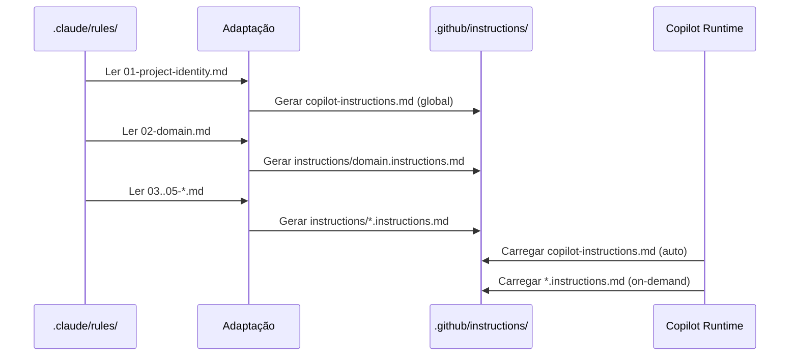

# História: Instructions Globais e Contextuais do Copilot

**ID:** STORY-001

## 1. Dependências

| Blocked By | Blocks |
| :--- | :--- |
| — | STORY-003, STORY-004, STORY-005, STORY-006, STORY-007, STORY-008, STORY-009 |

## 2. Regras Transversais Aplicáveis

| ID | Título |
| :--- | :--- |
| RULE-001 | Paridade funcional |
| RULE-002 | Convenções do Copilot |
| RULE-003 | Sem duplicação de conteúdo |
| RULE-004 | Idioma |

## 3. Descrição

Como **Tech Lead de Plataforma**, eu quero criar `copilot-instructions.md` e `instructions/*.instructions.md` adaptando as 5 rules de `.claude/rules/`, garantindo que o Copilot carregue contexto global e contextual seguindo suas convenções nativas.

Este é o alicerce de toda a estrutura `.github/`. O arquivo `copilot-instructions.md` é carregado automaticamente em toda interação do Copilot (equivalente ao carregamento automático das rules do Claude Code). Os arquivos `.instructions.md` são carregados condicionalmente quando relevantes.

O mapeamento é:
- `01-project-identity.md` → `copilot-instructions.md` (global, auto-incluído)
- `02-domain.md` → `instructions/domain.instructions.md`
- `03-coding-standards.md` → `instructions/coding-standards.instructions.md`
- `04-architecture-summary.md` → `instructions/architecture.instructions.md`
- `05-quality-gates.md` → `instructions/quality-gates.instructions.md`

### 3.1 Arquivo Global (copilot-instructions.md)

- Adaptar conteúdo de `01-project-identity.md` para formato Copilot
- Incluir: nome do projeto, stack, idioma, constraints
- Sem YAML frontmatter (convenção Copilot para o arquivo global)
- Referenciar instructions contextuais sem duplicar conteúdo

### 3.2 Instructions Contextuais (instructions/*.instructions.md)

- Cada arquivo com conteúdo adaptado (não cópia literal) da rule correspondente
- Formato: Markdown puro, sem frontmatter YAML
- Extensão obrigatória: `.instructions.md`
- Links relativos para referências detalhadas em `.claude/skills/`

### 3.3 Estrutura de Diretórios

- `.github/copilot-instructions.md` — raiz
- `.github/instructions/domain.instructions.md`
- `.github/instructions/coding-standards.instructions.md`
- `.github/instructions/architecture.instructions.md`
- `.github/instructions/quality-gates.instructions.md`

## 4. Definições de Qualidade Locais

### DoR Local (Definition of Ready)

- [ ] Conteúdo das 5 rules em `.claude/rules/` lido e compreendido
- [ ] Convenções de carregamento do Copilot validadas (global vs contextual)
- [ ] Decisão sobre nível de adaptação vs referência tomada por rule

### DoD Local (Definition of Done)

- [ ] `copilot-instructions.md` criado com conteúdo adaptado de project identity
- [ ] 4 arquivos `.instructions.md` criados em `instructions/`
- [ ] Todos os links relativos válidos e acessíveis
- [ ] Nenhum conteúdo duplicado literalmente entre `.claude/rules/` e `.github/instructions/`
- [ ] Copilot carrega `copilot-instructions.md` automaticamente em nova sessão

### Global Definition of Done (DoD)

- **Validação de formato:** YAML frontmatter válido (onde aplicável) e parseável
- **Convenções Copilot:** Extensões e naming conforme documentação oficial
- **Sem duplicação:** Conteúdo referenciado, não copiado de `.claude/`
- **Idioma:** Inglês
- **Documentação:** README.md atualizado com a estrutura

## 5. Contratos de Dados (Data Contract)

**Instruction File Contract:**

| Campo | Formato | Request | Response | Origem / Regra |
| :--- | :--- | :--- | :--- | :--- |
| `source_rule` | string (path) | M | — | Arquivo original em `.claude/rules/` |
| `target_file` | string (path) | M | — | Arquivo destino em `.github/` |
| `scope` | enum(global, contextual) | M | — | `global` = copilot-instructions.md, `contextual` = instructions/*.instructions.md |
| `content_strategy` | enum(adapt, reference, minimal) | M | — | Nível de adaptação do conteúdo original |

## 6. Diagramas

### 6.1 Mapeamento de Rules para Instructions



## 7. Critérios de Aceite (Gherkin)

```gherkin
Cenario: Carregamento automático do copilot-instructions.md
  DADO que o arquivo .github/copilot-instructions.md existe no repositório
  QUANDO o Copilot inicia uma nova sessão de chat
  ENTÃO o conteúdo de copilot-instructions.md é carregado automaticamente
  E o Copilot reconhece o nome do projeto como "my-quarkus-service"
  E o Copilot identifica a stack como Java 21 + Quarkus 3.17

Cenario: Carregamento contextual de coding-standards
  DADO que instructions/coding-standards.instructions.md existe
  QUANDO o usuário solicita uma tarefa de implementação de código
  ENTÃO o Copilot carrega as instruções de coding standards
  E aplica o limite de 25 linhas por método nas sugestões

Cenario: Arquivo instructions com extensão incorreta
  DADO que um arquivo de instructions usa extensão .md em vez de .instructions.md
  QUANDO o Copilot tenta carregar instructions contextuais
  ENTÃO o arquivo com extensão incorreta NÃO é carregado
  E apenas arquivos com extensão .instructions.md são reconhecidos

Cenario: Referência a conteúdo detalhado sem duplicação
  DADO que instructions/architecture.instructions.md contém um resumo da arquitetura
  QUANDO o Copilot precisa de detalhes sobre layer rules
  ENTÃO o arquivo referencia .claude/skills/architecture/SKILL.md via link relativo
  E NÃO duplica o conteúdo completo da skill

Cenario: Idioma consistente nas instructions
  DADO que RULE-004 define inglês como idioma padrão
  QUANDO qualquer arquivo de instructions é criado
  ENTÃO todo o conteúdo está em inglês
  E termos técnicos mantêm a grafia original em inglês
```

## 8. Sub-tarefas

- [ ] [Dev] Criar `.github/copilot-instructions.md` adaptando `01-project-identity.md`
- [ ] [Dev] Criar `.github/instructions/domain.instructions.md` adaptando `02-domain.md`
- [ ] [Dev] Criar `.github/instructions/coding-standards.instructions.md` adaptando `03-coding-standards.md`
- [ ] [Dev] Criar `.github/instructions/architecture.instructions.md` adaptando `04-architecture-summary.md`
- [ ] [Dev] Criar `.github/instructions/quality-gates.instructions.md` adaptando `05-quality-gates.md`
- [ ] [Test] Validar extensões de arquivo (.instructions.md)
- [ ] [Test] Validar links relativos para conteúdo detalhado
- [ ] [Test] Verificar carregamento automático no Copilot
- [ ] [Doc] Documentar mapeamento rules → instructions no README
