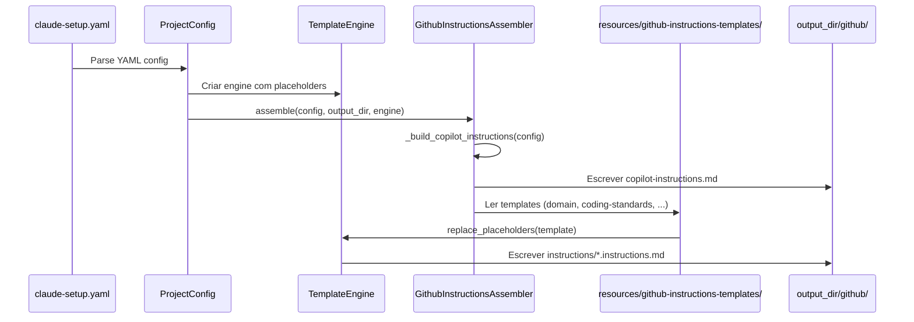

# História: Instructions Globais e Contextuais do Copilot

**ID:** STORY-001
**Status:** IMPLEMENTADA

## 1. Dependências

| Blocked By | Blocks |
| :--- | :--- |
| — | STORY-003, STORY-004, STORY-005, STORY-006, STORY-007, STORY-008, STORY-009 |

## 2. Regras Transversais Aplicáveis

| ID | Título |
| :--- | :--- |
| RULE-001 | Paridade funcional |
| RULE-002 | Convenções do Copilot |
| RULE-003 | Sem duplicação de conteúdo |
| RULE-004 | Idioma |
| RULE-008 | Integração com o gerador |

## 3. Descrição

Como **Tech Lead de Plataforma**, eu quero que o gerador `claude_setup` produza `copilot-instructions.md` e `instructions/*.instructions.md` adaptando as 5 rules de `.claude/rules/`, garantindo que o Copilot carregue contexto global e contextual seguindo suas convenções nativas.

Este é o alicerce de toda a estrutura `.github/` gerada. O `GithubInstructionsAssembler` é o 9º assembler no pipeline e produz output a partir de templates em `resources/github-instructions-templates/` e dados de `ProjectConfig`. O arquivo `copilot-instructions.md` é gerado programaticamente (não a partir de template) com dados extraídos de `ProjectConfig`. Os arquivos `.instructions.md` são gerados a partir de templates com placeholder replacement via `TemplateEngine`.

O mapeamento de rules para instructions geradas:
- `01-project-identity.md` → `copilot-instructions.md` (global, gerado de `ProjectConfig`)
- `02-domain.md` → `instructions/domain.instructions.md` (template: `resources/github-instructions-templates/domain.md`)
- `03-coding-standards.md` → `instructions/coding-standards.instructions.md` (template: `resources/github-instructions-templates/coding-standards.md`)
- `04-architecture-summary.md` → `instructions/architecture.instructions.md` (template: `resources/github-instructions-templates/architecture.md`)
- `05-quality-gates.md` → `instructions/quality-gates.instructions.md` (template: `resources/github-instructions-templates/quality-gates.md`)

### 3.1 Contexto Técnico (Gerador)

**Assembler:** `GithubInstructionsAssembler` em `src/claude_setup/assembler/github_instructions_assembler.py`

- **Pipeline position:** 9º assembler (último) em `_build_assemblers()`
- **Templates:** `resources/github-instructions-templates/{domain,coding-standards,architecture,quality-gates}.md`
- **Global file:** Gerado por `_build_copilot_instructions(config)` — extrai nome, stack, interfaces, constraints de `ProjectConfig`
- **Contextual files:** Gerados via `engine.replace_placeholders(template_content)` para cada template
- **Output dir:** `output_dir/github/` (copilot-instructions.md) e `output_dir/github/instructions/` (*.instructions.md)
- **CLI classification:** Arquivos em path contendo "github" são classificados na categoria "GitHub" por `_classify_files()`

### 3.2 Arquivo Global (copilot-instructions.md)

- Gerado por `_build_copilot_instructions(config)` a partir de `ProjectConfig`
- Inclui: nome do projeto, stack, idioma, constraints, referências a instructions contextuais
- Sem YAML frontmatter (convenção Copilot para o arquivo global)
- Lista instructions contextuais disponíveis com descrição

### 3.3 Instructions Contextuais (instructions/*.instructions.md)

- Geradas a partir de templates em `resources/github-instructions-templates/`
- Placeholders substituídos pelo `TemplateEngine` com dados de `ProjectConfig`
- Extensão obrigatória: `.instructions.md`
- Links relativos para referências detalhadas em `.claude/skills/` (ambos gerados no mesmo output_dir)

### 3.4 Estrutura de Output Gerado

- `output_dir/github/copilot-instructions.md` — raiz
- `output_dir/github/instructions/domain.instructions.md`
- `output_dir/github/instructions/coding-standards.instructions.md`
- `output_dir/github/instructions/architecture.instructions.md`
- `output_dir/github/instructions/quality-gates.instructions.md`

## 4. Definições de Qualidade Locais

### DoR Local (Definition of Ready)

- [x] Conteúdo das 5 rules em `.claude/rules/` lido e mapeado para templates
- [x] Convenções de carregamento do Copilot validadas (global vs contextual)
- [x] Decisão sobre nível de adaptação vs referência tomada por rule
- [x] Padrão de assembler existente compreendido (interface `assemble()`)

### DoD Local (Definition of Done)

- [x] `GithubInstructionsAssembler` implementado em `src/claude_setup/assembler/github_instructions_assembler.py`
- [x] 4 templates criados em `resources/github-instructions-templates/`
- [x] Assembler registrado como 9º em `_build_assemblers()` no `assembler/__init__.py`
- [x] Golden files atualizados em `tests/golden/` com output esperado
- [x] `test_pipeline.py` atualizado para refletir contagem de 9 assemblers
- [x] Testes unitários do assembler passando
- [x] `test_byte_for_byte.py` passando com golden files atualizados
- [x] Todos os links relativos válidos e acessíveis entre `.github/` e `.claude/` no output

### Global Definition of Done (DoD)

- **Validação de formato:** YAML frontmatter válido (onde aplicável) e parseável
- **Convenções Copilot:** Extensões e naming conforme documentação oficial
- **Sem duplicação:** Conteúdo referenciado, não copiado de `.claude/`
- **Idioma:** Inglês
- **Pipeline integrado:** Assembler registrado e executado no pipeline

## 5. Contratos de Dados (Data Contract)

**Instruction File Contract:**

| Campo | Formato | Request | Response | Origem / Regra |
| :--- | :--- | :--- | :--- | :--- |
| `source_rule` | string (path) | M | — | Arquivo original em `.claude/rules/` (mapeado em template) |
| `target_file` | string (path) | M | — | Arquivo destino gerado em `output_dir/github/` |
| `scope` | enum(global, contextual) | M | — | `global` = copilot-instructions.md (de `ProjectConfig`), `contextual` = instructions/*.instructions.md (de templates) |
| `content_strategy` | enum(adapt, reference, minimal) | M | — | Nível de adaptação aplicado no template |

## 6. Diagramas

### 6.1 Pipeline do Gerador para Instructions



## 7. Critérios de Aceite (Gherkin)

```gherkin
Cenario: Pipeline gera copilot-instructions.md
  DADO que o pipeline é executado com ProjectConfig válido
  QUANDO o GithubInstructionsAssembler é invocado
  ENTÃO output_dir/github/copilot-instructions.md é gerado
  E contém o nome do projeto extraído de ProjectConfig
  E contém a stack (Java 21 + Quarkus 3.17) extraída de ProjectConfig

Cenario: Pipeline gera instructions contextuais a partir de templates
  DADO que resources/github-instructions-templates/ contém 4 templates
  QUANDO o GithubInstructionsAssembler processa os templates
  ENTÃO 4 arquivos *.instructions.md são gerados em output_dir/github/instructions/
  E placeholders são substituídos por valores de ProjectConfig

Cenario: Golden files validam output byte-a-byte
  DADO que tests/golden/ contém expected output para github/
  QUANDO test_byte_for_byte.py é executado
  ENTÃO o output gerado é idêntico byte-a-byte ao golden file

Cenario: Pipeline conta 9 assemblers na ordem correta
  DADO que _build_assemblers() retorna a lista de assemblers
  QUANDO test_pipeline.py valida a lista
  ENTÃO são 9 assemblers
  E GithubInstructionsAssembler é o 9º

Cenario: Arquivo instructions com extensão incorreta
  DADO que um arquivo de instructions usa extensão .md em vez de .instructions.md
  QUANDO o Copilot tenta carregar instructions contextuais
  ENTÃO o arquivo com extensão incorreta NÃO é carregado
  E apenas arquivos com extensão .instructions.md são reconhecidos
```

## 8. Sub-tarefas

- [x] [Dev] Implementar `GithubInstructionsAssembler` em `src/claude_setup/assembler/github_instructions_assembler.py`
- [x] [Dev] Criar template `resources/github-instructions-templates/domain.md`
- [x] [Dev] Criar template `resources/github-instructions-templates/coding-standards.md`
- [x] [Dev] Criar template `resources/github-instructions-templates/architecture.md`
- [x] [Dev] Criar template `resources/github-instructions-templates/quality-gates.md`
- [x] [Dev] Registrar assembler em `_build_assemblers()` no `assembler/__init__.py`
- [x] [Dev] Verificar classificação "GitHub" em `_classify_files()` no `__main__.py`
- [x] [Test] Criar/atualizar golden files em `tests/golden/` com output esperado
- [x] [Test] Validar `test_byte_for_byte.py` com novos golden files
- [x] [Test] Atualizar `test_pipeline.py` para 9 assemblers
- [x] [Test] Testes unitários do `GithubInstructionsAssembler`
- [x] [Test] Validar extensões de arquivo (.instructions.md) no output
- [x] [Test] Validar links relativos entre `.github/` e `.claude/` no output
