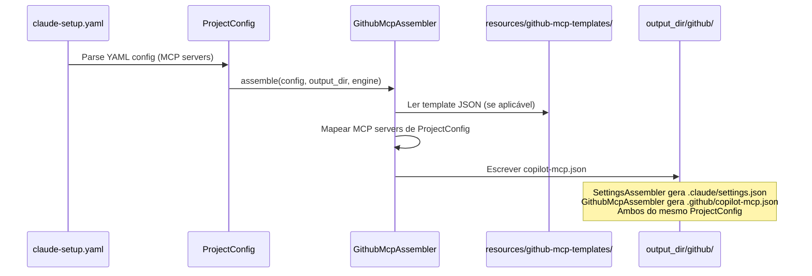

# História: Configuração MCP (copilot-mcp.json)

**ID:** STORY-002

## 1. Dependências

| Blocked By | Blocks |
| :--- | :--- |
| — | STORY-013 |

## 2. Regras Transversais Aplicáveis

| ID | Título |
| :--- | :--- |
| RULE-001 | Paridade funcional |
| RULE-002 | Convenções do Copilot |
| RULE-008 | Integração com o gerador |

## 3. Descrição

Como **DevOps Engineer**, eu quero que o gerador `claude_setup` produza `.github/copilot-mcp.json` com a configuração de MCP servers para integrações externas, garantindo paridade com a configuração MCP já gerada em `.claude/settings.json` pelo `SettingsAssembler`.

A configuração MCP é independente de todas as outras histórias e pode ser implementada em paralelo com STORY-001. Um novo assembler (`GithubMcpAssembler`) lê os dados de MCP servers do `ProjectConfig` e gera o JSON no formato Copilot. Tanto `.github/copilot-mcp.json` quanto `.claude/settings.json` são output gerado (gitignored).

### 3.1 Contexto Técnico (Gerador)

**Novo assembler:** `GithubMcpAssembler` em `src/claude_setup/assembler/github_mcp_assembler.py`

- **Padrão:** Seguir o mesmo padrão de `GithubInstructionsAssembler` e `SettingsAssembler`
- **Input:** `ProjectConfig` (seção de MCP servers, mesmos dados usados pelo `SettingsAssembler`)
- **Templates:** `resources/github-mcp-templates/` (template JSON com placeholders, ou geração programática)
- **Output:** `output_dir/github/copilot-mcp.json`
- **Pipeline registration:** Adicionar em `_build_assemblers()` no `assembler/__init__.py` (10º assembler)
- **CLI:** Classificação "GitHub" já existe em `_classify_files()` (detecta path contendo "github")
- **Interface:** `assemble(config, output_dir, engine) -> List[Path]`

### 3.2 Estrutura do copilot-mcp.json

- JSON válido gerado pelo assembler a partir de `ProjectConfig`
- Cada server com: `id`, `url`, `capabilities`, `env` (referência a variáveis, não valores)
- Sem segredos hardcoded — usar referências a variáveis de ambiente
- Template ou geração programática a partir dos mesmos dados de MCP do `ProjectConfig`

### 3.3 Paridade com .claude/settings.json

- `SettingsAssembler` já gera `.claude/settings.json` com configuração MCP
- `GithubMcpAssembler` lê os mesmos dados de `ProjectConfig` e adapta formato para Copilot
- Ambos os outputs são gerados no mesmo `run_pipeline()` — consistência garantida

## 4. Definições de Qualidade Locais

### DoR Local (Definition of Ready)

- [ ] Dados de MCP servers em `ProjectConfig` identificados e mapeados
- [ ] Schema JSON do copilot-mcp.json documentado
- [ ] Padrão de `GithubInstructionsAssembler` compreendido como referência
- [ ] Variáveis de ambiente necessárias listadas no `ProjectConfig`

### DoD Local (Definition of Done)

- [ ] `GithubMcpAssembler` implementado em `src/claude_setup/assembler/github_mcp_assembler.py`
- [ ] Template(s) criado(s) em `resources/github-mcp-templates/` (se aplicável)
- [ ] Assembler registrado em `_build_assemblers()` na posição correta
- [ ] Golden files atualizados em `tests/golden/` com output esperado
- [ ] `test_pipeline.py` atualizado para refletir novo assembler count
- [ ] Testes unitários do assembler passando
- [ ] `test_byte_for_byte.py` passando com golden files atualizados
- [ ] Nenhum segredo hardcoded no output gerado
- [ ] JSON parseável sem erros

### Global Definition of Done (DoD)

- **Validação de formato:** JSON válido e parseável
- **Convenções Copilot:** Naming e localização conforme documentação oficial
- **Sem duplicação:** Referencia variáveis de ambiente, não valores
- **Idioma:** Inglês
- **Pipeline integrado:** Assembler registrado e executado no pipeline
- **Golden files:** Output byte-a-byte validado

## 5. Contratos de Dados (Data Contract)

**MCP Server Config Contract:**

| Campo | Formato | Request | Response | Origem / Regra |
| :--- | :--- | :--- | :--- | :--- |
| `servers[].id` | string (lowercase-hyphens) | M | — | Identificador único do server (de `ProjectConfig`) |
| `servers[].url` | string (URL) | M | — | Endpoint do MCP server (de `ProjectConfig`) |
| `servers[].capabilities` | array[string] | M | — | Lista de capabilities oferecidas |
| `servers[].env` | object | O | — | Mapa de variáveis de ambiente necessárias |

## 6. Diagramas

### 6.1 Pipeline do Gerador para MCP Config



## 7. Critérios de Aceite (Gherkin)

```gherkin
Cenario: Pipeline gera copilot-mcp.json
  DADO que o pipeline é executado com ProjectConfig contendo MCP servers
  QUANDO o GithubMcpAssembler é invocado
  ENTÃO output_dir/github/copilot-mcp.json é gerado
  E o JSON é válido e parseável
  E contém todos os MCP servers definidos no ProjectConfig

Cenario: Paridade com settings.json gerado
  DADO que SettingsAssembler gera .claude/settings.json com N MCP servers
  QUANDO GithubMcpAssembler gera copilot-mcp.json
  ENTÃO todos os N servers têm equivalentes no copilot-mcp.json
  E cada server possui id, url e capabilities

Cenario: Golden files validam output byte-a-byte
  DADO que tests/golden/ contém expected output para github/copilot-mcp.json
  QUANDO test_byte_for_byte.py é executado
  ENTÃO o output gerado é idêntico byte-a-byte ao golden file

Cenario: Sem segredos hardcoded no output
  DADO que um MCP server requer API key
  QUANDO o assembler gera copilot-mcp.json
  ENTÃO o campo env referencia a variável de ambiente (ex: "$MCP_API_KEY")
  E nenhum valor de segredo aparece literalmente no arquivo gerado

Cenario: Pipeline registra novo assembler
  DADO que GithubMcpAssembler é registrado em _build_assemblers()
  QUANDO test_pipeline.py valida a lista
  ENTÃO o assembler count é atualizado
  E GithubMcpAssembler está na posição esperada
```

## 8. Sub-tarefas

- [ ] [Dev] Criar `GithubMcpAssembler` em `src/claude_setup/assembler/github_mcp_assembler.py` com `assemble()`
- [ ] [Dev] Criar template(s) em `resources/github-mcp-templates/` (se geração por template)
- [ ] [Dev] Registrar assembler em `_build_assemblers()` no `assembler/__init__.py`
- [ ] [Dev] Mapear dados MCP de `ProjectConfig` para formato JSON Copilot
- [ ] [Dev] Garantir referência a variáveis de ambiente (não valores) no output
- [ ] [Test] Criar golden files em `tests/golden/` com expected JSON output
- [ ] [Test] Validar `test_byte_for_byte.py` com novos golden files
- [ ] [Test] Atualizar `test_pipeline.py` para novo assembler count
- [ ] [Test] Testes unitários do `GithubMcpAssembler`
- [ ] [Test] Validar JSON parseável no output
- [ ] [Test] Verificar ausência de segredos hardcoded no output
