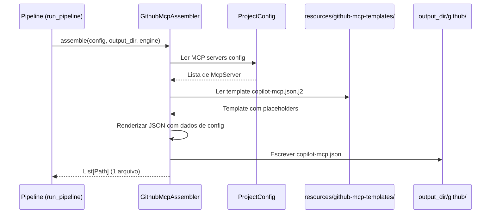

# Historia: Configuracao MCP (copilot-mcp.json)

**ID:** STORY-002

## 1. Dependencias

| Blocked By | Blocks |
| :--- | :--- |
| — | STORY-013 |

## 2. Regras Transversais Aplicaveis

| ID | Titulo |
| :--- | :--- |
| RULE-001 | Paridade funcional |
| RULE-002 | Convencoes do Copilot |

## 3. Descricao

Como **DevOps Engineer**, eu quero que o gerador `claude_setup` produza `.github/copilot-mcp.json` com a configuracao de MCP servers para integracoes externas, garantindo que o Copilot tenha acesso as mesmas ferramentas externas configuradas em `.claude/settings.json`.

A configuracao MCP e independente de todas as outras historias e pode ser implementada em paralelo com STORY-001. O assembler le a configuracao MCP de `ProjectConfig` (que ja modela os MCP servers de `settings.json`) e gera o formato equivalente para Copilot.

### 3.1 Estrutura do copilot-mcp.json

- JSON valido com schema de MCP servers
- Cada server com: `id`, `url`, `capabilities`, `env` (referencia a variaveis, nao valores)
- Sem segredos hardcoded — usar referencias a variaveis de ambiente

### 3.2 Paridade com .claude/settings.json

- Mapear MCP servers configurados em `ProjectConfig` (extraidos de `.claude/settings.json`)
- Adaptar formato para convencoes do Copilot
- Documentar capabilities disponiveis por server

### 3.3 Contexto Tecnico (Gerador)

A implementacao consiste em:

- **Assembler:** Criar `GithubMcpAssembler` em `src/claude_setup/assembler/github_mcp_assembler.py`
  - `__init__(resources_dir)` — recebe diretorio de resources
  - `assemble(config, output_dir, engine) -> List[Path]` — gera `github/copilot-mcp.json`
  - Le MCP servers de `config` (campo a definir — pode exigir extensao de `ProjectConfig`/`models.py`)
  - Renderiza template JSON ou gera via codigo Python
- **Template:** Criar `resources/github-mcp-templates/copilot-mcp.json.j2` (template Jinja2 para a estrutura JSON)
  - Alternativa: gerar JSON via codigo se a estrutura for simples demais para template
- **Pipeline:** Registrar `GithubMcpAssembler` em `assembler/__init__.py` -> `_build_assemblers()` (sera o 10o assembler)
- **CLI:** Adicionar classificacao "GitHub" em `__main__.py` -> `_classify_files()` para arquivos `github/copilot-mcp.json`
  - Se a classificacao "GitHub" ja existe (de STORY-001), verificar que o pattern cobre `.json`
- **Model:** Pode ser necessario estender `ProjectConfig` em `models.py` para incluir configuracao MCP
- **Testes:**
  - Criar testes unitarios para `GithubMcpAssembler` (JSON valido, ausencia de segredos, paridade de servers)
  - Atualizar `test_pipeline.py` (contagem de assemblers 9->10)
  - Regenerar golden files para 8 perfis
  - Verificar `test_byte_for_byte.py` passando

## 4. Definicoes de Qualidade Locais

### DoR Local (Definition of Ready)

- [ ] MCP servers em `ProjectConfig` identificados (ou extensao de modelo definida)
- [ ] Schema JSON do copilot-mcp.json documentado
- [ ] Variaveis de ambiente necessarias listadas

### DoD Local (Definition of Done)

- [ ] `GithubMcpAssembler` gera `github/copilot-mcp.json` com JSON valido
- [ ] Todos os MCP servers de `ProjectConfig` mapeados no JSON gerado
- [ ] Nenhum segredo hardcoded no arquivo gerado
- [ ] Assembler registrado no pipeline
- [ ] Golden files regenerados e testes byte-for-byte passando

### Global Definition of Done (DoD)

- **Validacao de formato:** JSON valido e parseavel em todos os perfis
- **Convencoes Copilot:** Naming e localizacao conforme documentacao oficial
- **Sem duplicacao:** Referencia variaveis de ambiente, nao valores
- **Idioma:** Ingles
- **Testes:** `test_byte_for_byte.py`, `test_pipeline.py` e testes unitarios passando

## 5. Contratos de Dados (Data Contract)

**MCP Server Config Contract:**

| Campo | Formato | Request | Response | Origem / Regra |
| :--- | :--- | :--- | :--- | :--- |
| `config.mcp_servers` | List[McpServer] | M | — | Configuracao MCP em ProjectConfig |
| `servers[].id` | string (lowercase-hyphens) | — | M | Identificador unico do server no JSON gerado |
| `servers[].url` | string (URL) | — | M | Endpoint do MCP server |
| `servers[].capabilities` | array[string] | — | M | Lista de capabilities oferecidas |
| `servers[].env` | object | — | O | Mapa de variaveis de ambiente (referencias, nao valores) |

## 6. Diagramas

### 6.1 Fluxo do Assembler MCP



## 7. Criterios de Aceite (Gherkin)

```gherkin
Cenario: Assembler gera JSON valido e parseavel
  DADO que o pipeline executa com um ProjectConfig que inclui MCP servers
  QUANDO o GithubMcpAssembler.assemble() e chamado
  ENTAO o arquivo github/copilot-mcp.json e gerado no output_dir
  E o conteudo e JSON valido parseavel sem erros
  E a estrutura contem o array "servers"

Cenario: Paridade de MCP servers com ProjectConfig
  DADO que ProjectConfig configura N MCP servers
  QUANDO o assembler gera copilot-mcp.json
  ENTAO todos os N servers tem equivalentes no JSON gerado
  E cada server possui id, url e capabilities

Cenario: Sem segredos hardcoded no JSON gerado
  DADO que um MCP server requer API key
  QUANDO o assembler gera a configuracao
  ENTAO o campo env referencia a variavel de ambiente (ex: "$MCP_API_KEY")
  E nenhum valor de segredo aparece literalmente no arquivo

Cenario: Golden files byte-for-byte para todos os perfis
  DADO que golden files incluem copilot-mcp.json para perfis com MCP
  QUANDO test_byte_for_byte.py executa
  ENTAO cada arquivo gerado e identico byte-a-byte ao golden file correspondente

Cenario: Pipeline inclui GithubMcpAssembler
  DADO que _build_assemblers() retorna a lista ordenada de assemblers
  QUANDO test_pipeline.py verifica a contagem
  ENTAO existem 10 assemblers registrados
  E GithubMcpAssembler esta presente na lista
```

## 8. Sub-tarefas

- [ ] [Dev] Criar `GithubMcpAssembler` em `src/claude_setup/assembler/github_mcp_assembler.py`
- [ ] [Dev] Criar template em `resources/github-mcp-templates/copilot-mcp.json.j2` (ou similar)
- [ ] [Dev] Estender `ProjectConfig` em `models.py` se necessario para modelar MCP servers
- [ ] [Dev] Registrar assembler no pipeline (`assembler/__init__.py` -> `_build_assemblers()`)
- [ ] [Dev] Verificar/atualizar classificacao em `__main__.py` -> `_classify_files()`
- [ ] [Test] Criar testes unitarios para `GithubMcpAssembler` (JSON valido, sem segredos, paridade)
- [ ] [Test] Atualizar `test_pipeline.py` (contagem de assemblers 9->10)
- [ ] [Test] Regenerar golden files para 8 perfis
- [ ] [Test] Verificar testes byte-for-byte passando
