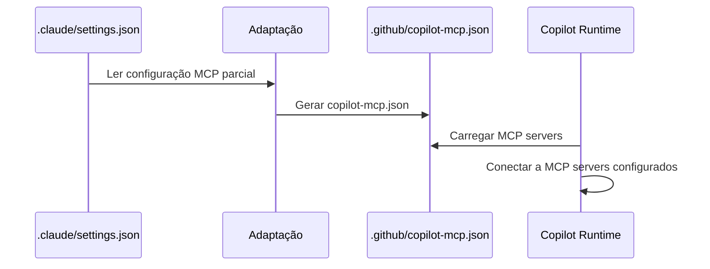

# História: Configuração MCP (copilot-mcp.json)

**ID:** STORY-002

## 1. Dependências

| Blocked By | Blocks |
| :--- | :--- |
| — | STORY-013 |

## 2. Regras Transversais Aplicáveis

| ID | Título |
| :--- | :--- |
| RULE-001 | Paridade funcional |
| RULE-002 | Convenções do Copilot |

## 3. Descrição

Como **DevOps Engineer**, eu quero criar `.github/copilot-mcp.json` com a configuração de MCP servers para integrações externas, garantindo que o Copilot tenha acesso às mesmas ferramentas externas configuradas em `.claude/settings.json`.

A configuração MCP é independente de todas as outras histórias e pode ser implementada em paralelo com STORY-001. Define MCP servers, suas capabilities e variáveis de ambiente necessárias.

### 3.1 Estrutura do copilot-mcp.json

- JSON válido com schema de MCP servers
- Cada server com: `id`, `url`, `capabilities`, `env` (referência a variáveis, não valores)
- Sem segredos hardcoded — usar referências a variáveis de ambiente

### 3.2 Paridade com .claude/settings.json

- Mapear MCP servers configurados em `.claude/settings.json` (seção parcial)
- Adaptar formato para convenções do Copilot
- Documentar capabilities disponíveis por server

## 4. Definições de Qualidade Locais

### DoR Local (Definition of Ready)

- [ ] MCP servers configurados em `.claude/settings.json` identificados
- [ ] Schema JSON do copilot-mcp.json documentado
- [ ] Variáveis de ambiente necessárias listadas

### DoD Local (Definition of Done)

- [ ] Arquivo `.github/copilot-mcp.json` criado com JSON válido
- [ ] Todos os MCP servers mapeados de `.claude/settings.json`
- [ ] Nenhum segredo hardcoded no arquivo
- [ ] JSON parseável sem erros

### Global Definition of Done (DoD)

- **Validação de formato:** JSON válido e parseável
- **Convenções Copilot:** Naming e localização conforme documentação oficial
- **Sem duplicação:** Referencia variáveis de ambiente, não valores
- **Idioma:** Inglês
- **Documentação:** README.md atualizado

## 5. Contratos de Dados (Data Contract)

**MCP Server Config Contract:**

| Campo | Formato | Request | Response | Origem / Regra |
| :--- | :--- | :--- | :--- | :--- |
| `servers[].id` | string (lowercase-hyphens) | M | — | Identificador único do server |
| `servers[].url` | string (URL) | M | — | Endpoint do MCP server |
| `servers[].capabilities` | array[string] | M | — | Lista de capabilities oferecidas |
| `servers[].env` | object | O | — | Mapa de variáveis de ambiente necessárias |

## 6. Diagramas

### 6.1 Configuração MCP



## 7. Critérios de Aceite (Gherkin)

```gherkin
Cenario: JSON válido e parseável
  DADO que .github/copilot-mcp.json foi criado
  QUANDO um parser JSON processa o arquivo
  ENTÃO o parse é bem-sucedido sem erros
  E a estrutura contém o array "servers"

Cenario: Paridade de MCP servers com .claude/settings.json
  DADO que .claude/settings.json configura N MCP servers
  QUANDO copilot-mcp.json é gerado
  ENTÃO todos os N servers têm equivalentes no copilot-mcp.json
  E cada server possui id, url e capabilities

Cenario: Sem segredos hardcoded
  DADO que um MCP server requer API key
  QUANDO a configuração é definida em copilot-mcp.json
  ENTÃO o campo env referencia a variável de ambiente (ex: "$MCP_API_KEY")
  E nenhum valor de segredo aparece literalmente no arquivo

Cenario: Server MCP com capabilities inválidas
  DADO que um server é configurado com capability inexistente
  QUANDO o Copilot tenta usar a capability
  ENTÃO recebe erro indicando capability não suportada
  E as demais capabilities do server continuam funcionais
```

## 8. Sub-tarefas

- [ ] [Dev] Ler e mapear MCP servers de `.claude/settings.json`
- [ ] [Dev] Criar `.github/copilot-mcp.json` com schema correto
- [ ] [Dev] Documentar variáveis de ambiente necessárias
- [ ] [Test] Validar JSON com parser
- [ ] [Test] Verificar ausência de segredos hardcoded
- [ ] [Doc] Documentar MCP servers no README
