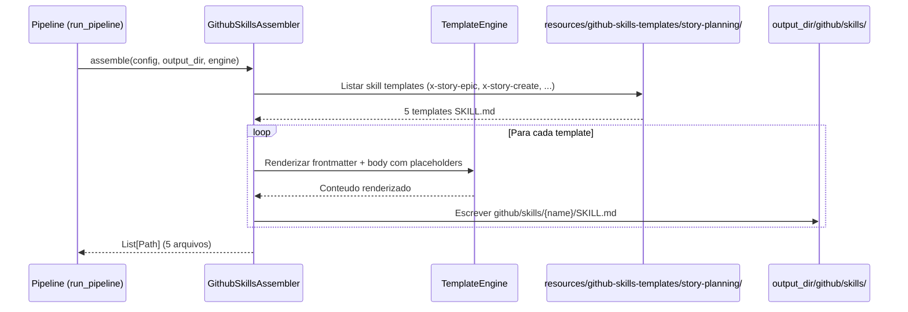

# Historia: Skills de Story/Planning

**ID:** STORY-003

## 1. Dependencias

| Blocked By | Blocks |
| :--- | :--- |
| STORY-001 | STORY-010, STORY-012 |

## 2. Regras Transversais Aplicaveis

| ID | Titulo |
| :--- | :--- |
| RULE-001 | Paridade funcional |
| RULE-002 | Convencoes do Copilot |
| RULE-003 | Sem duplicacao de conteudo |
| RULE-004 | Idioma (pt-BR para estas skills) |
| RULE-005 | Progressive disclosure |

## 3. Descricao

Como **Product Owner Tecnico**, eu quero que o gerador `claude_setup` produza skills de story/planning (`x-story-epic`, `x-story-create`, `x-story-map`, `x-story-epic-full`, `story-planning`) dentro da estrutura `.github/skills/`, garantindo que o fluxo de decomposicao de specs em epicos e historias funcione no Copilot com a mesma qualidade.

Este e o primeiro grupo de skills `.github/` a ser gerado e estabelece o padrao canonico de `SKILL.md` com frontmatter YAML, progressive disclosure em 3 niveis e referencias a conteudo existente. As skills de story sao excecao de idioma (pt-BR conforme RULE-004).

### 3.1 Skills a gerar

- `github/skills/x-story-epic/SKILL.md` — Geracao de Epic a partir de spec
- `github/skills/x-story-create/SKILL.md` — Geracao de Stories a partir de Epic
- `github/skills/x-story-map/SKILL.md` — Geracao de Implementation Map
- `github/skills/x-story-epic-full/SKILL.md` — Orquestracao completa (Epic + Stories + Map)
- `github/skills/story-planning/SKILL.md` — Referencia de decomposicao e planning

### 3.2 Padrao de frontmatter

```yaml
---
name: x-story-epic
description: >
  Gera um documento Epic a partir de uma especificacao tecnica. Extrai
  regras cross-cutting, story index e quality gates. Use quando o usuario
  pedir para criar epic, decompor spec ou extrair regras de negocio.
---
```

### 3.3 Progressive disclosure

- Nivel 1: Frontmatter com description suficiente para trigger
- Nivel 2: Body com workflow completo, templates referenciados, quality checklist
- Nivel 3: `references/decomposition-guide.md` e templates linkados

### 3.4 Contexto Tecnico (Gerador)

O `SkillsAssembler` existente (`src/claude_setup/assembler/skills.py`) ja gera skills para `.claude/skills/`. Para `.github/skills/`, ha duas abordagens possiveis:

**Opcao A — Criar `GithubSkillsAssembler` separado:**
- Novo assembler em `src/claude_setup/assembler/github_skills_assembler.py`
- Templates em `resources/github-skills-templates/story-planning/` (com frontmatter YAML Copilot)
- Registrado separadamente no pipeline

**Opcao B — Estender `SkillsAssembler` existente:**
- Adicionar metodo `_assemble_github_skills()` ao `SkillsAssembler`
- Reutilizar logica de selecao de skills, adicionando output para `github/skills/`

**Decisao recomendada:** Opcao A (assembler separado) — respeita SRP e permite evolucao independente dos formatos Claude vs Copilot.

Implementacao:

- **Assembler:** `GithubSkillsAssembler` em `src/claude_setup/assembler/github_skills_assembler.py`
  - `__init__(resources_dir)` — recebe diretorio de resources
  - `assemble(config, output_dir, engine) -> List[Path]` — gera skills em `github/skills/`
  - Itera templates em `resources/github-skills-templates/story-planning/`
  - Renderiza frontmatter YAML + body Markdown via `TemplateEngine`
- **Templates:** Criar `resources/github-skills-templates/story-planning/` contendo:
  - `x-story-epic/SKILL.md` — template com frontmatter e body adaptados
  - `x-story-create/SKILL.md`
  - `x-story-map/SKILL.md`
  - `x-story-epic-full/SKILL.md`
  - `story-planning/SKILL.md`
- **Pipeline:** Registrar `GithubSkillsAssembler` em `assembler/__init__.py` -> `_build_assemblers()`
- **CLI:** Verificar que `_classify_files()` classifica `github/skills/` corretamente (pode cair em "GitHub" ou necessitar subcategoria)
- **Testes:**
  - Criar testes unitarios para `GithubSkillsAssembler`
  - Atualizar `test_pipeline.py` (contagem de assemblers)
  - Regenerar golden files para 8 perfis
  - Verificar `test_byte_for_byte.py` passando
  - Validar frontmatter YAML parseavel em cada skill gerada

## 4. Definicoes de Qualidade Locais

### DoR Local (Definition of Ready)

- [ ] STORY-001 concluida (GithubInstructionsAssembler como referencia de padrao)
- [ ] Skills equivalentes em `.claude/skills/` (geradas por `SkillsAssembler`) lidas e mapeadas
- [ ] Frontmatter YAML pattern validado para naming lowercase-hyphens
- [ ] Decisao entre Opcao A e Opcao B tomada

### DoD Local (Definition of Done)

- [ ] Assembler gera 5 skills com frontmatter YAML valido em `github/skills/`
- [ ] Templates em `resources/github-skills-templates/story-planning/` criados
- [ ] Assembler registrado no pipeline
- [ ] Cada skill com description especifica para trigger correto
- [ ] Conteudo em pt-BR (excecao RULE-004)
- [ ] References referenciam `.claude/skills/*/references/` sem duplicar
- [ ] Golden files regenerados e testes byte-for-byte passando

### Global Definition of Done (DoD)

- **Validacao de formato:** YAML frontmatter valido e parseavel
- **Convencoes Copilot:** `name` em lowercase-hyphens, `description` presente
- **Sem duplicacao:** References linkam para `.claude/skills/`
- **Idioma:** pt-BR (excecao documentada)
- **Progressive disclosure:** 3 niveis implementados nos templates
- **Testes:** `test_byte_for_byte.py`, `test_pipeline.py` e testes unitarios passando

## 5. Contratos de Dados (Data Contract)

**Skill File Contract:**

| Campo | Formato | Request | Response | Origem / Regra |
| :--- | :--- | :--- | :--- | :--- |
| `frontmatter.name` | string (lowercase-hyphens) | M | — | Identificador para trigger. Ex: `x-story-epic` |
| `frontmatter.description` | string (multiline) | M | — | Descricao para roteamento. Deve incluir trigger keywords |
| `body` | markdown | M | — | Instrucoes detalhadas do workflow |
| `references/` | directory | O | — | Links relativos para `.claude/skills/*/references/` |
| `template_dir` | Path | M | — | `resources/github-skills-templates/story-planning/` |
| `output_dir` | Path | — | M | `github/skills/{skill-name}/SKILL.md` |

## 6. Diagramas

### 6.1 Fluxo do Assembler de Skills Story/Planning



## 7. Criterios de Aceite (Gherkin)

```gherkin
Cenario: Assembler gera skill com frontmatter YAML valido
  DADO que o template x-story-epic/SKILL.md existe em resources/github-skills-templates/
  QUANDO o GithubSkillsAssembler.assemble() e chamado
  ENTAO o arquivo github/skills/x-story-epic/SKILL.md e gerado no output_dir
  E o frontmatter YAML e parseavel
  E o campo "name" e "x-story-epic"
  E o campo "description" contem keywords de trigger como "epic" e "spec"

Cenario: Trigger correto da skill x-story-epic-full
  DADO que o assembler gerou github/skills/x-story-epic-full/SKILL.md
  QUANDO o frontmatter e avaliado
  ENTAO a description contem keywords "epic", "stories" e "map"
  E o body contem workflow completo de orquestracao

Cenario: Conteudo em pt-BR conforme excecao RULE-004
  DADO que skills de story sao excecao de idioma
  QUANDO o template x-story-create/SKILL.md e renderizado
  ENTAO o conteudo esta em portugues brasileiro
  E termos tecnicos como "frontmatter", "sprint" e "DAG" permanecem em ingles

Cenario: Progressive disclosure com 3 niveis no template
  DADO que o template x-story-map/SKILL.md contem frontmatter, body e references
  QUANDO o assembler gera o arquivo
  ENTAO o frontmatter contem apenas name e description (nivel 1)
  E o body contem workflow detalhado (nivel 2)
  E references linkam para .claude/skills/ originais (nivel 3)

Cenario: Golden files byte-for-byte para skills de story
  DADO que golden files incluem github/skills/x-story-* para todos os perfis
  QUANDO test_byte_for_byte.py executa
  ENTAO cada skill gerada e identica byte-a-byte ao golden file correspondente
```

## 8. Sub-tarefas

- [ ] [Dev] Criar `GithubSkillsAssembler` em `src/claude_setup/assembler/github_skills_assembler.py`
- [ ] [Dev] Criar templates em `resources/github-skills-templates/story-planning/` (5 skills: x-story-epic, x-story-create, x-story-map, x-story-epic-full, story-planning)
- [ ] [Dev] Registrar assembler no pipeline (`assembler/__init__.py` -> `_build_assemblers()`)
- [ ] [Dev] Verificar/atualizar classificacao em `__main__.py` -> `_classify_files()`
- [ ] [Test] Criar testes unitarios para `GithubSkillsAssembler` (frontmatter YAML valido, trigger keywords)
- [ ] [Test] Atualizar `test_pipeline.py` (contagem de assemblers)
- [ ] [Test] Regenerar golden files para 8 perfis
- [ ] [Test] Verificar testes byte-for-byte passando
- [ ] [Test] Validar links relativos para `.claude/skills/*/references/`
