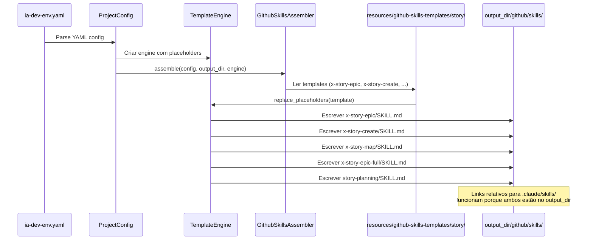

# História: Skills de Story/Planning

**ID:** STORY-003

## 1. Dependências

| Blocked By | Blocks |
| :--- | :--- |
| STORY-001 | STORY-010, STORY-012 |

## 2. Regras Transversais Aplicáveis

| ID | Título |
| :--- | :--- |
| RULE-001 | Paridade funcional |
| RULE-002 | Convenções do Copilot |
| RULE-003 | Sem duplicação de conteúdo |
| RULE-004 | Idioma (pt-BR para estas skills) |
| RULE-005 | Progressive disclosure |
| RULE-008 | Integração com o gerador |

## 3. Descrição

Como **Product Owner Técnico**, eu quero que o gerador `ia_dev_env` produza skills de story/planning (`x-story-epic`, `x-story-create`, `x-story-map`, `x-story-epic-full`, `story-planning`) em `.github/skills/`, garantindo que o fluxo de decomposição de specs em épicos e histórias funcione no Copilot com a mesma qualidade.

Este é o primeiro grupo de skills `.github/` a ser gerado e estabelece o padrão canônico para skills Copilot com frontmatter YAML, progressive disclosure em 3 níveis e referências a conteúdo existente. As skills de story são exceção de idioma (pt-BR conforme RULE-004). O assembler gera os arquivos a partir de templates em `resources/` com placeholder replacement via `TemplateEngine`.

### 3.1 Contexto Técnico (Gerador)

**Novo assembler:** `GithubSkillsAssembler` (ou extensão do pipeline) em `src/ia_dev_env/assembler/github_skills_assembler.py`

- **Padrão:** Seguir o mesmo padrão de `GithubInstructionsAssembler` (templates + `TemplateEngine`)
- **Input:** `ProjectConfig` + templates em `resources/github-skills-templates/story/`
- **Output:** `output_dir/github/skills/{x-story-epic,x-story-create,x-story-map,x-story-epic-full,story-planning}/SKILL.md`
- **Templates:** Cada skill tem um template Markdown em `resources/github-skills-templates/story/` com frontmatter YAML e placeholders
- **Pipeline registration:** Adicionar em `_build_assemblers()` no `assembler/__init__.py`
- **CLI:** Classificação "GitHub" já existe em `_classify_files()` (detecta path contendo "github")
- **Referências cruzadas:** Links relativos para `.claude/skills/*/references/` funcionam porque ambos são gerados no mesmo `output_dir`
- **Reutilização:** Este assembler pode ser estendido por STORY-004 a STORY-009 para gerar outros grupos de skills, ou cada grupo pode ter seu próprio set de templates

### 3.2 Skills a gerar

- `output_dir/github/skills/x-story-epic/SKILL.md` — Geração de Epic a partir de spec
- `output_dir/github/skills/x-story-create/SKILL.md` — Geração de Stories a partir de Epic
- `output_dir/github/skills/x-story-map/SKILL.md` — Geração de Implementation Map
- `output_dir/github/skills/x-story-epic-full/SKILL.md` — Orquestração completa (Epic + Stories + Map)
- `output_dir/github/skills/story-planning/SKILL.md` — Referência de decomposição e planning

### 3.3 Padrão de frontmatter (no template)

```yaml
---
name: x-story-epic
description: >
  Gera um documento Epic a partir de uma especificação técnica. Extrai
  regras cross-cutting, story index e quality gates. Use quando o usuário
  pedir para criar epic, decompor spec ou extrair regras de negócio.
---
```

### 3.4 Progressive disclosure (nos templates)

- Nível 1: Frontmatter com description suficiente para trigger
- Nível 2: Body com workflow completo, templates referenciados, quality checklist
- Nível 3: `references/decomposition-guide.md` e templates linkados (referência cruzada para `.claude/skills/`)

## 4. Definições de Qualidade Locais

### DoR Local (Definition of Ready)

- [ ] STORY-001 concluída (GithubInstructionsAssembler como referência de padrão)
- [ ] Skills equivalentes em `.claude/skills/` lidas e mapeadas para templates
- [ ] Frontmatter YAML pattern validado para naming lowercase-hyphens
- [ ] Estrutura de templates definida em `resources/github-skills-templates/story/`

### DoD Local (Definition of Done)

- [ ] Assembler implementado (novo `GithubSkillsAssembler` ou extensão do pipeline)
- [ ] 5 templates de skills criados em `resources/github-skills-templates/story/`
- [ ] Cada template com frontmatter YAML e description específica para trigger correto
- [ ] Conteúdo em pt-BR nos templates (exceção RULE-004)
- [ ] References linkam para `.claude/skills/*/references/` (referência cruzada no output)
- [ ] Assembler registrado em `_build_assemblers()` na posição correta
- [ ] Golden files atualizados em `tests/golden/` com output esperado
- [ ] `test_pipeline.py` atualizado para novo assembler count
- [ ] `test_byte_for_byte.py` passando com golden files atualizados
- [ ] Testes unitários do assembler passando

### Global Definition of Done (DoD)

- **Validação de formato:** YAML frontmatter válido e parseável nos templates e output
- **Convenções Copilot:** `name` em lowercase-hyphens, `description` presente
- **Sem duplicação:** References linkam para `.claude/skills/` no output
- **Idioma:** pt-BR (exceção documentada)
- **Progressive disclosure:** 3 níveis implementados nos templates
- **Pipeline integrado:** Assembler registrado e executado no pipeline
- **Golden files:** Output byte-a-byte validado

## 5. Contratos de Dados (Data Contract)

**Skill File Contract:**

| Campo | Formato | Request | Response | Origem / Regra |
| :--- | :--- | :--- | :--- | :--- |
| `frontmatter.name` | string (lowercase-hyphens) | M | — | Identificador para trigger. Ex: `x-story-epic` |
| `frontmatter.description` | string (multiline) | M | — | Descrição para roteamento. Deve incluir trigger keywords |
| `body` | markdown | M | — | Instruções detalhadas do workflow (gerado de template) |
| `references/` | directory | O | — | Arquivos auxiliares — referência cruzada para `.claude/skills/` |

## 6. Diagramas

### 6.1 Pipeline do Gerador para Skills de Story/Planning



## 7. Critérios de Aceite (Gherkin)

```gherkin
Cenario: Pipeline gera 5 skills de story/planning
  DADO que resources/github-skills-templates/story/ contém 5 templates
  QUANDO o assembler de GitHub skills é executado
  ENTÃO 5 diretórios são criados em output_dir/github/skills/
  E cada um contém SKILL.md com frontmatter YAML válido

Cenario: Frontmatter válido em skill gerada
  DADO que o template de x-story-epic contém frontmatter com name e description
  QUANDO o assembler gera output_dir/github/skills/x-story-epic/SKILL.md
  ENTÃO o campo "name" é "x-story-epic"
  E o campo "description" contém keywords de trigger como "epic" e "spec"

Cenario: Golden files validam output byte-a-byte
  DADO que tests/golden/ contém expected output para github/skills/x-story-*
  QUANDO test_byte_for_byte.py é executado
  ENTÃO o output gerado é idêntico byte-a-byte ao golden file

Cenario: Conteúdo em pt-BR conforme exceção RULE-004
  DADO que templates de story são em pt-BR (exceção de idioma)
  QUANDO o assembler gera os SKILL.md
  ENTÃO o conteúdo está em português brasileiro
  E termos técnicos como "frontmatter", "sprint" e "DAG" permanecem em inglês

Cenario: Referência cruzada sem duplicação no output
  DADO que .claude/skills/x-story-epic-full/references/ é gerado no output_dir
  QUANDO .github/skills/x-story-epic-full/SKILL.md referencia esse conteúdo
  ENTÃO usa link relativo para o diretório no output_dir
  E NÃO duplica o arquivo em github/skills/
```

## 8. Sub-tarefas

- [ ] [Dev] Implementar `GithubSkillsAssembler` em `src/ia_dev_env/assembler/github_skills_assembler.py` (ou extensão do pipeline)
- [ ] [Dev] Criar template `resources/github-skills-templates/story/x-story-epic.md` com frontmatter e body
- [ ] [Dev] Criar template `resources/github-skills-templates/story/x-story-create.md` com frontmatter e body
- [ ] [Dev] Criar template `resources/github-skills-templates/story/x-story-map.md` com frontmatter e body
- [ ] [Dev] Criar template `resources/github-skills-templates/story/x-story-epic-full.md` com frontmatter e body
- [ ] [Dev] Criar template `resources/github-skills-templates/story/story-planning.md` com frontmatter e body
- [ ] [Dev] Registrar assembler em `_build_assemblers()` no `assembler/__init__.py`
- [ ] [Test] Criar golden files em `tests/golden/` com expected output para 5 skills
- [ ] [Test] Validar `test_byte_for_byte.py` com novos golden files
- [ ] [Test] Atualizar `test_pipeline.py` para novo assembler count
- [ ] [Test] Testes unitários do assembler (frontmatter parsing, template rendering)
- [ ] [Test] Validar trigger keywords nas descriptions do output
- [ ] [Test] Verificar links relativos entre `.github/skills/` e `.claude/skills/` no output
