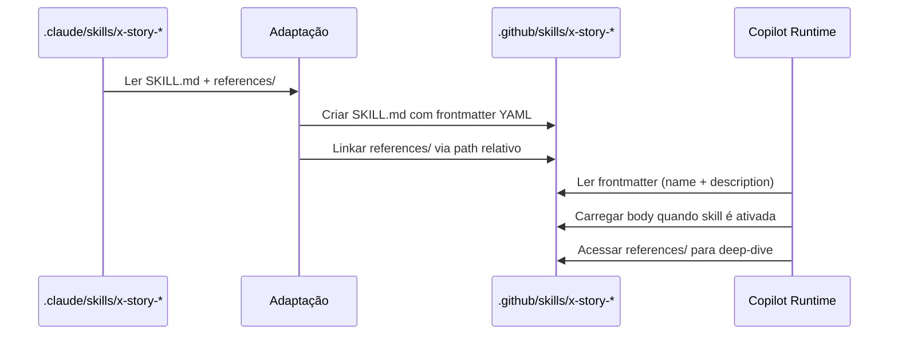

# História: Skills de Story/Planning

**ID:** STORY-003

## 1. Dependências

| Blocked By | Blocks |
| :--- | :--- |
| STORY-001 | STORY-010, STORY-012 |

## 2. Regras Transversais Aplicáveis

| ID | Título |
| :--- | :--- |
| RULE-001 | Paridade funcional |
| RULE-002 | Convenções do Copilot |
| RULE-003 | Sem duplicação de conteúdo |
| RULE-004 | Idioma (pt-BR para estas skills) |
| RULE-005 | Progressive disclosure |

## 3. Descrição

Como **Product Owner Técnico**, eu quero adaptar as skills de story/planning (`x-story-epic`, `x-story-create`, `x-story-map`, `x-story-epic-full`, `story-planning`) para `.github/skills/`, garantindo que o fluxo de decomposição de specs em épicos e histórias funcione no Copilot com a mesma qualidade.

Este é o primeiro grupo de skills a ser criado e estabelece o padrão canônico de `SKILL.md` com frontmatter YAML, progressive disclosure em 3 níveis e referências a conteúdo existente. As skills de story são exceção de idioma (pt-BR conforme RULE-004).

### 3.1 Skills a criar

- `.github/skills/x-story-epic/SKILL.md` — Geração de Epic a partir de spec
- `.github/skills/x-story-create/SKILL.md` — Geração de Stories a partir de Epic
- `.github/skills/x-story-map/SKILL.md` — Geração de Implementation Map
- `.github/skills/x-story-epic-full/SKILL.md` — Orquestração completa (Epic + Stories + Map)
- `.github/skills/story-planning/SKILL.md` — Referência de decomposição e planning

### 3.2 Padrão de frontmatter

```yaml
---
name: x-story-epic
description: >
  Gera um documento Epic a partir de uma especificação técnica. Extrai
  regras cross-cutting, story index e quality gates. Use quando o usuário
  pedir para criar epic, decompor spec ou extrair regras de negócio.
---
```

### 3.3 Progressive disclosure

- Nível 1: Frontmatter com description suficiente para trigger
- Nível 2: Body com workflow completo, templates referenciados, quality checklist
- Nível 3: `references/decomposition-guide.md` e templates linkados

## 4. Definições de Qualidade Locais

### DoR Local (Definition of Ready)

- [ ] STORY-001 concluída (instructions base disponíveis)
- [ ] Skills equivalentes em `.claude/skills/` lidas e mapeadas
- [ ] Frontmatter YAML pattern validado para naming lowercase-hyphens

### DoD Local (Definition of Done)

- [ ] 5 skills criadas com frontmatter válido
- [ ] Cada skill com description específica para trigger correto
- [ ] Conteúdo em pt-BR (exceção RULE-004)
- [ ] References referenciam `.claude/skills/*/references/` sem duplicar
- [ ] Copilot ativa a skill correta quando solicitado

### Global Definition of Done (DoD)

- **Validação de formato:** YAML frontmatter válido e parseável
- **Convenções Copilot:** `name` em lowercase-hyphens, `description` presente
- **Sem duplicação:** References linkam para `.claude/skills/`
- **Idioma:** pt-BR (exceção documentada)
- **Progressive disclosure:** 3 níveis implementados
- **Documentação:** README.md atualizado

## 5. Contratos de Dados (Data Contract)

**Skill File Contract:**

| Campo | Formato | Request | Response | Origem / Regra |
| :--- | :--- | :--- | :--- | :--- |
| `frontmatter.name` | string (lowercase-hyphens) | M | — | Identificador para trigger. Ex: `x-story-epic` |
| `frontmatter.description` | string (multiline) | M | — | Descrição para roteamento. Deve incluir trigger keywords |
| `body` | markdown | M | — | Instruções detalhadas do workflow |
| `references/` | directory | O | — | Arquivos auxiliares para deep-dive |

## 6. Diagramas

### 6.1 Adaptação de Skills de Story/Planning



## 7. Critérios de Aceite (Gherkin)

```gherkin
Cenario: Frontmatter válido em skill de story
  DADO que .github/skills/x-story-epic/SKILL.md foi criado
  QUANDO o frontmatter YAML é parseado
  ENTÃO o campo "name" é "x-story-epic"
  E o campo "description" contém keywords de trigger como "epic" e "spec"

Cenario: Trigger correto da skill x-story-epic-full
  DADO que o usuário solicita "decomponha esta spec em epic e stories"
  QUANDO o Copilot avalia as skills disponíveis
  ENTÃO a skill x-story-epic-full é selecionada
  E o body com workflow completo é carregado

Cenario: Conteúdo em pt-BR conforme exceção RULE-004
  DADO que skills de story são exceção de idioma
  QUANDO o body de x-story-create é gerado
  ENTÃO o conteúdo está em português brasileiro
  E termos técnicos como "frontmatter", "sprint" e "DAG" permanecem em inglês

Cenario: Progressive disclosure com 3 níveis
  DADO que a skill x-story-map tem frontmatter, body e references/
  QUANDO o Copilot carrega apenas o frontmatter
  ENTÃO apenas name e description são consumidos
  E o body NÃO é carregado até ativação explícita

Cenario: Referência sem duplicação de decomposition-guide
  DADO que .claude/skills/x-story-epic-full/references/decomposition-guide.md existe
  QUANDO .github/skills/x-story-epic-full/ referencia esse conteúdo
  ENTÃO usa link relativo para o arquivo original
  E NÃO cria cópia do arquivo em .github/skills/
```

## 8. Sub-tarefas

- [ ] [Dev] Criar `.github/skills/x-story-epic/SKILL.md` com frontmatter e body adaptados
- [ ] [Dev] Criar `.github/skills/x-story-create/SKILL.md` com frontmatter e body adaptados
- [ ] [Dev] Criar `.github/skills/x-story-map/SKILL.md` com frontmatter e body adaptados
- [ ] [Dev] Criar `.github/skills/x-story-epic-full/SKILL.md` com frontmatter e body adaptados
- [ ] [Dev] Criar `.github/skills/story-planning/SKILL.md` com frontmatter e body adaptados
- [ ] [Test] Validar YAML frontmatter de todas as 5 skills
- [ ] [Test] Validar trigger keywords nas descriptions
- [ ] [Test] Verificar links relativos para references/
- [ ] [Doc] Documentar skills de story/planning no README
