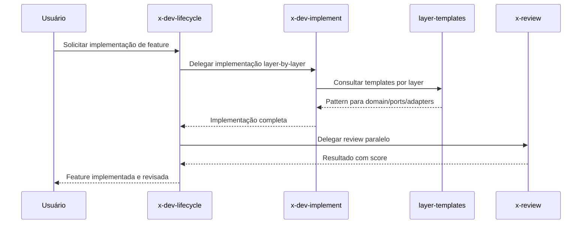

# História: Skills de Development

**ID:** STORY-004

## 1. Dependências

| Blocked By | Blocks |
| :--- | :--- |
| STORY-001 | STORY-010, STORY-012 |

## 2. Regras Transversais Aplicáveis

| ID | Título |
| :--- | :--- |
| RULE-001 | Paridade funcional |
| RULE-002 | Convenções do Copilot |
| RULE-003 | Sem duplicação de conteúdo |
| RULE-005 | Progressive disclosure |

## 3. Descrição

Como **Java Developer**, eu quero adaptar as skills de development (`x-dev-implement`, `x-dev-lifecycle`, `layer-templates`) para `.github/skills/`, garantindo que o fluxo de implementação de features siga os mesmos padrões de qualidade e arquitetura hexagonal.

Estas skills são de alta prioridade pois representam o core do fluxo de desenvolvimento. Elas orquestram desde o planning até a implementação layer-by-layer com checks intermediários de compilação.

### 3.1 Skills a criar

- `.github/skills/x-dev-implement/SKILL.md` — Implementação de feature seguindo convenções
- `.github/skills/x-dev-lifecycle/SKILL.md` — Ciclo completo: branch → plan → implement → review → PR
- `.github/skills/layer-templates/SKILL.md` — Templates de código por layer da arquitetura hexagonal

### 3.2 Referências a knowledge packs

- `x-dev-implement` referencia `architecture`, `coding-standards`, `layer-templates`
- `x-dev-lifecycle` orquestra `x-dev-implement`, `x-review`, `x-git-push`
- `layer-templates` contém patterns para domain, ports, adapters, application

## 4. Definições de Qualidade Locais

### DoR Local (Definition of Ready)

- [ ] STORY-001 concluída (instructions base disponíveis)
- [ ] Skills `.claude/skills/x-dev-*` e `layer-templates` lidas
- [ ] Padrão de frontmatter validado em STORY-003

### DoD Local (Definition of Done)

- [ ] 3 skills criadas com frontmatter válido
- [ ] Body com workflow detalhado de implementação
- [ ] References linkam para `.claude/skills/` originais
- [ ] Copilot ativa skill correta para "implementar feature"

### Global Definition of Done (DoD)

- **Validação de formato:** YAML frontmatter válido e parseável
- **Convenções Copilot:** `name` em lowercase-hyphens, `description` presente
- **Sem duplicação:** References linkam para `.claude/skills/`
- **Idioma:** Inglês
- **Progressive disclosure:** 3 níveis implementados
- **Documentação:** README.md atualizado

## 5. Contratos de Dados (Data Contract)

**Development Skill Contract:**

| Campo | Formato | Request | Response | Origem / Regra |
| :--- | :--- | :--- | :--- | :--- |
| `frontmatter.name` | string (lowercase-hyphens) | M | — | Ex: `x-dev-implement` |
| `frontmatter.description` | string (multiline) | M | — | Keywords: implement, feature, lifecycle, layer |
| `referenced_skills` | array[string] | M | — | Skills que esta skill orquestra |
| `language_framework` | string | M | — | Ex: "java 21 / quarkus 3.17" |

## 6. Diagramas

### 6.1 Orquestração de Dev Lifecycle



## 7. Critérios de Aceite (Gherkin)

```gherkin
Cenario: Trigger correto para implementação de feature
  DADO que .github/skills/x-dev-implement/SKILL.md existe com frontmatter válido
  QUANDO o usuário solicita "implementar a STORY-005"
  ENTÃO o Copilot seleciona a skill x-dev-implement
  E o body com workflow de implementação é carregado

Cenario: Layer templates com patterns por camada
  DADO que .github/skills/layer-templates/SKILL.md existe
  QUANDO a skill é ativada para criar um use case
  ENTÃO o template da camada application é fornecido
  E segue o padrão de arquitetura hexagonal definido nas instructions

Cenario: Dev lifecycle orquestra skills dependentes
  DADO que x-dev-lifecycle referencia x-dev-implement e x-review
  QUANDO o usuário solicita "ciclo completo de implementação"
  ENTÃO a skill carrega o workflow completo
  E referencia as skills dependentes por nome

Cenario: Frontmatter com name inválido (uppercase)
  DADO que um SKILL.md tem name: "X-Dev-Implement" (com uppercase)
  QUANDO o frontmatter é validado
  ENTÃO a validação falha
  E o erro indica que name deve ser lowercase-hyphens
```

## 8. Sub-tarefas

- [ ] [Dev] Criar `.github/skills/x-dev-implement/SKILL.md` com workflow de implementação
- [ ] [Dev] Criar `.github/skills/x-dev-lifecycle/SKILL.md` com ciclo completo
- [ ] [Dev] Criar `.github/skills/layer-templates/SKILL.md` com templates por layer
- [ ] [Test] Validar YAML frontmatter das 3 skills
- [ ] [Test] Verificar trigger keywords nas descriptions
- [ ] [Test] Validar referências cruzadas entre skills
- [ ] [Doc] Documentar skills de development no README
