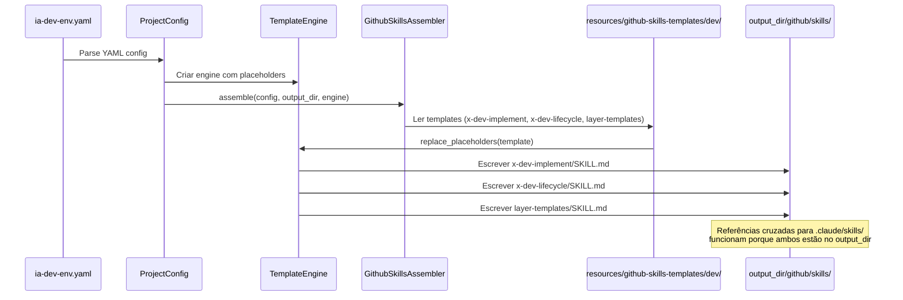
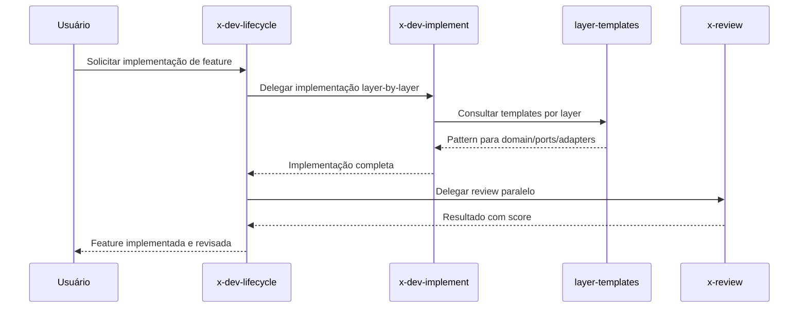

# História: Skills de Development

**ID:** STORY-004

## 1. Dependências

| Blocked By | Blocks |
| :--- | :--- |
| STORY-001 | STORY-010, STORY-012 |

## 2. Regras Transversais Aplicáveis

| ID | Título |
| :--- | :--- |
| RULE-001 | Paridade funcional |
| RULE-002 | Convenções do Copilot |
| RULE-003 | Sem duplicação de conteúdo |
| RULE-005 | Progressive disclosure |
| RULE-008 | Integração com o gerador |

## 3. Descrição

Como **Java Developer**, eu quero que o gerador `ia_dev_env` produza skills de development (`x-dev-implement`, `x-dev-lifecycle`, `layer-templates`) em `.github/skills/`, garantindo que o fluxo de implementação de features siga os mesmos padrões de qualidade e arquitetura hexagonal.

Estas skills são de alta prioridade pois representam o core do fluxo de desenvolvimento. O assembler gera os arquivos a partir de templates em `resources/` com placeholder replacement via `TemplateEngine`, orquestrando desde o planning até a implementação layer-by-layer com checks intermediários. Os templates referenciam knowledge packs em `.claude/skills/` via links relativos (ambos gerados no mesmo `output_dir`).

### 3.1 Contexto Técnico (Gerador)

**Assembler:** Extensão do `GithubSkillsAssembler` criado em STORY-003 (ou assembler dedicado)

- **Padrão:** Mesmo padrão de STORY-003 — templates em `resources/` + `TemplateEngine`
- **Input:** `ProjectConfig` + templates em `resources/github-skills-templates/dev/`
- **Output:** `output_dir/github/skills/{x-dev-implement,x-dev-lifecycle,layer-templates}/SKILL.md`
- **Templates:** Cada skill tem um template Markdown com frontmatter YAML, body com workflow e referências
- **Pipeline:** Se `GithubSkillsAssembler` de STORY-003 já itera sobre subdiretórios de `resources/github-skills-templates/`, basta adicionar o subdiretório `dev/`. Caso contrário, registrar novo assembler em `_build_assemblers()`
- **Referências cruzadas:** `x-dev-implement` referencia `architecture`, `coding-standards`, `layer-templates` em `.claude/skills/` — funciona porque ambos são gerados no mesmo `output_dir`
- **Orquestração:** `x-dev-lifecycle` referencia `x-dev-implement`, `x-review`, `x-git-push` — todas geradas pelo mesmo pipeline

### 3.2 Skills a gerar

- `output_dir/github/skills/x-dev-implement/SKILL.md` — Implementação de feature seguindo convenções
- `output_dir/github/skills/x-dev-lifecycle/SKILL.md` — Ciclo completo: branch → plan → implement → review → PR
- `output_dir/github/skills/layer-templates/SKILL.md` — Templates de código por layer da arquitetura hexagonal

### 3.3 Referências a knowledge packs (nos templates)

- `x-dev-implement` referencia `architecture`, `coding-standards`, `layer-templates` via link relativo no output
- `x-dev-lifecycle` orquestra `x-dev-implement`, `x-review`, `x-git-push` — skills geradas pelo mesmo pipeline
- `layer-templates` contém patterns para domain, ports, adapters, application — referencia `.claude/skills/layer-templates/references/`

## 4. Definições de Qualidade Locais

### DoR Local (Definition of Ready)

- [ ] STORY-001 concluída (GithubInstructionsAssembler como referência de padrão)
- [ ] STORY-003 concluída ou em paralelo (padrão de GithubSkillsAssembler definido)
- [ ] Skills `.claude/skills/x-dev-*` e `layer-templates` lidas e mapeadas para templates
- [ ] Estrutura de templates definida em `resources/github-skills-templates/dev/`

### DoD Local (Definition of Done)

- [ ] 3 templates de skills criados em `resources/github-skills-templates/dev/`
- [ ] Assembler gera 3 skills em `output_dir/github/skills/` com frontmatter válido
- [ ] Body com workflow detalhado de implementação nos templates
- [ ] References linkam para `.claude/skills/` originais (referência cruzada no output)
- [ ] Golden files atualizados em `tests/golden/` com output esperado
- [ ] `test_byte_for_byte.py` passando com golden files atualizados
- [ ] Testes unitários do assembler passando (template rendering, frontmatter)

### Global Definition of Done (DoD)

- **Validação de formato:** YAML frontmatter válido e parseável nos templates e output
- **Convenções Copilot:** `name` em lowercase-hyphens, `description` presente
- **Sem duplicação:** References linkam para `.claude/skills/` no output
- **Idioma:** Inglês
- **Progressive disclosure:** 3 níveis implementados nos templates
- **Pipeline integrado:** Assembler registrado e executado no pipeline
- **Golden files:** Output byte-a-byte validado

## 5. Contratos de Dados (Data Contract)

**Development Skill Contract:**

| Campo | Formato | Request | Response | Origem / Regra |
| :--- | :--- | :--- | :--- | :--- |
| `frontmatter.name` | string (lowercase-hyphens) | M | — | Ex: `x-dev-implement` |
| `frontmatter.description` | string (multiline) | M | — | Keywords: implement, feature, lifecycle, layer |
| `referenced_skills` | array[string] | M | — | Skills que esta skill orquestra (no template) |
| `language_framework` | string | M | — | Ex: "java 21 / quarkus 3.17" (de `ProjectConfig`) |

## 6. Diagramas

### 6.1 Pipeline do Gerador para Skills de Development



### 6.2 Orquestração de Dev Lifecycle (no output gerado)



## 7. Critérios de Aceite (Gherkin)

```gherkin
Cenario: Pipeline gera 3 skills de development
  DADO que resources/github-skills-templates/dev/ contém 3 templates
  QUANDO o assembler de GitHub skills é executado
  ENTÃO 3 diretórios são criados em output_dir/github/skills/
  E cada um contém SKILL.md com frontmatter YAML válido

Cenario: Trigger correto para implementação de feature
  DADO que o template de x-dev-implement gera SKILL.md com frontmatter válido
  QUANDO o output é gerado pelo pipeline
  ENTÃO o campo "name" é "x-dev-implement"
  E o campo "description" contém keywords "implement" e "feature"

Cenario: Golden files validam output byte-a-byte
  DADO que tests/golden/ contém expected output para github/skills/x-dev-*
  QUANDO test_byte_for_byte.py é executado
  ENTÃO o output gerado é idêntico byte-a-byte ao golden file

Cenario: Layer templates com patterns por camada no output
  DADO que o template de layer-templates gera SKILL.md
  QUANDO o assembler processa o template via TemplateEngine
  ENTÃO placeholders de ProjectConfig são substituídos (language, framework)
  E o body contém patterns para domain, ports, adapters, application

Cenario: Referências cruzadas entre skills no output
  DADO que x-dev-lifecycle referencia x-dev-implement e x-review
  QUANDO o pipeline gera ambas as skills no mesmo output_dir
  ENTÃO links relativos entre elas são válidos
  E referências para .claude/skills/ são acessíveis

Cenario: Frontmatter com name inválido (uppercase) no template
  DADO que um template tem name: "X-Dev-Implement" (com uppercase)
  QUANDO o assembler valida o frontmatter
  ENTÃO a validação falha
  E o erro indica que name deve ser lowercase-hyphens
```

## 8. Sub-tarefas

- [ ] [Dev] Criar template `resources/github-skills-templates/dev/x-dev-implement.md` com workflow de implementação
- [ ] [Dev] Criar template `resources/github-skills-templates/dev/x-dev-lifecycle.md` com ciclo completo
- [ ] [Dev] Criar template `resources/github-skills-templates/dev/layer-templates.md` com templates por layer
- [ ] [Dev] Registrar templates no assembler (extensão de STORY-003 ou novo assembler em `_build_assemblers()`)
- [ ] [Dev] Configurar placeholders de `ProjectConfig` nos templates (language, framework, etc.)
- [ ] [Test] Criar golden files em `tests/golden/` com expected output para 3 skills
- [ ] [Test] Validar `test_byte_for_byte.py` com novos golden files
- [ ] [Test] Testes unitários do assembler (template rendering, frontmatter validation)
- [ ] [Test] Verificar trigger keywords nas descriptions do output
- [ ] [Test] Validar referências cruzadas entre skills e para `.claude/skills/` no output
