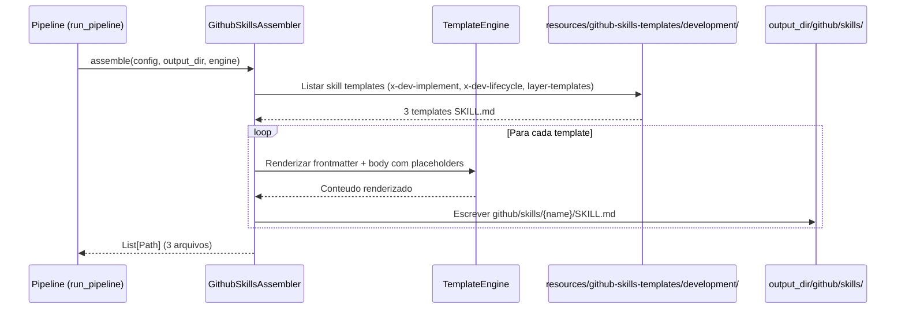

# Historia: Skills de Development

**ID:** STORY-004

## 1. Dependencias

| Blocked By | Blocks |
| :--- | :--- |
| STORY-001 | STORY-010, STORY-012 |

## 2. Regras Transversais Aplicaveis

| ID | Titulo |
| :--- | :--- |
| RULE-001 | Paridade funcional |
| RULE-002 | Convencoes do Copilot |
| RULE-003 | Sem duplicacao de conteudo |
| RULE-005 | Progressive disclosure |

## 3. Descricao

Como **Java Developer**, eu quero que o gerador `claude_setup` produza skills de development (`x-dev-implement`, `x-dev-lifecycle`, `layer-templates`) dentro da estrutura `.github/skills/`, garantindo que o fluxo de implementacao de features siga os mesmos padroes de qualidade e arquitetura hexagonal.

Estas skills sao de alta prioridade pois representam o core do fluxo de desenvolvimento. Elas orquestram desde o planning ate a implementacao layer-by-layer com checks intermediarios de compilacao.

### 3.1 Skills a gerar

- `github/skills/x-dev-implement/SKILL.md` — Implementacao de feature seguindo convencoes
- `github/skills/x-dev-lifecycle/SKILL.md` — Ciclo completo: branch -> plan -> implement -> review -> PR
- `github/skills/layer-templates/SKILL.md` — Templates de codigo por layer da arquitetura hexagonal

### 3.2 Referencias a knowledge packs

- `x-dev-implement` referencia `architecture`, `coding-standards`, `layer-templates`
- `x-dev-lifecycle` orquestra `x-dev-implement`, `x-review`, `x-git-push`
- `layer-templates` contem patterns para domain, ports, adapters, application

### 3.3 Contexto Tecnico (Gerador)

Este story segue o mesmo padrao de STORY-003. Se STORY-003 criou o `GithubSkillsAssembler`, este story estende o assembler com templates adicionais. Caso contrario, cria o assembler.

**Cenario provavel (STORY-003 ja implementada):**
- O `GithubSkillsAssembler` ja existe e itera templates por diretorio
- Basta criar novos templates em `resources/github-skills-templates/development/`
- O assembler automaticamente descobre e renderiza os novos templates

**Cenario alternativo (STORY-003 nao implementada):**
- Criar `GithubSkillsAssembler` conforme descrito em STORY-003
- Incluir templates de development junto com os de story-planning

Implementacao:

- **Templates:** Criar `resources/github-skills-templates/development/` contendo:
  - `x-dev-implement/SKILL.md` — template com frontmatter Copilot + workflow de implementacao
  - `x-dev-lifecycle/SKILL.md` — template com ciclo completo, referenciando skills dependentes
  - `layer-templates/SKILL.md` — template com patterns por layer (domain, ports, adapters, application)
- **Assembler:** Se `GithubSkillsAssembler` ja existe (de STORY-003):
  - Verificar que o assembler descobre `resources/github-skills-templates/development/` automaticamente
  - Se necessario, ajustar logica de scan de diretorios
  - Se o assembler nao existe, criar conforme STORY-003
- **Frontmatter:** Cada template deve incluir:
  - `name` em lowercase-hyphens
  - `description` com keywords relevantes (implement, feature, lifecycle, layer, hexagonal)
  - Body com workflow detalhado e referencias a knowledge packs
- **References:** Links relativos para `.claude/skills/` originais (architecture, coding-standards, layer-templates)
- **Testes:**
  - Criar/estender testes unitarios para skills de development
  - Regenerar golden files para 8 perfis
  - Verificar `test_byte_for_byte.py` passando
  - Validar frontmatter YAML parseavel
  - Validar referencias cruzadas entre skills (x-dev-lifecycle -> x-dev-implement)

## 4. Definicoes de Qualidade Locais

### DoR Local (Definition of Ready)

- [ ] STORY-001 concluida (instructions base disponiveis)
- [ ] Skills `.claude/skills/x-dev-*` e `layer-templates` lidas e mapeadas
- [ ] Padrao de frontmatter validado em STORY-003 (ou definido aqui se STORY-003 pendente)
- [ ] `GithubSkillsAssembler` disponivel (de STORY-003) ou decisao de cria-lo tomada

### DoD Local (Definition of Done)

- [ ] 3 templates de skills criados em `resources/github-skills-templates/development/`
- [ ] Assembler gera 3 skills em `github/skills/` com frontmatter YAML valido
- [ ] Body com workflow detalhado de implementacao
- [ ] References linkam para `.claude/skills/` originais
- [ ] Golden files regenerados e testes byte-for-byte passando

### Global Definition of Done (DoD)

- **Validacao de formato:** YAML frontmatter valido e parseavel
- **Convencoes Copilot:** `name` em lowercase-hyphens, `description` presente
- **Sem duplicacao:** References linkam para `.claude/skills/`
- **Idioma:** Ingles
- **Progressive disclosure:** 3 niveis implementados nos templates
- **Testes:** `test_byte_for_byte.py`, `test_pipeline.py` e testes unitarios passando

## 5. Contratos de Dados (Data Contract)

**Development Skill Contract:**

| Campo | Formato | Request | Response | Origem / Regra |
| :--- | :--- | :--- | :--- | :--- |
| `frontmatter.name` | string (lowercase-hyphens) | M | — | Ex: `x-dev-implement` |
| `frontmatter.description` | string (multiline) | M | — | Keywords: implement, feature, lifecycle, layer |
| `referenced_skills` | array[string] | M | — | Skills que esta skill orquestra (no body) |
| `template_dir` | Path | M | — | `resources/github-skills-templates/development/` |
| `output_dir` | Path | — | M | `github/skills/{skill-name}/SKILL.md` |

## 6. Diagramas

### 6.1 Fluxo do Assembler de Skills Development



### 6.2 Orquestracao de Dev Lifecycle (runtime)


## 7. Criterios de Aceite (Gherkin)

```gherkin
Cenario: Assembler gera skill x-dev-implement com frontmatter valido
  DADO que o template x-dev-implement/SKILL.md existe em resources/github-skills-templates/development/
  QUANDO o GithubSkillsAssembler.assemble() e chamado
  ENTAO o arquivo github/skills/x-dev-implement/SKILL.md e gerado no output_dir
  E o frontmatter YAML e parseavel
  E o campo "name" e "x-dev-implement"
  E o campo "description" contem keywords "implement" e "feature"

Cenario: Layer templates com patterns por camada
  DADO que o template layer-templates/SKILL.md existe em resources/
  QUANDO o assembler gera o arquivo
  ENTAO o body contem patterns para domain, ports, adapters e application
  E segue o padrao de arquitetura hexagonal definido nas instructions

Cenario: Dev lifecycle referencia skills dependentes
  DADO que o template x-dev-lifecycle/SKILL.md referencia x-dev-implement e x-review
  QUANDO o assembler gera o arquivo
  ENTAO o body contem referencias por nome as skills dependentes
  E o workflow completo esta documentado no body

Cenario: Frontmatter com name em lowercase-hyphens
  DADO que todos os templates de development usam name em lowercase-hyphens
  QUANDO o assembler gera os arquivos
  ENTAO nenhum name contem caracteres uppercase
  E o pattern [a-z0-9-]+ e respeitado

Cenario: Golden files byte-for-byte para skills de development
  DADO que golden files incluem github/skills/x-dev-* para todos os perfis
  QUANDO test_byte_for_byte.py executa
  ENTAO cada skill gerada e identica byte-a-byte ao golden file correspondente
```

## 8. Sub-tarefas

- [ ] [Dev] Criar templates em `resources/github-skills-templates/development/` (3 skills: x-dev-implement, x-dev-lifecycle, layer-templates)
- [ ] [Dev] Verificar que `GithubSkillsAssembler` descobre templates em `development/` (ajustar scan se necessario)
- [ ] [Dev] Se `GithubSkillsAssembler` nao existe (STORY-003 pendente), criar conforme padrao de STORY-003
- [ ] [Dev] Incluir referencias cruzadas entre skills no body dos templates
- [ ] [Test] Criar/estender testes unitarios para skills de development (frontmatter YAML, keywords)
- [ ] [Test] Validar referencias cruzadas entre skills (x-dev-lifecycle -> x-dev-implement)
- [ ] [Test] Regenerar golden files para 8 perfis
- [ ] [Test] Verificar testes byte-for-byte passando
