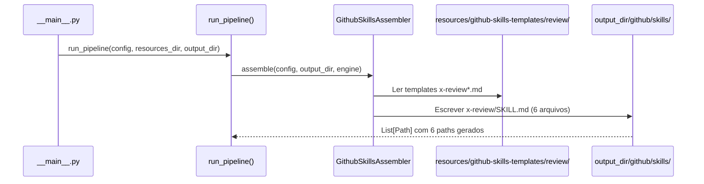
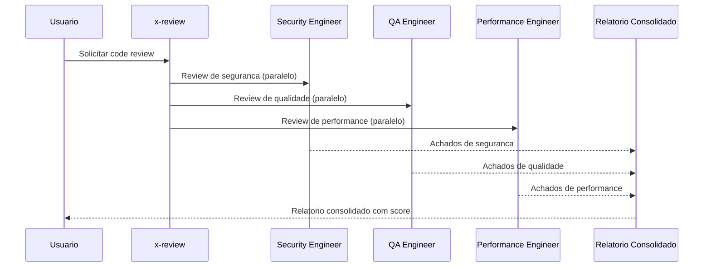

# Historia: Skills de Review (Gerador Python)

**ID:** STORY-005

## 1. Dependencias

| Blocked By | Blocks |
| :--- | :--- |
| STORY-001 | STORY-010, STORY-012 |

## 2. Regras Transversais Aplicaveis

| ID | Titulo |
| :--- | :--- |
| RULE-001 | Paridade funcional |
| RULE-002 | Convencoes do Copilot |
| RULE-003 | Sem duplicacao de conteudo |
| RULE-005 | Progressive disclosure |

## 3. Descricao

Como **Tech Lead**, eu quero que o gerador Python `ia_dev_env` produza as 6 skills de review (`x-review`, `x-review-api`, `x-review-pr`, `x-review-grpc`, `x-review-events`, `x-review-gateway`) dentro do diretorio `.github/skills/` gerado, garantindo que o processo de code review automatizado mantenha a mesma cobertura e rigor.

O gerador `ia_dev_env` ja produz tanto `.claude/` quanto `.github/` como output. Esta story adiciona templates e logica de assembler para gerar as skills de review na arvore `.github/skills/`. Ambos os diretorios (`.claude/` e `.github/`) sao gitignored -- sao output do gerador.

As skills de review sao de alta prioridade e formam o pilar de qualidade do repositorio. Cada skill tem um foco especializado (API design, PR holistico, gRPC, eventos, gateway) e produz relatorios com scoring padronizado.

### 3.1 Skills a gerar

- `.github/skills/x-review/SKILL.md` -- Review paralelo com 8 engenheiros especialistas (Security, QA, Performance, Database, Observability, DevOps, API, Event)
- `.github/skills/x-review-api/SKILL.md` -- Validacao REST: RFC 7807, pagination, URL versioning, OpenAPI, status codes
- `.github/skills/x-review-pr/SKILL.md` -- Tech Lead review com checklist de 40 pontos, decisao GO/NO-GO
- `.github/skills/x-review-grpc/SKILL.md` -- Validacao de proto3, service definitions, patterns
- `.github/skills/x-review-events/SKILL.md` -- Validacao de event schemas, producer/consumer, dead letter
- `.github/skills/x-review-gateway/SKILL.md` -- Review de API gateway configuration

### 3.2 Padrao de descriptions

Cada description deve incluir keywords especificas para evitar colisao de trigger entre skills de review similares. Ex: `x-review-api` usa "REST", "RFC 7807", "OpenAPI"; `x-review-grpc` usa "gRPC", "proto3", "protobuf".

## Contexto Tecnico (Gerador)

### Assembler

- Criar ou estender um assembler em `src/ia_dev_env/assembler/` (ex: `github_skills_assembler.py`) que implemente `assemble(config, output_dir, engine) -> List[Path]`.
- O assembler le templates de `resources/github-skills-templates/review/` e gera arquivos em `output_dir/github/skills/<skill-name>/SKILL.md`.
- Registrar o novo assembler em `assembler/__init__.py` -> `_build_assemblers()`.

### Templates

- Criar diretorio `resources/github-skills-templates/review/` com 6 templates Jinja/Markdown:
  - `x-review.md`, `x-review-api.md`, `x-review-pr.md`, `x-review-grpc.md`, `x-review-events.md`, `x-review-gateway.md`
- Templates usam placeholders do `TemplateEngine` (ex: `{{PROJECT_NAME}}`, `{{LANGUAGE}}`).

### Pipeline

- O pipeline `assembler/__init__.py` -> `run_pipeline()` ja orquestra todos os assemblers.
- O novo assembler e executado apos `GithubInstructionsAssembler` (que gera `.github/instructions/`).

### Testes

- **Golden files:** Adicionar fixtures em `tests/golden/github/skills/x-review*/SKILL.md` e validar em `tests/test_byte_for_byte.py`.
- **Pipeline test:** Estender `tests/test_pipeline.py` para verificar que os 6 arquivos de review skills aparecem em `PipelineResult.files_generated`.
- **Unit test:** Testar o assembler isoladamente com config mock e `tmp_path`.

## 4. Definicoes de Qualidade Locais

### DoR Local (Definition of Ready)

- [ ] STORY-001 concluida (`GithubInstructionsAssembler` funcional)
- [ ] Skills `.claude/skills/x-review*` lidas e mapeadas como base para templates
- [ ] Padrao de frontmatter validado em STORY-003
- [ ] Estrutura de `resources/github-skills-templates/` definida

### DoD Local (Definition of Done)

- [ ] Assembler gera 6 skills com frontmatter YAML valido
- [ ] Descriptions diferenciadas para evitar colisao de trigger
- [ ] Body com workflow de review e formato de output
- [ ] References linkam para knowledge packs originais em `.claude/skills/`
- [ ] Golden files conferem byte-a-byte
- [ ] `tests/test_pipeline.py` passa com os 6 novos arquivos

### Global Definition of Done (DoD)

- **Validacao de formato:** YAML frontmatter valido e parseavel
- **Convencoes Copilot:** `name` em lowercase-hyphens, `description` presente
- **Sem duplicacao:** References linkam para `.claude/skills/`
- **Idioma:** Ingles
- **Progressive disclosure:** 3 niveis implementados
- **Documentacao:** README.md atualizado

## 5. Contratos de Dados (Data Contract)

**Review Skill Contract:**

| Campo | Formato | Request | Response | Origem / Regra |
| :--- | :--- | :--- | :--- | :--- |
| `frontmatter.name` | string (lowercase-hyphens) | M | -- | Ex: `x-review-api` |
| `frontmatter.description` | string (multiline) | M | -- | Keywords especificas por tipo de review |
| `review_focus` | string | M | -- | Foco do review (REST, gRPC, holistico, etc.) |
| `output_format` | string | M | -- | Formato do relatorio (score, GO/NO-GO, etc.) |

## 6. Diagramas

### 6.1 Fluxo do Gerador para Skills de Review



### 6.2 Fluxo de Review Paralelo (Runtime)



## 7. Criterios de Aceite (Gherkin)

```gherkin
Cenario: Gerador produz 6 skills de review
  DADO que o config YAML do projeto esta valido
  QUANDO run_pipeline() e executado
  ENTAO output_dir/github/skills/ contem 6 subdiretorios: x-review, x-review-api, x-review-pr, x-review-grpc, x-review-events, x-review-gateway
  E cada subdiretorio contem SKILL.md com frontmatter YAML valido

Cenario: Golden files de review conferem byte-a-byte
  DADO que tests/golden/github/skills/x-review*/SKILL.md existem
  QUANDO test_byte_for_byte.py e executado
  ENTAO a saida gerada e identica aos golden files

Cenario: Trigger diferenciado entre x-review-api e x-review-grpc
  DADO que ambos os SKILL.md gerados possuem descriptions distintas
  QUANDO o Copilot le os frontmatters
  ENTAO x-review-api contem keywords "REST", "RFC 7807", "OpenAPI"
  E x-review-grpc contem keywords "gRPC", "proto3", "protobuf"
  E NAO ha sobreposicao de keywords primarias

Cenario: Pipeline test inclui skills de review
  DADO que tests/test_pipeline.py valida PipelineResult
  QUANDO o pipeline roda com config padrao
  ENTAO PipelineResult.files_generated inclui paths para os 6 SKILL.md de review

Cenario: Referencia a knowledge pack de security
  DADO que o template x-review.md referencia .claude/skills/security/SKILL.md
  QUANDO o SKILL.md e gerado
  ENTAO o link relativo aponta para o knowledge pack original
  E NAO duplica o conteudo em .github/skills/
```

## 8. Sub-tarefas

- [ ] [Dev] Criar diretorio `resources/github-skills-templates/review/` com 6 templates Markdown
- [ ] [Dev] Implementar `GithubSkillsAssembler` (ou estender existente) em `src/ia_dev_env/assembler/` com metodo `assemble()`
- [ ] [Dev] Registrar assembler em `assembler/__init__.py` -> `_build_assemblers()`
- [ ] [Dev] Criar template `x-review.md` com workflow de review paralelo
- [ ] [Dev] Criar template `x-review-api.md` com validacao REST
- [ ] [Dev] Criar template `x-review-pr.md` com checklist de 40 pontos
- [ ] [Dev] Criar template `x-review-grpc.md` com validacao proto3
- [ ] [Dev] Criar template `x-review-events.md` com validacao de eventos
- [ ] [Dev] Criar template `x-review-gateway.md` com review de gateway
- [ ] [Test] Criar golden files em `tests/golden/github/skills/x-review*/SKILL.md`
- [ ] [Test] Adicionar caso em `tests/test_byte_for_byte.py` para os 6 arquivos
- [ ] [Test] Estender `tests/test_pipeline.py` para validar presenca dos 6 paths
- [ ] [Test] Testar assembler isolado com config mock e `tmp_path`
- [ ] [Test] Validar YAML frontmatter parseavel nas 6 skills geradas
- [ ] [Test] Verificar diferenciacao de keywords entre skills similares
- [ ] [Doc] Documentar skills de review no README
