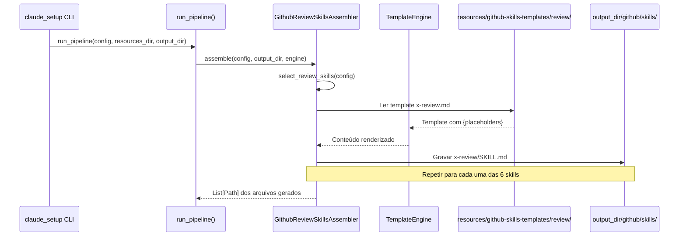

# História: Skills de Review

**ID:** STORY-005

## 1. Dependências

| Blocked By | Blocks |
| :--- | :--- |
| STORY-001 | STORY-010, STORY-012 |

## 2. Regras Transversais Aplicáveis

| ID | Título |
| :--- | :--- |
| RULE-001 | Paridade funcional |
| RULE-002 | Convenções do Copilot |
| RULE-003 | Sem duplicação de conteúdo |
| RULE-005 | Progressive disclosure |

## 3. Descrição

Como **Tech Lead**, eu quero que o gerador `claude_setup` produza as 6 skills de review (`x-review`, `x-review-api`, `x-review-pr`, `x-review-grpc`, `x-review-events`, `x-review-gateway`) em `.github/skills/`, garantindo que o processo de code review automatizado mantenha a mesma cobertura e rigor.

As skills de review são de alta prioridade e formam o pilar de qualidade do repositório. Cada skill tem um foco especializado (API design, PR holístico, gRPC, eventos, gateway) e produz relatórios com scoring padronizado.

### 3.1 Skills a gerar

- `.github/skills/x-review/SKILL.md` — Review paralelo com 8 engenheiros especialistas (Security, QA, Performance, Database, Observability, DevOps, API, Event)
- `.github/skills/x-review-api/SKILL.md` — Validação REST: RFC 7807, pagination, URL versioning, OpenAPI, status codes
- `.github/skills/x-review-pr/SKILL.md` — Tech Lead review com checklist de 40 pontos, decisão GO/NO-GO
- `.github/skills/x-review-grpc/SKILL.md` — Validação de proto3, service definitions, patterns
- `.github/skills/x-review-events/SKILL.md` — Validação de event schemas, producer/consumer, dead letter
- `.github/skills/x-review-gateway/SKILL.md` — Review de API gateway configuration

### 3.2 Padrão de descriptions

Cada description deve incluir keywords específicas para evitar colisão de trigger entre skills de review similares. Ex: `x-review-api` usa "REST", "RFC 7807", "OpenAPI"; `x-review-grpc` usa "gRPC", "proto3", "protobuf".

### 3.3 Contexto Técnico (Gerador)

Este trabalho consiste em **estender o gerador Python `claude_setup`** para emitir skills de review na árvore `.github/skills/`. O gerador já possui `SkillsAssembler` (`src/claude_setup/assembler/skills.py`) que gera skills para `.claude/skills/`. Para `.github/skills/` de review:

- **Assembler**: Criar `GithubReviewSkillsAssembler` em `src/claude_setup/assembler/github_review_skills_assembler.py`, implementando `assemble(config, output_dir, engine) -> List[Path]`. Ele deve iterar sobre os 6 templates de review, renderizar via `TemplateEngine`, e gravar em `output_dir/github/skills/x-review*/SKILL.md`.
- **Templates**: Criar `resources/github-skills-templates/review/` com 6 templates Jinja2/placeholder (um por skill). Cada template deve conter frontmatter YAML (`name` + `description`) e body com workflow e formato de output.
- **Pipeline**: Registrar `GithubReviewSkillsAssembler` em `assembler/__init__.py` → `_build_assemblers()`, após `GithubInstructionsAssembler`.
- **Condicionais**: Skills condicionais (`x-review-api`, `x-review-grpc`, `x-review-events`, `x-review-gateway`) devem respeitar a mesma lógica de gates já existente em `SkillsAssembler._select_interface_skills()` e `_select_infra_skills()`.
- **TemplateEngine**: Usar `engine.replace_placeholders()` para injetar valores de `ProjectConfig` (nome do projeto, framework, interfaces).

## 4. Definições de Qualidade Locais

### DoR Local (Definition of Ready)

- [ ] STORY-001 concluída (`GithubInstructionsAssembler` funcionando)
- [ ] Skills `.claude/skills/x-review*` lidas e mapeadas como referência para templates
- [ ] Padrão de frontmatter YAML validado
- [ ] Estrutura de `resources/github-skills-templates/` definida

### DoD Local (Definition of Done)

- [ ] `GithubReviewSkillsAssembler` implementado e registrado no pipeline
- [ ] 6 templates de review criados em `resources/github-skills-templates/review/`
- [ ] Descriptions diferenciadas para evitar colisão de trigger
- [ ] Body com workflow de review e formato de output
- [ ] References linkam para knowledge packs originais em `.claude/skills/`
- [ ] Golden files atualizados e passando byte-for-byte
- [ ] Pipeline gera `.github/skills/x-review*/SKILL.md` corretamente

### Global Definition of Done (DoD)

- **Validação de formato:** YAML frontmatter válido e parseável
- **Convenções Copilot:** `name` em lowercase-hyphens, `description` presente
- **Sem duplicação:** References linkam para `.claude/skills/`
- **Idioma:** Inglês
- **Progressive disclosure:** 3 níveis implementados
- **Documentação:** README gerado atualizado com skills de review

## 5. Contratos de Dados (Data Contract)

**Review Skill Contract:**

| Campo | Formato | Request | Response | Origem / Regra |
| :--- | :--- | :--- | :--- | :--- |
| `frontmatter.name` | string (lowercase-hyphens) | M | — | Ex: `x-review-api` |
| `frontmatter.description` | string (multiline) | M | — | Keywords específicas por tipo de review |
| `review_focus` | string | M | — | Foco do review (REST, gRPC, holístico, etc.) |
| `output_format` | string | M | — | Formato do relatório (score, GO/NO-GO, etc.) |

## 6. Diagramas

### 6.1 Pipeline do Gerador para Skills de Review



### 6.2 Fluxo de Review Paralelo (output gerado)


## 7. Critérios de Aceite (Gherkin)

```gherkin
Cenario: Gerador produz 6 skills de review
  DADO que o pipeline inclui GithubReviewSkillsAssembler
  QUANDO run_pipeline() é executado com config padrão (interfaces: rest, grpc, event-consumer, event-producer)
  ENTÃO o output_dir contém github/skills/x-review/SKILL.md
  E o output_dir contém github/skills/x-review-api/SKILL.md
  E o output_dir contém github/skills/x-review-pr/SKILL.md
  E o output_dir contém github/skills/x-review-grpc/SKILL.md
  E o output_dir contém github/skills/x-review-events/SKILL.md
  E o output_dir contém github/skills/x-review-gateway/SKILL.md

Cenario: Frontmatter YAML válido nas skills geradas
  DADO que o gerador produziu github/skills/x-review-api/SKILL.md
  QUANDO o frontmatter YAML é parseado
  ENTÃO o campo "name" é "x-review-api"
  E o campo "description" contém keywords "REST", "RFC 7807", "OpenAPI"

Cenario: Skills condicionais respeitam feature gates
  DADO que a config NÃO inclui interface "grpc"
  QUANDO run_pipeline() é executado
  ENTÃO o output_dir NÃO contém github/skills/x-review-grpc/SKILL.md
  MAS contém github/skills/x-review/SKILL.md (sempre presente)
  E contém github/skills/x-review-pr/SKILL.md (sempre presente)

Cenario: Descriptions diferenciadas evitam colisão de trigger
  DADO que as 6 skills de review foram geradas
  QUANDO as descriptions são comparadas
  ENTÃO x-review-api contém "REST" e NÃO contém "gRPC"
  E x-review-grpc contém "gRPC" e NÃO contém "REST"

Cenario: Golden files byte-for-byte
  DADO que os golden files de review existem em tests/golden/
  QUANDO o gerador produz as skills de review
  ENTÃO a saída é idêntica byte-for-byte aos golden files
  E test_byte_for_byte.py passa sem diff

Cenario: Referência a knowledge pack sem duplicação
  DADO que x-review referencia .claude/skills/security/SKILL.md
  QUANDO o body gerado é inspecionado
  ENTÃO contém link relativo para o knowledge pack original
  E NÃO duplica o conteúdo em .github/skills/
```

## 8. Sub-tarefas

- [ ] [Dev] Criar `GithubReviewSkillsAssembler` em `src/claude_setup/assembler/github_review_skills_assembler.py` com `assemble()`, lógica de seleção condicional e renderização via `TemplateEngine`
- [ ] [Dev] Criar 6 templates de skill de review em `resources/github-skills-templates/review/` (`x-review.md`, `x-review-api.md`, `x-review-pr.md`, `x-review-grpc.md`, `x-review-events.md`, `x-review-gateway.md`)
- [ ] [Dev] Implementar lógica de frontmatter YAML (`name` + `description` com keywords diferenciadas) nos templates
- [ ] [Dev] Registrar `GithubReviewSkillsAssembler` em `assembler/__init__.py` → `_build_assemblers()`
- [ ] [Dev] Implementar feature gates condicionais (rest → x-review-api, grpc → x-review-grpc, events → x-review-events, gateway → x-review-gateway)
- [ ] [Test] Testes unitários do assembler: verificar seleção de skills por config
- [ ] [Test] Testes unitários: verificar renderização de templates com `TemplateEngine`
- [ ] [Test] Regenerar golden files e verificar byte-for-byte em `tests/test_byte_for_byte.py`
- [ ] [Test] Adicionar cenários de pipeline em `tests/test_pipeline.py`
- [ ] [Doc] Atualizar template de README gerado (`ReadmeAssembler`) para listar skills de review
