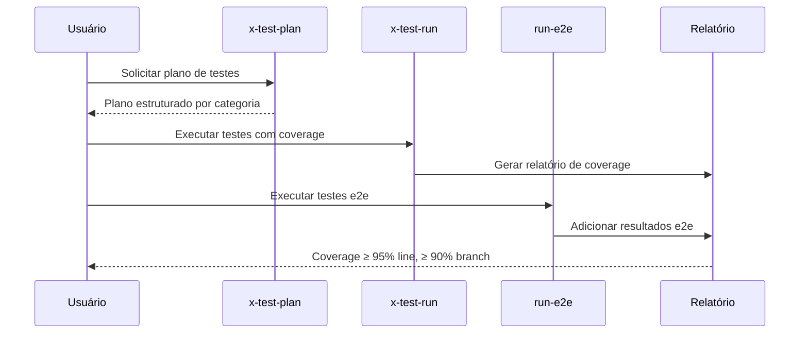

# História: Skills de Testing

**ID:** STORY-006

## 1. Dependências

| Blocked By | Blocks |
| :--- | :--- |
| STORY-001 | STORY-013 |

## 2. Regras Transversais Aplicáveis

| ID | Título |
| :--- | :--- |
| RULE-001 | Paridade funcional |
| RULE-002 | Convenções do Copilot |
| RULE-003 | Sem duplicação de conteúdo |
| RULE-005 | Progressive disclosure |

## 3. Descrição

Como **QA Engineer**, eu quero adaptar as 6 skills de testing (`x-test-plan`, `x-test-run`, `run-e2e`, `run-smoke-api`, `run-contract-tests`, `run-perf-test`) para `.github/skills/`, garantindo que a geração e execução de testes siga os padrões de qualidade com coverage ≥ 95% line e ≥ 90% branch.

As skills de testing cobrem todo o espectro: desde planejamento de testes até execução de smoke tests, e2e, contract tests e performance tests.

### 3.1 Skills a criar

- `.github/skills/x-test-plan/SKILL.md` — Geração de plano de testes abrangente
- `.github/skills/x-test-run/SKILL.md` — Execução de testes com relatório de coverage
- `.github/skills/run-e2e/SKILL.md` — Testes end-to-end com banco real (containers)
- `.github/skills/run-smoke-api/SKILL.md` — Smoke tests com Newman/Postman
- `.github/skills/run-contract-tests/SKILL.md` — Contract tests (Pact, Spring Cloud Contract)
- `.github/skills/run-perf-test/SKILL.md` — Performance tests (latência, throughput, recursos)

### 3.2 Referência a knowledge pack de testing

- Todas referenciam `.claude/skills/testing/SKILL.md` para filosofia e padrões
- Coverage thresholds definidos em instructions/quality-gates.instructions.md

## 4. Definições de Qualidade Locais

### DoR Local (Definition of Ready)

- [ ] STORY-001 concluída (instructions base disponíveis)
- [ ] Skills `.claude/skills/x-test-*` e `run-*` lidas e mapeadas
- [ ] Thresholds de coverage definidos em quality-gates

### DoD Local (Definition of Done)

- [ ] 6 skills criadas com frontmatter válido
- [ ] Cada skill com workflow específico para seu tipo de teste
- [ ] References linkam para knowledge pack de testing
- [ ] Copilot ativa skill correta por tipo de teste

### Global Definition of Done (DoD)

- **Validação de formato:** YAML frontmatter válido e parseável
- **Convenções Copilot:** `name` em lowercase-hyphens, `description` presente
- **Sem duplicação:** References linkam para `.claude/skills/`
- **Idioma:** Inglês
- **Progressive disclosure:** 3 níveis implementados
- **Documentação:** README.md atualizado

## 5. Contratos de Dados (Data Contract)

**Testing Skill Contract:**

| Campo | Formato | Request | Response | Origem / Regra |
| :--- | :--- | :--- | :--- | :--- |
| `frontmatter.name` | string (lowercase-hyphens) | M | — | Ex: `x-test-run` |
| `frontmatter.description` | string (multiline) | M | — | Keywords: test, coverage, e2e, smoke, contract, performance |
| `test_type` | enum(unit, integration, e2e, smoke, contract, performance) | M | — | Tipo de teste coberto |
| `coverage_threshold` | object | O | — | Line ≥ 95%, Branch ≥ 90% |

## 6. Diagramas

### 6.1 Fluxo de Teste e Coverage



## 7. Critérios de Aceite (Gherkin)

```gherkin
Cenario: Trigger correto para geração de plano de testes
  DADO que .github/skills/x-test-plan/SKILL.md existe
  QUANDO o usuário solicita "criar plano de testes para STORY-003"
  ENTÃO o Copilot seleciona x-test-plan
  E gera plano com categorias: unit, integration, API, contract, e2e, performance

Cenario: Diferenciação entre run-e2e e run-smoke-api
  DADO que ambas as skills existem em .github/skills/
  QUANDO o usuário solicita "executar smoke tests"
  ENTÃO o Copilot seleciona run-smoke-api
  E NÃO seleciona run-e2e

Cenario: Coverage threshold validado por x-test-run
  DADO que x-test-run inclui thresholds de coverage no body
  QUANDO os testes são executados
  ENTÃO o relatório valida line coverage ≥ 95%
  E valida branch coverage ≥ 90%

Cenario: Performance test com cenários definidos
  DADO que .github/skills/run-perf-test/SKILL.md existe
  QUANDO o body é carregado
  ENTÃO inclui cenários: baseline, normal, peak, sustained
  E define métricas de latência e throughput

Cenario: Referência ao knowledge pack de testing
  DADO que skills de testing referenciam .claude/skills/testing/SKILL.md
  QUANDO o Copilot precisa de filosofia de testes e fixtures
  ENTÃO acessa o knowledge pack original via link relativo
  E NÃO duplica o conteúdo
```

## 8. Sub-tarefas

- [ ] [Dev] Criar `.github/skills/x-test-plan/SKILL.md`
- [ ] [Dev] Criar `.github/skills/x-test-run/SKILL.md`
- [ ] [Dev] Criar `.github/skills/run-e2e/SKILL.md`
- [ ] [Dev] Criar `.github/skills/run-smoke-api/SKILL.md`
- [ ] [Dev] Criar `.github/skills/run-contract-tests/SKILL.md`
- [ ] [Dev] Criar `.github/skills/run-perf-test/SKILL.md`
- [ ] [Test] Validar YAML frontmatter das 6 skills
- [ ] [Test] Verificar diferenciação de trigger entre skills similares
- [ ] [Doc] Documentar skills de testing no README
