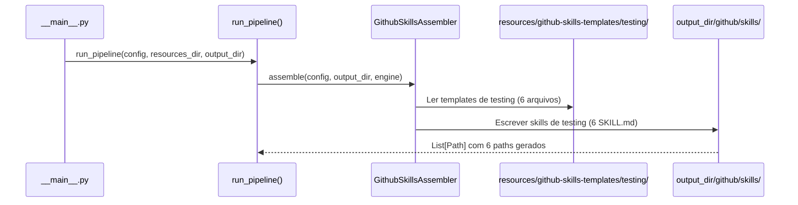
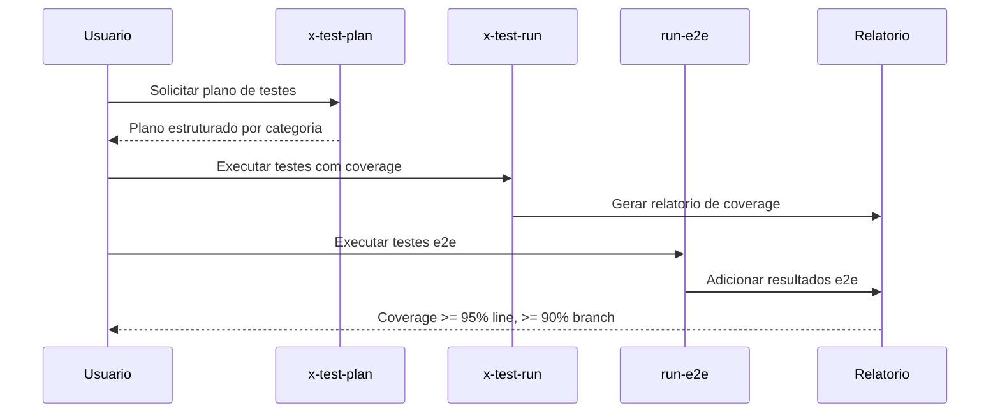

# Historia: Skills de Testing (Gerador Python)

**ID:** STORY-006

## 1. Dependencias

| Blocked By | Blocks |
| :--- | :--- |
| STORY-001 | STORY-013 |

## 2. Regras Transversais Aplicaveis

| ID | Titulo |
| :--- | :--- |
| RULE-001 | Paridade funcional |
| RULE-002 | Convencoes do Copilot |
| RULE-003 | Sem duplicacao de conteudo |
| RULE-005 | Progressive disclosure |

## 3. Descricao

Como **QA Engineer**, eu quero que o gerador Python `ia_dev_env` produza as 6 skills de testing (`x-test-plan`, `x-test-run`, `run-e2e`, `run-smoke-api`, `run-contract-tests`, `run-perf-test`) dentro do diretorio `.github/skills/` gerado, garantindo que a geracao e execucao de testes siga os padroes de qualidade com coverage >= 95% line e >= 90% branch.

O gerador `ia_dev_env` ja produz tanto `.claude/` quanto `.github/` como output. Esta story adiciona templates e logica de assembler para gerar as skills de testing na arvore `.github/skills/`. Ambos os diretorios sao gitignored -- sao output do gerador.

As skills de testing cobrem todo o espectro: desde planejamento de testes ate execucao de smoke tests, e2e, contract tests e performance tests.

### 3.1 Skills a gerar

- `.github/skills/x-test-plan/SKILL.md` -- Geracao de plano de testes abrangente
- `.github/skills/x-test-run/SKILL.md` -- Execucao de testes com relatorio de coverage
- `.github/skills/run-e2e/SKILL.md` -- Testes end-to-end com banco real (containers)
- `.github/skills/run-smoke-api/SKILL.md` -- Smoke tests com Newman/Postman
- `.github/skills/run-contract-tests/SKILL.md` -- Contract tests (Pact, Spring Cloud Contract)
- `.github/skills/run-perf-test/SKILL.md` -- Performance tests (latencia, throughput, recursos)

### 3.2 Referencia a knowledge pack de testing

- Todas referenciam `.claude/skills/testing/SKILL.md` para filosofia e padroes
- Coverage thresholds definidos em instructions/quality-gates.instructions.md

## Contexto Tecnico (Gerador)

### Assembler

- Estender o `GithubSkillsAssembler` (criado em STORY-005, ou criar novo) em `src/ia_dev_env/assembler/` para processar a categoria `testing`.
- O assembler le templates de `resources/github-skills-templates/testing/` e gera arquivos em `output_dir/github/skills/<skill-name>/SKILL.md`.
- Se o assembler ja foi registrado em `_build_assemblers()` na STORY-005, basta adicionar a nova categoria de templates.

### Templates

- Criar diretorio `resources/github-skills-templates/testing/` com 6 templates Jinja/Markdown:
  - `x-test-plan.md`, `x-test-run.md`, `run-e2e.md`, `run-smoke-api.md`, `run-contract-tests.md`, `run-perf-test.md`
- Templates usam placeholders do `TemplateEngine` (ex: `{{PROJECT_NAME}}`, `{{LANGUAGE}}`).
- Templates de testing devem incluir thresholds de coverage como constantes renderizaveis.

### Pipeline

- O pipeline `assembler/__init__.py` -> `run_pipeline()` ja orquestra todos os assemblers.
- O assembler de skills GitHub processa todas as categorias de templates encontradas em `resources/github-skills-templates/`.

### Testes

- **Golden files:** Adicionar fixtures em `tests/golden/github/skills/{x-test-plan,x-test-run,run-e2e,run-smoke-api,run-contract-tests,run-perf-test}/SKILL.md` e validar em `tests/test_byte_for_byte.py`.
- **Pipeline test:** Estender `tests/test_pipeline.py` para verificar que os 6 arquivos de testing skills aparecem em `PipelineResult.files_generated`.
- **Unit test:** Testar o assembler isoladamente com config mock e `tmp_path`.

## 4. Definicoes de Qualidade Locais

### DoR Local (Definition of Ready)

- [ ] STORY-001 concluida (`GithubInstructionsAssembler` funcional)
- [ ] Skills `.claude/skills/x-test-*` e `run-*` lidas e mapeadas como base para templates
- [ ] Thresholds de coverage definidos em quality-gates
- [ ] Estrutura de `resources/github-skills-templates/` definida (STORY-005)

### DoD Local (Definition of Done)

- [ ] Assembler gera 6 skills com frontmatter YAML valido
- [ ] Cada skill com workflow especifico para seu tipo de teste
- [ ] References linkam para knowledge pack de testing em `.claude/skills/`
- [ ] Golden files conferem byte-a-byte
- [ ] `tests/test_pipeline.py` passa com os 6 novos arquivos

### Global Definition of Done (DoD)

- **Validacao de formato:** YAML frontmatter valido e parseavel
- **Convencoes Copilot:** `name` em lowercase-hyphens, `description` presente
- **Sem duplicacao:** References linkam para `.claude/skills/`
- **Idioma:** Ingles
- **Progressive disclosure:** 3 niveis implementados
- **Documentacao:** README.md atualizado

## 5. Contratos de Dados (Data Contract)

**Testing Skill Contract:**

| Campo | Formato | Request | Response | Origem / Regra |
| :--- | :--- | :--- | :--- | :--- |
| `frontmatter.name` | string (lowercase-hyphens) | M | -- | Ex: `x-test-run` |
| `frontmatter.description` | string (multiline) | M | -- | Keywords: test, coverage, e2e, smoke, contract, performance |
| `test_type` | enum(unit, integration, e2e, smoke, contract, performance) | M | -- | Tipo de teste coberto |
| `coverage_threshold` | object | O | -- | Line >= 95%, Branch >= 90% |

## 6. Diagramas

### 6.1 Fluxo do Gerador para Skills de Testing



### 6.2 Fluxo de Teste e Coverage (Runtime)



## 7. Criterios de Aceite (Gherkin)

```gherkin
Cenario: Gerador produz 6 skills de testing
  DADO que o config YAML do projeto esta valido
  QUANDO run_pipeline() e executado
  ENTAO output_dir/github/skills/ contem 6 subdiretorios: x-test-plan, x-test-run, run-e2e, run-smoke-api, run-contract-tests, run-perf-test
  E cada subdiretorio contem SKILL.md com frontmatter YAML valido

Cenario: Golden files de testing conferem byte-a-byte
  DADO que tests/golden/github/skills/{testing-skills}/SKILL.md existem
  QUANDO test_byte_for_byte.py e executado
  ENTAO a saida gerada e identica aos golden files

Cenario: Diferenciacao entre run-e2e e run-smoke-api
  DADO que ambos os SKILL.md gerados possuem descriptions distintas
  QUANDO o Copilot le os frontmatters
  ENTAO run-smoke-api contem keywords "smoke", "Newman", "Postman", "health"
  E run-e2e contem keywords "end-to-end", "container", "database"

Cenario: Coverage threshold presente em x-test-run
  DADO que o template x-test-run.md inclui thresholds
  QUANDO o SKILL.md e gerado
  ENTAO o body contem "line coverage >= 95%"
  E contem "branch coverage >= 90%"

Cenario: Pipeline test inclui skills de testing
  DADO que tests/test_pipeline.py valida PipelineResult
  QUANDO o pipeline roda com config padrao
  ENTAO PipelineResult.files_generated inclui paths para os 6 SKILL.md de testing

Cenario: Referencia ao knowledge pack de testing
  DADO que templates de testing referenciam .claude/skills/testing/SKILL.md
  QUANDO os SKILL.md sao gerados
  ENTAO cada arquivo contem link relativo para o knowledge pack original
  E NAO duplica o conteudo
```

## 8. Sub-tarefas

- [ ] [Dev] Criar diretorio `resources/github-skills-templates/testing/` com 6 templates Markdown
- [ ] [Dev] Estender `GithubSkillsAssembler` para processar categoria `testing` (ou reusar mecanismo de STORY-005)
- [ ] [Dev] Criar template `x-test-plan.md` com geracao de plano de testes
- [ ] [Dev] Criar template `x-test-run.md` com execucao e coverage thresholds
- [ ] [Dev] Criar template `run-e2e.md` com testes end-to-end
- [ ] [Dev] Criar template `run-smoke-api.md` com smoke tests
- [ ] [Dev] Criar template `run-contract-tests.md` com contract tests
- [ ] [Dev] Criar template `run-perf-test.md` com performance tests
- [ ] [Test] Criar golden files em `tests/golden/github/skills/{testing-skills}/SKILL.md`
- [ ] [Test] Adicionar caso em `tests/test_byte_for_byte.py` para os 6 arquivos
- [ ] [Test] Estender `tests/test_pipeline.py` para validar presenca dos 6 paths
- [ ] [Test] Testar assembler isolado com config mock e `tmp_path`
- [ ] [Test] Validar YAML frontmatter parseavel nas 6 skills geradas
- [ ] [Test] Verificar diferenciacao de keywords entre skills similares
- [ ] [Doc] Documentar skills de testing no README
