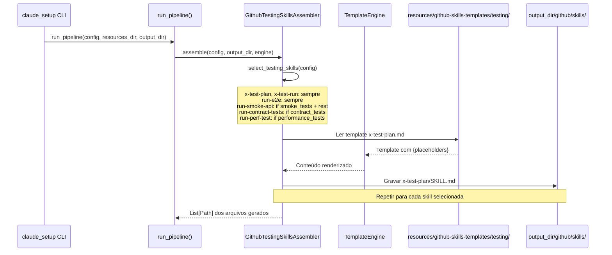
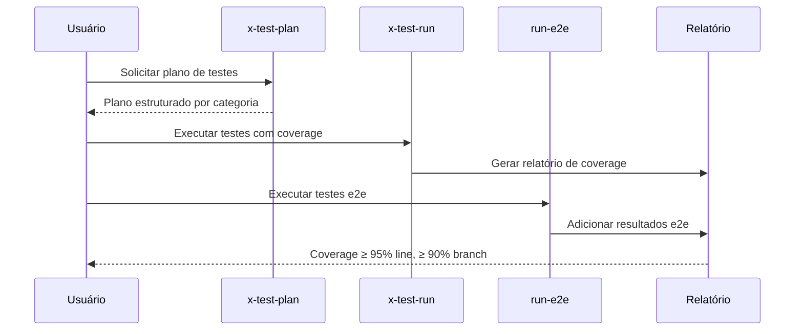

# História: Skills de Testing

**ID:** STORY-006

## 1. Dependências

| Blocked By | Blocks |
| :--- | :--- |
| STORY-001 | STORY-013 |

## 2. Regras Transversais Aplicáveis

| ID | Título |
| :--- | :--- |
| RULE-001 | Paridade funcional |
| RULE-002 | Convenções do Copilot |
| RULE-003 | Sem duplicação de conteúdo |
| RULE-005 | Progressive disclosure |

## 3. Descrição

Como **QA Engineer**, eu quero que o gerador `claude_setup` produza as 6 skills de testing (`x-test-plan`, `x-test-run`, `run-e2e`, `run-smoke-api`, `run-contract-tests`, `run-perf-test`) em `.github/skills/`, garantindo que a geração e execução de testes siga os padrões de qualidade com coverage ≥ 95% line e ≥ 90% branch.

As skills de testing cobrem todo o espectro: desde planejamento de testes até execução de smoke tests, e2e, contract tests e performance tests.

### 3.1 Skills a gerar

- `.github/skills/x-test-plan/SKILL.md` — Geração de plano de testes abrangente
- `.github/skills/x-test-run/SKILL.md` — Execução de testes com relatório de coverage
- `.github/skills/run-e2e/SKILL.md` — Testes end-to-end com banco real (containers)
- `.github/skills/run-smoke-api/SKILL.md` — Smoke tests com Newman/Postman
- `.github/skills/run-contract-tests/SKILL.md` — Contract tests (Pact, Spring Cloud Contract)
- `.github/skills/run-perf-test/SKILL.md` — Performance tests (latência, throughput, recursos)

### 3.2 Referência a knowledge pack de testing

- Todas referenciam `.claude/skills/testing/SKILL.md` para filosofia e padrões
- Coverage thresholds definidos em instructions/quality-gates.instructions.md

### 3.3 Contexto Técnico (Gerador)

Este trabalho consiste em **estender o gerador Python `claude_setup`** para emitir skills de testing na árvore `.github/skills/`. O padrão segue o mesmo de STORY-005 (review skills):

- **Assembler**: Criar `GithubTestingSkillsAssembler` em `src/claude_setup/assembler/github_testing_skills_assembler.py`, implementando `assemble(config, output_dir, engine) -> List[Path]`. Deve iterar sobre os 6 templates de testing, renderizar via `TemplateEngine`, e gravar em `output_dir/github/skills/<skill-name>/SKILL.md`.
- **Templates**: Criar `resources/github-skills-templates/testing/` com 6 templates Jinja2/placeholder (um por skill). Cada template deve conter frontmatter YAML (`name` + `description`) e body com workflow específico por tipo de teste.
- **Pipeline**: Registrar `GithubTestingSkillsAssembler` em `assembler/__init__.py` → `_build_assemblers()`.
- **Condicionais**: Reutilizar a lógica de gates de `SkillsAssembler._select_testing_skills()`: `run-smoke-api` requer `smoke_tests=true` + interface `rest`; `run-perf-test` requer `performance_tests=true`; `run-contract-tests` requer `contract_tests=true`; `run-e2e` é sempre incluída; `x-test-plan` e `x-test-run` são sempre incluídas.
- **TemplateEngine**: Usar `engine.replace_placeholders()` para injetar valores de `ProjectConfig` (coverage thresholds, framework, etc.).

## 4. Definições de Qualidade Locais

### DoR Local (Definition of Ready)

- [ ] STORY-001 concluída (`GithubInstructionsAssembler` funcionando)
- [ ] Skills `.claude/skills/x-test-*` e `run-*` lidas e mapeadas como referência para templates
- [ ] Thresholds de coverage definidos em quality-gates
- [ ] Estrutura de `resources/github-skills-templates/` definida

### DoD Local (Definition of Done)

- [ ] `GithubTestingSkillsAssembler` implementado e registrado no pipeline
- [ ] 6 templates de testing criados em `resources/github-skills-templates/testing/`
- [ ] Cada skill com workflow específico para seu tipo de teste
- [ ] References linkam para knowledge pack de testing em `.claude/skills/`
- [ ] Golden files atualizados e passando byte-for-byte
- [ ] Pipeline gera `.github/skills/<skill-name>/SKILL.md` corretamente

### Global Definition of Done (DoD)

- **Validação de formato:** YAML frontmatter válido e parseável
- **Convenções Copilot:** `name` em lowercase-hyphens, `description` presente
- **Sem duplicação:** References linkam para `.claude/skills/`
- **Idioma:** Inglês
- **Progressive disclosure:** 3 níveis implementados
- **Documentação:** README gerado atualizado com skills de testing

## 5. Contratos de Dados (Data Contract)

**Testing Skill Contract:**

| Campo | Formato | Request | Response | Origem / Regra |
| :--- | :--- | :--- | :--- | :--- |
| `frontmatter.name` | string (lowercase-hyphens) | M | — | Ex: `x-test-run` |
| `frontmatter.description` | string (multiline) | M | — | Keywords: test, coverage, e2e, smoke, contract, performance |
| `test_type` | enum(unit, integration, e2e, smoke, contract, performance) | M | — | Tipo de teste coberto |
| `coverage_threshold` | object | O | — | Line ≥ 95%, Branch ≥ 90% |

## 6. Diagramas

### 6.1 Pipeline do Gerador para Skills de Testing



### 6.2 Fluxo de Teste e Coverage (output gerado)



## 7. Critérios de Aceite (Gherkin)

```gherkin
Cenario: Gerador produz skills de testing conforme config
  DADO que o pipeline inclui GithubTestingSkillsAssembler
  E a config tem smoke_tests=true, contract_tests=true, performance_tests=true, interface=rest
  QUANDO run_pipeline() é executado
  ENTÃO o output_dir contém github/skills/x-test-plan/SKILL.md
  E contém github/skills/x-test-run/SKILL.md
  E contém github/skills/run-e2e/SKILL.md
  E contém github/skills/run-smoke-api/SKILL.md
  E contém github/skills/run-contract-tests/SKILL.md
  E contém github/skills/run-perf-test/SKILL.md

Cenario: Skills condicionais respeitam feature gates
  DADO que a config tem smoke_tests=false e contract_tests=false
  QUANDO run_pipeline() é executado
  ENTÃO o output_dir NÃO contém github/skills/run-smoke-api/SKILL.md
  E NÃO contém github/skills/run-contract-tests/SKILL.md
  MAS contém github/skills/x-test-plan/SKILL.md (sempre presente)
  E contém github/skills/x-test-run/SKILL.md (sempre presente)
  E contém github/skills/run-e2e/SKILL.md (sempre presente)

Cenario: Diferenciação de trigger entre run-e2e e run-smoke-api
  DADO que ambas as skills foram geradas
  QUANDO as descriptions são comparadas
  ENTÃO run-e2e contém "end-to-end" e "containers"
  E run-smoke-api contém "smoke" e "Newman"
  E NÃO há sobreposição de keywords primárias

Cenario: Coverage thresholds no template de x-test-run
  DADO que o template x-test-run.md contém placeholders de coverage
  QUANDO o gerador renderiza com TemplateEngine
  ENTÃO o body gerado inclui "line coverage ≥ 95%"
  E inclui "branch coverage ≥ 90%"

Cenario: Golden files byte-for-byte
  DADO que os golden files de testing existem em tests/golden/
  QUANDO o gerador produz as skills de testing
  ENTÃO a saída é idêntica byte-for-byte aos golden files
  E test_byte_for_byte.py passa sem diff

Cenario: Referência ao knowledge pack de testing
  DADO que as skills geradas referenciam .claude/skills/testing/SKILL.md
  QUANDO o body gerado é inspecionado
  ENTÃO contém link relativo para o knowledge pack original
  E NÃO duplica o conteúdo
```

## 8. Sub-tarefas

- [ ] [Dev] Criar `GithubTestingSkillsAssembler` em `src/claude_setup/assembler/github_testing_skills_assembler.py` com `assemble()`, lógica de seleção condicional e renderização via `TemplateEngine`
- [ ] [Dev] Criar 6 templates de skill de testing em `resources/github-skills-templates/testing/` (`x-test-plan.md`, `x-test-run.md`, `run-e2e.md`, `run-smoke-api.md`, `run-contract-tests.md`, `run-perf-test.md`)
- [ ] [Dev] Implementar frontmatter YAML com keywords diferenciadas por tipo de teste nos templates
- [ ] [Dev] Registrar `GithubTestingSkillsAssembler` em `assembler/__init__.py` → `_build_assemblers()`
- [ ] [Dev] Implementar feature gates condicionais (smoke_tests, contract_tests, performance_tests, interface rest)
- [ ] [Test] Testes unitários do assembler: verificar seleção de skills por config (todas as combinações de flags)
- [ ] [Test] Testes unitários: verificar renderização de templates com `TemplateEngine` (placeholders de coverage)
- [ ] [Test] Regenerar golden files e verificar byte-for-byte em `tests/test_byte_for_byte.py`
- [ ] [Test] Adicionar cenários de pipeline em `tests/test_pipeline.py`
- [ ] [Doc] Atualizar template de README gerado (`ReadmeAssembler`) para listar skills de testing
