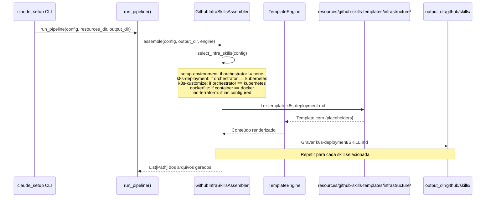
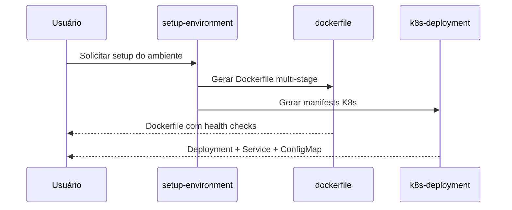

# História: Skills de Infrastructure

**ID:** STORY-007

## 1. Dependências

| Blocked By | Blocks |
| :--- | :--- |
| STORY-001 | STORY-013 |

## 2. Regras Transversais Aplicáveis

| ID | Título |
| :--- | :--- |
| RULE-001 | Paridade funcional |
| RULE-002 | Convenções do Copilot |
| RULE-003 | Sem duplicação de conteúdo |
| RULE-005 | Progressive disclosure |

## 3. Descrição

Como **DevOps Engineer**, eu quero que o gerador `claude_setup` produza as 5 skills de infrastructure (`setup-environment`, `k8s-deployment`, `k8s-kustomize`, `dockerfile`, `iac-terraform`) em `.github/skills/`, garantindo que o provisionamento e deployment sigam padrões cloud-agnostic e security-hardened.

Estas skills são de prioridade média pois dependem menos do fluxo principal de desenvolvimento e mais da maturidade da plataforma.

### 3.1 Skills a gerar

- `.github/skills/setup-environment/SKILL.md` — Setup de ambiente de desenvolvimento local
- `.github/skills/k8s-deployment/SKILL.md` — Patterns de deployment Kubernetes
- `.github/skills/k8s-kustomize/SKILL.md` — Kustomize para gerenciamento de ambientes
- `.github/skills/dockerfile/SKILL.md` — Dockerfile multi-stage com security hardening
- `.github/skills/iac-terraform/SKILL.md` — Terraform patterns e módulos

### 3.2 Cloud-agnostic constraint

Conforme `01-project-identity.md`: "Cloud-Agnostic: ZERO dependencies on cloud-specific services". Todas as skills de infra devem respeitar esse constraint. Os templates não podem conter referências a AWS EKS, GKE ou AKS específicos.

### 3.3 Contexto Técnico (Gerador)

Este trabalho consiste em **estender o gerador Python `claude_setup`** para emitir skills de infrastructure na árvore `.github/skills/`. O padrão segue o mesmo de STORY-005 e STORY-006:

- **Assembler**: Criar `GithubInfraSkillsAssembler` em `src/claude_setup/assembler/github_infra_skills_assembler.py`, implementando `assemble(config, output_dir, engine) -> List[Path]`. Deve iterar sobre os templates de infra, renderizar via `TemplateEngine`, e gravar em `output_dir/github/skills/<skill-name>/SKILL.md`.
- **Templates**: Criar `resources/github-skills-templates/infrastructure/` com 5 templates Jinja2/placeholder (um por skill). Cada template deve conter frontmatter YAML (`name` + `description`) e body com patterns cloud-agnostic.
- **Pipeline**: Registrar `GithubInfraSkillsAssembler` em `assembler/__init__.py` → `_build_assemblers()`.
- **Condicionais**: Reutilizar a lógica de gates de `SkillsAssembler._select_infra_skills()`: `setup-environment` requer `orchestrator != "none"`; `k8s-deployment` e `k8s-kustomize` requerem `orchestrator == "kubernetes"`; `dockerfile` requer `container == "docker"`; `iac-terraform` é condicional ao campo `iac` da config (se existir).
- **TemplateEngine**: Usar `engine.replace_placeholders()` para injetar valores de `ProjectConfig` (container, orchestrator, etc.).
- **Validação cloud-agnostic**: O assembler deve verificar que templates renderizados NÃO contêm referências a cloud providers específicos (validação estática nos templates, não em runtime).

## 4. Definições de Qualidade Locais

### DoR Local (Definition of Ready)

- [ ] STORY-001 concluída (`GithubInstructionsAssembler` funcionando)
- [ ] Skills `.claude/skills/` de infra lidas e mapeadas como referência para templates
- [ ] Constraint cloud-agnostic validado nos templates
- [ ] Estrutura de `resources/github-skills-templates/` definida

### DoD Local (Definition of Done)

- [ ] `GithubInfraSkillsAssembler` implementado e registrado no pipeline
- [ ] 5 templates de infra criados em `resources/github-skills-templates/infrastructure/`
- [ ] Cada skill respeita constraint cloud-agnostic
- [ ] References linkam para knowledge packs originais em `.claude/skills/`
- [ ] Golden files atualizados e passando byte-for-byte
- [ ] Pipeline gera `.github/skills/<skill-name>/SKILL.md` corretamente

### Global Definition of Done (DoD)

- **Validação de formato:** YAML frontmatter válido e parseável
- **Convenções Copilot:** `name` em lowercase-hyphens, `description` presente
- **Sem duplicação:** References linkam para `.claude/skills/`
- **Idioma:** Inglês
- **Progressive disclosure:** 3 níveis implementados
- **Documentação:** README gerado atualizado com skills de infrastructure

## 5. Contratos de Dados (Data Contract)

**Infrastructure Skill Contract:**

| Campo | Formato | Request | Response | Origem / Regra |
| :--- | :--- | :--- | :--- | :--- |
| `frontmatter.name` | string (lowercase-hyphens) | M | — | Ex: `k8s-deployment` |
| `frontmatter.description` | string (multiline) | M | — | Keywords: kubernetes, docker, terraform, setup |
| `cloud_agnostic` | boolean | M | — | Deve ser true (constraint do projeto) |
| `target_platform` | string | M | — | Ex: "kubernetes", "docker", "terraform" |

## 6. Diagramas

### 6.1 Pipeline do Gerador para Skills de Infrastructure



### 6.2 Fluxo de Setup de Ambiente (output gerado)



## 7. Critérios de Aceite (Gherkin)

```gherkin
Cenario: Gerador produz skills de infra conforme config
  DADO que o pipeline inclui GithubInfraSkillsAssembler
  E a config tem container=docker, orchestrator=kubernetes
  QUANDO run_pipeline() é executado
  ENTÃO o output_dir contém github/skills/setup-environment/SKILL.md
  E contém github/skills/k8s-deployment/SKILL.md
  E contém github/skills/k8s-kustomize/SKILL.md
  E contém github/skills/dockerfile/SKILL.md

Cenario: Skills condicionais respeitam feature gates
  DADO que a config tem orchestrator=none e container=none
  QUANDO run_pipeline() é executado
  ENTÃO o output_dir NÃO contém github/skills/setup-environment/SKILL.md
  E NÃO contém github/skills/k8s-deployment/SKILL.md
  E NÃO contém github/skills/dockerfile/SKILL.md

Cenario: Cloud-agnostic constraint no conteúdo gerado
  DADO que o template k8s-deployment.md foi renderizado
  QUANDO o conteúdo gerado é inspecionado
  ENTÃO NÃO contém referências a "AWS EKS", "GKE" ou "AKS" específicos
  E usa Kubernetes vanilla com padrões portáveis

Cenario: Frontmatter YAML válido nas skills geradas
  DADO que o gerador produziu github/skills/dockerfile/SKILL.md
  QUANDO o frontmatter YAML é parseado
  ENTÃO o campo "name" é "dockerfile"
  E o campo "description" contém keywords "multi-stage", "security", "Docker"

Cenario: Golden files byte-for-byte
  DADO que os golden files de infra existem em tests/golden/
  QUANDO o gerador produz as skills de infrastructure
  ENTÃO a saída é idêntica byte-for-byte aos golden files
  E test_byte_for_byte.py passa sem diff

Cenario: Kustomize com gerenciamento de ambientes
  DADO que o template k8s-kustomize.md foi renderizado
  QUANDO o body gerado é inspecionado
  ENTÃO inclui patterns para base, overlays e components
  E demonstra patches e generators
```

## 8. Sub-tarefas

- [ ] [Dev] Criar `GithubInfraSkillsAssembler` em `src/claude_setup/assembler/github_infra_skills_assembler.py` com `assemble()`, lógica de seleção condicional e renderização via `TemplateEngine`
- [ ] [Dev] Criar 5 templates de skill de infra em `resources/github-skills-templates/infrastructure/` (`setup-environment.md`, `k8s-deployment.md`, `k8s-kustomize.md`, `dockerfile.md`, `iac-terraform.md`)
- [ ] [Dev] Implementar frontmatter YAML com keywords diferenciadas por tipo de infra nos templates
- [ ] [Dev] Registrar `GithubInfraSkillsAssembler` em `assembler/__init__.py` → `_build_assemblers()`
- [ ] [Dev] Implementar feature gates condicionais (orchestrator, container, iac)
- [ ] [Dev] Validar constraint cloud-agnostic nos templates (sem referências a cloud providers específicos)
- [ ] [Test] Testes unitários do assembler: verificar seleção de skills por config (todas as combinações de orchestrator/container)
- [ ] [Test] Testes unitários: verificar renderização de templates com `TemplateEngine`
- [ ] [Test] Regenerar golden files e verificar byte-for-byte em `tests/test_byte_for_byte.py`
- [ ] [Test] Adicionar cenários de pipeline em `tests/test_pipeline.py`
- [ ] [Doc] Atualizar template de README gerado (`ReadmeAssembler`) para listar skills de infrastructure
