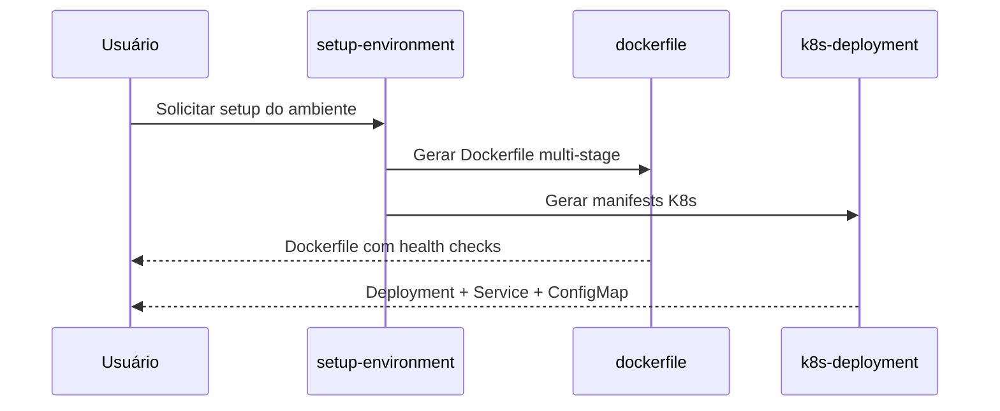

# História: Skills de Infrastructure

**ID:** STORY-007

## 1. Dependências

| Blocked By | Blocks |
| :--- | :--- |
| STORY-001 | STORY-013 |

## 2. Regras Transversais Aplicáveis

| ID | Título |
| :--- | :--- |
| RULE-001 | Paridade funcional |
| RULE-002 | Convenções do Copilot |
| RULE-003 | Sem duplicação de conteúdo |
| RULE-005 | Progressive disclosure |

## 3. Descrição

Como **DevOps Engineer**, eu quero adaptar as 5 skills de infrastructure (`setup-environment`, `k8s-deployment`, `k8s-kustomize`, `dockerfile`, `iac-terraform`) para `.github/skills/`, garantindo que o provisionamento e deployment sigam padrões cloud-agnostic e security-hardened.

Estas skills são de prioridade média pois dependem menos do fluxo principal de desenvolvimento e mais da maturidade da plataforma.

### 3.1 Skills a criar

- `.github/skills/setup-environment/SKILL.md` — Setup de ambiente de desenvolvimento local
- `.github/skills/k8s-deployment/SKILL.md` — Patterns de deployment Kubernetes
- `.github/skills/k8s-kustomize/SKILL.md` — Kustomize para gerenciamento de ambientes
- `.github/skills/dockerfile/SKILL.md` — Dockerfile multi-stage com security hardening
- `.github/skills/iac-terraform/SKILL.md` — Terraform patterns e módulos

### 3.2 Cloud-agnostic constraint

Conforme `01-project-identity.md`: "Cloud-Agnostic: ZERO dependencies on cloud-specific services". Todas as skills de infra devem respeitar esse constraint.

## 4. Definições de Qualidade Locais

### DoR Local (Definition of Ready)

- [ ] STORY-001 concluída
- [ ] Skills `.claude/skills/` de infra lidas e mapeadas
- [ ] Constraint cloud-agnostic validado

### DoD Local (Definition of Done)

- [ ] 5 skills criadas com frontmatter válido
- [ ] Cada skill respeita constraint cloud-agnostic
- [ ] References linkam para knowledge packs originais
- [ ] Copilot ativa skill correta por tipo de infra

### Global Definition of Done (DoD)

- **Validação de formato:** YAML frontmatter válido e parseável
- **Convenções Copilot:** `name` em lowercase-hyphens, `description` presente
- **Sem duplicação:** References linkam para `.claude/skills/`
- **Idioma:** Inglês
- **Progressive disclosure:** 3 níveis implementados
- **Documentação:** README.md atualizado

## 5. Contratos de Dados (Data Contract)

**Infrastructure Skill Contract:**

| Campo | Formato | Request | Response | Origem / Regra |
| :--- | :--- | :--- | :--- | :--- |
| `frontmatter.name` | string (lowercase-hyphens) | M | — | Ex: `k8s-deployment` |
| `frontmatter.description` | string (multiline) | M | — | Keywords: kubernetes, docker, terraform, setup |
| `cloud_agnostic` | boolean | M | — | Deve ser true (constraint do projeto) |
| `target_platform` | string | M | — | Ex: "kubernetes", "docker", "terraform" |

## 6. Diagramas

### 6.1 Setup de Ambiente



## 7. Critérios de Aceite (Gherkin)

```gherkin
Cenario: Trigger correto para Dockerfile
  DADO que .github/skills/dockerfile/SKILL.md existe
  QUANDO o usuário solicita "criar Dockerfile para o serviço"
  ENTÃO o Copilot seleciona a skill dockerfile
  E o body inclui pattern de multi-stage build

Cenario: Cloud-agnostic constraint respeitado
  DADO que skills de infra devem ser cloud-agnostic
  QUANDO o body de k8s-deployment é carregado
  ENTÃO NÃO contém referências a AWS EKS, GKE ou AKS específicos
  E usa Kubernetes vanilla com padrões portáveis

Cenario: Kustomize com gerenciamento de ambientes
  DADO que .github/skills/k8s-kustomize/SKILL.md existe
  QUANDO o body é carregado
  ENTÃO inclui patterns para base, overlays e components
  E demonstra patches e generators

Cenario: Terraform com remote state
  DADO que .github/skills/iac-terraform/SKILL.md existe
  QUANDO o body é carregado
  ENTÃO inclui module structure e remote state
  E respeita constraint cloud-agnostic nos providers

Cenario: Setup environment com dependências
  DADO que setup-environment orquestra Docker e K8s
  QUANDO o usuário solicita "configurar ambiente de desenvolvimento"
  ENTÃO o workflow inclui build de container e deploy local
  E inclui verificação de dependências (JDK, Maven, Docker)
```

## 8. Sub-tarefas

- [ ] [Dev] Criar `.github/skills/setup-environment/SKILL.md`
- [ ] [Dev] Criar `.github/skills/k8s-deployment/SKILL.md`
- [ ] [Dev] Criar `.github/skills/k8s-kustomize/SKILL.md`
- [ ] [Dev] Criar `.github/skills/dockerfile/SKILL.md`
- [ ] [Dev] Criar `.github/skills/iac-terraform/SKILL.md`
- [ ] [Test] Validar YAML frontmatter das 5 skills
- [ ] [Test] Verificar constraint cloud-agnostic em todas
- [ ] [Doc] Documentar skills de infrastructure no README
