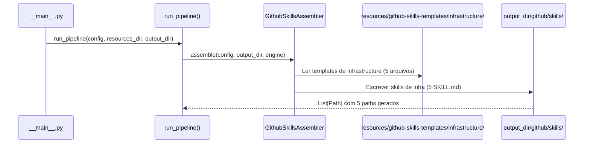
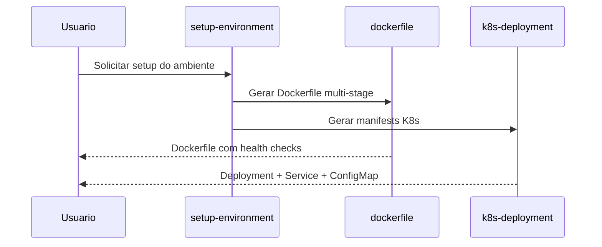

# Historia: Skills de Infrastructure (Gerador Python)

**ID:** STORY-007

## 1. Dependencias

| Blocked By | Blocks |
| :--- | :--- |
| STORY-001 | STORY-013 |

## 2. Regras Transversais Aplicaveis

| ID | Titulo |
| :--- | :--- |
| RULE-001 | Paridade funcional |
| RULE-002 | Convencoes do Copilot |
| RULE-003 | Sem duplicacao de conteudo |
| RULE-005 | Progressive disclosure |

## 3. Descricao

Como **DevOps Engineer**, eu quero que o gerador Python `claude_setup` produza as 5 skills de infrastructure (`setup-environment`, `k8s-deployment`, `k8s-kustomize`, `dockerfile`, `iac-terraform`) dentro do diretorio `.github/skills/` gerado, garantindo que o provisionamento e deployment sigam padroes cloud-agnostic e security-hardened.

O gerador `claude_setup` ja produz tanto `.claude/` quanto `.github/` como output. Esta story adiciona templates e logica de assembler para gerar as skills de infrastructure na arvore `.github/skills/`. Ambos os diretorios sao gitignored -- sao output do gerador.

Estas skills sao de prioridade media pois dependem menos do fluxo principal de desenvolvimento e mais da maturidade da plataforma.

### 3.1 Skills a gerar

- `.github/skills/setup-environment/SKILL.md` -- Setup de ambiente de desenvolvimento local
- `.github/skills/k8s-deployment/SKILL.md` -- Patterns de deployment Kubernetes
- `.github/skills/k8s-kustomize/SKILL.md` -- Kustomize para gerenciamento de ambientes
- `.github/skills/dockerfile/SKILL.md` -- Dockerfile multi-stage com security hardening
- `.github/skills/iac-terraform/SKILL.md` -- Terraform patterns e modulos

### 3.2 Cloud-agnostic constraint

Conforme `01-project-identity.md`: "Cloud-Agnostic: ZERO dependencies on cloud-specific services". Os templates de infra devem respeitar esse constraint -- o gerador NAO deve produzir referencias a AWS EKS, GKE ou AKS especificos.

## Contexto Tecnico (Gerador)

### Assembler

- Estender o `GithubSkillsAssembler` (criado em STORY-005) em `src/claude_setup/assembler/` para processar a categoria `infrastructure`.
- O assembler le templates de `resources/github-skills-templates/infrastructure/` e gera arquivos em `output_dir/github/skills/<skill-name>/SKILL.md`.
- Se o assembler ja foi registrado em `_build_assemblers()` na STORY-005, basta adicionar a nova categoria de templates.

### Templates

- Criar diretorio `resources/github-skills-templates/infrastructure/` com 5 templates Jinja/Markdown:
  - `setup-environment.md`, `k8s-deployment.md`, `k8s-kustomize.md`, `dockerfile.md`, `iac-terraform.md`
- Templates usam placeholders do `TemplateEngine` (ex: `{{PROJECT_NAME}}`, `{{CONTAINER}}`, `{{ORCHESTRATOR}}`).
- Templates devem ser parametrizados pelo `config.infrastructure` (container, orchestrator) para manter cloud-agnostic.

### Pipeline

- O pipeline `assembler/__init__.py` -> `run_pipeline()` ja orquestra todos os assemblers.
- O assembler de skills GitHub processa todas as categorias de templates encontradas em `resources/github-skills-templates/`.

### Testes

- **Golden files:** Adicionar fixtures em `tests/golden/github/skills/{setup-environment,k8s-deployment,k8s-kustomize,dockerfile,iac-terraform}/SKILL.md` e validar em `tests/test_byte_for_byte.py`.
- **Pipeline test:** Estender `tests/test_pipeline.py` para verificar que os 5 arquivos de infra skills aparecem em `PipelineResult.files_generated`.
- **Unit test:** Testar o assembler isoladamente com config mock e `tmp_path`.
- **Constraint test:** Validar que nenhum golden file contem referencias a cloud providers especificos (AWS, GCP, Azure como servicos concretos).

## 4. Definicoes de Qualidade Locais

### DoR Local (Definition of Ready)

- [ ] STORY-001 concluida (`GithubInstructionsAssembler` funcional)
- [ ] Skills `.claude/skills/` de infra lidas e mapeadas como base para templates
- [ ] Constraint cloud-agnostic validado nos templates
- [ ] Estrutura de `resources/github-skills-templates/` definida (STORY-005)

### DoD Local (Definition of Done)

- [ ] Assembler gera 5 skills com frontmatter YAML valido
- [ ] Cada skill respeita constraint cloud-agnostic
- [ ] References linkam para knowledge packs originais em `.claude/skills/`
- [ ] Golden files conferem byte-a-byte
- [ ] `tests/test_pipeline.py` passa com os 5 novos arquivos

### Global Definition of Done (DoD)

- **Validacao de formato:** YAML frontmatter valido e parseavel
- **Convencoes Copilot:** `name` em lowercase-hyphens, `description` presente
- **Sem duplicacao:** References linkam para `.claude/skills/`
- **Idioma:** Ingles
- **Progressive disclosure:** 3 niveis implementados
- **Documentacao:** README.md atualizado

## 5. Contratos de Dados (Data Contract)

**Infrastructure Skill Contract:**

| Campo | Formato | Request | Response | Origem / Regra |
| :--- | :--- | :--- | :--- | :--- |
| `frontmatter.name` | string (lowercase-hyphens) | M | -- | Ex: `k8s-deployment` |
| `frontmatter.description` | string (multiline) | M | -- | Keywords: kubernetes, docker, terraform, setup |
| `cloud_agnostic` | boolean | M | -- | Deve ser true (constraint do projeto) |
| `target_platform` | string | M | -- | Ex: "kubernetes", "docker", "terraform" |

## 6. Diagramas

### 6.1 Fluxo do Gerador para Skills de Infrastructure



### 6.2 Setup de Ambiente (Runtime)



## 7. Criterios de Aceite (Gherkin)

```gherkin
Cenario: Gerador produz 5 skills de infrastructure
  DADO que o config YAML do projeto esta valido
  QUANDO run_pipeline() e executado
  ENTAO output_dir/github/skills/ contem 5 subdiretorios: setup-environment, k8s-deployment, k8s-kustomize, dockerfile, iac-terraform
  E cada subdiretorio contem SKILL.md com frontmatter YAML valido

Cenario: Golden files de infrastructure conferem byte-a-byte
  DADO que tests/golden/github/skills/{infra-skills}/SKILL.md existem
  QUANDO test_byte_for_byte.py e executado
  ENTAO a saida gerada e identica aos golden files

Cenario: Cloud-agnostic constraint respeitado nos templates
  DADO que os templates de infrastructure devem ser cloud-agnostic
  QUANDO os SKILL.md sao gerados
  ENTAO NAO contem referencias a AWS EKS, GKE ou AKS como servicos concretos
  E usam Kubernetes vanilla com padroes portaveis

Cenario: Dockerfile template parametrizado
  DADO que o template dockerfile.md usa placeholders do TemplateEngine
  QUANDO config.infrastructure.container = "docker"
  ENTAO o SKILL.md gerado inclui pattern de multi-stage build
  E inclui health checks e security hardening

Cenario: Pipeline test inclui skills de infrastructure
  DADO que tests/test_pipeline.py valida PipelineResult
  QUANDO o pipeline roda com config padrao
  ENTAO PipelineResult.files_generated inclui paths para os 5 SKILL.md de infra

Cenario: Kustomize com gerenciamento de ambientes
  DADO que o template k8s-kustomize.md e processado pelo assembler
  QUANDO o SKILL.md e gerado
  ENTAO inclui patterns para base, overlays e components
  E demonstra patches e generators
```

## 8. Sub-tarefas

- [ ] [Dev] Criar diretorio `resources/github-skills-templates/infrastructure/` com 5 templates Markdown
- [ ] [Dev] Estender `GithubSkillsAssembler` para processar categoria `infrastructure` (ou reusar mecanismo de STORY-005)
- [ ] [Dev] Criar template `setup-environment.md` com setup de ambiente local
- [ ] [Dev] Criar template `k8s-deployment.md` com patterns de deployment
- [ ] [Dev] Criar template `k8s-kustomize.md` com gerenciamento de ambientes
- [ ] [Dev] Criar template `dockerfile.md` com multi-stage e security hardening
- [ ] [Dev] Criar template `iac-terraform.md` com module structure e remote state
- [ ] [Test] Criar golden files em `tests/golden/github/skills/{infra-skills}/SKILL.md`
- [ ] [Test] Adicionar caso em `tests/test_byte_for_byte.py` para os 5 arquivos
- [ ] [Test] Estender `tests/test_pipeline.py` para validar presenca dos 5 paths
- [ ] [Test] Testar assembler isolado com config mock e `tmp_path`
- [ ] [Test] Validar YAML frontmatter parseavel nas 5 skills geradas
- [ ] [Test] Validar constraint cloud-agnostic (ausencia de cloud-specific references)
- [ ] [Doc] Documentar skills de infrastructure no README
