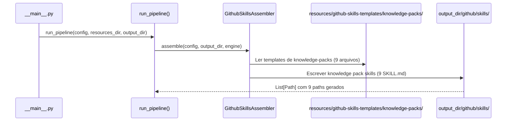
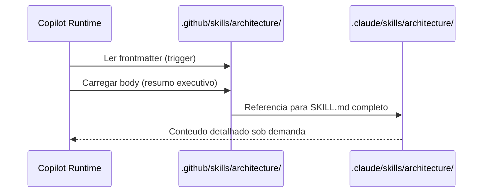

# Historia: Skills Knowledge Packs (Gerador Python)

**ID:** STORY-008

## 1. Dependencias

| Blocked By | Blocks |
| :--- | :--- |
| STORY-001 | STORY-013 |

## 2. Regras Transversais Aplicaveis

| ID | Titulo |
| :--- | :--- |
| RULE-001 | Paridade funcional |
| RULE-002 | Convencoes do Copilot |
| RULE-003 | Sem duplicacao de conteudo |
| RULE-005 | Progressive disclosure |

## 3. Descricao

Como **Architect**, eu quero que o gerador Python `ia_dev_env` produza os 9 knowledge packs (`architecture`, `coding-standards`, `patterns`, `protocols`, `observability`, `resilience`, `security`, `compliance`, `api-design`) dentro do diretorio `.github/skills/` gerado, garantindo que o Copilot tenha acesso ao mesmo corpo de conhecimento tecnico de referencia.

O gerador `ia_dev_env` ja produz tanto `.claude/` quanto `.github/` como output. Esta story adiciona templates e logica de assembler para gerar os knowledge packs na arvore `.github/skills/`. Ambos os diretorios sao gitignored -- sao output do gerador.

Knowledge packs sao skills de prioridade baixa (material de referencia) mas essenciais como base para skills operacionais. A estrategia principal e referencia (RULE-003): frontmatter com description no Copilot, body com resumo e link para o conteudo completo em `.claude/skills/`.

### 3.1 Skills a gerar

- `.github/skills/architecture/SKILL.md` -- Arquitetura hexagonal, dependency rules, package structure
- `.github/skills/coding-standards/SKILL.md` -- Clean Code, SOLID, idiomas Java 21
- `.github/skills/patterns/SKILL.md` -- CQRS e patterns de design
- `.github/skills/protocols/SKILL.md` -- REST, gRPC, GraphQL, WebSocket, event-driven
- `.github/skills/observability/SKILL.md` -- Tracing, metrics, logging, health checks
- `.github/skills/resilience/SKILL.md` -- Circuit breaker, retry, bulkhead, backpressure
- `.github/skills/security/SKILL.md` -- OWASP Top 10, secrets, crypto, headers
- `.github/skills/compliance/SKILL.md` -- GDPR, HIPAA, LGPD, PCI-DSS
- `.github/skills/api-design/SKILL.md` -- REST patterns, status codes, RFC 7807, pagination

### 3.2 Estrategia de referencia nos templates

- Frontmatter: description rica para trigger correto
- Body: resumo executivo (20-30 linhas) com os pontos mais criticos
- References: link direto para `.claude/skills/*/SKILL.md` e `references/`
- Templates devem gerar body enxuto -- o conteudo completo vive em `.claude/skills/` (tambem gerado pelo `ia_dev_env`)

## Contexto Tecnico (Gerador)

### Assembler

- Estender o `GithubSkillsAssembler` (criado em STORY-005) em `src/ia_dev_env/assembler/` para processar a categoria `knowledge-packs`.
- O assembler le templates de `resources/github-skills-templates/knowledge-packs/` e gera arquivos em `output_dir/github/skills/<skill-name>/SKILL.md`.
- Se o assembler ja foi registrado em `_build_assemblers()` na STORY-005, basta adicionar a nova categoria de templates.

### Templates

- Criar diretorio `resources/github-skills-templates/knowledge-packs/` com 9 templates Jinja/Markdown:
  - `architecture.md`, `coding-standards.md`, `patterns.md`, `protocols.md`, `observability.md`, `resilience.md`, `security.md`, `compliance.md`, `api-design.md`
- Templates usam placeholders do `TemplateEngine` (ex: `{{PROJECT_NAME}}`, `{{LANGUAGE}}`, `{{ARCHITECTURE}}`).
- Templates devem gerar body com no maximo 30 linhas de resumo executivo, referenciando `.claude/skills/` para conteudo completo.

### Pipeline

- O pipeline `assembler/__init__.py` -> `run_pipeline()` ja orquestra todos os assemblers.
- O assembler de skills GitHub processa todas as categorias de templates encontradas em `resources/github-skills-templates/`.

### Testes

- **Golden files:** Adicionar fixtures em `tests/golden/github/skills/{architecture,coding-standards,patterns,protocols,observability,resilience,security,compliance,api-design}/SKILL.md` e validar em `tests/test_byte_for_byte.py`.
- **Pipeline test:** Estender `tests/test_pipeline.py` para verificar que os 9 arquivos de knowledge pack skills aparecem em `PipelineResult.files_generated`.
- **Unit test:** Testar o assembler isoladamente com config mock e `tmp_path`.
- **Body size test:** Validar que o body gerado de cada knowledge pack tem <= 30 linhas de resumo.

## 4. Definicoes de Qualidade Locais

### DoR Local (Definition of Ready)

- [ ] STORY-001 concluida (`GithubInstructionsAssembler` funcional)
- [ ] 9 knowledge packs em `.claude/skills/` lidos e mapeados como base para templates
- [ ] Estrategia de referencia vs duplicacao definida
- [ ] Estrutura de `resources/github-skills-templates/` definida (STORY-005)

### DoD Local (Definition of Done)

- [ ] Assembler gera 9 skills com frontmatter YAML valido
- [ ] Body com resumo executivo (<= 30 linhas), nao copia completa
- [ ] References linkam para `.claude/skills/` originais (tambem gerados)
- [ ] Golden files conferem byte-a-byte
- [ ] `tests/test_pipeline.py` passa com os 9 novos arquivos

### Global Definition of Done (DoD)

- **Validacao de formato:** YAML frontmatter valido e parseavel
- **Convencoes Copilot:** `name` em lowercase-hyphens, `description` presente
- **Sem duplicacao:** Body com resumo, referencias para conteudo completo
- **Idioma:** Ingles
- **Progressive disclosure:** 3 niveis implementados
- **Documentacao:** README.md atualizado

## 5. Contratos de Dados (Data Contract)

**Knowledge Pack Skill Contract:**

| Campo | Formato | Request | Response | Origem / Regra |
| :--- | :--- | :--- | :--- | :--- |
| `frontmatter.name` | string (lowercase-hyphens) | M | -- | Ex: `architecture` |
| `frontmatter.description` | string (multiline) | M | -- | Keywords do dominio de conhecimento |
| `summary_lines` | integer | M | -- | 20-30 linhas de resumo no body |
| `reference_path` | string (path) | M | -- | Link para `.claude/skills/*/SKILL.md` |

## 6. Diagramas

### 6.1 Fluxo do Gerador para Knowledge Packs



### 6.2 Estrategia de Referencia (Runtime)



## 7. Criterios de Aceite (Gherkin)

```gherkin
Cenario: Gerador produz 9 knowledge pack skills
  DADO que o config YAML do projeto esta valido
  QUANDO run_pipeline() e executado
  ENTAO output_dir/github/skills/ contem 9 subdiretorios: architecture, coding-standards, patterns, protocols, observability, resilience, security, compliance, api-design
  E cada subdiretorio contem SKILL.md com frontmatter YAML valido

Cenario: Golden files de knowledge packs conferem byte-a-byte
  DADO que tests/golden/github/skills/{knowledge-pack-skills}/SKILL.md existem
  QUANDO test_byte_for_byte.py e executado
  ENTAO a saida gerada e identica aos golden files

Cenario: Body com resumo executivo, nao copia completa
  DADO que o template security.md gera um body enxuto
  QUANDO o SKILL.md e gerado
  ENTAO o body contem no maximo 30 linhas de resumo
  E inclui link para .claude/skills/security/SKILL.md

Cenario: Sem duplicacao de conteudo entre .claude e .github
  DADO que .claude/skills/coding-standards/SKILL.md tem 200+ linhas (tambem gerado)
  QUANDO .github/skills/coding-standards/SKILL.md e gerado
  ENTAO o body tem resumo de 20-30 linhas
  E NAO duplica tabelas, listas ou secoes completas

Cenario: Diferenciacao entre api-design e protocols
  DADO que ambos os SKILL.md gerados possuem descriptions distintas
  QUANDO o Copilot le os frontmatters
  ENTAO api-design contem keywords "status code", "REST patterns", "pagination"
  E protocols contem keywords "gRPC", "WebSocket", "event-driven"

Cenario: Pipeline test inclui knowledge pack skills
  DADO que tests/test_pipeline.py valida PipelineResult
  QUANDO o pipeline roda com config padrao
  ENTAO PipelineResult.files_generated inclui paths para os 9 SKILL.md de knowledge packs
```

## 8. Sub-tarefas

- [ ] [Dev] Criar diretorio `resources/github-skills-templates/knowledge-packs/` com 9 templates Markdown
- [ ] [Dev] Estender `GithubSkillsAssembler` para processar categoria `knowledge-packs` (ou reusar mecanismo de STORY-005)
- [ ] [Dev] Criar template `architecture.md` com resumo executivo de arquitetura hexagonal
- [ ] [Dev] Criar template `coding-standards.md` com resumo de Clean Code e SOLID
- [ ] [Dev] Criar template `patterns.md` com resumo de CQRS e design patterns
- [ ] [Dev] Criar template `protocols.md` com resumo de protocolos (REST, gRPC, etc.)
- [ ] [Dev] Criar template `observability.md` com resumo de tracing, metrics, logging
- [ ] [Dev] Criar template `resilience.md` com resumo de circuit breaker, retry, etc.
- [ ] [Dev] Criar template `security.md` com resumo de OWASP Top 10
- [ ] [Dev] Criar template `compliance.md` com resumo de GDPR, HIPAA, LGPD
- [ ] [Dev] Criar template `api-design.md` com resumo de REST patterns e RFC 7807
- [ ] [Test] Criar golden files em `tests/golden/github/skills/{knowledge-pack-skills}/SKILL.md`
- [ ] [Test] Adicionar caso em `tests/test_byte_for_byte.py` para os 9 arquivos
- [ ] [Test] Estender `tests/test_pipeline.py` para validar presenca dos 9 paths
- [ ] [Test] Testar assembler isolado com config mock e `tmp_path`
- [ ] [Test] Validar YAML frontmatter parseavel nas 9 skills geradas
- [ ] [Test] Validar que body tem <= 30 linhas de resumo em cada knowledge pack
- [ ] [Test] Validar links relativos para `.claude/skills/` em cada SKILL.md gerado
- [ ] [Doc] Documentar knowledge packs no README
