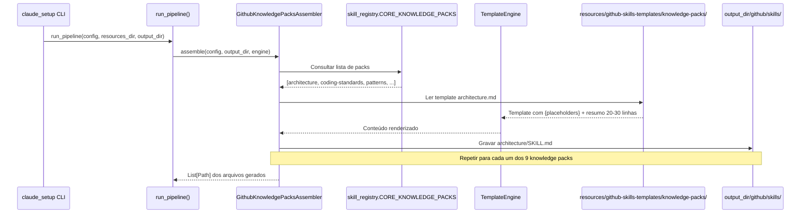
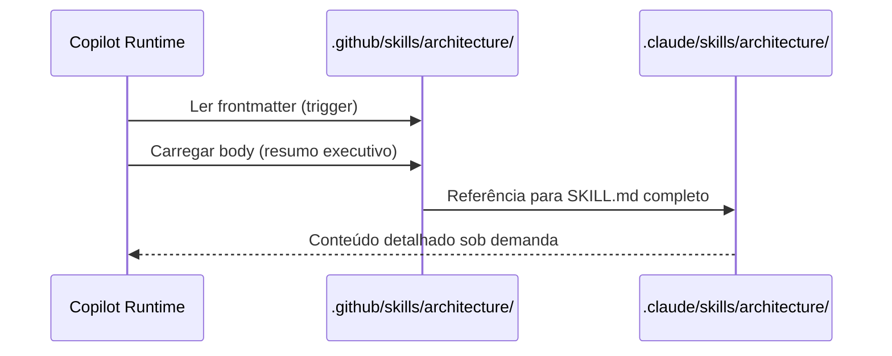

# História: Skills Knowledge Packs

**ID:** STORY-008

## 1. Dependências

| Blocked By | Blocks |
| :--- | :--- |
| STORY-001 | STORY-013 |

## 2. Regras Transversais Aplicáveis

| ID | Título |
| :--- | :--- |
| RULE-001 | Paridade funcional |
| RULE-002 | Convenções do Copilot |
| RULE-003 | Sem duplicação de conteúdo |
| RULE-005 | Progressive disclosure |

## 3. Descrição

Como **Architect**, eu quero que o gerador `claude_setup` produza os 9 knowledge packs (`architecture`, `coding-standards`, `patterns`, `protocols`, `observability`, `resilience`, `security`, `compliance`, `api-design`) em `.github/skills/`, garantindo que o Copilot tenha acesso ao mesmo corpo de conhecimento técnico de referência.

Knowledge packs são skills de prioridade baixa (material de referência) mas essenciais como base para skills operacionais. A estratégia principal é referência (RULE-003): frontmatter com description no Copilot, body com resumo executivo e link para o conteúdo completo em `.claude/skills/`. Estes **não são skills invocáveis** — são reference-only, com summary body + link.

### 3.1 Skills a gerar

- `.github/skills/architecture/SKILL.md` — Arquitetura hexagonal, dependency rules, package structure
- `.github/skills/coding-standards/SKILL.md` — Clean Code, SOLID, idiomas Java 21
- `.github/skills/patterns/SKILL.md` — CQRS e patterns de design
- `.github/skills/protocols/SKILL.md` — REST, gRPC, GraphQL, WebSocket, event-driven
- `.github/skills/observability/SKILL.md` — Tracing, metrics, logging, health checks
- `.github/skills/resilience/SKILL.md` — Circuit breaker, retry, bulkhead, backpressure
- `.github/skills/security/SKILL.md` — OWASP Top 10, secrets, crypto, headers
- `.github/skills/compliance/SKILL.md` — GDPR, HIPAA, LGPD, PCI-DSS
- `.github/skills/api-design/SKILL.md` — REST patterns, status codes, RFC 7807, pagination

### 3.2 Estratégia de referência

- Frontmatter: description rica para trigger correto
- Body: resumo executivo (20-30 linhas) com os pontos mais críticos
- References: link direto para `.claude/skills/*/SKILL.md` e `references/`

### 3.3 Contexto Técnico (Gerador)

Este trabalho consiste em **estender o gerador Python `claude_setup`** para emitir knowledge packs na árvore `.github/skills/`. Diferente das skills operacionais (STORY-005/006/007), knowledge packs são **reference-only** com body de resumo + link:

- **Assembler**: Criar `GithubKnowledgePacksAssembler` em `src/claude_setup/assembler/github_knowledge_packs_assembler.py`, implementando `assemble(config, output_dir, engine) -> List[Path]`. Deve iterar sobre os 9 templates de knowledge pack, renderizar via `TemplateEngine`, e gravar em `output_dir/github/skills/<pack-name>/SKILL.md`.
- **Templates**: Criar `resources/github-skills-templates/knowledge-packs/` com 9 templates Jinja2/placeholder (um por pack). Cada template deve conter:
  - Frontmatter YAML (`name` + `description` rica)
  - Body com resumo executivo de 20-30 linhas (NÃO cópia completa)
  - Link relativo para `.claude/skills/<pack-name>/SKILL.md`
- **Pipeline**: Registrar `GithubKnowledgePacksAssembler` em `assembler/__init__.py` → `_build_assemblers()`.
- **Relação com `SkillsAssembler`**: O `SkillsAssembler` existente já gera knowledge packs para `.claude/skills/` via `select_knowledge_packs()` e `CORE_KNOWLEDGE_PACKS`. O novo assembler reutiliza a mesma lista de packs (`skill_registry.CORE_KNOWLEDGE_PACKS`) para determinar quais gerar para `.github/skills/`.
- **TemplateEngine**: Usar `engine.replace_placeholders()` para injetar valores de `ProjectConfig`. Os templates devem usar `{project_name}`, `{framework_name}`, `{language_name}`, etc.
- **Validação de tamanho**: O assembler pode opcionalmente validar que o body gerado tem ≤ 30 linhas de resumo (excluindo frontmatter e links), garantindo a regra de não-duplicação.

## 4. Definições de Qualidade Locais

### DoR Local (Definition of Ready)

- [ ] STORY-001 concluída (`GithubInstructionsAssembler` funcionando)
- [ ] 9 knowledge packs em `.claude/skills/` lidos como referência para templates
- [ ] Estratégia de referência vs duplicação definida (resumo ≤ 30 linhas + link)
- [ ] Estrutura de `resources/github-skills-templates/` definida

### DoD Local (Definition of Done)

- [ ] `GithubKnowledgePacksAssembler` implementado e registrado no pipeline
- [ ] 9 templates de knowledge pack criados em `resources/github-skills-templates/knowledge-packs/`
- [ ] Body com resumo executivo, não cópia completa
- [ ] References linkam para `.claude/skills/` originais
- [ ] Golden files atualizados e passando byte-for-byte
- [ ] Pipeline gera `.github/skills/<pack-name>/SKILL.md` corretamente

### Global Definition of Done (DoD)

- **Validação de formato:** YAML frontmatter válido e parseável
- **Convenções Copilot:** `name` em lowercase-hyphens, `description` presente
- **Sem duplicação:** Body com resumo, referências para conteúdo completo
- **Idioma:** Inglês
- **Progressive disclosure:** 3 níveis implementados
- **Documentação:** README gerado atualizado com knowledge packs

## 5. Contratos de Dados (Data Contract)

**Knowledge Pack Skill Contract:**

| Campo | Formato | Request | Response | Origem / Regra |
| :--- | :--- | :--- | :--- | :--- |
| `frontmatter.name` | string (lowercase-hyphens) | M | — | Ex: `architecture` |
| `frontmatter.description` | string (multiline) | M | — | Keywords do domínio de conhecimento |
| `summary_lines` | integer | M | — | 20-30 linhas de resumo no body |
| `reference_path` | string (path) | M | — | Link para `.claude/skills/*/SKILL.md` |

## 6. Diagramas

### 6.1 Pipeline do Gerador para Knowledge Packs



### 6.2 Estratégia de Referência (output gerado)



## 7. Critérios de Aceite (Gherkin)

```gherkin
Cenario: Gerador produz 9 knowledge packs
  DADO que o pipeline inclui GithubKnowledgePacksAssembler
  QUANDO run_pipeline() é executado com config padrão
  ENTÃO o output_dir contém github/skills/architecture/SKILL.md
  E contém github/skills/coding-standards/SKILL.md
  E contém github/skills/patterns/SKILL.md
  E contém github/skills/protocols/SKILL.md
  E contém github/skills/observability/SKILL.md
  E contém github/skills/resilience/SKILL.md
  E contém github/skills/security/SKILL.md
  E contém github/skills/compliance/SKILL.md
  E contém github/skills/api-design/SKILL.md

Cenario: Body com resumo executivo, não cópia completa
  DADO que o template security.md contém resumo de 20-30 linhas
  QUANDO o gerador renderiza o template
  ENTÃO o body gerado contém no máximo 30 linhas de resumo (excluindo frontmatter)
  E inclui link para .claude/skills/security/SKILL.md

Cenario: Sem duplicação de conteúdo entre .claude e .github
  DADO que .claude/skills/coding-standards/SKILL.md tem 200+ linhas
  QUANDO o gerador produz github/skills/coding-standards/SKILL.md
  ENTÃO o body gerado tem resumo de 20-30 linhas
  E NÃO duplica tabelas, listas ou seções completas do original

Cenario: Frontmatter YAML válido nos packs gerados
  DADO que o gerador produziu github/skills/architecture/SKILL.md
  QUANDO o frontmatter YAML é parseado
  ENTÃO o campo "name" é "architecture"
  E o campo "description" contém keywords do domínio

Cenario: Diferenciação de trigger entre api-design e protocols
  DADO que ambos os packs foram gerados
  QUANDO as descriptions são comparadas
  ENTÃO api-design contém "status codes", "pagination", "RFC 7807"
  E protocols contém "gRPC", "WebSocket", "event-driven"

Cenario: Golden files byte-for-byte
  DADO que os golden files de knowledge packs existem em tests/golden/
  QUANDO o gerador produz os knowledge packs
  ENTÃO a saída é idêntica byte-for-byte aos golden files
  E test_byte_for_byte.py passa sem diff

Cenario: Knowledge pack com frontmatter incompleto no template
  DADO que um template em resources/ não tem campo "description"
  QUANDO o assembler tenta renderizar
  ENTÃO levanta erro indicando campo obrigatório ausente
  E o pipeline reporta falha clara
```

## 8. Sub-tarefas

- [ ] [Dev] Criar `GithubKnowledgePacksAssembler` em `src/claude_setup/assembler/github_knowledge_packs_assembler.py` com `assemble()` e iteração sobre `CORE_KNOWLEDGE_PACKS`
- [ ] [Dev] Criar 9 templates de knowledge pack em `resources/github-skills-templates/knowledge-packs/` (`architecture.md`, `coding-standards.md`, `patterns.md`, `protocols.md`, `observability.md`, `resilience.md`, `security.md`, `compliance.md`, `api-design.md`)
- [ ] [Dev] Implementar frontmatter YAML com description rica e keywords diferenciadas em cada template
- [ ] [Dev] Implementar body de resumo executivo (20-30 linhas) + link relativo para `.claude/skills/` em cada template
- [ ] [Dev] Registrar `GithubKnowledgePacksAssembler` em `assembler/__init__.py` → `_build_assemblers()`
- [ ] [Dev] Reutilizar `CORE_KNOWLEDGE_PACKS` de `domain/skill_registry.py` para lista de packs
- [ ] [Test] Testes unitários do assembler: verificar geração dos 9 packs
- [ ] [Test] Testes unitários: verificar que body gerado tem ≤ 30 linhas de resumo
- [ ] [Test] Testes unitários: validar links relativos para `.claude/skills/`
- [ ] [Test] Regenerar golden files e verificar byte-for-byte em `tests/test_byte_for_byte.py`
- [ ] [Test] Adicionar cenários de pipeline em `tests/test_pipeline.py`
- [ ] [Doc] Atualizar template de README gerado (`ReadmeAssembler`) para listar knowledge packs
