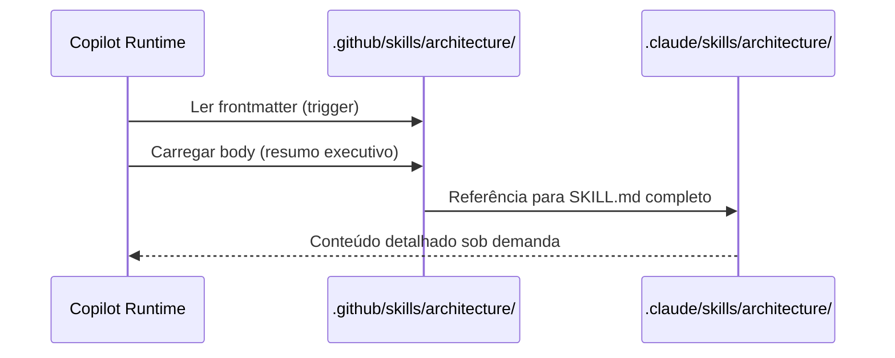

# História: Skills Knowledge Packs

**ID:** STORY-008

## 1. Dependências

| Blocked By | Blocks |
| :--- | :--- |
| STORY-001 | STORY-013 |

## 2. Regras Transversais Aplicáveis

| ID | Título |
| :--- | :--- |
| RULE-001 | Paridade funcional |
| RULE-002 | Convenções do Copilot |
| RULE-003 | Sem duplicação de conteúdo |
| RULE-005 | Progressive disclosure |

## 3. Descrição

Como **Architect**, eu quero adaptar os 9 knowledge packs (`architecture`, `coding-standards`, `patterns`, `protocols`, `observability`, `resilience`, `security`, `compliance`, `api-design`) para `.github/skills/`, garantindo que o Copilot tenha acesso ao mesmo corpo de conhecimento técnico de referência.

Knowledge packs são skills de prioridade baixa (material de referência) mas essenciais como base para skills operacionais. A estratégia principal é referência (RULE-003): frontmatter com description no Copilot, body com resumo e link para o conteúdo completo em `.claude/skills/`.

### 3.1 Skills a criar

- `.github/skills/architecture/SKILL.md` — Arquitetura hexagonal, dependency rules, package structure
- `.github/skills/coding-standards/SKILL.md` — Clean Code, SOLID, idiomas Java 21
- `.github/skills/patterns/SKILL.md` — CQRS e patterns de design
- `.github/skills/protocols/SKILL.md` — REST, gRPC, GraphQL, WebSocket, event-driven
- `.github/skills/observability/SKILL.md` — Tracing, metrics, logging, health checks
- `.github/skills/resilience/SKILL.md` — Circuit breaker, retry, bulkhead, backpressure
- `.github/skills/security/SKILL.md` — OWASP Top 10, secrets, crypto, headers
- `.github/skills/compliance/SKILL.md` — GDPR, HIPAA, LGPD, PCI-DSS
- `.github/skills/api-design/SKILL.md` — REST patterns, status codes, RFC 7807, pagination

### 3.2 Estratégia de referência

- Frontmatter: description rica para trigger correto
- Body: resumo executivo (20-30 linhas) com os pontos mais críticos
- References: link direto para `.claude/skills/*/SKILL.md` e `references/`

## 4. Definições de Qualidade Locais

### DoR Local (Definition of Ready)

- [ ] STORY-001 concluída
- [ ] 9 knowledge packs em `.claude/skills/` lidos
- [ ] Estratégia de referência vs duplicação definida

### DoD Local (Definition of Done)

- [ ] 9 skills criadas com frontmatter válido
- [ ] Body com resumo executivo, não cópia completa
- [ ] References linkam para `.claude/skills/` originais
- [ ] Copilot ativa knowledge pack correto por tema

### Global Definition of Done (DoD)

- **Validação de formato:** YAML frontmatter válido e parseável
- **Convenções Copilot:** `name` em lowercase-hyphens, `description` presente
- **Sem duplicação:** Body com resumo, referências para conteúdo completo
- **Idioma:** Inglês
- **Progressive disclosure:** 3 níveis implementados
- **Documentação:** README.md atualizado

## 5. Contratos de Dados (Data Contract)

**Knowledge Pack Skill Contract:**

| Campo | Formato | Request | Response | Origem / Regra |
| :--- | :--- | :--- | :--- | :--- |
| `frontmatter.name` | string (lowercase-hyphens) | M | — | Ex: `architecture` |
| `frontmatter.description` | string (multiline) | M | — | Keywords do domínio de conhecimento |
| `summary_lines` | integer | M | — | 20-30 linhas de resumo no body |
| `reference_path` | string (path) | M | — | Link para `.claude/skills/*/SKILL.md` |

## 6. Diagramas

### 6.1 Estratégia de Referência



## 7. Critérios de Aceite (Gherkin)

```gherkin
Cenario: Trigger correto para knowledge pack de architecture
  DADO que .github/skills/architecture/SKILL.md existe
  QUANDO o usuário solicita "quais são as regras de dependência entre layers?"
  ENTÃO o Copilot seleciona a skill architecture
  E carrega o resumo executivo no body

Cenario: Body com resumo executivo, não cópia completa
  DADO que a skill security foi criada
  QUANDO o body é carregado
  ENTÃO contém no máximo 30 linhas de resumo
  E inclui link para .claude/skills/security/SKILL.md

Cenario: Sem duplicação de conteúdo entre .claude e .github
  DADO que .claude/skills/coding-standards/SKILL.md tem 200+ linhas
  QUANDO .github/skills/coding-standards/SKILL.md é criado
  ENTÃO o body tem resumo de 20-30 linhas
  E NÃO duplica tabelas, listas ou seções completas

Cenario: Diferenciação entre api-design e protocols
  DADO que ambas as skills existem em .github/skills/
  QUANDO o usuário pergunta "qual status code usar para criação?"
  ENTÃO o Copilot seleciona api-design
  E NÃO seleciona protocols

Cenario: Knowledge pack com frontmatter incompleto
  DADO que um SKILL.md não tem campo "description"
  QUANDO o Copilot tenta indexar a skill
  ENTÃO a skill NÃO é indexada
  E o erro indica campo obrigatório ausente
```

## 8. Sub-tarefas

- [ ] [Dev] Criar `.github/skills/architecture/SKILL.md` com resumo executivo
- [ ] [Dev] Criar `.github/skills/coding-standards/SKILL.md` com resumo executivo
- [ ] [Dev] Criar `.github/skills/patterns/SKILL.md` com resumo executivo
- [ ] [Dev] Criar `.github/skills/protocols/SKILL.md` com resumo executivo
- [ ] [Dev] Criar `.github/skills/observability/SKILL.md` com resumo executivo
- [ ] [Dev] Criar `.github/skills/resilience/SKILL.md` com resumo executivo
- [ ] [Dev] Criar `.github/skills/security/SKILL.md` com resumo executivo
- [ ] [Dev] Criar `.github/skills/compliance/SKILL.md` com resumo executivo
- [ ] [Dev] Criar `.github/skills/api-design/SKILL.md` com resumo executivo
- [ ] [Test] Validar YAML frontmatter das 9 skills
- [ ] [Test] Verificar que body tem ≤ 30 linhas de resumo
- [ ] [Test] Validar links relativos para .claude/skills/
- [ ] [Doc] Documentar knowledge packs no README
