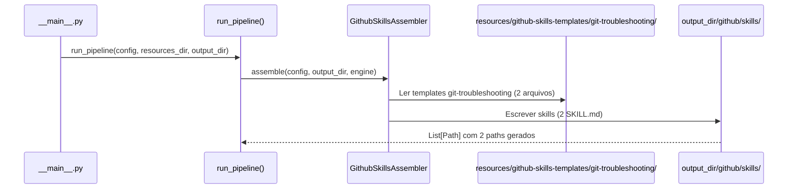
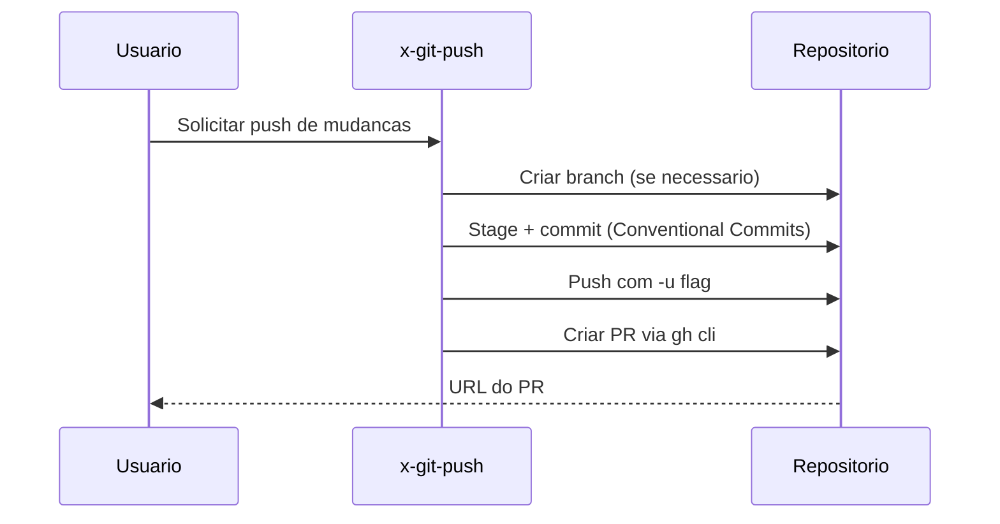

# Historia: Skills de Git e Troubleshooting (Gerador Python)

**ID:** STORY-009

## 1. Dependencias

| Blocked By | Blocks |
| :--- | :--- |
| STORY-001 | STORY-013 |

## 2. Regras Transversais Aplicaveis

| ID | Titulo |
| :--- | :--- |
| RULE-001 | Paridade funcional |
| RULE-002 | Convencoes do Copilot |
| RULE-003 | Sem duplicacao de conteudo |
| RULE-005 | Progressive disclosure |

## 3. Descricao

Como **Developer**, eu quero que o gerador Python `claude_setup` produza as skills de git (`x-git-push`) e troubleshooting (`x-ops-troubleshoot`) dentro do diretorio `.github/skills/` gerado, garantindo que operacoes de versionamento e diagnostico de problemas sigam os mesmos padroes.

O gerador `claude_setup` ja produz tanto `.claude/` quanto `.github/` como output. Esta story adiciona templates e logica de assembler para gerar as 2 skills de git/troubleshooting na arvore `.github/skills/`. Ambos os diretorios sao gitignored -- sao output do gerador.

Estas duas skills sao de prioridade media e complementam o fluxo de desenvolvimento: `x-git-push` cuida de branch creation, commits (Conventional Commits), push e PR creation; `x-ops-troubleshoot` diagnostica erros, stacktraces, build failures e runtime exceptions.

### 3.1 Skills a gerar

- `.github/skills/x-git-push/SKILL.md` -- Git workflow: branch, commit, push, PR creation
- `.github/skills/x-ops-troubleshoot/SKILL.md` -- Diagnostico sistematico: reproduce, locate, understand, fix, verify

### 3.2 Convencoes de commit

- O template de `x-git-push` deve referenciar Conventional Commits
- Formato: `type(scope): description`
- Co-authored-by com identificacao do agente

## Contexto Tecnico (Gerador)

### Assembler

- Estender o `GithubSkillsAssembler` (criado em STORY-005) em `src/claude_setup/assembler/` para processar a categoria `git-troubleshooting`.
- O assembler le templates de `resources/github-skills-templates/git-troubleshooting/` e gera arquivos em `output_dir/github/skills/<skill-name>/SKILL.md`.
- Se o assembler ja foi registrado em `_build_assemblers()` na STORY-005, basta adicionar a nova categoria de templates.

### Templates

- Criar diretorio `resources/github-skills-templates/git-troubleshooting/` com 2 templates Jinja/Markdown:
  - `x-git-push.md`, `x-ops-troubleshoot.md`
- Templates usam placeholders do `TemplateEngine` (ex: `{{PROJECT_NAME}}`).
- O template `x-git-push.md` deve incluir formato de Conventional Commits e lista de tipos validos.

### Pipeline

- O pipeline `assembler/__init__.py` -> `run_pipeline()` ja orquestra todos os assemblers.
- O assembler de skills GitHub processa todas as categorias de templates encontradas em `resources/github-skills-templates/`.

### Testes

- **Golden files:** Adicionar fixtures em `tests/golden/github/skills/{x-git-push,x-ops-troubleshoot}/SKILL.md` e validar em `tests/test_byte_for_byte.py`.
- **Pipeline test:** Estender `tests/test_pipeline.py` para verificar que os 2 arquivos de git/troubleshooting skills aparecem em `PipelineResult.files_generated`.
- **Unit test:** Testar o assembler isoladamente com config mock e `tmp_path`.

## 4. Definicoes de Qualidade Locais

### DoR Local (Definition of Ready)

- [ ] STORY-001 concluida (`GithubInstructionsAssembler` funcional)
- [ ] Skills `.claude/skills/x-git-push` e `x-ops-troubleshoot` lidas e mapeadas como base para templates
- [ ] Estrutura de `resources/github-skills-templates/` definida (STORY-005)

### DoD Local (Definition of Done)

- [ ] Assembler gera 2 skills com frontmatter YAML valido
- [ ] `x-git-push` com workflow de Conventional Commits
- [ ] `x-ops-troubleshoot` com metodologia sistematica (reproduce -> locate -> understand -> fix -> verify)
- [ ] Golden files conferem byte-a-byte
- [ ] `tests/test_pipeline.py` passa com os 2 novos arquivos

### Global Definition of Done (DoD)

- **Validacao de formato:** YAML frontmatter valido e parseavel
- **Convencoes Copilot:** `name` em lowercase-hyphens, `description` presente
- **Sem duplicacao:** References linkam para `.claude/skills/`
- **Idioma:** Ingles
- **Progressive disclosure:** 3 niveis implementados
- **Documentacao:** README.md atualizado

## 5. Contratos de Dados (Data Contract)

**Git/Troubleshoot Skill Contract:**

| Campo | Formato | Request | Response | Origem / Regra |
| :--- | :--- | :--- | :--- | :--- |
| `frontmatter.name` | string (lowercase-hyphens) | M | -- | `x-git-push` ou `x-ops-troubleshoot` |
| `frontmatter.description` | string (multiline) | M | -- | Keywords: git, commit, push, PR, troubleshoot, error, stacktrace |
| `workflow_steps` | array[string] | M | -- | Passos do workflow |

## 6. Diagramas

### 6.1 Fluxo do Gerador para Skills de Git/Troubleshooting



### 6.2 Fluxo de Git Push (Runtime)



### 6.3 Fluxo de Troubleshooting (Runtime)


## 7. Criterios de Aceite (Gherkin)

```gherkin
Cenario: Gerador produz 2 skills de git e troubleshooting
  DADO que o config YAML do projeto esta valido
  QUANDO run_pipeline() e executado
  ENTAO output_dir/github/skills/ contem 2 subdiretorios: x-git-push, x-ops-troubleshoot
  E cada subdiretorio contem SKILL.md com frontmatter YAML valido

Cenario: Golden files de git/troubleshooting conferem byte-a-byte
  DADO que tests/golden/github/skills/{x-git-push,x-ops-troubleshoot}/SKILL.md existem
  QUANDO test_byte_for_byte.py e executado
  ENTAO a saida gerada e identica aos golden files

Cenario: Conventional Commits no template x-git-push
  DADO que o template x-git-push.md define formato de commit
  QUANDO o SKILL.md e gerado
  ENTAO o body inclui formato "type(scope): description"
  E lista tipos validos: feat, fix, chore, refactor, test, docs

Cenario: Troubleshoot com metodologia sistematica
  DADO que o template x-ops-troubleshoot.md define workflow
  QUANDO o SKILL.md e gerado
  ENTAO o body contem os 5 passos: reproduce, locate, understand, fix, verify
  E a ordem dos passos e preservada

Cenario: Diferenciacao entre git push e troubleshoot
  DADO que ambos os SKILL.md gerados possuem descriptions distintas
  QUANDO o Copilot le os frontmatters
  ENTAO x-git-push contem keywords "git", "commit", "push", "branch", "PR"
  E x-ops-troubleshoot contem keywords "error", "stacktrace", "debug", "diagnose"

Cenario: Pipeline test inclui skills de git/troubleshooting
  DADO que tests/test_pipeline.py valida PipelineResult
  QUANDO o pipeline roda com config padrao
  ENTAO PipelineResult.files_generated inclui paths para os 2 SKILL.md
```

## 8. Sub-tarefas

- [ ] [Dev] Criar diretorio `resources/github-skills-templates/git-troubleshooting/` com 2 templates Markdown
- [ ] [Dev] Estender `GithubSkillsAssembler` para processar categoria `git-troubleshooting` (ou reusar mecanismo de STORY-005)
- [ ] [Dev] Criar template `x-git-push.md` com workflow de Conventional Commits
- [ ] [Dev] Criar template `x-ops-troubleshoot.md` com metodologia sistematica (5 passos)
- [ ] [Test] Criar golden files em `tests/golden/github/skills/{x-git-push,x-ops-troubleshoot}/SKILL.md`
- [ ] [Test] Adicionar caso em `tests/test_byte_for_byte.py` para os 2 arquivos
- [ ] [Test] Estender `tests/test_pipeline.py` para validar presenca dos 2 paths
- [ ] [Test] Testar assembler isolado com config mock e `tmp_path`
- [ ] [Test] Validar YAML frontmatter parseavel nas 2 skills geradas
- [ ] [Test] Verificar diferenciacao de keywords entre as 2 skills
- [ ] [Doc] Documentar skills de git e troubleshooting no README
