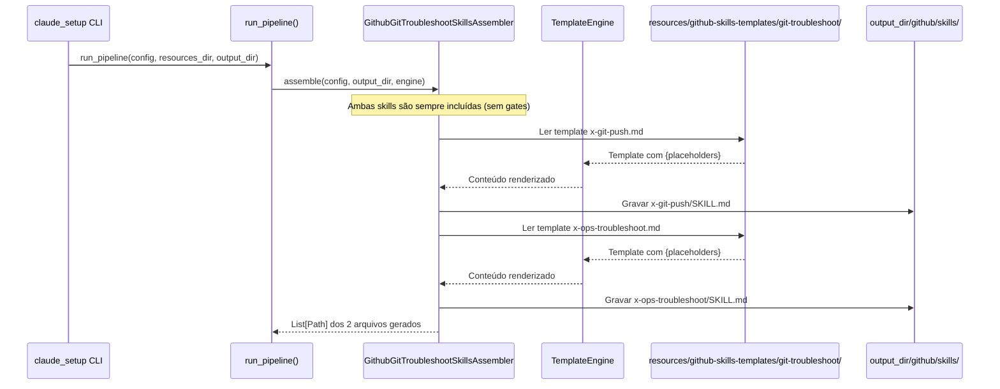
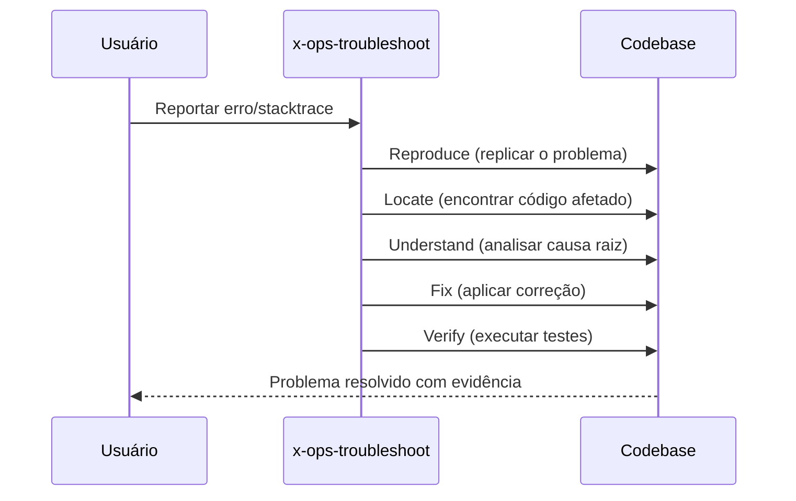

# História: Skills de Git e Troubleshooting

**ID:** STORY-009

## 1. Dependências

| Blocked By | Blocks |
| :--- | :--- |
| STORY-001 | STORY-013 |

## 2. Regras Transversais Aplicáveis

| ID | Título |
| :--- | :--- |
| RULE-001 | Paridade funcional |
| RULE-002 | Convenções do Copilot |
| RULE-003 | Sem duplicação de conteúdo |
| RULE-005 | Progressive disclosure |

## 3. Descrição

Como **Developer**, eu quero que o gerador `claude_setup` produza as skills de git (`x-git-push`) e troubleshooting (`x-ops-troubleshoot`) em `.github/skills/`, garantindo que operações de versionamento e diagnóstico de problemas sigam os mesmos padrões.

Estas duas skills são de prioridade média e complementam o fluxo de desenvolvimento: `x-git-push` cuida de branch creation, commits (Conventional Commits), push e PR creation; `x-ops-troubleshoot` diagnostica erros, stacktraces, build failures e runtime exceptions.

### 3.1 Skills a gerar

- `.github/skills/x-git-push/SKILL.md` — Git workflow: branch, commit, push, PR creation
- `.github/skills/x-ops-troubleshoot/SKILL.md` — Diagnóstico sistemático: reproduce, locate, understand, fix, verify

### 3.2 Convenções de commit

- x-git-push deve referenciar Conventional Commits
- Formato: `type(scope): description`
- Co-authored-by com identificação do agente

### 3.3 Contexto Técnico (Gerador)

Este trabalho consiste em **estender o gerador Python `claude_setup`** para emitir skills de git e troubleshooting na árvore `.github/skills/`. O padrão segue o mesmo de STORY-005/006/007:

- **Assembler**: Criar `GithubGitTroubleshootSkillsAssembler` em `src/claude_setup/assembler/github_git_troubleshoot_skills_assembler.py`, implementando `assemble(config, output_dir, engine) -> List[Path]`. Deve iterar sobre os 2 templates, renderizar via `TemplateEngine`, e gravar em `output_dir/github/skills/<skill-name>/SKILL.md`.
- **Templates**: Criar `resources/github-skills-templates/git-troubleshoot/` com 2 templates Jinja2/placeholder:
  - `x-git-push.md` — Template com frontmatter + workflow de Conventional Commits, branch naming, push com `-u` flag, PR creation via `gh cli`
  - `x-ops-troubleshoot.md` — Template com frontmatter + metodologia sistemática (reproduce → locate → understand → fix → verify)
- **Pipeline**: Registrar `GithubGitTroubleshootSkillsAssembler` em `assembler/__init__.py` → `_build_assemblers()`.
- **Condicionais**: Ambas as skills são **sempre incluídas** (não dependem de feature gates). São skills core do fluxo de desenvolvimento.
- **TemplateEngine**: Usar `engine.replace_placeholders()` para injetar valores de `ProjectConfig` (nome do projeto, build tool, etc.).

## 4. Definições de Qualidade Locais

### DoR Local (Definition of Ready)

- [ ] STORY-001 concluída (`GithubInstructionsAssembler` funcionando)
- [ ] Skills `.claude/skills/x-git-push` e `x-ops-troubleshoot` lidas como referência para templates
- [ ] Estrutura de `resources/github-skills-templates/` definida

### DoD Local (Definition of Done)

- [ ] `GithubGitTroubleshootSkillsAssembler` implementado e registrado no pipeline
- [ ] 2 templates criados em `resources/github-skills-templates/git-troubleshoot/`
- [ ] x-git-push com workflow de Conventional Commits
- [ ] x-ops-troubleshoot com metodologia sistemática
- [ ] Golden files atualizados e passando byte-for-byte
- [ ] Pipeline gera `.github/skills/<skill-name>/SKILL.md` corretamente

### Global Definition of Done (DoD)

- **Validação de formato:** YAML frontmatter válido e parseável
- **Convenções Copilot:** `name` em lowercase-hyphens, `description` presente
- **Sem duplicação:** References linkam para `.claude/skills/`
- **Idioma:** Inglês
- **Progressive disclosure:** 3 níveis implementados
- **Documentação:** README gerado atualizado com skills de git e troubleshooting

## 5. Contratos de Dados (Data Contract)

**Git/Troubleshoot Skill Contract:**

| Campo | Formato | Request | Response | Origem / Regra |
| :--- | :--- | :--- | :--- | :--- |
| `frontmatter.name` | string (lowercase-hyphens) | M | — | `x-git-push` ou `x-ops-troubleshoot` |
| `frontmatter.description` | string (multiline) | M | — | Keywords: git, commit, push, PR, troubleshoot, error, stacktrace |
| `workflow_steps` | array[string] | M | — | Passos do workflow |

## 6. Diagramas

### 6.1 Pipeline do Gerador para Skills de Git e Troubleshooting



### 6.2 Fluxo de Git Push (output gerado)


### 6.3 Fluxo de Troubleshooting (output gerado)



## 7. Critérios de Aceite (Gherkin)

```gherkin
Cenario: Gerador produz 2 skills de git e troubleshooting
  DADO que o pipeline inclui GithubGitTroubleshootSkillsAssembler
  QUANDO run_pipeline() é executado com qualquer config
  ENTÃO o output_dir contém github/skills/x-git-push/SKILL.md
  E contém github/skills/x-ops-troubleshoot/SKILL.md

Cenario: Skills são sempre incluídas (sem feature gates)
  DADO que a config tem interfaces=[] e orchestrator=none
  QUANDO run_pipeline() é executado
  ENTÃO o output_dir contém github/skills/x-git-push/SKILL.md
  E contém github/skills/x-ops-troubleshoot/SKILL.md

Cenario: Conventional Commits no template x-git-push
  DADO que o template x-git-push.md foi renderizado
  QUANDO o body gerado é inspecionado
  ENTÃO inclui formato "type(scope): description"
  E lista tipos válidos: feat, fix, chore, refactor, test, docs

Cenario: Troubleshoot com metodologia sistemática
  DADO que o template x-ops-troubleshoot.md foi renderizado
  QUANDO o body gerado é inspecionado
  ENTÃO inclui passos: reproduce, locate, understand, fix, verify
  E não permite fix antes de understand

Cenario: Diferenciação de trigger entre git push e troubleshoot
  DADO que ambas as skills foram geradas
  QUANDO as descriptions são comparadas
  ENTÃO x-git-push contém "git", "commit", "push", "PR"
  E x-ops-troubleshoot contém "troubleshoot", "error", "stacktrace"
  E NÃO há sobreposição de keywords primárias

Cenario: Golden files byte-for-byte
  DADO que os golden files de git e troubleshoot existem em tests/golden/
  QUANDO o gerador produz as 2 skills
  ENTÃO a saída é idêntica byte-for-byte aos golden files
  E test_byte_for_byte.py passa sem diff

Cenario: Placeholders renderizados pelo TemplateEngine
  DADO que o template x-git-push.md contém {project_name} e {build_tool}
  QUANDO o gerador renderiza com config.project.name="my-quarkus-service"
  ENTÃO o body gerado contém "my-quarkus-service"
  E contém o build tool configurado
```

## 8. Sub-tarefas

- [ ] [Dev] Criar `GithubGitTroubleshootSkillsAssembler` em `src/claude_setup/assembler/github_git_troubleshoot_skills_assembler.py` com `assemble()` e renderização via `TemplateEngine`
- [ ] [Dev] Criar template `x-git-push.md` em `resources/github-skills-templates/git-troubleshoot/` com frontmatter + workflow de Conventional Commits
- [ ] [Dev] Criar template `x-ops-troubleshoot.md` em `resources/github-skills-templates/git-troubleshoot/` com frontmatter + metodologia sistemática
- [ ] [Dev] Registrar `GithubGitTroubleshootSkillsAssembler` em `assembler/__init__.py` → `_build_assemblers()`
- [ ] [Test] Testes unitários do assembler: verificar geração das 2 skills com qualquer config
- [ ] [Test] Testes unitários: verificar renderização de placeholders pelo `TemplateEngine`
- [ ] [Test] Regenerar golden files e verificar byte-for-byte em `tests/test_byte_for_byte.py`
- [ ] [Test] Adicionar cenários de pipeline em `tests/test_pipeline.py`
- [ ] [Doc] Atualizar template de README gerado (`ReadmeAssembler`) para listar skills de git e troubleshooting
