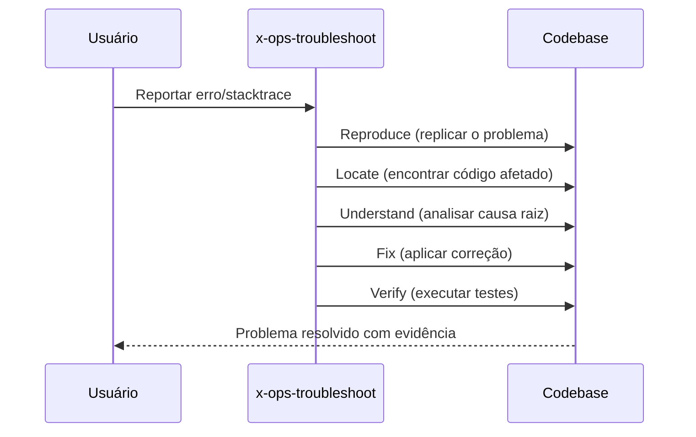

# História: Skills de Git e Troubleshooting

**ID:** STORY-009

## 1. Dependências

| Blocked By | Blocks |
| :--- | :--- |
| STORY-001 | STORY-013 |

## 2. Regras Transversais Aplicáveis

| ID | Título |
| :--- | :--- |
| RULE-001 | Paridade funcional |
| RULE-002 | Convenções do Copilot |
| RULE-003 | Sem duplicação de conteúdo |
| RULE-005 | Progressive disclosure |

## 3. Descrição

Como **Developer**, eu quero adaptar as skills de git (`x-git-push`) e troubleshooting (`x-ops-troubleshoot`) para `.github/skills/`, garantindo que operações de versionamento e diagnóstico de problemas sigam os mesmos padrões.

Estas duas skills são de prioridade média e complementam o fluxo de desenvolvimento: `x-git-push` cuida de branch creation, commits (Conventional Commits), push e PR creation; `x-ops-troubleshoot` diagnostica erros, stacktraces, build failures e runtime exceptions.

### 3.1 Skills a criar

- `.github/skills/x-git-push/SKILL.md` — Git workflow: branch, commit, push, PR creation
- `.github/skills/x-ops-troubleshoot/SKILL.md` — Diagnóstico sistemático: reproduce, locate, understand, fix, verify

### 3.2 Convenções de commit

- x-git-push deve referenciar Conventional Commits
- Formato: `type(scope): description`
- Co-authored-by com identificação do agente

## 4. Definições de Qualidade Locais

### DoR Local (Definition of Ready)

- [ ] STORY-001 concluída
- [ ] Skills `.claude/skills/x-git-push` e `x-ops-troubleshoot` lidas

### DoD Local (Definition of Done)

- [ ] 2 skills criadas com frontmatter válido
- [ ] x-git-push com workflow de Conventional Commits
- [ ] x-ops-troubleshoot com metodologia sistemática
- [ ] Copilot ativa skill correta

### Global Definition of Done (DoD)

- **Validação de formato:** YAML frontmatter válido e parseável
- **Convenções Copilot:** `name` em lowercase-hyphens, `description` presente
- **Sem duplicação:** References linkam para `.claude/skills/`
- **Idioma:** Inglês
- **Progressive disclosure:** 3 níveis implementados
- **Documentação:** README.md atualizado

## 5. Contratos de Dados (Data Contract)

**Git/Troubleshoot Skill Contract:**

| Campo | Formato | Request | Response | Origem / Regra |
| :--- | :--- | :--- | :--- | :--- |
| `frontmatter.name` | string (lowercase-hyphens) | M | — | `x-git-push` ou `x-ops-troubleshoot` |
| `frontmatter.description` | string (multiline) | M | — | Keywords: git, commit, push, PR, troubleshoot, error, stacktrace |
| `workflow_steps` | array[string] | M | — | Passos do workflow |

## 6. Diagramas

### 6.1 Fluxo de Git Push


### 6.2 Fluxo de Troubleshooting



## 7. Critérios de Aceite (Gherkin)

```gherkin
Cenario: Trigger correto para git push
  DADO que .github/skills/x-git-push/SKILL.md existe
  QUANDO o usuário solicita "fazer push das mudanças"
  ENTÃO o Copilot seleciona x-git-push
  E carrega workflow de branch, commit, push

Cenario: Conventional Commits no x-git-push
  DADO que x-git-push define formato de commit
  QUANDO o body é carregado
  ENTÃO inclui formato "type(scope): description"
  E lista tipos válidos: feat, fix, chore, refactor, test, docs

Cenario: Troubleshoot com metodologia sistemática
  DADO que .github/skills/x-ops-troubleshoot/SKILL.md existe
  QUANDO o usuário reporta um erro de compilação
  ENTÃO o Copilot segue: reproduce → locate → understand → fix → verify
  E não tenta fix antes de entender a causa raiz

Cenario: Diferenciação entre git push e troubleshoot
  DADO que ambas as skills existem
  QUANDO o usuário diz "o build falhou"
  ENTÃO o Copilot seleciona x-ops-troubleshoot
  E NÃO seleciona x-git-push
```

## 8. Sub-tarefas

- [ ] [Dev] Criar `.github/skills/x-git-push/SKILL.md` com workflow de git
- [ ] [Dev] Criar `.github/skills/x-ops-troubleshoot/SKILL.md` com metodologia
- [ ] [Test] Validar YAML frontmatter das 2 skills
- [ ] [Test] Verificar trigger keywords diferenciados
- [ ] [Doc] Documentar skills de git e troubleshooting no README
