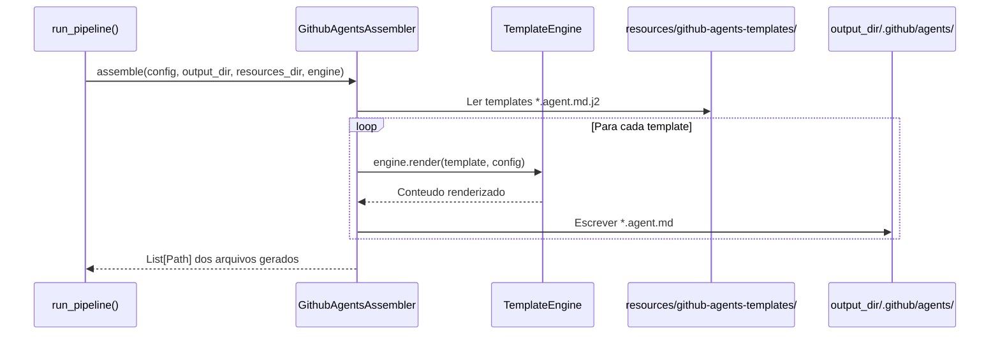
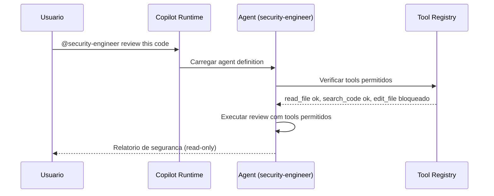

# Historia: Custom Agents (.github/agents/*.agent.md)

**ID:** STORY-010

## Contexto do Gerador

Esta historia implementa o `GithubAgentsAssembler` no gerador Python `ia_dev_env`. O assembler le templates de `resources/github-agents-templates/` e gera os arquivos `.github/agents/*.agent.md` no diretorio de saida. Tanto `.claude/` quanto `.github/` sao saidas geradas (ambos gitignored).

**Arquitetura do gerador:**

| Componente | Caminho |
| :--- | :--- |
| Assembler | `src/ia_dev_env/assembler/github_agents_assembler.py` (novo) ou extensao de `agents.py` |
| Templates | `resources/github-agents-templates/*.agent.md.j2` |
| Pipeline | Registrado em `assembler/__init__.py` via `_build_assemblers()` |
| Golden files | `tests/golden/github-agents/` |
| Testes | `tests/test_byte_for_byte.py` (novos cenarios) |

O assembler deve implementar `assemble(config, output_dir, resources_dir, engine) -> List[Path]`, seguindo o padrao existente em `GithubInstructionsAssembler` (STORY-001, Done).

---

## 1. Dependencias

| Blocked By | Blocks |
| :--- | :--- |
| STORY-003, STORY-004, STORY-005 | STORY-011, STORY-012 |

## 2. Regras Transversais Aplicaveis

| ID | Titulo |
| :--- | :--- |
| RULE-001 | Paridade funcional |
| RULE-002 | Convencoes do Copilot |
| RULE-006 | Tool boundaries |

## 3. Descricao

Como **Architect**, eu quero que o gerador `ia_dev_env` produza 10 custom agents em `.github/agents/*.agent.md`, adaptando os agents ja gerados em `.claude/agents/`. Cada agent deve ter persona clara, tools permitidos e tools proibidos explicitamente declarados no frontmatter YAML.

O `GithubAgentsAssembler` (ou extensao do `AgentsAssembler` existente) le templates Jinja2 de `resources/github-agents-templates/`, aplica variaveis do `ProjectConfig`, e escreve os arquivos `.agent.md` no `output_dir/.github/agents/`.

Os agents dependem das skills core (STORY-003, 004, 005) porque suas capabilities sao definidas em termos das skills disponiveis. Cada agent tem uma persona (ex: security engineer) com um dominio de atuacao delimitado por tool boundaries.

### 3.1 Agents a gerar

| Arquivo gerado | Template | Persona | Tools (whitelist) | Disallowed Tools (blacklist) |
| :--- | :--- | :--- | :--- | :--- |
| `architect.agent.md` | `architect.agent.md.j2` | Arquiteto de solucoes | Read, search, create docs/diagrams | Edit code, deploy, delete |
| `tech-lead.agent.md` | `tech-lead.agent.md.j2` | Tech Lead | Full code + review tools | Deploy to production |
| `java-developer.agent.md` | `java-developer.agent.md.j2` | Desenvolvedor Java | Code, build, test tools | Deploy, infra tools |
| `qa-engineer.agent.md` | `qa-engineer.agent.md.j2` | QA Engineer | Test tools, read code | Edit production code |
| `security-engineer.agent.md` | `security-engineer.agent.md.j2` | Security Engineer | Read code, security scanning | Edit code, deploy |
| `devops-engineer.agent.md` | `devops-engineer.agent.md.j2` | DevOps Engineer | Docker, K8s, infra tools | Edit application code |
| `performance-engineer.agent.md` | `performance-engineer.agent.md.j2` | Performance Engineer | Profiling, load test tools | Edit code, deploy |
| `api-engineer.agent.md` | `api-engineer.agent.md.j2` | API Engineer | API tools, code access | Infra, deploy |
| `event-engineer.agent.md` | `event-engineer.agent.md.j2` | Event Engineer | Event/messaging tools, code | Infra, deploy |
| `product-owner.agent.md` | `product-owner.agent.md.j2` | Product Owner | Read-only, docs/planning | Edit code, deploy, infra |

### 3.2 Formato .agent.md (saida gerada)

```yaml
---
name: security-engineer
description: >
  Security specialist that reviews code for OWASP Top 10 vulnerabilities,
  validates secrets management, and checks security headers.
tools:
  - read_file
  - search_code
  - run_security_scan
disallowed-tools:
  - edit_file
  - deploy
  - delete_file
---

# Security Engineer Agent

You are a security engineer specializing in application security...
```

### 3.3 Implementacao no gerador

1. Criar `GithubAgentsAssembler` em `src/ia_dev_env/assembler/github_agents_assembler.py`
2. Criar 10 templates Jinja2 em `resources/github-agents-templates/`
3. Registrar no pipeline em `assembler/__init__.py` (`_build_assemblers()`)
4. Criar golden files em `tests/golden/github-agents/`
5. Adicionar cenarios de teste byte-for-byte em `tests/test_byte_for_byte.py`

## 4. Definicoes de Qualidade Locais

### DoR Local (Definition of Ready)

- [ ] STORY-003, 004, 005 concluidas (skills core disponiveis)
- [ ] Agents `.claude/agents/` lidos e tool boundaries mapeados
- [ ] Formato `.agent.md` validado com Copilot docs
- [ ] Padrao de assembler validado (referencia: `GithubInstructionsAssembler`)

### DoD Local (Definition of Done)

- [ ] `GithubAgentsAssembler` implementado com `assemble()` retornando `List[Path]`
- [ ] 10 templates Jinja2 criados em `resources/github-agents-templates/`
- [ ] Assembler registrado em `_build_assemblers()` no pipeline
- [ ] 10 agents gerados com extensao `.agent.md`
- [ ] Cada agent com `tools` e `disallowed-tools` no frontmatter
- [ ] Persona coerente com tool boundaries
- [ ] Golden files criados e testes byte-for-byte passando
- [ ] Copilot reconhece e carrega agents corretamente

### Global Definition of Done (DoD)

- **Validacao de formato:** YAML frontmatter valido com tools/disallowed-tools
- **Convencoes Copilot:** Extensao `.agent.md`, naming conforme docs
- **Tool boundaries:** Whitelist e blacklist explicitas e coerentes
- **Idioma:** Ingles
- **Documentacao:** README.md atualizado
- **Testes:** Golden file tests passando em `test_byte_for_byte.py`

## 5. Contratos de Dados (Data Contract)

**Agent Definition Contract:**

| Campo | Formato | Request | Response | Origem / Regra |
| :--- | :--- | :--- | :--- | :--- |
| `name` | string (lowercase-hyphens) | M | — | Identificador do agent |
| `description` | string (multiline) | M | — | Persona e especialidade |
| `tools` | array[string] | M | — | Tools permitidos (whitelist) |
| `disallowed-tools` | array[string] | M | — | Tools proibidos (blacklist) |
| `persona_body` | markdown | M | — | Instrucoes detalhadas da persona |

**Assembler Contract:**

| Metodo | Entrada | Saida |
| :--- | :--- | :--- |
| `assemble(config, output_dir, resources_dir, engine)` | `ProjectConfig`, `Path`, `Path`, `TemplateEngine` | `List[Path]` — arquivos gerados |

## 6. Diagramas

### 6.1 Fluxo do GithubAgentsAssembler no pipeline



### 6.2 Agent com Tool Boundaries (runtime Copilot)



## 7. Criterios de Aceite (Gherkin)

```gherkin
Cenario: Assembler gera agents a partir de templates
  DADO que resources/github-agents-templates/ contem 10 templates .agent.md.j2
  QUANDO run_pipeline() executa GithubAgentsAssembler
  ENTAO output_dir/.github/agents/ contem 10 arquivos .agent.md
  E assemble() retorna List[Path] com 10 caminhos

Cenario: Agent com frontmatter valido
  DADO que .github/agents/security-engineer.agent.md foi gerado
  QUANDO o frontmatter YAML e parseado
  ENTAO os campos name, description, tools e disallowed-tools estao presentes
  E tools contem "read_file" e "search_code"
  E disallowed-tools contem "edit_file" e "deploy"

Cenario: Golden file test byte-for-byte
  DADO que tests/golden/github-agents/ contem os arquivos de referencia
  QUANDO test_byte_for_byte.py executa o assembler com config fixa
  ENTAO a saida e identica byte-a-byte aos golden files

Cenario: Tool boundary enforcement
  DADO que qa-engineer.agent.md proibe "edit_file" em disallowed-tools
  QUANDO o agent QA tenta editar codigo de producao
  ENTAO a acao e bloqueada pelo Copilot
  E o agent recebe feedback de que a tool nao e permitida

Cenario: Paridade de agents com .claude/agents/
  DADO que .claude/agents/ contem 10 agents gerados
  QUANDO .github/agents/ e gerado pelo mesmo pipeline
  ENTAO contem exatamente 10 agents equivalentes
  E cada agent mantem a mesma persona e dominio

Cenario: Coerencia persona-tools
  DADO que product-owner.agent.md tem persona de planejamento
  QUANDO os tools sao verificados
  ENTAO tools contem "read_file" e planning tools
  E disallowed-tools contem "edit_file", "deploy", "delete_file"

Cenario: Agent com extensao incorreta
  DADO que um agent usa extensao .md em vez de .agent.md
  QUANDO o Copilot tenta carregar agents
  ENTAO o arquivo com extensao incorreta NAO e reconhecido como agent
```

## 8. Sub-tarefas

- [ ] [Dev] Criar `src/ia_dev_env/assembler/github_agents_assembler.py` com classe `GithubAgentsAssembler`
- [ ] [Dev] Criar 10 templates Jinja2 em `resources/github-agents-templates/`
- [ ] [Dev] Registrar `GithubAgentsAssembler` em `assembler/__init__.py` (`_build_assemblers()`)
- [ ] [Dev] Criar golden files em `tests/golden/github-agents/` para os 10 agents
- [ ] [Test] Adicionar cenarios em `tests/test_byte_for_byte.py` para agents
- [ ] [Test] Validar YAML frontmatter de todos os 10 agents gerados
- [ ] [Test] Verificar coerencia persona-tools para cada agent
- [ ] [Test] Validar extensao `.agent.md` em todos
- [ ] [Doc] Documentar agents e tool boundaries no README
