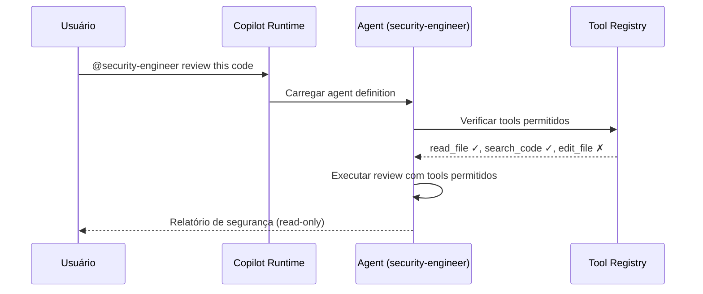

# História: Custom Agents (.github/agents/*.agent.md)

**ID:** STORY-010

## 1. Dependências

| Blocked By | Blocks |
| :--- | :--- |
| STORY-003, STORY-004, STORY-005 | STORY-011, STORY-012 |

## 2. Regras Transversais Aplicáveis

| ID | Título |
| :--- | :--- |
| RULE-001 | Paridade funcional |
| RULE-002 | Convenções do Copilot |
| RULE-006 | Tool boundaries |

## 3. Descrição

Como **Architect**, eu quero adaptar os 10 custom agents de `.claude/agents/` para `.github/agents/*.agent.md`, garantindo que cada agente tenha persona clara, tools permitidos e tools proibidos explicitamente declarados no frontmatter YAML.

Os agents dependem das skills core (STORY-003, 004, 005) porque suas capabilities são definidas em termos das skills disponíveis. Cada agent tem uma persona (ex: security engineer) com um domínio de atuação delimitado por tool boundaries.

### 3.1 Agents a criar

| Arquivo | Persona | Tools (whitelist) | Disallowed Tools (blacklist) |
| :--- | :--- | :--- | :--- |
| `architect.agent.md` | Arquiteto de soluções | Read, search, create docs/diagrams | Edit code, deploy, delete |
| `tech-lead.agent.md` | Tech Lead | Full code + review tools | Deploy to production |
| `java-developer.agent.md` | Desenvolvedor Java | Code, build, test tools | Deploy, infra tools |
| `qa-engineer.agent.md` | QA Engineer | Test tools, read code | Edit production code |
| `security-engineer.agent.md` | Security Engineer | Read code, security scanning | Edit code, deploy |
| `devops-engineer.agent.md` | DevOps Engineer | Docker, K8s, infra tools | Edit application code |
| `performance-engineer.agent.md` | Performance Engineer | Profiling, load test tools | Edit code, deploy |
| `api-engineer.agent.md` | API Engineer | API tools, code access | Infra, deploy |
| `event-engineer.agent.md` | Event Engineer | Event/messaging tools, code | Infra, deploy |
| `product-owner.agent.md` | Product Owner | Read-only, docs/planning | Edit code, deploy, infra |

### 3.2 Formato .agent.md

```yaml
---
name: security-engineer
description: >
  Security specialist that reviews code for OWASP Top 10 vulnerabilities,
  validates secrets management, and checks security headers.
tools:
  - read_file
  - search_code
  - run_security_scan
disallowed-tools:
  - edit_file
  - deploy
  - delete_file
---

# Security Engineer Agent

You are a security engineer specializing in application security...
```

## 4. Definições de Qualidade Locais

### DoR Local (Definition of Ready)

- [ ] STORY-003, 004, 005 concluídas (skills core disponíveis)
- [ ] Agents `.claude/agents/` lidos e tool boundaries mapeados
- [ ] Formato `.agent.md` validado com Copilot docs

### DoD Local (Definition of Done)

- [ ] 10 agents criados com extensão `.agent.md`
- [ ] Cada agent com `tools` e `disallowed-tools` no frontmatter
- [ ] Persona coerente com tool boundaries
- [ ] Copilot reconhece e carrega agents corretamente

### Global Definition of Done (DoD)

- **Validação de formato:** YAML frontmatter válido com tools/disallowed-tools
- **Convenções Copilot:** Extensão `.agent.md`, naming conforme docs
- **Tool boundaries:** Whitelist e blacklist explícitas e coerentes
- **Idioma:** Inglês
- **Documentação:** README.md atualizado

## 5. Contratos de Dados (Data Contract)

**Agent Definition Contract:**

| Campo | Formato | Request | Response | Origem / Regra |
| :--- | :--- | :--- | :--- | :--- |
| `name` | string (lowercase-hyphens) | M | — | Identificador do agent |
| `description` | string (multiline) | M | — | Persona e especialidade |
| `tools` | array[string] | M | — | Tools permitidos (whitelist) |
| `disallowed-tools` | array[string] | M | — | Tools proibidos (blacklist) |
| `persona_body` | markdown | M | — | Instruções detalhadas da persona |

## 6. Diagramas

### 6.1 Agent com Tool Boundaries



## 7. Critérios de Aceite (Gherkin)

```gherkin
Cenario: Agent com frontmatter válido
  DADO que .github/agents/security-engineer.agent.md foi criado
  QUANDO o frontmatter YAML é parseado
  ENTÃO os campos name, description, tools e disallowed-tools estão presentes
  E tools contém "read_file" e "search_code"
  E disallowed-tools contém "edit_file" e "deploy"

Cenario: Tool boundary enforcement
  DADO que qa-engineer.agent.md proíbe "edit_file" em disallowed-tools
  QUANDO o agent QA tenta editar código de produção
  ENTÃO a ação é bloqueada pelo Copilot
  E o agent recebe feedback de que a tool não é permitida

Cenario: Paridade de agents com .claude/agents/
  DADO que .claude/agents/ contém 10 agents
  QUANDO .github/agents/ é criado
  ENTÃO contém exatamente 10 agents equivalentes
  E cada agent mantém a mesma persona e domínio

Cenario: Coerência persona-tools
  DADO que product-owner.agent.md tem persona de planejamento
  QUANDO os tools são verificados
  ENTÃO tools contém "read_file" e planning tools
  E disallowed-tools contém "edit_file", "deploy", "delete_file"

Cenario: Agent com extensão incorreta
  DADO que um agent usa extensão .md em vez de .agent.md
  QUANDO o Copilot tenta carregar agents
  ENTÃO o arquivo com extensão incorreta NÃO é reconhecido como agent
```

## 8. Sub-tarefas

- [ ] [Dev] Criar `.github/agents/architect.agent.md`
- [ ] [Dev] Criar `.github/agents/tech-lead.agent.md`
- [ ] [Dev] Criar `.github/agents/java-developer.agent.md`
- [ ] [Dev] Criar `.github/agents/qa-engineer.agent.md`
- [ ] [Dev] Criar `.github/agents/security-engineer.agent.md`
- [ ] [Dev] Criar `.github/agents/devops-engineer.agent.md`
- [ ] [Dev] Criar `.github/agents/performance-engineer.agent.md`
- [ ] [Dev] Criar `.github/agents/api-engineer.agent.md`
- [ ] [Dev] Criar `.github/agents/event-engineer.agent.md`
- [ ] [Dev] Criar `.github/agents/product-owner.agent.md`
- [ ] [Test] Validar YAML frontmatter de todos os 10 agents
- [ ] [Test] Verificar coerência persona-tools para cada agent
- [ ] [Test] Validar extensão `.agent.md` em todos
- [ ] [Doc] Documentar agents e tool boundaries no README
