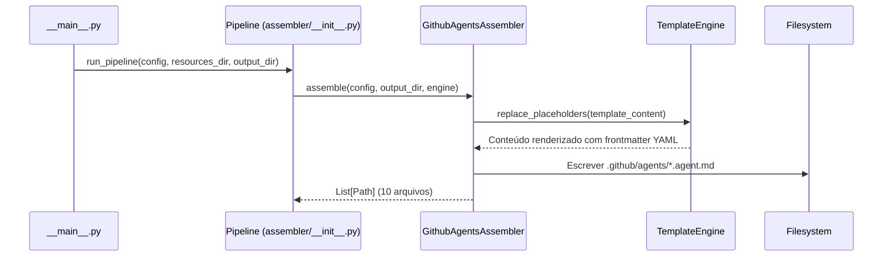
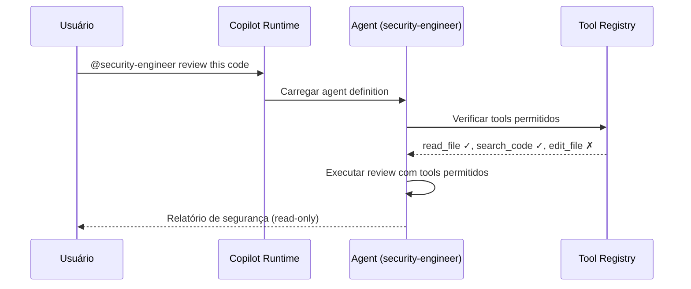

# História: Custom Agents (.github/agents/*.agent.md)

**ID:** STORY-010

## 1. Dependências

| Blocked By | Blocks |
| :--- | :--- |
| STORY-003, STORY-004, STORY-005 | STORY-011, STORY-012 |

## 2. Regras Transversais Aplicáveis

| ID | Título |
| :--- | :--- |
| RULE-001 | Paridade funcional |
| RULE-002 | Convenções do Copilot |
| RULE-006 | Tool boundaries |

## 3. Descrição

Como **Architect**, eu quero que o gerador `claude_setup` produza 10 custom agents em `.github/agents/*.agent.md`, garantindo que cada agente tenha persona clara, tools permitidos e tools proibidos explicitamente declarados no frontmatter YAML.

Os agents dependem das skills core (STORY-003, 004, 005) porque suas capabilities são definidas em termos das skills disponíveis. Cada agent tem uma persona (ex: security engineer) com um domínio de atuação delimitado por tool boundaries.

### 3.1 Contexto Técnico (Gerador)

O `claude_setup` já possui o `AgentsAssembler` (`src/claude_setup/assembler/agents.py`) que gera agents para `.claude/agents/`. Este assembler implementa `assemble(config, output_dir, resources_dir, engine) -> List[Path]` e utiliza templates de `resources/agents-templates/` com subdirectories `core/`, `conditional/`, `developers/` e `checklists/`.

Para gerar `.github/agents/*.agent.md`, a implementação deve:

1. **Criar `GithubAgentsAssembler`** em `src/claude_setup/assembler/github_agents_assembler.py` (ou estender `AgentsAssembler`) — seguindo o mesmo padrão de `GithubInstructionsAssembler` (STORY-001)
2. **Criar templates** em `resources/github-agents-templates/` com frontmatter YAML contendo `name`, `description`, `tools` e `disallowed-tools`
3. **Registrar** o novo assembler em `assembler/__init__.py` → `_build_assemblers()`
4. **Usar `TemplateEngine`** para substituir `{placeholder}` nos templates com valores de `ProjectConfig`
5. **Extensão `.agent.md`** — o assembler deve garantir que todos os arquivos gerados usem esta extensão (diferente de `.claude/agents/` que usa `.md`)

### 3.2 Agents a gerar

| Arquivo | Persona | Tools (whitelist) | Disallowed Tools (blacklist) |
| :--- | :--- | :--- | :--- |
| `architect.agent.md` | Arquiteto de soluções | Read, search, create docs/diagrams | Edit code, deploy, delete |
| `tech-lead.agent.md` | Tech Lead | Full code + review tools | Deploy to production |
| `java-developer.agent.md` | Desenvolvedor Java | Code, build, test tools | Deploy, infra tools |
| `qa-engineer.agent.md` | QA Engineer | Test tools, read code | Edit production code |
| `security-engineer.agent.md` | Security Engineer | Read code, security scanning | Edit code, deploy |
| `devops-engineer.agent.md` | DevOps Engineer | Docker, K8s, infra tools | Edit application code |
| `performance-engineer.agent.md` | Performance Engineer | Profiling, load test tools | Edit code, deploy |
| `api-engineer.agent.md` | API Engineer | API tools, code access | Infra, deploy |
| `event-engineer.agent.md` | Event Engineer | Event/messaging tools, code | Infra, deploy |
| `product-owner.agent.md` | Product Owner | Read-only, docs/planning | Edit code, deploy, infra |

### 3.3 Formato .agent.md (template em `resources/github-agents-templates/`)

```yaml
---
name: security-engineer
description: >
  Security specialist that reviews code for OWASP Top 10 vulnerabilities,
  validates secrets management, and checks security headers.
tools:
  - read_file
  - search_code
  - run_security_scan
disallowed-tools:
  - edit_file
  - deploy
  - delete_file
---

# Security Engineer Agent

You are a security engineer specializing in application security...
```

## 4. Definições de Qualidade Locais

### DoR Local (Definition of Ready)

- [ ] STORY-003, 004, 005 concluídas (skills core disponíveis)
- [ ] Agents `.claude/agents/` lidos e tool boundaries mapeados
- [ ] Formato `.agent.md` validado com Copilot docs
- [ ] `AgentsAssembler` existente analisado para reuso de lógica condicional

### DoD Local (Definition of Done)

- [ ] `GithubAgentsAssembler` gera 10 agents com extensão `.agent.md`
- [ ] Cada agent com `tools` e `disallowed-tools` no frontmatter
- [ ] Persona coerente com tool boundaries
- [ ] Assembler registrado no pipeline (`_build_assemblers()`)
- [ ] Golden files regenerados e passando em `test_byte_for_byte.py`
- [ ] Contagem atualizada em `test_pipeline.py`

### Global Definition of Done (DoD)

- **Validação de formato:** YAML frontmatter válido com tools/disallowed-tools
- **Convenções Copilot:** Extensão `.agent.md`, naming conforme docs
- **Tool boundaries:** Whitelist e blacklist explícitas e coerentes
- **Idioma:** Inglês
- **Documentação:** README.md atualizado
- **Testes:** Golden files + pipeline tests passando

## 5. Contratos de Dados (Data Contract)

**Agent Definition Contract:**

| Campo | Formato | Request | Response | Origem / Regra |
| :--- | :--- | :--- | :--- | :--- |
| `name` | string (lowercase-hyphens) | M | — | Identificador do agent |
| `description` | string (multiline) | M | — | Persona e especialidade |
| `tools` | array[string] | M | — | Tools permitidos (whitelist) |
| `disallowed-tools` | array[string] | M | — | Tools proibidos (blacklist) |
| `persona_body` | markdown | M | — | Instruções detalhadas da persona |

## 6. Diagramas

### 6.1 Fluxo do Gerador para Agents



### 6.2 Agent com Tool Boundaries (runtime)



## 7. Critérios de Aceite (Gherkin)

```gherkin
Cenario: Gerador produz 10 agents com extensão .agent.md
  DADO que o pipeline é executado com config padrão
  QUANDO GithubAgentsAssembler.assemble() é chamado
  ENTÃO 10 arquivos são gerados em output_dir/github/agents/
  E todos possuem extensão ".agent.md"

Cenario: Agent gerado com frontmatter YAML válido
  DADO que o gerador produziu security-engineer.agent.md
  QUANDO o frontmatter YAML é parseado
  ENTÃO os campos name, description, tools e disallowed-tools estão presentes
  E tools contém "read_file" e "search_code"
  E disallowed-tools contém "edit_file" e "deploy"

Cenario: Golden files correspondem byte a byte
  DADO que golden files existem em tests/golden/github/agents/
  QUANDO test_byte_for_byte.py é executado
  ENTÃO cada agent gerado é idêntico ao golden file correspondente

Cenario: Pipeline contabiliza agents gerados
  DADO que o pipeline completo é executado
  QUANDO PipelineResult.files_generated é verificado
  ENTÃO a contagem inclui os 10 agents de .github/agents/

Cenario: Coerência persona-tools no template
  DADO que o template de product-owner.agent.md está em resources/
  QUANDO o TemplateEngine renderiza o template
  ENTÃO tools contém "read_file" e planning tools
  E disallowed-tools contém "edit_file", "deploy", "delete_file"

Cenario: Placeholders são substituídos nos agents gerados
  DADO que o template contém {LANGUAGE_NAME} e {FRAMEWORK_NAME}
  QUANDO o TemplateEngine processa o template
  ENTÃO os placeholders são substituídos por valores de ProjectConfig
```

## 8. Sub-tarefas

- [ ] [Dev] Criar `GithubAgentsAssembler` em `src/claude_setup/assembler/github_agents_assembler.py`
- [ ] [Dev] Criar templates de agent em `resources/github-agents-templates/` (10 arquivos `.agent.md`)
- [ ] [Dev] Implementar lógica de frontmatter YAML com `tools` / `disallowed-tools`
- [ ] [Dev] Registrar assembler no pipeline (`assembler/__init__.py` → `_build_assemblers()`)
- [ ] [Dev] Adicionar classificação "GitHub Agents" em `__main__.py` → `_classify_files()`
- [ ] [Test] Testes unitários para os 10 agents gerados (frontmatter, extensão, conteúdo)
- [ ] [Test] Regenerar golden files em `tests/golden/github/agents/`
- [ ] [Test] Atualizar contagem esperada em `test_pipeline.py`
