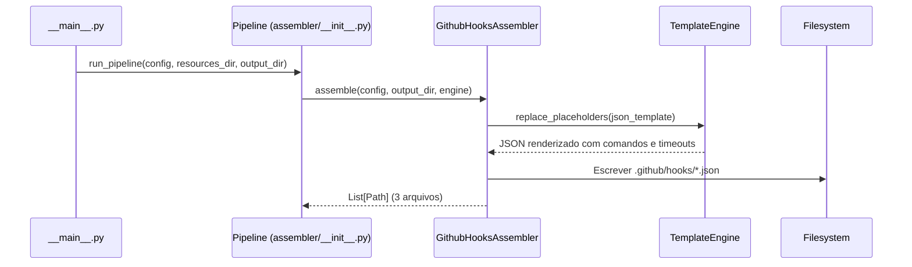

# História: Hooks (.github/hooks/*.json)

**ID:** STORY-011

## 1. Dependências

| Blocked By | Blocks |
| :--- | :--- |
| STORY-010 | STORY-013 |

## 2. Regras Transversais Aplicáveis

| ID | Título |
| :--- | :--- |
| RULE-001 | Paridade funcional |
| RULE-002 | Convenções do Copilot |
| RULE-007 | Consistência de hooks |

## 3. Descrição

Como **DevOps Engineer**, eu quero que o gerador `claude_setup` produza `.github/hooks/*.json` com hooks determinísticos em formato JSON, garantindo que os mesmos pontos de verificação cobertos por `.claude/hooks/post-compile-check.sh` existam no Copilot, além de hooks adicionais para lint e context loading.

Os hooks dependem dos agents (STORY-010) porque executam no workflow dos agents. O formato JSON substitui os shell scripts diretos usados no Claude Code, seguindo as convenções do Copilot.

### 3.1 Contexto Técnico (Gerador)

O `claude_setup` já possui o `HooksAssembler` (`src/claude_setup/assembler/hooks_assembler.py`) que gera hooks para `.claude/hooks/`. Este assembler copia shell scripts de `resources/hooks-templates/{key}/post-compile-check.sh` com base no mapeamento `get_hook_template_key(language, build_tool)`.

Para gerar `.github/hooks/*.json`, a implementação deve:

1. **Criar `GithubHooksAssembler`** em `src/claude_setup/assembler/github_hooks_assembler.py` (ou estender `HooksAssembler`) — seguindo o padrão de `GithubInstructionsAssembler`
2. **Criar templates JSON** em `resources/github-hooks-templates/` — cada template contém a estrutura JSON com `hooks[]` array
3. **Registrar** o novo assembler em `assembler/__init__.py` → `_build_assemblers()`
4. **Usar `TemplateEngine`** para substituir `{placeholder}` nos templates JSON (ex: `{BUILD_COMMAND}`, `{TIMEOUT}`)
5. **JSON válido** — o assembler deve garantir que os arquivos gerados são parseáveis como JSON

### 3.2 Hooks a gerar

| Hook | Event | Matcher | Comando | Timeout |
| :--- | :--- | :--- | :--- | :--- |
| post-compile-check | postToolUse | `{ "tool": "edit_file" }` | `scripts/post-compile-check.sh` | 60000ms |
| pre-commit-lint | preToolUse | `{ "tool": "git_commit" }` | `scripts/pre-commit-lint.sh` | 30000ms |
| session-context-loader | sessionStart | — | `scripts/load-context.sh` | 10000ms |

### 3.3 Formato JSON (template em `resources/github-hooks-templates/`)

```json
{
  "hooks": [
    {
      "event": "postToolUse",
      "matcher": { "tool": "edit_file" },
      "command": "scripts/post-compile-check.sh",
      "timeout": 60000,
      "description": "Verify compilation after file edits"
    }
  ]
}
```

### 3.4 Paridade com .claude/hooks/

- `post-compile-check.sh` existe em `.claude/hooks/` e o assembler existente (`HooksAssembler`) já gera esse script
- O `GithubHooksAssembler` gera a **definição JSON** que referencia esse script, não duplica o script
- Hooks adicionais (lint, session) expandem a cobertura

## 4. Definições de Qualidade Locais

### DoR Local (Definition of Ready)

- [ ] STORY-010 concluída (agents disponíveis)
- [ ] `HooksAssembler` existente analisado para entender lógica condicional
- [ ] Formato JSON de hooks validado com Copilot docs

### DoD Local (Definition of Done)

- [ ] `GithubHooksAssembler` gera 3 hooks em formato JSON válido
- [ ] post-compile-check referencia o mesmo script funcional de `.claude/hooks/`
- [ ] Timeouts configurados e documentados
- [ ] Assembler registrado no pipeline (`_build_assemblers()`)
- [ ] Golden files regenerados e passando em `test_byte_for_byte.py`
- [ ] Contagem atualizada em `test_pipeline.py`

### Global Definition of Done (DoD)

- **Validação de formato:** JSON válido e parseável
- **Convenções Copilot:** Event types válidos, matcher correto
- **Consistência:** Paridade com hooks `.claude/` existentes
- **Performance:** Timeouts ≤ 60s
- **Documentação:** README.md atualizado
- **Testes:** Golden files + pipeline tests passando

## 5. Contratos de Dados (Data Contract)

**Hook Definition Contract:**

| Campo | Formato | Request | Response | Origem / Regra |
| :--- | :--- | :--- | :--- | :--- |
| `hooks[].event` | enum(sessionStart, postToolUse, preToolUse, etc.) | M | — | Tipo de evento |
| `hooks[].matcher` | object | O | — | Filtro de tool/evento |
| `hooks[].command` | string (path) | M | — | Script a executar |
| `hooks[].timeout` | integer (ms) | M | — | Timeout máximo (≤ 60000) |
| `hooks[].description` | string | M | — | Descrição do propósito |

## 6. Diagramas

### 6.1 Fluxo do Gerador para Hooks



### 6.2 Hook post-compile-check (runtime)


## 7. Critérios de Aceite (Gherkin)

```gherkin
Cenario: Gerador produz 3 hooks em formato JSON
  DADO que o pipeline é executado com config padrão
  QUANDO GithubHooksAssembler.assemble() é chamado
  ENTÃO 3 arquivos JSON são gerados em output_dir/github/hooks/
  E cada arquivo é parseável como JSON válido

Cenario: Hook gerado contém estrutura correta
  DADO que o gerador produziu post-compile-check.json
  QUANDO o JSON é parseado
  ENTÃO o array "hooks" contém pelo menos 1 hook
  E o hook possui campos event, command, timeout e description

Cenario: Golden files correspondem byte a byte
  DADO que golden files existem em tests/golden/github/hooks/
  QUANDO test_byte_for_byte.py é executado
  ENTÃO cada hook JSON gerado é idêntico ao golden file correspondente

Cenario: Paridade com hook .claude existente
  DADO que HooksAssembler já gera post-compile-check.sh para .claude/hooks/
  QUANDO GithubHooksAssembler gera o equivalente JSON
  ENTÃO o campo command referencia o mesmo script ou equivalente funcional
  E o timeout é ≤ 60000ms

Cenario: Pipeline contabiliza hooks gerados
  DADO que o pipeline completo é executado
  QUANDO PipelineResult.files_generated é verificado
  ENTÃO a contagem inclui os 3 hooks de .github/hooks/
```

## 8. Sub-tarefas

- [ ] [Dev] Criar `GithubHooksAssembler` em `src/claude_setup/assembler/github_hooks_assembler.py`
- [ ] [Dev] Criar templates JSON em `resources/github-hooks-templates/` (3 arquivos)
- [ ] [Dev] Implementar lógica condicional baseada em `get_hook_template_key()` para post-compile-check
- [ ] [Dev] Registrar assembler no pipeline (`assembler/__init__.py` → `_build_assemblers()`)
- [ ] [Dev] Adicionar classificação "GitHub Hooks" em `__main__.py` → `_classify_files()`
- [ ] [Test] Testes unitários para os 3 hooks JSON gerados (estrutura, event types, timeouts)
- [ ] [Test] Regenerar golden files em `tests/golden/github/hooks/`
- [ ] [Test] Atualizar contagem esperada em `test_pipeline.py`
