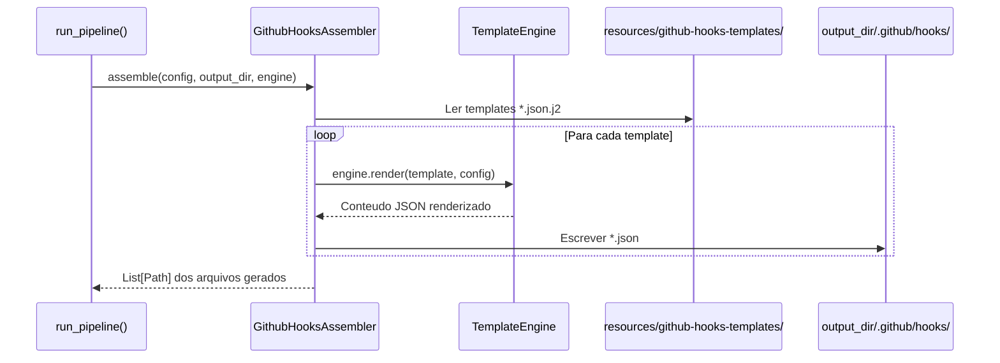
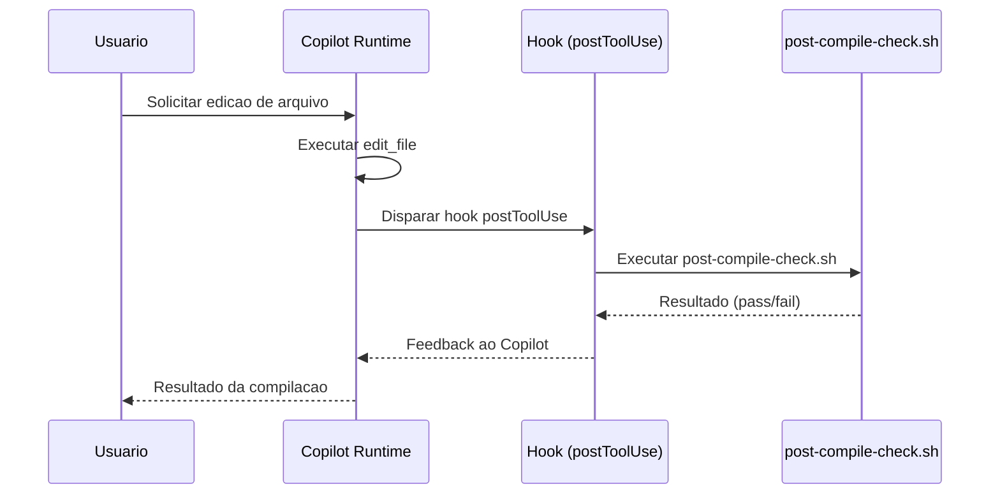

# Historia: Hooks (.github/hooks/*.json)

**ID:** STORY-011

## Contexto do Gerador

Esta historia implementa o `GithubHooksAssembler` no gerador Python `ia_dev_env`. O assembler le templates de `resources/github-hooks-templates/` e gera os arquivos `.github/hooks/*.json` no diretorio de saida. Tanto `.claude/` quanto `.github/` sao saidas geradas (ambos gitignored).

**Arquitetura do gerador:**

| Componente | Caminho |
| :--- | :--- |
| Assembler | `src/ia_dev_env/assembler/github_hooks_assembler.py` (novo) ou extensao de `hooks_assembler.py` |
| Templates | `resources/github-hooks-templates/*.json.j2` |
| Pipeline | Registrado em `assembler/__init__.py` via `_build_assemblers()` |
| Golden files | `tests/golden/github-hooks/` |
| Testes | `tests/test_byte_for_byte.py` (novos cenarios) |

O assembler deve implementar `assemble(config, output_dir, engine) -> List[Path]`, seguindo o padrao existente em `GithubInstructionsAssembler` (STORY-001, Done).

---

## 1. Dependencias

| Blocked By | Blocks |
| :--- | :--- |
| STORY-010 | STORY-013 |

## 2. Regras Transversais Aplicaveis

| ID | Titulo |
| :--- | :--- |
| RULE-001 | Paridade funcional |
| RULE-002 | Convencoes do Copilot |
| RULE-007 | Consistencia de hooks |

## 3. Descricao

Como **DevOps Engineer**, eu quero que o gerador `ia_dev_env` produza `.github/hooks/*.json` com hooks deterministicos em formato JSON, garantindo que os mesmos pontos de verificacao cobertos pelos hooks gerados em `.claude/hooks/` existam tambem na saida `.github/`, alem de hooks adicionais para lint e context loading.

O `GithubHooksAssembler` (ou extensao do `HooksAssembler` existente em `hooks_assembler.py`) le templates Jinja2 de `resources/github-hooks-templates/`, aplica variaveis do `ProjectConfig`, e escreve os arquivos JSON no `output_dir/.github/hooks/`.

Os hooks dependem dos agents (STORY-010) porque executam no workflow dos agents. O formato JSON substitui os shell scripts diretos usados no Claude Code, seguindo as convencoes do Copilot.

### 3.1 Hooks a gerar

| Hook | Template | Event | Matcher | Comando | Timeout |
| :--- | :--- | :--- | :--- | :--- | :--- |
| post-compile-check | `post-compile-check.json.j2` | postToolUse | `{ "tool": "edit_file" }` | `scripts/post-compile-check.sh` | 60000ms |
| pre-commit-lint | `pre-commit-lint.json.j2` | preToolUse | `{ "tool": "git_commit" }` | `scripts/pre-commit-lint.sh` | 30000ms |
| session-context-loader | `session-context-loader.json.j2` | sessionStart | — | `scripts/load-context.sh` | 10000ms |

### 3.2 Formato JSON (saida gerada)

```json
{
  "hooks": [
    {
      "event": "postToolUse",
      "matcher": { "tool": "edit_file" },
      "command": "scripts/post-compile-check.sh",
      "timeout": 60000,
      "description": "Verify compilation after file edits"
    }
  ]
}
```

### 3.3 Paridade com .claude/hooks/ (ambos gerados)

- `post-compile-check.sh` e gerado em `.claude/hooks/` pelo `HooksAssembler` e deve ter equivalente funcional em `.github/hooks/`
- Hooks adicionais expandem a cobertura para lint e session start
- Ambos os diretorios sao saidas do mesmo pipeline `run_pipeline()`

### 3.4 Implementacao no gerador

1. Criar `GithubHooksAssembler` em `src/ia_dev_env/assembler/github_hooks_assembler.py`
2. Criar 3 templates Jinja2 em `resources/github-hooks-templates/`
3. Registrar no pipeline em `assembler/__init__.py` (`_build_assemblers()`)
4. Criar golden files em `tests/golden/github-hooks/`
5. Adicionar cenarios de teste byte-for-byte em `tests/test_byte_for_byte.py`

## 4. Definicoes de Qualidade Locais

### DoR Local (Definition of Ready)

- [ ] STORY-010 concluida (agents disponiveis)
- [ ] Hook `.claude/hooks/post-compile-check.sh` (gerado) lido
- [ ] Formato JSON de hooks validado com Copilot docs
- [ ] Padrao de assembler validado (referencia: `GithubInstructionsAssembler`)

### DoD Local (Definition of Done)

- [ ] `GithubHooksAssembler` implementado com `assemble()` retornando `List[Path]`
- [ ] 3 templates Jinja2 criados em `resources/github-hooks-templates/`
- [ ] Assembler registrado em `_build_assemblers()` no pipeline
- [ ] 3 hooks gerados em formato JSON valido
- [ ] post-compile-check equivalente ao existente em .claude/hooks/ (ambos gerados)
- [ ] Timeouts configurados e documentados
- [ ] Golden files criados e testes byte-for-byte passando

### Global Definition of Done (DoD)

- **Validacao de formato:** JSON valido e parseavel
- **Convencoes Copilot:** Event types validos, matcher correto
- **Consistencia:** Paridade com hooks .claude/ gerados
- **Performance:** Timeouts <= 60s
- **Documentacao:** README.md atualizado
- **Testes:** Golden file tests passando em `test_byte_for_byte.py`

## 5. Contratos de Dados (Data Contract)

**Hook Definition Contract:**

| Campo | Formato | Request | Response | Origem / Regra |
| :--- | :--- | :--- | :--- | :--- |
| `hooks[].event` | enum(sessionStart, postToolUse, preToolUse, etc.) | M | — | Tipo de evento |
| `hooks[].matcher` | object | O | — | Filtro de tool/evento |
| `hooks[].command` | string (path) | M | — | Script a executar |
| `hooks[].timeout` | integer (ms) | M | — | Timeout maximo (<= 60000) |
| `hooks[].description` | string | M | — | Descricao do proposito |

**Assembler Contract:**

| Metodo | Entrada | Saida |
| :--- | :--- | :--- |
| `assemble(config, output_dir, engine)` | `ProjectConfig`, `Path`, `TemplateEngine` | `List[Path]` — arquivos gerados |

## 6. Diagramas

### 6.1 Fluxo do GithubHooksAssembler no pipeline



### 6.2 Fluxo de Hook post-compile-check (runtime Copilot)



## 7. Criterios de Aceite (Gherkin)

```gherkin
Cenario: Assembler gera hooks a partir de templates
  DADO que resources/github-hooks-templates/ contem 3 templates .json.j2
  QUANDO run_pipeline() executa GithubHooksAssembler
  ENTAO output_dir/.github/hooks/ contem 3 arquivos .json
  E assemble() retorna List[Path] com 3 caminhos

Cenario: Golden file test byte-for-byte
  DADO que tests/golden/github-hooks/ contem os arquivos de referencia
  QUANDO test_byte_for_byte.py executa o assembler com config fixa
  ENTAO a saida e identica byte-a-byte aos golden files

Cenario: JSON valido para hooks
  DADO que .github/hooks/post-compile-check.json foi gerado
  QUANDO um parser JSON processa o arquivo
  ENTAO o parse e bem-sucedido
  E o array "hooks" contem pelo menos 1 hook

Cenario: Hook post-compile-check dispara apos edit_file
  DADO que o hook esta configurado com event "postToolUse" e matcher "edit_file"
  QUANDO o Copilot executa uma edicao de arquivo
  ENTAO o hook post-compile-check.sh e executado
  E o resultado (pass/fail) e reportado ao Copilot

Cenario: Paridade com hook .claude gerado
  DADO que .claude/hooks/post-compile-check.sh e gerado pelo HooksAssembler
  QUANDO o hook equivalente e gerado em .github/hooks/ pelo GithubHooksAssembler
  ENTAO o comando referencia o mesmo script ou equivalente funcional
  E o timeout e <= 60000ms

Cenario: Hook com timeout excedido
  DADO que session-context-loader tem timeout de 10000ms
  QUANDO o script demora mais de 10 segundos
  ENTAO o hook e cancelado por timeout
  E o Copilot continua sem o contexto adicional

Cenario: Hook pre-commit-lint bloqueia commit invalido
  DADO que pre-commit-lint esta configurado com event "preToolUse" e matcher "git_commit"
  QUANDO o codigo tem violations de lint
  ENTAO o hook reporta falha
  E o commit e bloqueado ate correcao
```

## 8. Sub-tarefas

- [ ] [Dev] Criar `src/ia_dev_env/assembler/github_hooks_assembler.py` com classe `GithubHooksAssembler`
- [ ] [Dev] Criar template `resources/github-hooks-templates/post-compile-check.json.j2`
- [ ] [Dev] Criar template `resources/github-hooks-templates/pre-commit-lint.json.j2`
- [ ] [Dev] Criar template `resources/github-hooks-templates/session-context-loader.json.j2`
- [ ] [Dev] Registrar `GithubHooksAssembler` em `assembler/__init__.py` (`_build_assemblers()`)
- [ ] [Dev] Criar golden files em `tests/golden/github-hooks/`
- [ ] [Test] Adicionar cenarios em `tests/test_byte_for_byte.py` para hooks
- [ ] [Test] Validar JSON de todos os 3 hooks gerados
- [ ] [Test] Verificar event types e matchers validos
- [ ] [Test] Testar timeout de cada hook
- [ ] [Doc] Documentar hooks no README
