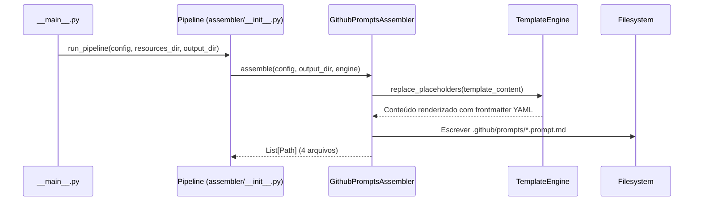

# História: Prompts de Composição (.github/prompts/*.prompt.md)

**ID:** STORY-012

## 1. Dependências

| Blocked By | Blocks |
| :--- | :--- |
| STORY-003, STORY-004, STORY-005, STORY-010 | STORY-013 |

## 2. Regras Transversais Aplicáveis

| ID | Título |
| :--- | :--- |
| RULE-001 | Paridade funcional |
| RULE-002 | Convenções do Copilot |
| RULE-004 | Idioma |
| RULE-005 | Progressive disclosure |

## 3. Descrição

Como **Product Owner Técnico**, eu quero que o gerador `claude_setup` produza 4 prompts em `.github/prompts/*.prompt.md` que orquestram workflows completos, garantindo que tarefas recorrentes (nova feature, decomposição de spec, code review, troubleshooting) possam ser executadas com menor fricção.

Os prompts são composições de alto nível que conectam skills e agents em fluxos end-to-end. Cada prompt tem YAML frontmatter com `name` e `description`, seguido do template de instruções.

### 3.1 Contexto Técnico (Gerador)

Não existe assembler equivalente para prompts em `.claude/` — este é um artefato novo exclusivo da estrutura `.github/`. A implementação segue o padrão estabelecido por `GithubInstructionsAssembler` (STORY-001).

Para gerar `.github/prompts/*.prompt.md`, a implementação deve:

1. **Criar `GithubPromptsAssembler`** em `src/claude_setup/assembler/github_prompts_assembler.py`
2. **Criar templates** em `resources/github-prompts-templates/` — cada template contém frontmatter YAML (`name`, `description`) seguido de corpo markdown com instruções do workflow
3. **Registrar** o novo assembler em `assembler/__init__.py` → `_build_assemblers()`
4. **Usar `TemplateEngine`** para substituir `{placeholder}` nos templates com valores de `ProjectConfig` (ex: `{LANGUAGE_NAME}`, `{FRAMEWORK_NAME}`)
5. **Extensão `.prompt.md`** — garantir naming convention do Copilot
6. **Adicionar classificação** "GitHub Prompts" em `__main__.py` → `_classify_files()`

### 3.2 Prompts a gerar

| Prompt | Baseado em | Skills orquestradas | Agents envolvidos |
| :--- | :--- | :--- | :--- |
| `new-feature.prompt.md` | Workflow de implementação | x-dev-lifecycle, x-dev-implement, x-review | java-developer, tech-lead |
| `decompose-spec.prompt.md` | Templates de epic/story | x-story-epic-full | product-owner, architect |
| `code-review.prompt.md` | Workflow de review | x-review, x-review-api, x-review-pr | tech-lead, security-engineer, qa-engineer |
| `troubleshoot.prompt.md` | Workflow de troubleshoot | x-ops-troubleshoot | java-developer |

### 3.3 Formato .prompt.md (template em `resources/github-prompts-templates/`)

```yaml
---
name: new-feature
description: >
  Orchestrates the complete feature implementation cycle: planning,
  layer-by-layer implementation, review, and PR creation.
---

# New Feature Implementation

Follow these steps to implement a new feature...
```

## 4. Definições de Qualidade Locais

### DoR Local (Definition of Ready)

- [ ] STORY-003, 004, 005, 010 concluídas (skills e agents disponíveis)
- [ ] Templates existentes em `resources/` analisados para padrão de frontmatter
- [ ] Formato `.prompt.md` validado com Copilot docs
- [ ] `GithubInstructionsAssembler` (STORY-001) analisado como referência de implementação

### DoD Local (Definition of Done)

- [ ] `GithubPromptsAssembler` gera 4 prompts com extensão `.prompt.md`
- [ ] Cada prompt com frontmatter YAML válido (`name`, `description`)
- [ ] Workflows referenciando skills e agents existentes
- [ ] Assembler registrado no pipeline (`_build_assemblers()`)
- [ ] Golden files regenerados e passando em `test_byte_for_byte.py`
- [ ] Contagem atualizada em `test_pipeline.py`

### Global Definition of Done (DoD)

- **Validação de formato:** YAML frontmatter válido
- **Convenções Copilot:** Extensão `.prompt.md`, naming conforme docs
- **Sem duplicação:** Orquestra skills/agents, não duplica conteúdo
- **Idioma:** Inglês
- **Documentação:** README.md atualizado
- **Testes:** Golden files + pipeline tests passando

## 5. Contratos de Dados (Data Contract)

**Prompt Composition Contract:**

| Campo | Formato | Request | Response | Origem / Regra |
| :--- | :--- | :--- | :--- | :--- |
| `frontmatter.name` | string (lowercase-hyphens) | M | — | Ex: `new-feature` |
| `frontmatter.description` | string (multiline) | M | — | Descrição do workflow |
| `orchestrated_skills` | array[string] | M | — | Skills ativadas pelo prompt |
| `involved_agents` | array[string] | O | — | Agents recomendados |

## 6. Diagramas

### 6.1 Fluxo do Gerador para Prompts



### 6.2 Prompt new-feature orquestrando skills (runtime)


## 7. Critérios de Aceite (Gherkin)

```gherkin
Cenario: Gerador produz 4 prompts com extensão .prompt.md
  DADO que o pipeline é executado com config padrão
  QUANDO GithubPromptsAssembler.assemble() é chamado
  ENTÃO 4 arquivos são gerados em output_dir/github/prompts/
  E todos possuem extensão ".prompt.md"

Cenario: Prompt gerado com frontmatter YAML válido
  DADO que o gerador produziu new-feature.prompt.md
  QUANDO o frontmatter YAML é parseado
  ENTÃO os campos name e description estão presentes
  E name é "new-feature" em lowercase-hyphens

Cenario: Golden files correspondem byte a byte
  DADO que golden files existem em tests/golden/github/prompts/
  QUANDO test_byte_for_byte.py é executado
  ENTÃO cada prompt gerado é idêntico ao golden file correspondente

Cenario: Prompt referencia skills existentes
  DADO que o template de code-review.prompt.md contém referências a skills
  QUANDO o conteúdo gerado é verificado
  ENTÃO referencia x-review, x-review-api e x-review-pr

Cenario: Pipeline contabiliza prompts gerados
  DADO que o pipeline completo é executado
  QUANDO PipelineResult.files_generated é verificado
  ENTÃO a contagem inclui os 4 prompts de .github/prompts/

Cenario: Placeholders são substituídos nos prompts gerados
  DADO que o template contém {LANGUAGE_NAME} e {FRAMEWORK_NAME}
  QUANDO o TemplateEngine processa o template
  ENTÃO os placeholders são substituídos por valores de ProjectConfig
```

## 8. Sub-tarefas

- [ ] [Dev] Criar `GithubPromptsAssembler` em `src/claude_setup/assembler/github_prompts_assembler.py`
- [ ] [Dev] Criar templates em `resources/github-prompts-templates/` (4 arquivos `.prompt.md`)
- [ ] [Dev] Implementar lógica de geração com frontmatter YAML e corpo markdown
- [ ] [Dev] Registrar assembler no pipeline (`assembler/__init__.py` → `_build_assemblers()`)
- [ ] [Dev] Adicionar classificação "GitHub Prompts" em `__main__.py` → `_classify_files()`
- [ ] [Test] Testes unitários para os 4 prompts gerados (frontmatter, extensão, referências)
- [ ] [Test] Regenerar golden files em `tests/golden/github/prompts/`
- [ ] [Test] Atualizar contagem esperada em `test_pipeline.py`
