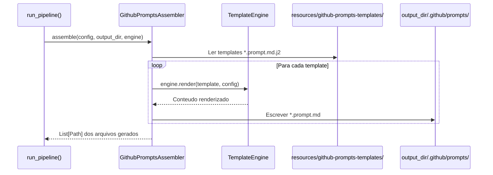
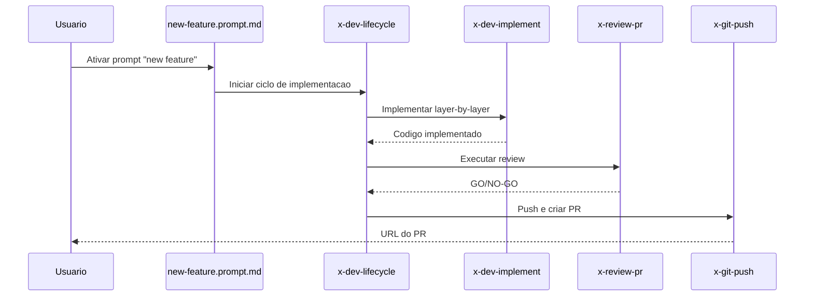

# Historia: Prompts de Composicao (.github/prompts/*.prompt.md)

**ID:** STORY-012

## Contexto do Gerador

Esta historia implementa o `GithubPromptsAssembler` no gerador Python `ia_dev_env`. Este assembler nao possui equivalente em `.claude/` — e exclusivo para a saida `.github/`. O assembler le templates de `resources/github-prompts-templates/` e gera os arquivos `.github/prompts/*.prompt.md` no diretorio de saida. Tanto `.claude/` quanto `.github/` sao saidas geradas (ambos gitignored).

**Arquitetura do gerador:**

| Componente | Caminho |
| :--- | :--- |
| Assembler | `src/ia_dev_env/assembler/github_prompts_assembler.py` (novo, sem equivalente `.claude/`) |
| Templates | `resources/github-prompts-templates/*.prompt.md.j2` |
| Pipeline | Registrado em `assembler/__init__.py` via `_build_assemblers()` |
| Golden files | `tests/golden/github-prompts/` |
| Testes | `tests/test_byte_for_byte.py` (novos cenarios) |

O assembler deve implementar `assemble(config, output_dir, engine) -> List[Path]`, seguindo o padrao existente em `GithubInstructionsAssembler` (STORY-001, Done).

---

## 1. Dependencias

| Blocked By | Blocks |
| :--- | :--- |
| STORY-003, STORY-004, STORY-005, STORY-010 | STORY-013 |

## 2. Regras Transversais Aplicaveis

| ID | Titulo |
| :--- | :--- |
| RULE-001 | Paridade funcional |
| RULE-002 | Convencoes do Copilot |
| RULE-004 | Idioma |
| RULE-005 | Progressive disclosure |

## 3. Descricao

Como **Product Owner Tecnico**, eu quero que o gerador `ia_dev_env` produza 4 prompts em `.github/prompts/*.prompt.md` que orquestram workflows completos, garantindo que tarefas recorrentes (nova feature, decomposicao de spec, code review, troubleshooting) possam ser executadas com menor friccao.

O `GithubPromptsAssembler` e um assembler novo sem equivalente no lado `.claude/`. Ele le templates Jinja2 de `resources/github-prompts-templates/`, aplica variaveis do `ProjectConfig`, e escreve os arquivos `.prompt.md` no `output_dir/.github/prompts/`.

Os prompts sao composicoes de alto nivel que conectam skills e agents em fluxos end-to-end. Cada prompt tem YAML frontmatter com `name` e `description`, seguido do template de instrucoes.

### 3.1 Prompts a gerar

| Prompt gerado | Template | Baseado em | Skills orquestradas | Agents envolvidos |
| :--- | :--- | :--- | :--- | :--- |
| `new-feature.prompt.md` | `new-feature.prompt.md.j2` | Workflow de implementacao | x-dev-lifecycle, x-dev-implement, x-review | java-developer, tech-lead |
| `decompose-spec.prompt.md` | `decompose-spec.prompt.md.j2` | Templates de epic/story | x-story-epic-full | product-owner, architect |
| `code-review.prompt.md` | `code-review.prompt.md.j2` | Workflow de review | x-review, x-review-api, x-review-pr | tech-lead, security-engineer, qa-engineer |
| `troubleshoot.prompt.md` | `troubleshoot.prompt.md.j2` | Workflow de troubleshoot | x-ops-troubleshoot | java-developer |

### 3.2 Formato .prompt.md (saida gerada)

```yaml
---
name: new-feature
description: >
  Orchestrates the complete feature implementation cycle: planning,
  layer-by-layer implementation, review, and PR creation.
---

# New Feature Implementation

Follow these steps to implement a new feature...
```

### 3.3 Implementacao no gerador

1. Criar `GithubPromptsAssembler` em `src/ia_dev_env/assembler/github_prompts_assembler.py`
2. Criar 4 templates Jinja2 em `resources/github-prompts-templates/`
3. Registrar no pipeline em `assembler/__init__.py` (`_build_assemblers()`)
4. Criar golden files em `tests/golden/github-prompts/`
5. Adicionar cenarios de teste byte-for-byte em `tests/test_byte_for_byte.py`

## 4. Definicoes de Qualidade Locais

### DoR Local (Definition of Ready)

- [ ] STORY-003, 004, 005, 010 concluidas (skills e agents disponiveis)
- [ ] Templates existentes em `resources/` analisados como referencia de padrao
- [ ] Formato `.prompt.md` validado com Copilot docs
- [ ] Padrao de assembler validado (referencia: `GithubInstructionsAssembler`)

### DoD Local (Definition of Done)

- [ ] `GithubPromptsAssembler` implementado com `assemble()` retornando `List[Path]`
- [ ] 4 templates Jinja2 criados em `resources/github-prompts-templates/`
- [ ] Assembler registrado em `_build_assemblers()` no pipeline
- [ ] 4 prompts gerados com extensao `.prompt.md`
- [ ] Cada prompt com frontmatter YAML valido
- [ ] Workflows referenciando skills e agents existentes
- [ ] Golden files criados e testes byte-for-byte passando
- [ ] Copilot reconhece e lista prompts disponiveis

### Global Definition of Done (DoD)

- **Validacao de formato:** YAML frontmatter valido
- **Convencoes Copilot:** Extensao `.prompt.md`, naming conforme docs
- **Sem duplicacao:** Orquestra skills/agents, nao duplica conteudo
- **Idioma:** Ingles
- **Documentacao:** README.md atualizado
- **Testes:** Golden file tests passando em `test_byte_for_byte.py`

## 5. Contratos de Dados (Data Contract)

**Prompt Composition Contract:**

| Campo | Formato | Request | Response | Origem / Regra |
| :--- | :--- | :--- | :--- | :--- |
| `frontmatter.name` | string (lowercase-hyphens) | M | — | Ex: `new-feature` |
| `frontmatter.description` | string (multiline) | M | — | Descricao do workflow |
| `orchestrated_skills` | array[string] | M | — | Skills ativadas pelo prompt |
| `involved_agents` | array[string] | O | — | Agents recomendados |

**Assembler Contract:**

| Metodo | Entrada | Saida |
| :--- | :--- | :--- |
| `assemble(config, output_dir, engine)` | `ProjectConfig`, `Path`, `TemplateEngine` | `List[Path]` — arquivos gerados |

## 6. Diagramas

### 6.1 Fluxo do GithubPromptsAssembler no pipeline



### 6.2 Prompt new-feature orquestrando skills (runtime Copilot)



## 7. Criterios de Aceite (Gherkin)

```gherkin
Cenario: Assembler gera prompts a partir de templates
  DADO que resources/github-prompts-templates/ contem 4 templates .prompt.md.j2
  QUANDO run_pipeline() executa GithubPromptsAssembler
  ENTAO output_dir/.github/prompts/ contem 4 arquivos .prompt.md
  E assemble() retorna List[Path] com 4 caminhos

Cenario: Golden file test byte-for-byte
  DADO que tests/golden/github-prompts/ contem os arquivos de referencia
  QUANDO test_byte_for_byte.py executa o assembler com config fixa
  ENTAO a saida e identica byte-a-byte aos golden files

Cenario: Prompt new-feature disponivel para selecao
  DADO que .github/prompts/new-feature.prompt.md foi gerado com frontmatter valido
  QUANDO o usuario lista prompts disponiveis
  ENTAO "new-feature" aparece na lista
  E a description descreve o workflow de implementacao

Cenario: Prompt decompose-spec orquestra x-story-epic-full
  DADO que decompose-spec.prompt.md referencia x-story-epic-full
  QUANDO o usuario ativa o prompt com uma spec como input
  ENTAO o workflow solicita o caminho da spec
  E ativa a skill x-story-epic-full para decomposicao

Cenario: Prompt code-review com multiplos agents
  DADO que code-review.prompt.md referencia tech-lead, security e qa agents
  QUANDO o prompt e ativado para um PR
  ENTAO o workflow instrui reviews paralelos pelos 3 agents
  E consolida resultados em relatorio unico

Cenario: Prompt com frontmatter invalido
  DADO que um .prompt.md nao tem campo "name" no frontmatter
  QUANDO o Copilot tenta indexar o prompt
  ENTAO o prompt NAO aparece na lista de prompts disponiveis
  E o erro indica campo obrigatorio ausente

Cenario: Prompt troubleshoot com metodologia sistematica
  DADO que troubleshoot.prompt.md referencia x-ops-troubleshoot
  QUANDO o usuario ativa o prompt com uma stacktrace
  ENTAO o workflow segue: reproduce -> locate -> understand -> fix -> verify
  E nao pula etapas do diagnostico
```

## 8. Sub-tarefas

- [ ] [Dev] Criar `src/ia_dev_env/assembler/github_prompts_assembler.py` com classe `GithubPromptsAssembler`
- [ ] [Dev] Criar template `resources/github-prompts-templates/new-feature.prompt.md.j2`
- [ ] [Dev] Criar template `resources/github-prompts-templates/decompose-spec.prompt.md.j2`
- [ ] [Dev] Criar template `resources/github-prompts-templates/code-review.prompt.md.j2`
- [ ] [Dev] Criar template `resources/github-prompts-templates/troubleshoot.prompt.md.j2`
- [ ] [Dev] Registrar `GithubPromptsAssembler` em `assembler/__init__.py` (`_build_assemblers()`)
- [ ] [Dev] Criar golden files em `tests/golden/github-prompts/`
- [ ] [Test] Adicionar cenarios em `tests/test_byte_for_byte.py` para prompts
- [ ] [Test] Validar YAML frontmatter dos 4 prompts gerados
- [ ] [Test] Verificar referencias a skills e agents existentes
- [ ] [Test] Validar extensao `.prompt.md`
- [ ] [Doc] Documentar prompts no README
