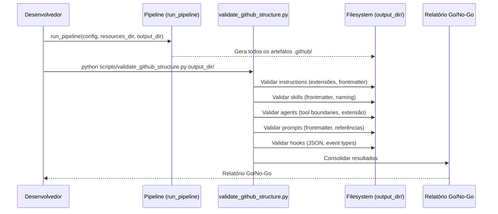

# História: README e Validação Final da Estrutura .github

**ID:** STORY-013

## 1. Dependências

| Blocked By | Blocks |
| :--- | :--- |
| STORY-001, STORY-002, STORY-003, STORY-004, STORY-005, STORY-006, STORY-007, STORY-008, STORY-009, STORY-010, STORY-011, STORY-012 | — |

## 2. Regras Transversais Aplicáveis

| ID | Título |
| :--- | :--- |
| RULE-001 | Paridade funcional |
| RULE-002 | Convenções do Copilot |
| RULE-003 | Sem duplicação de conteúdo |
| RULE-004 | Idioma |
| RULE-005 | Progressive disclosure |
| RULE-006 | Tool boundaries |
| RULE-007 | Consistência de hooks |

## 3. Descrição

Como **Tech Lead**, eu quero que o gerador `claude_setup` produza o README.md da estrutura `.github/` e inclua validação automatizada de todos os componentes gerados, garantindo que a adoção do Copilot ocorra com evidências de conformidade e governança completa.

Esta é a história final que converge todos os ramos de dependência. Produz documentação de governança e valida end-to-end todos os artefatos gerados: instructions, skills, agents, prompts, hooks e MCP.

### 3.1 Contexto Técnico (Gerador)

O `claude_setup` já possui o `ReadmeAssembler` (`src/claude_setup/assembler/readme_assembler.py`) que gera README para a estrutura `.claude/`. A implementação deve estender este assembler para incluir a documentação da estrutura `.github/`.

Para esta história, a implementação envolve:

1. **Estender `ReadmeAssembler`** para incluir seção `.github/` no README gerado — árvore de diretórios, tabela de mapeamento `.claude/` ↔ `.github/`, convenções por tipo de artefato
2. **Criar script de validação** em `scripts/validate_github_structure.py` — valida frontmatter YAML, extensões corretas, JSON válido, tool boundaries, links
3. **Testes de integração** — rodar `run_pipeline()` completo e validar que a estrutura `.github/` gerada contém todos os artefatos esperados
4. **Golden files** — garantir que `tests/golden/` inclui `.github/README.md` com árvore completa
5. **Relatório Go/No-Go** — o script de validação gera relatório automático com decisão GO/NO-GO

### 3.2 README.md gerado

O `ReadmeAssembler` deve gerar conteúdo incluindo:

- Árvore de diretórios completa de `.github/`
- Mapeamento `.claude/` ↔ `.github/` com tabela de equivalência
- Convenções por tipo de artefato (naming, frontmatter, extensões)
- Guia de contribuição e manutenção
- Links para documentação oficial do GitHub Copilot

### 3.3 Validação End-to-End (script de validação)

Checklist de validação por componente:

| Componente | Assembler que gera | Validações |
| :--- | :--- | :--- |
| Instructions | `GithubInstructionsAssembler` | Extensões `.instructions.md`, carregamento global, links válidos |
| Skills | (skills assemblers da Fase 1) | YAML frontmatter, name lowercase-hyphens, description presente |
| Agents | `GithubAgentsAssembler` | Extensão `.agent.md`, tools/disallowed-tools no frontmatter |
| Prompts | `GithubPromptsAssembler` | Extensão `.prompt.md`, frontmatter válido, referências a skills/agents |
| Hooks | `GithubHooksAssembler` | JSON válido, event types corretos, timeouts ≤ 60s |
| MCP | (MCP assembler) | JSON válido, sem segredos hardcoded, capabilities documentadas |

## 4. Definições de Qualidade Locais

### DoR Local (Definition of Ready)

- [ ] Todas as 12 histórias anteriores concluídas (todos os assemblers implementados)
- [ ] Lista completa de artefatos gerados pelo pipeline disponível
- [ ] Critérios de validação por componente definidos

### DoD Local (Definition of Done)

- [ ] `ReadmeAssembler` estendido para incluir seção `.github/` no README
- [ ] Script `scripts/validate_github_structure.py` implementado e funcional
- [ ] Validação executada em 100% dos artefatos gerados pelo pipeline
- [ ] Zero erros críticos (frontmatter inválido, extensões erradas, links quebrados)
- [ ] Relatório Go/No-Go gerado automaticamente pelo script
- [ ] Golden files atualizados incluindo `.github/README.md`

### Global Definition of Done (DoD)

- **Validação de formato:** 100% dos artefatos gerados validados
- **Convenções Copilot:** Todos os artefatos seguem convenções
- **Sem duplicação:** Nenhum conteúdo duplicado verificado
- **Idioma:** Inglês (exceções pt-BR documentadas)
- **Documentação:** README.md completo e preciso
- **Integração:** Testes de integração passando com pipeline completo
- **Testes:** Golden files + pipeline tests + validation script passando

## 5. Contratos de Dados (Data Contract)

**Validation Report Contract:**

| Campo | Formato | Request | Response | Origem / Regra |
| :--- | :--- | :--- | :--- | :--- |
| `component` | enum(instructions, skills, agents, prompts, hooks, mcp) | — | M | Componente validado |
| `total_artifacts` | integer | — | M | Total de artefatos gerados pelo assembler |
| `passed` | integer | — | M | Artefatos que passaram validação |
| `failed` | integer | — | M | Artefatos que falharam |
| `severity` | enum(critical, major, minor) | — | M | Maior severidade encontrada |
| `decision` | enum(GO, NO-GO) | — | M | Decisão final |

## 6. Diagramas

### 6.1 Fluxo de Validação do Gerador



## 7. Critérios de Aceite (Gherkin)

```gherkin
Cenario: README gerado inclui árvore de diretórios .github/
  DADO que o pipeline completo é executado
  QUANDO ReadmeAssembler gera o README
  ENTÃO o conteúdo inclui árvore de diretórios com todos os artefatos .github/
  E inclui tabela de mapeamento .claude/ ↔ .github/

Cenario: Golden file do README corresponde byte a byte
  DADO que golden files incluem github/README.md
  QUANDO test_byte_for_byte.py é executado
  ENTÃO o README gerado é idêntico ao golden file

Cenario: Script de validação reporta GO para pipeline correto
  DADO que o pipeline gerou todos os artefatos esperados
  QUANDO scripts/validate_github_structure.py é executado no output_dir
  ENTÃO o relatório emite decisão "GO"
  E todos os componentes têm zero falhas críticas

Cenario: Script de validação detecta frontmatter inválido
  DADO que um agent gerado não possui campo "name" no frontmatter
  QUANDO o script de validação é executado
  ENTÃO a decisão é "NO-GO"
  E o erro crítico lista o componente e arquivo afetado

Cenario: Teste de integração valida pipeline completo
  DADO que test_pipeline.py é executado com config padrão
  QUANDO PipelineResult é verificado
  ENTÃO files_generated inclui artefatos de TODOS os assemblers .github/
  E a contagem total corresponde ao esperado

Cenario: Validação de extensões em todos os agents gerados
  DADO que GithubAgentsAssembler gerou 10 agents
  QUANDO o script de validação verifica extensões
  ENTÃO todos possuem extensão ".agent.md"
  E nenhum usa extensão ".md" simples
```

## 8. Sub-tarefas

- [ ] [Dev] Estender `ReadmeAssembler` para incluir seção `.github/` no README gerado
- [ ] [Dev] Criar script de validação automatizada (`scripts/validate_github_structure.py`)
- [ ] [Dev] Implementar validadores por componente (instructions, skills, agents, prompts, hooks, mcp)
- [ ] [Dev] Implementar geração de relatório Go/No-Go no script
- [ ] [Test] Testes de integração: rodar `run_pipeline()` completo e validar toda a estrutura `.github/`
- [ ] [Test] Verificar que golden files incluem `.github/README.md` com árvore completa
- [ ] [Test] Verificar que o relatório Go/No-Go é gerado automaticamente pelo script
- [ ] [Test] Atualizar contagem esperada em `test_pipeline.py`
