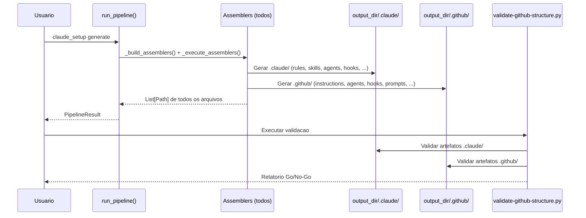
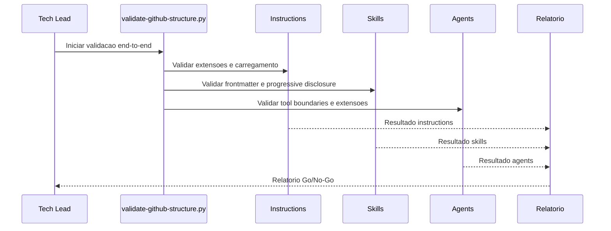

# Historia: README e Validacao Final da Estrutura .github

**ID:** STORY-013

## Contexto do Gerador

Esta historia estende o `ReadmeAssembler` existente no gerador Python `claude_setup` para incluir documentacao da estrutura `.github/`, e adiciona um script de validacao end-to-end. O gerador produz AMBAS as estruturas `.claude/` e `.github/` — ambas sao saidas gitignored.

**Arquitetura do gerador:**

| Componente | Caminho |
| :--- | :--- |
| Assembler existente | `src/claude_setup/assembler/readme_assembler.py` (estender) |
| Template README | `resources/readme-templates/` (adicionar secao `.github/`) |
| Script de validacao | `scripts/validate-github-structure.py` (novo) |
| Pipeline | Ja registrado em `assembler/__init__.py` via `_build_assemblers()` |
| Golden files | `tests/golden/readme/` (atualizar) |
| Testes | `tests/test_byte_for_byte.py` (atualizar cenarios existentes) |

O `ReadmeAssembler` ja implementa `assemble(config, output_dir, engine) -> List[Path]`. Esta historia estende o template para cobrir a documentacao `.github/` e adiciona validacao cross-cutting.

---

## 1. Dependencias

| Blocked By | Blocks |
| :--- | :--- |
| STORY-001, STORY-002, STORY-003, STORY-004, STORY-005, STORY-006, STORY-007, STORY-008, STORY-009, STORY-010, STORY-011, STORY-012 | — |

## 2. Regras Transversais Aplicaveis

| ID | Titulo |
| :--- | :--- |
| RULE-001 | Paridade funcional |
| RULE-002 | Convencoes do Copilot |
| RULE-003 | Sem duplicacao de conteudo |
| RULE-004 | Idioma |
| RULE-005 | Progressive disclosure |
| RULE-006 | Tool boundaries |
| RULE-007 | Consistencia de hooks |

## 3. Descricao

Como **Tech Lead**, eu quero que o gerador `claude_setup` produza um README.md abrangente cobrindo AMBAS as estruturas geradas (`.claude/` e `.github/`), e que exista um script de validacao transversal de todos os componentes gerados, garantindo que a adocao ocorra com evidencias de conformidade e governanca completa.

Esta e a historia final que converge todos os ramos de dependencia. Estende o `ReadmeAssembler` existente para incluir documentacao `.github/` e cria um script de validacao end-to-end que verifica a integridade de TODAS as saidas geradas pelo pipeline.

### 3.1 README.md (gerado pelo ReadmeAssembler estendido)

- Arvore de diretorios completa de `.claude/` E `.github/` (ambos gerados)
- Mapeamento `.claude/` <-> `.github/` com tabela de equivalencia
- Convencoes por tipo de artefato (naming, frontmatter, extensoes)
- Guia de contribuicao e manutencao (focado nos templates e assemblers)
- Links para documentacao oficial do GitHub Copilot e Claude Code
- Nota explicando que ambos diretorios sao saidas geradas pelo `claude_setup`

### 3.2 Script de Validacao End-to-End

Script Python `scripts/validate-github-structure.py` que valida TODAS as saidas geradas:

| Componente | Validacoes |
| :--- | :--- |
| Instructions | Extensoes `.instructions.md`, carregamento global, links validos |
| Skills | YAML frontmatter, name lowercase-hyphens, description presente, progressive disclosure |
| Agents | Extensao `.agent.md`, tools/disallowed-tools no frontmatter, coerencia persona-tools |
| Prompts | Extensao `.prompt.md`, frontmatter valido, referencias a skills/agents |
| Hooks | JSON valido, event types corretos, timeouts <= 60s |
| MCP | JSON valido, sem segredos hardcoded, capabilities documentadas |

### 3.3 Implementacao no gerador

1. Estender template README em `resources/readme-templates/` para incluir secao `.github/`
2. Criar `scripts/validate-github-structure.py`
3. Atualizar golden files em `tests/golden/readme/`
4. Atualizar cenarios de teste byte-for-byte em `tests/test_byte_for_byte.py`

## 4. Definicoes de Qualidade Locais

### DoR Local (Definition of Ready)

- [ ] Todas as 12 historias anteriores concluidas
- [ ] Lista completa de artefatos gerados disponivel (ambas saidas)
- [ ] Criterios de validacao por componente definidos
- [ ] Padrao de assembler validado (referencia: `GithubInstructionsAssembler`)

### DoD Local (Definition of Done)

- [ ] Template README estendido para cobrir `.claude/` e `.github/`
- [ ] README gerado contem arvore e mapeamento de AMBAS as estruturas
- [ ] Script `validate-github-structure.py` criado e funcional
- [ ] Validacao executada em 100% dos artefatos gerados
- [ ] Zero erros criticos (frontmatter invalido, extensoes erradas, links quebrados)
- [ ] Relatorio Go/No-Go produzido
- [ ] Golden files atualizados e testes byte-for-byte passando

### Global Definition of Done (DoD)

- **Validacao de formato:** 100% dos artefatos validados (ambas saidas)
- **Convencoes Copilot:** Todos os artefatos `.github/` seguem convencoes
- **Sem duplicacao:** Nenhum conteudo duplicado verificado
- **Idioma:** Ingles (excecoes pt-BR documentadas)
- **Documentacao:** README.md completo cobrindo ambas estruturas geradas
- **Integracao:** Validacao manual com Copilot e Claude Code
- **Testes:** Golden file tests passando em `test_byte_for_byte.py`

## 5. Contratos de Dados (Data Contract)

**Validation Report Contract:**

| Campo | Formato | Request | Response | Origem / Regra |
| :--- | :--- | :--- | :--- | :--- |
| `component` | enum(instructions, skills, agents, prompts, hooks, mcp) | — | M | Componente validado |
| `output_target` | enum(.claude, .github) | — | M | Qual saida gerada |
| `total_artifacts` | integer | — | M | Total de artefatos no componente |
| `passed` | integer | — | M | Artefatos que passaram validacao |
| `failed` | integer | — | M | Artefatos que falharam |
| `severity` | enum(critical, major, minor) | — | M | Maior severidade encontrada |
| `decision` | enum(GO, NO-GO) | — | M | Decisao final |

## 6. Diagramas

### 6.1 Pipeline completo do gerador (visao consolidada)



### 6.2 Fluxo de Validacao End-to-End



## 7. Criterios de Aceite (Gherkin)

```gherkin
Cenario: README gerado cobre ambas estruturas
  DADO que o pipeline gerou .claude/ e .github/
  QUANDO o ReadmeAssembler gera o README.md
  ENTAO contem arvore de diretorios de AMBAS as estruturas
  E inclui tabela de mapeamento .claude/ <-> .github/
  E explica que ambos sao saidas geradas pelo claude_setup

Cenario: Golden file test do README atualizado
  DADO que tests/golden/readme/ contem o README de referencia atualizado
  QUANDO test_byte_for_byte.py executa o ReadmeAssembler com config fixa
  ENTAO a saida e identica byte-a-byte ao golden file

Cenario: Validacao de YAML frontmatter em todas as skills
  DADO que existem 42+ skills geradas em .github/skills/
  QUANDO o script de validacao parseia o frontmatter de cada SKILL.md
  ENTAO todos possuem campo "name" em lowercase-hyphens
  E todos possuem campo "description" nao vazio

Cenario: Validacao de tool boundaries em todos os agents
  DADO que existem 10 agents gerados em .github/agents/
  QUANDO o script de validacao verifica cada .agent.md
  ENTAO todos possuem "tools" e "disallowed-tools" no frontmatter
  E nenhum agent tem whitelist e blacklist vazias simultaneamente

Cenario: Relatorio Go/No-Go com zero erros criticos
  DADO que a validacao end-to-end foi executada em ambas saidas
  QUANDO todos os componentes passam sem erros criticos
  ENTAO o relatorio emite decisao "GO"
  E lista warnings como informativos

Cenario: Relatorio No-Go com erros criticos
  DADO que a validacao encontra um skill sem campo "name"
  QUANDO o relatorio e gerado
  ENTAO a decisao e "NO-GO"
  E o erro critico e listado com componente, saida (.claude/.github) e arquivo afetado
  E a severidade e "critical"
```

## 8. Sub-tarefas

- [ ] [Dev] Estender template README em `resources/readme-templates/` para cobrir `.github/`
- [ ] [Dev] Incluir tabela de mapeamento `.claude/` <-> `.github/` no template
- [ ] [Dev] Documentar que ambos diretorios sao saidas geradas pelo `claude_setup`
- [ ] [Dev] Criar `scripts/validate-github-structure.py`
- [ ] [Dev] Atualizar golden files em `tests/golden/readme/`
- [ ] [Test] Atualizar cenarios em `tests/test_byte_for_byte.py` para README estendido
- [ ] [Test] Executar validacao de instructions (extensoes, carregamento)
- [ ] [Test] Executar validacao de skills (frontmatter, progressive disclosure)
- [ ] [Test] Executar validacao de agents (tool boundaries, extensoes)
- [ ] [Test] Executar validacao de prompts (frontmatter, referencias)
- [ ] [Test] Executar validacao de hooks (JSON, event types, timeouts)
- [ ] [Test] Executar validacao de MCP (JSON, sem segredos)
- [ ] [Test] Produzir relatorio Go/No-Go consolidado
- [ ] [Doc] Incluir guia de contribuicao focado em templates e assemblers
