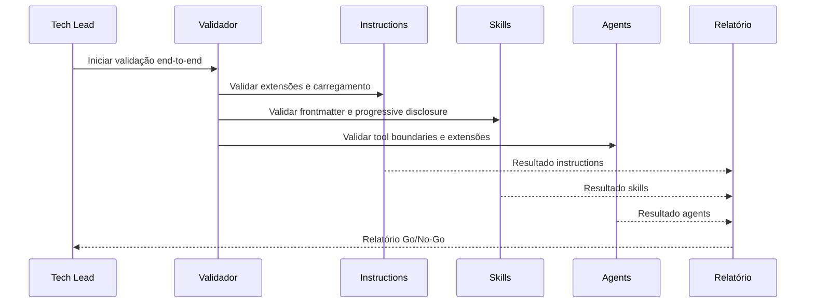

# História: README e Validação Final da Estrutura .github

**ID:** STORY-013

## 1. Dependências

| Blocked By | Blocks |
| :--- | :--- |
| STORY-001, STORY-002, STORY-003, STORY-004, STORY-005, STORY-006, STORY-007, STORY-008, STORY-009, STORY-010, STORY-011, STORY-012 | — |

## 2. Regras Transversais Aplicáveis

| ID | Título |
| :--- | :--- |
| RULE-001 | Paridade funcional |
| RULE-002 | Convenções do Copilot |
| RULE-003 | Sem duplicação de conteúdo |
| RULE-004 | Idioma |
| RULE-005 | Progressive disclosure |
| RULE-006 | Tool boundaries |
| RULE-007 | Consistência de hooks |

## 3. Descrição

Como **Tech Lead**, eu quero criar o README.md da estrutura `.github/` e executar validação transversal de todos os componentes, garantindo que a adoção do Copilot ocorra com evidências de conformidade e governança completa.

Esta é a história final que converge todos os ramos de dependência. Produz documentação de governança e executa validação end-to-end cobrindo instructions, skills, agents, prompts, hooks e MCP.

### 3.1 README.md

- Árvore de diretórios completa de `.github/`
- Mapeamento `.claude/` ↔ `.github/` com tabela de equivalência
- Convenções por tipo de artefato (naming, frontmatter, extensões)
- Guia de contribuição e manutenção
- Links para documentação oficial do GitHub Copilot

### 3.2 Validação End-to-End

Checklist de validação por componente:

| Componente | Validações |
| :--- | :--- |
| Instructions | Extensões `.instructions.md`, carregamento global, links válidos |
| Skills | YAML frontmatter, name lowercase-hyphens, description presente, progressive disclosure |
| Agents | Extensão `.agent.md`, tools/disallowed-tools no frontmatter, coerência persona-tools |
| Prompts | Extensão `.prompt.md`, frontmatter válido, referências a skills/agents |
| Hooks | JSON válido, event types corretos, timeouts ≤ 60s |
| MCP | JSON válido, sem segredos hardcoded, capabilities documentadas |

## 4. Definições de Qualidade Locais

### DoR Local (Definition of Ready)

- [ ] Todas as 12 histórias anteriores concluídas
- [ ] Lista completa de artefatos gerados disponível
- [ ] Critérios de validação por componente definidos

### DoD Local (Definition of Done)

- [ ] README.md criado em `.github/` com árvore e mapeamento
- [ ] Validação executada em 100% dos artefatos
- [ ] Zero erros críticos (frontmatter inválido, extensões erradas, links quebrados)
- [ ] Relatório Go/No-Go produzido

### Global Definition of Done (DoD)

- **Validação de formato:** 100% dos artefatos validados
- **Convenções Copilot:** Todos os artefatos seguem convenções
- **Sem duplicação:** Nenhum conteúdo duplicado verificado
- **Idioma:** Inglês (exceções pt-BR documentadas)
- **Documentação:** README.md completo e preciso
- **Integração:** Validação manual com Copilot

## 5. Contratos de Dados (Data Contract)

**Validation Report Contract:**

| Campo | Formato | Request | Response | Origem / Regra |
| :--- | :--- | :--- | :--- | :--- |
| `component` | enum(instructions, skills, agents, prompts, hooks, mcp) | — | M | Componente validado |
| `total_artifacts` | integer | — | M | Total de artefatos no componente |
| `passed` | integer | — | M | Artefatos que passaram validação |
| `failed` | integer | — | M | Artefatos que falharam |
| `severity` | enum(critical, major, minor) | — | M | Maior severidade encontrada |
| `decision` | enum(GO, NO-GO) | — | M | Decisão final |

## 6. Diagramas

### 6.1 Fluxo de Validação Final



## 7. Critérios de Aceite (Gherkin)

```gherkin
Cenario: README com árvore de diretórios completa
  DADO que todos os componentes .github/ foram criados
  QUANDO o README.md é gerado
  ENTÃO contém árvore de diretórios com todos os artefatos
  E inclui tabela de mapeamento .claude/ ↔ .github/

Cenario: Validação de YAML frontmatter em todas as skills
  DADO que existem 42+ skills em .github/skills/
  QUANDO o validador parseia o frontmatter de cada SKILL.md
  ENTÃO todos possuem campo "name" em lowercase-hyphens
  E todos possuem campo "description" não vazio

Cenario: Validação de tool boundaries em todos os agents
  DADO que existem 10 agents em .github/agents/
  QUANDO o validador verifica cada .agent.md
  ENTÃO todos possuem "tools" e "disallowed-tools" no frontmatter
  E nenhum agent tem whitelist e blacklist vazias simultaneamente

Cenario: Relatório Go/No-Go com zero erros críticos
  DADO que a validação end-to-end foi executada
  QUANDO todos os componentes passam sem erros críticos
  ENTÃO o relatório emite decisão "GO"
  E lista warnings como informativos

Cenario: Relatório No-Go com erros críticos
  DADO que a validação encontra um skill sem campo "name"
  QUANDO o relatório é gerado
  ENTÃO a decisão é "NO-GO"
  E o erro crítico é listado com componente e arquivo afetado
  E a severidade é "critical"
```

## 8. Sub-tarefas

- [ ] [Dev] Criar `.github/README.md` com árvore de diretórios
- [ ] [Dev] Incluir tabela de mapeamento `.claude/` ↔ `.github/`
- [ ] [Dev] Documentar convenções por tipo de artefato
- [ ] [Test] Executar validação de instructions (extensões, carregamento)
- [ ] [Test] Executar validação de skills (frontmatter, progressive disclosure)
- [ ] [Test] Executar validação de agents (tool boundaries, extensões)
- [ ] [Test] Executar validação de prompts (frontmatter, referências)
- [ ] [Test] Executar validação de hooks (JSON, event types, timeouts)
- [ ] [Test] Executar validação de MCP (JSON, sem segredos)
- [ ] [Test] Produzir relatório Go/No-Go consolidado
- [ ] [Doc] Incluir guia de contribuição e manutenção no README
