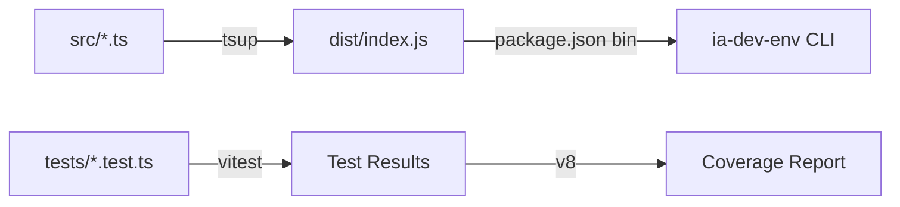

# História: Setup do Projeto Node.js + TypeScript

**ID:** STORY-001

## 1. Dependências

| Blocked By | Blocks |
| :--- | :--- |
| — | STORY-002, STORY-003, STORY-005 |

## 2. Regras Transversais Aplicáveis

| ID | Título |
| :--- | :--- |
| RULE-011 | Resources inalterados |

## 3. Descrição

Como **desenvolvedor do ia-dev-environment**, eu quero ter a estrutura base do projeto Node.js + TypeScript configurada, garantindo que toda a infraestrutura de build, teste e desenvolvimento esteja funcional antes de iniciar a migração dos módulos.

Esta é a história fundacional do épico. Ela cria o esqueleto do projeto TypeScript com todas as configurações necessárias: `package.json` com dependências, `tsconfig.json`, bundler (`tsup`), test runner (`vitest`), e a estrutura de diretórios que espelha a arquitetura proposta. O diretório `resources/` existente é referenciado (não copiado/modificado).

### 3.1 Inicialização do package.json

- Nome: `ia-dev-environment`
- Versão: `0.1.0`
- Licença: MIT
- `bin`: `{ "ia-dev-env": "./dist/index.js" }`
- `type`: `"module"` (ESM)
- Scripts: `build`, `dev`, `test`, `test:coverage`, `lint`
- Dependências runtime: `commander`, `js-yaml`, `nunjucks`, `inquirer`
- Dependências dev: `typescript`, `tsup`, `vitest`, `@types/node`, `@types/js-yaml`, `@types/nunjucks`, `tsx`

### 3.2 Configuração TypeScript

- `tsconfig.json` com target ES2022, module NodeNext, strict mode
- `outDir`: `./dist`
- `rootDir`: `./src`
- Include: `src/**/*.ts`
- Exclude: `node_modules`, `dist`, `tests`

### 3.3 Configuração de Build (tsup)

- Entry: `src/index.ts`
- Format: ESM
- Target: Node 18+
- Bundle: true
- DTS: true
- Shebang no entry point: `#!/usr/bin/env node`

### 3.4 Configuração de Testes (vitest)

- `vitest.config.ts` com coverage provider `v8`
- Thresholds: lines 95%, branches 90%
- Include: `tests/**/*.test.ts`
- Coverage exclude: `dist/`, `resources/`, `tests/`

### 3.5 Estrutura de Diretórios

```
src/
├── index.ts
├── cli.ts
├── config.ts
├── models.ts
├── template-engine.ts
├── utils.ts
├── exceptions.ts
├── interactive.ts
├── assembler/
│   └── index.ts
└── domain/
    └── (módulos individuais)
tests/
└── fixtures/
```

## 4. Definições de Qualidade Locais

### DoR Local (Definition of Ready)

- [ ] Versões mínimas de Node.js (18+) e npm definidas
- [ ] Decisão sobre ESM vs CJS tomada (ESM)
- [ ] Lista completa de dependências npm aprovada

### DoD Local (Definition of Done)

- [ ] `npm install` executa sem erros
- [ ] `npm run build` compila sem erros TypeScript
- [ ] `npm run test` executa e reporta 0 testes (nenhum implementado ainda)
- [ ] `npm run test:coverage` gera relatório de cobertura
- [ ] `npx ia-dev-env --help` exibe mensagem de ajuda básica (stub)
- [ ] Estrutura de diretórios criada com arquivos stub

### Global Definition of Done (DoD)

- **Cobertura:** ≥ 95% Line Coverage, ≥ 90% Branch Coverage
- **Testes Automatizados:** Unitários + integração com vitest
- **Relatório de Cobertura:** vitest coverage lcov + text
- **Documentação:** JSDoc em funções/classes públicas
- **Persistência:** N/A
- **Performance:** Build < 10s, testes < 30s

## 5. Contratos de Dados (Data Contract)

**package.json:**

| Campo | Formato | Obrigatório | Origem / Regra |
| :--- | :--- | :--- | :--- |
| `name` | string | M | `ia-dev-environment` |
| `version` | semver | M | `0.1.0` |
| `bin.ia-dev-env` | path | M | `./dist/index.js` |
| `type` | string | M | `module` |
| `scripts.build` | string | M | `tsup` |
| `scripts.test` | string | M | `vitest` |

**tsconfig.json:**

| Campo | Formato | Obrigatório | Origem / Regra |
| :--- | :--- | :--- | :--- |
| `compilerOptions.target` | string | M | `ES2022` |
| `compilerOptions.module` | string | M | `NodeNext` |
| `compilerOptions.strict` | boolean | M | `true` |
| `compilerOptions.outDir` | path | M | `./dist` |

## 6. Diagramas

### 6.1 Estrutura de Build



## 7. Critérios de Aceite (Gherkin)

```gherkin
Cenario: Build do projeto TypeScript
  DADO que o projeto foi inicializado com npm install
  QUANDO executo npm run build
  ENTÃO o diretório dist/ é criado com index.js
  E o arquivo dist/index.js contém shebang #!/usr/bin/env node

Cenario: Execução do CLI via bin
  DADO que o projeto foi compilado com npm run build
  QUANDO executo npx ia-dev-env --help
  ENTÃO uma mensagem de ajuda é exibida sem erros

Cenario: Test runner funcional
  DADO que vitest está configurado
  QUANDO executo npm run test
  ENTÃO o vitest executa sem erros de configuração
  E reporta 0 test suites (nenhum teste implementado)

Cenario: Coverage report funcional
  DADO que vitest com v8 coverage está configurado
  QUANDO executo npm run test:coverage
  ENTÃO um relatório de cobertura é gerado
  E o formato inclui lcov e text

Cenario: Estrutura de diretórios criada
  DADO que o projeto foi inicializado
  QUANDO verifico a estrutura de diretórios
  ENTÃO src/assembler/ existe
  E src/domain/ existe
  E tests/fixtures/ existe
```

## 8. Sub-tarefas

- [ ] [Dev] Criar `package.json` com todas as dependências e scripts
- [ ] [Dev] Criar `tsconfig.json` com configuração strict ESM
- [ ] [Dev] Criar `tsup.config.ts` com configuração de bundling
- [ ] [Dev] Criar `vitest.config.ts` com coverage thresholds
- [ ] [Dev] Criar estrutura de diretórios `src/`, `src/assembler/`, `src/domain/`, `tests/fixtures/`
- [ ] [Dev] Criar `src/index.ts` stub com entry point básico
- [ ] [Dev] Criar `.gitignore` para node_modules, dist, coverage
- [ ] [Test] Validar que build, test e CLI stub funcionam
- [ ] [Doc] Documentar setup de desenvolvimento no README (se aplicável)
