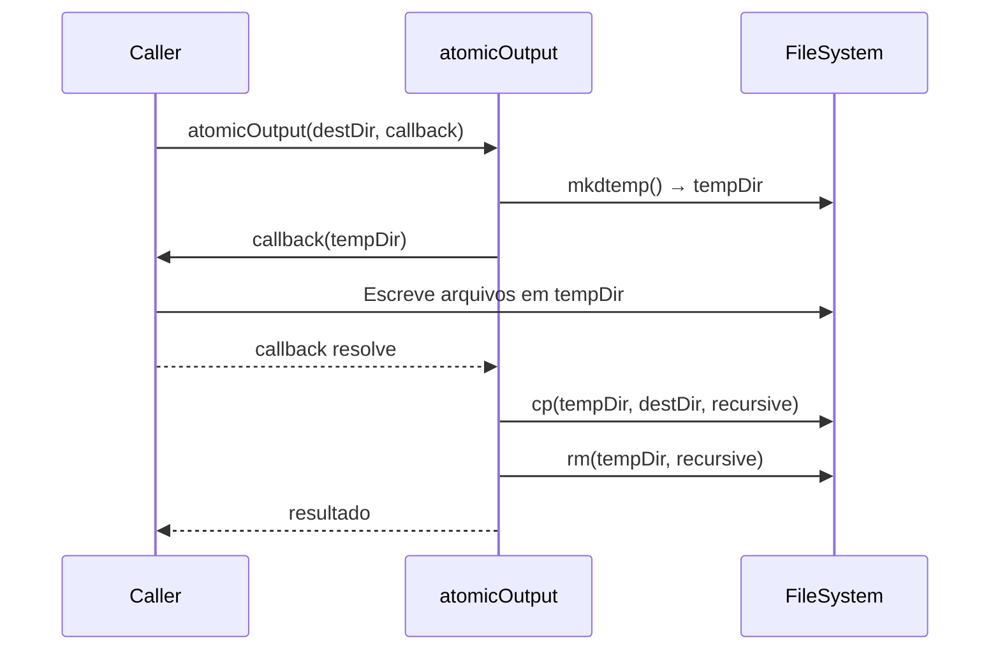

# História: Exceptions e Utilitários

**ID:** STORY-002

## 1. Dependências

| Blocked By | Blocks |
| :--- | :--- |
| STORY-001 | STORY-004, STORY-016 |

## 2. Regras Transversais Aplicáveis

| ID | Título |
| :--- | :--- |
| RULE-003 | Validação de paths |
| RULE-004 | Atomic output |

## 3. Descrição

Como **desenvolvedor do ia-dev-environment**, eu quero ter as classes de exceção customizadas e os utilitários de infraestrutura migrados para TypeScript, garantindo que a validação de paths e a escrita atômica funcionem identicamente ao Python.

Este módulo é crítico pois fornece as fundações de segurança (validação de paths contra symlinks, traversal e protected paths) e confiabilidade (atomic output via temp dir) que todos os assemblers dependem.

### 3.1 Exceptions (`src/exceptions.ts`)

- **Módulo Python de origem:** `src/ia_dev_env/exceptions.py`
- `ConfigValidationError` — recebe `missingFields: string[]`, mensagem formatada listando campos faltantes
- `PipelineError` — recebe `assemblerName: string` e `reason: string`
- Ambas estendem `Error` nativo do JavaScript

### 3.2 Utilitários (`src/utils.ts`)

- **Módulo Python de origem:** `src/ia_dev_env/utils.py`
- `atomicOutput(destDir: string)` — implementar como função async que:
  1. Cria temp dir via `node:os.tmpdir()` + `node:fs/promises.mkdtemp()`
  2. Executa callback recebendo o temp dir path
  3. Copia temp dir → destDir via `cp` recursivo
  4. Limpa temp dir em `finally`
- `validateDestPath(path: string)` — rejeita symlinks via `lstat()`
- `rejectDangerousPath(path: string)` — rejeita CWD, home dir, PROTECTED_PATHS (`/`, `/tmp`, `/var`, `/etc`, `/usr`)
- `setupLogging(verbose: boolean)` — configura nível de log (usar `console` ou lib leve)
- `findResourcesDir()` — localiza `resources/` relativo ao pacote (equivalente ao `__file__/../../resources`)

### 3.3 Constantes

- `PROTECTED_PATHS`: `["/", "/tmp", "/var", "/etc", "/usr"]`

## 4. Definições de Qualidade Locais

### DoR Local (Definition of Ready)

- [ ] Módulos Python `exceptions.py` e `utils.py` lidos e compreendidos
- [ ] Comportamento de `atomic_output` mapeado com edge cases
- [ ] Lista de PROTECTED_PATHS confirmada

### DoD Local (Definition of Done)

- [ ] `ConfigValidationError` e `PipelineError` implementados com mesma assinatura
- [ ] `atomicOutput` cria temp dir, executa callback, copia e limpa
- [ ] `validateDestPath` rejeita symlinks
- [ ] `rejectDangerousPath` rejeita CWD, home e PROTECTED_PATHS
- [ ] `findResourcesDir` localiza resources relativo ao pacote
- [ ] Testes cobrindo todos os cenários de validação

### Global Definition of Done (DoD)

- **Cobertura:** ≥ 95% Line Coverage, ≥ 90% Branch Coverage
- **Testes Automatizados:** Unitários com vitest
- **Relatório de Cobertura:** vitest coverage lcov + text
- **Documentação:** JSDoc em funções públicas
- **Persistência:** N/A
- **Performance:** N/A

## 5. Contratos de Dados (Data Contract)

**ConfigValidationError:**

| Campo | Formato | Origem / Regra |
| :--- | :--- | :--- |
| `missingFields` | `string[]` | Campos YAML ausentes |
| `message` | `string` | `"Missing required fields: field1, field2"` |

**PipelineError:**

| Campo | Formato | Origem / Regra |
| :--- | :--- | :--- |
| `assemblerName` | `string` | Nome do assembler que falhou |
| `reason` | `string` | Descrição do erro |

**atomicOutput callback:**

| Parâmetro | Tipo | Descrição |
| :--- | :--- | :--- |
| `tempDir` | `string` | Path do diretório temporário |
| retorno | `Promise<T>` | Resultado do callback |

## 6. Diagramas

### 6.1 Fluxo de Atomic Output



## 7. Critérios de Aceite (Gherkin)

```gherkin
Cenario: Rejeição de symlink como destino
  DADO que o path de destino é um symlink
  QUANDO valido o path com validateDestPath
  ENTÃO um erro é lançado indicando que symlinks não são permitidos

Cenario: Rejeição de path protegido
  DADO que o path de destino é "/tmp"
  QUANDO valido o path com rejectDangerousPath
  ENTÃO um erro é lançado indicando que o path é protegido

Cenario: Rejeição do home directory
  DADO que o path de destino é o home directory do usuário
  QUANDO valido o path com rejectDangerousPath
  ENTÃO um erro é lançado indicando que o home não é permitido

Cenario: Atomic output com sucesso
  DADO que o destDir é um diretório válido
  QUANDO executo atomicOutput com um callback que cria arquivos
  ENTÃO os arquivos aparecem no destDir
  E o temp dir é removido

Cenario: Atomic output com falha no callback
  DADO que o destDir é um diretório válido
  QUANDO executo atomicOutput com um callback que lança erro
  ENTÃO o destDir não é modificado
  E o temp dir é removido

Cenario: ConfigValidationError com campos faltantes
  DADO que um YAML não possui os campos "project" e "language"
  QUANDO crio ConfigValidationError(["project", "language"])
  ENTÃO a mensagem contém "project" e "language"
```

## 8. Sub-tarefas

- [ ] [Dev] Implementar `ConfigValidationError` e `PipelineError` em `src/exceptions.ts`
- [ ] [Dev] Implementar `atomicOutput` com temp dir + copy + cleanup
- [ ] [Dev] Implementar `validateDestPath` e `rejectDangerousPath`
- [ ] [Dev] Implementar `setupLogging` e `findResourcesDir`
- [ ] [Test] Unitário: cenários de validação de path (symlink, protected, home, CWD)
- [ ] [Test] Unitário: atomic output com sucesso e falha
- [ ] [Test] Unitário: exceções customizadas
