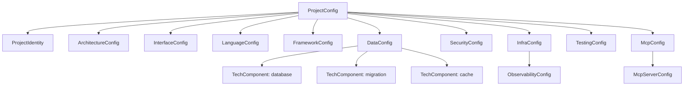

# História: Models — Interfaces e Classes TypeScript

**ID:** STORY-003

## 1. Dependências

| Blocked By | Blocks |
| :--- | :--- |
| STORY-001 | STORY-004, STORY-006, STORY-007, STORY-008, STORY-017 |

## 2. Regras Transversais Aplicáveis

| ID | Título |
| :--- | :--- |
| RULE-001 | Compatibilidade de output |
| RULE-005 | Placeholder replacement |

## 3. Descrição

Como **desenvolvedor do ia-dev-environment**, eu quero ter todos os modelos de dados Python migrados para TypeScript como interfaces e classes, garantindo que a estrutura de dados e os defaults sejam idênticos.

O módulo `models.py` define 17 dataclasses Python com `from_dict` classmethods, defaults, e tipos aninhados. A migração deve preservar todos os campos, tipos, defaults e a lógica de desserialização (equivalente ao `from_dict`).

### 3.1 Módulo Python de Origem

- `src/ia_dev_env/models.py` (337 linhas)

### 3.2 Módulo TypeScript de Destino

- `src/models.ts`

### 3.3 Mapeamento de Tipos

| Python Dataclass | TypeScript | Notas |
| :--- | :--- | :--- |
| `@dataclass` | `class` + `interface` | Interface para shape, classe para `fromDict` |
| `field(default_factory=list)` | `= []` no construtor | Mutable defaults tratados |
| `Optional[X]` | `X \| undefined` | TypeScript idiomático |
| `List[str]` | `string[]` | |
| `Dict[str, str]` | `Record<string, string>` | |
| `from_dict(cls, data)` | `static fromDict(data)` | Factory method estático |

### 3.4 Função Auxiliar `_require`

- `_require(data, key, model)` → extrai campo obrigatório ou lança `Error` com mensagem: `"Missing required field '{key}' in {model}"`
- Implementar como função `require(data: Record<string, unknown>, key: string, model: string): unknown`

### 3.5 Lista Completa de Models

1. `TechComponent` — name (default "none"), version (default "")
2. `ProjectIdentity` — name (required), purpose (required)
3. `ArchitectureConfig` — style (required), domain_driven (false), event_driven (false)
4. `InterfaceConfig` — type (required), spec (""), broker ("")
5. `LanguageConfig` — name (required), version (required)
6. `FrameworkConfig` — name (required), version (required), build_tool ("pip"), native_build (false)
7. `DataConfig` — database (TechComponent), migration (TechComponent), cache (TechComponent)
8. `SecurityConfig` — frameworks (string[])
9. `ObservabilityConfig` — tool ("none"), metrics ("none"), tracing ("none")
10. `InfraConfig` — container ("docker"), orchestrator ("none"), templating ("kustomize"), iac ("none"), registry ("none"), api_gateway ("none"), service_mesh ("none"), observability (ObservabilityConfig)
11. `TestingConfig` — smoke_tests (true), contract_tests (false), performance_tests (true), coverage_line (95), coverage_branch (90)
12. `McpServerConfig` — id (required), url (required), capabilities (string[]), env (Record<string,string>)
13. `McpConfig` — servers (McpServerConfig[])
14. `ProjectConfig` — project (required), architecture (required), interfaces (required), language (required), framework (required), data?, infrastructure?, security?, testing?, mcp?
15. `PipelineResult` — success, output_dir, files_generated, warnings, duration_ms
16. `FileDiff` — path, diff, python_size, reference_size
17. `VerificationResult` — success, total_files, mismatches, missing_files, extra_files

## 4. Definições de Qualidade Locais

### DoR Local (Definition of Ready)

- [ ] Módulo Python `models.py` lido integralmente
- [ ] Todos os defaults e tipos validados contra o código Python
- [ ] Decisão sobre uso de interfaces vs classes tomada

### DoD Local (Definition of Done)

- [ ] Todas as 17 classes/interfaces implementadas
- [ ] Todos os `fromDict` factories implementados com mesma lógica
- [ ] Defaults idênticos ao Python
- [ ] `require()` helper implementado
- [ ] Testes unitários para cada `fromDict` com dados válidos e inválidos

### Global Definition of Done (DoD)

- **Cobertura:** ≥ 95% Line Coverage, ≥ 90% Branch Coverage
- **Testes Automatizados:** Unitários com vitest
- **Relatório de Cobertura:** vitest coverage lcov + text
- **Documentação:** JSDoc em classes e interfaces
- **Persistência:** N/A
- **Performance:** N/A

## 5. Contratos de Dados (Data Contract)

**ProjectConfig (principal):**

| Campo | Formato | Obrigatório | Default | Origem / Regra |
| :--- | :--- | :--- | :--- | :--- |
| `project` | `ProjectIdentity` | M | — | YAML `project` section |
| `architecture` | `ArchitectureConfig` | M | — | YAML `architecture` section |
| `interfaces` | `InterfaceConfig[]` | M | — | YAML `interfaces` section |
| `language` | `LanguageConfig` | M | — | YAML `language` section |
| `framework` | `FrameworkConfig` | M | — | YAML `framework` section |
| `data` | `DataConfig` | O | `DataConfig` defaults | YAML `data` section |
| `infrastructure` | `InfraConfig` | O | `InfraConfig` defaults | YAML `infrastructure` section |
| `security` | `SecurityConfig` | O | `SecurityConfig` defaults | YAML `security` section |
| `testing` | `TestingConfig` | O | `TestingConfig` defaults | YAML `testing` section |
| `mcp` | `McpConfig` | O | `McpConfig` defaults | YAML `mcp` section |

## 6. Diagramas

### 6.1 Hierarquia de Models



## 7. Critérios de Aceite (Gherkin)

```gherkin
Cenario: Desserialização de ProjectConfig completo
  DADO que tenho um objeto com todos os campos obrigatórios e opcionais
  QUANDO crio ProjectConfig.fromDict(data)
  ENTÃO todos os campos são preenchidos corretamente
  E os tipos aninhados são instâncias das classes corretas

Cenario: Desserialização com campos opcionais ausentes
  DADO que tenho um objeto apenas com campos obrigatórios
  QUANDO crio ProjectConfig.fromDict(data)
  ENTÃO os campos opcionais recebem seus defaults
  E data.database.name é "none"
  E testing.smoke_tests é true

Cenario: Erro em campo obrigatório ausente
  DADO que tenho um objeto sem o campo "name" em project
  QUANDO crio ProjectIdentity.fromDict(data)
  ENTÃO um Error é lançado com mensagem contendo "name" e "ProjectIdentity"

Cenario: TechComponent com defaults
  DADO que crio um TechComponent sem parâmetros
  QUANDO acesso name e version
  ENTÃO name é "none"
  E version é ""

Cenario: FrameworkConfig com build_tool default
  DADO que tenho um objeto com name e version para framework
  QUANDO crio FrameworkConfig.fromDict(data) sem build_tool
  ENTÃO build_tool é "pip"
  E native_build é false
```

## 8. Sub-tarefas

- [ ] [Dev] Implementar interfaces TypeScript para todos os 17 models
- [ ] [Dev] Implementar classes com `fromDict` static methods
- [ ] [Dev] Implementar função `require()` helper
- [ ] [Dev] Garantir defaults idênticos ao Python
- [ ] [Test] Unitário: `fromDict` com dados completos para cada model
- [ ] [Test] Unitário: `fromDict` com campos opcionais ausentes
- [ ] [Test] Unitário: `fromDict` com campos obrigatórios ausentes (erros)
- [ ] [Test] Unitário: tipos aninhados (DataConfig → TechComponent)
