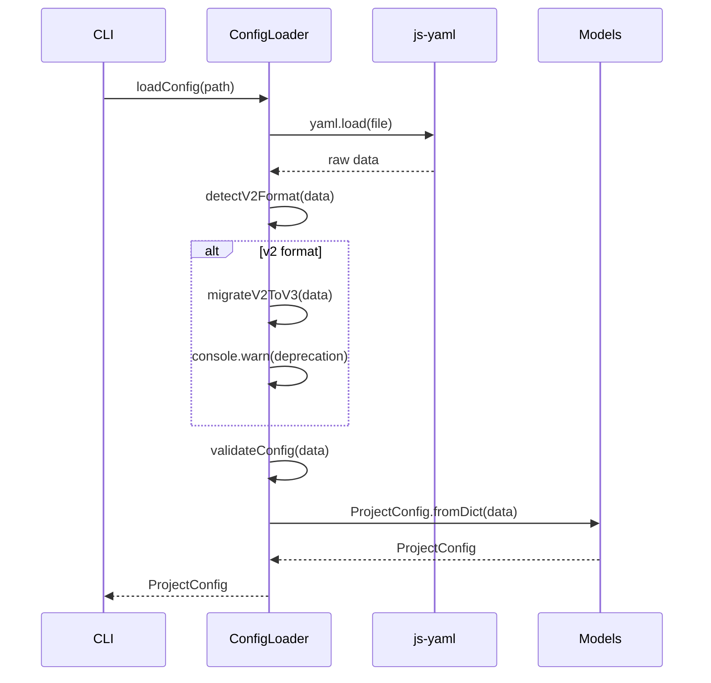

# História: Config Loader + Migração v2→v3

**ID:** STORY-004

## 1. Dependências

| Blocked By | Blocks |
| :--- | :--- |
| STORY-002, STORY-003 | STORY-017, STORY-018 |

## 2. Regras Transversais Aplicáveis

| ID | Título |
| :--- | :--- |
| RULE-001 | Compatibilidade de output |
| RULE-002 | Migração v2→v3 |

## 3. Descrição

Como **desenvolvedor do ia-dev-environment**, eu quero ter o config loader migrado para TypeScript, garantindo que a leitura de YAML, detecção de formato v2, migração para v3 e validação produzam exatamente o mesmo `ProjectConfig` que o Python.

O config loader é o ponto de entrada de dados do sistema. Toda configuração YAML passa por ele antes de alimentar o pipeline. A migração v2→v3 é especialmente crítica pois transforma formatos legados com mappings hardcoded.

### 3.1 Módulo Python de Origem

- `src/ia_dev_env/config.py`

### 3.2 Módulo TypeScript de Destino

- `src/config.ts`
- Dependência npm: `js-yaml`

### 3.3 Constantes a Preservar

**REQUIRED_SECTIONS:**
```typescript
const REQUIRED_SECTIONS = ["project", "architecture", "interfaces", "language", "framework"] as const;
```

**TYPE_MAPPING (v2 → v3):**
```typescript
const TYPE_MAPPING: Record<string, { style: string; interfaces: Array<{ type: string }> }> = {
  api: { style: "microservice", interfaces: [{ type: "rest" }] },
  cli: { style: "library", interfaces: [{ type: "cli" }] },
  library: { style: "library", interfaces: [] },
  worker: { style: "microservice", interfaces: [{ type: "event-consumer" }] },
  fullstack: { style: "monolith", interfaces: [{ type: "rest" }] },
};
```

**STACK_MAPPING (v2 → v3):**
```typescript
const STACK_MAPPING: Record<string, { language: string; version: string; framework: string; frameworkVersion: string }> = {
  "java-quarkus": { language: "java", version: "21", framework: "quarkus", frameworkVersion: "3.17" },
  "java-spring": { language: "java", version: "21", framework: "spring-boot", frameworkVersion: "3.4" },
  "python-fastapi": { language: "python", version: "3.12", framework: "fastapi", frameworkVersion: "0.115" },
  "python-click-cli": { language: "python", version: "3.9", framework: "click", frameworkVersion: "8.1" },
  "go-gin": { language: "go", version: "1.23", framework: "gin", frameworkVersion: "1.10" },
  "kotlin-ktor": { language: "kotlin", version: "2.1", framework: "ktor", frameworkVersion: "3.0" },
  "typescript-nestjs": { language: "typescript", version: "5.7", framework: "nestjs", frameworkVersion: "10.4" },
  "rust-axum": { language: "rust", version: "1.83", framework: "axum", frameworkVersion: "0.8" },
};
```

### 3.4 Funções

- `loadConfig(path: string): ProjectConfig` — lê YAML → detecta v2 → migra → valida → `ProjectConfig.fromDict()`
- `detectV2Format(data: Record<string, unknown>): boolean` — verifica presença de `type` ou `stack` no root
- `migrateV2ToV3(data: Record<string, unknown>): Record<string, unknown>` — transforma com warnings via `console.warn`
- `validateConfig(data: Record<string, unknown>): void` — verifica REQUIRED_SECTIONS, lança `ConfigValidationError`

## 4. Definições de Qualidade Locais

### DoR Local (Definition of Ready)

- [ ] Módulo Python `config.py` lido integralmente
- [ ] Models (STORY-003) implementados e disponíveis
- [ ] Exceptions (STORY-002) implementadas e disponíveis
- [ ] Fixtures YAML v2 e v3 preparadas

### DoD Local (Definition of Done)

- [ ] `loadConfig` lê YAML e retorna `ProjectConfig` idêntico ao Python
- [ ] `detectV2Format` detecta corretamente configs v2
- [ ] `migrateV2ToV3` transforma v2 para v3 com mesmos mappings
- [ ] `validateConfig` rejeita configs com seções faltantes
- [ ] TYPE_MAPPING e STACK_MAPPING idênticos ao Python
- [ ] Warnings de migração emitidos corretamente

### Global Definition of Done (DoD)

- **Cobertura:** ≥ 95% Line Coverage, ≥ 90% Branch Coverage
- **Testes Automatizados:** Unitários + fixtures YAML
- **Relatório de Cobertura:** vitest coverage lcov + text
- **Documentação:** JSDoc em funções públicas
- **Persistência:** N/A
- **Performance:** N/A

## 5. Contratos de Dados (Data Contract)

**loadConfig:**

| Parâmetro | Tipo | Obrigatório | Descrição |
| :--- | :--- | :--- | :--- |
| `path` | `string` | M | Caminho para arquivo YAML |
| retorno | `ProjectConfig` | M | Configuração desserializada e validada |

**Exemplo YAML v2:**
```yaml
type: api
stack: java-spring
project:
  name: my-project
  purpose: Example project
```

**Exemplo YAML v3:**
```yaml
project:
  name: my-project
  purpose: Example project
architecture:
  style: microservice
interfaces:
  - type: rest
language:
  name: java
  version: "21"
framework:
  name: spring-boot
  version: "3.4"
```

## 6. Diagramas

### 6.1 Fluxo de Config Loading



## 7. Critérios de Aceite (Gherkin)

```gherkin
Cenario: Carregamento de config v3 válida
  DADO que tenho um arquivo YAML v3 com todas as seções obrigatórias
  QUANDO executo loadConfig(path)
  ENTÃO um ProjectConfig é retornado com todos os campos corretos

Cenario: Detecção e migração de config v2
  DADO que tenho um arquivo YAML com campos "type" e "stack" no root
  QUANDO executo loadConfig(path)
  ENTÃO o formato v2 é detectado
  E a migração v2→v3 é executada
  E um warning de deprecação é emitido
  E o ProjectConfig resultante é equivalente à versão v3 manual

Cenario: Validação rejeita seção obrigatória ausente
  DADO que tenho um arquivo YAML sem a seção "language"
  QUANDO executo loadConfig(path)
  ENTÃO um ConfigValidationError é lançado
  E a mensagem contém "language"

Cenario: TYPE_MAPPING produz valores corretos
  DADO que tenho um YAML v2 com type "worker"
  QUANDO a migração é executada
  ENTÃO architecture.style é "microservice"
  E interfaces contém um item com type "event-consumer"

Cenario: STACK_MAPPING produz valores corretos
  DADO que tenho um YAML v2 com stack "python-fastapi"
  QUANDO a migração é executada
  ENTÃO language.name é "python"
  E language.version é "3.12"
  E framework.name é "fastapi"
  E framework.version é "0.115"
```

## 8. Sub-tarefas

- [ ] [Dev] Implementar constantes TYPE_MAPPING, STACK_MAPPING, REQUIRED_SECTIONS
- [ ] [Dev] Implementar `loadConfig` com leitura YAML via js-yaml
- [ ] [Dev] Implementar `detectV2Format`
- [ ] [Dev] Implementar `migrateV2ToV3` com transformação e warnings
- [ ] [Dev] Implementar `validateConfig` com verificação de seções
- [ ] [Test] Unitário: carregamento de config v3 válida
- [ ] [Test] Unitário: detecção e migração v2→v3 para cada entry do TYPE_MAPPING
- [ ] [Test] Unitário: migração v2→v3 para cada entry do STACK_MAPPING
- [ ] [Test] Unitário: rejeição de config inválida (seções faltantes)
- [ ] [Test] Fixtures: criar YAMLs v2 e v3 para testes de paridade
