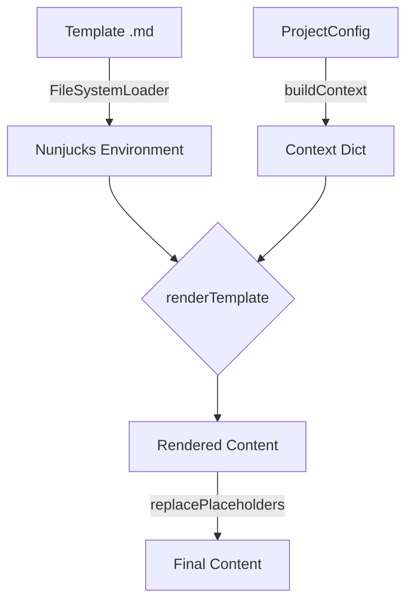

# História: Template Engine (Nunjucks)

**ID:** STORY-005

## 1. Dependências

| Blocked By | Blocks |
| :--- | :--- |
| STORY-001 | STORY-008, STORY-014, STORY-015 |

## 2. Regras Transversais Aplicáveis

| ID | Título |
| :--- | :--- |
| RULE-005 | Placeholder replacement |
| RULE-007 | Template engine config |

## 3. Descrição

Como **desenvolvedor do ia-dev-environment**, eu quero ter o template engine migrado de Jinja2 para Nunjucks, garantindo que a renderização de templates e substituição de placeholders produzam output byte-for-byte idêntico.

O Nunjucks é a escolha natural por ser compatível com a sintaxe Jinja2. A configuração deve ser cuidadosamente espelhada: `autoescape=false`, `keep_trailing_newline=true`, `trim_blocks=false`, `lstrip_blocks=false`, com `StrictUndefined` equivalente.

### 3.1 Módulo Python de Origem

- `src/ia_dev_env/template_engine.py`

### 3.2 Módulo TypeScript de Destino

- `src/template-engine.ts`
- Dependência npm: `nunjucks`

### 3.3 Classe TemplateEngine

- Construtor: `constructor(resourcesDir: string, config: ProjectConfig)`
- Configura `nunjucks.Environment` com `FileSystemLoader` em `resourcesDir`
- Configuração: `autoescape: false`, `trimBlocks: false`, `lstripBlocks: false`, `throwOnUndefined: true`

### 3.4 Métodos

- `renderTemplate(templatePath: string, context?: Record<string, unknown>): string` — renderiza template de arquivo
- `renderString(templateStr: string, context?: Record<string, unknown>): string` — renderiza string inline
- `replacePlaceholders(content: string, config?: ProjectConfig): string` — substitui `{placeholder}` por valores (regex: `\{(\w+)\}`)
- `static injectSection(baseContent: string, section: string, marker: string): string` — substitui marker por conteúdo
- `static concatFiles(paths: string[], separator?: string): string` — lê e concatena arquivos (separator default: `"\n"`)

### 3.5 Contexto Default (25 campos flat)

```typescript
{
  project_name, project_purpose, language_name, language_version,
  framework_name, framework_version, build_tool, architecture_style,
  domain_driven, event_driven, container, orchestrator, templating,
  iac, registry, api_gateway, service_mesh, database_name, cache_name,
  smoke_tests, contract_tests, performance_tests, coverage_line,
  coverage_branch
}
```

## 4. Definições de Qualidade Locais

### DoR Local (Definition of Ready)

- [ ] Módulo Python `template_engine.py` lido integralmente
- [ ] Comportamento de Nunjucks vs Jinja2 investigado para edge cases
- [ ] Decisão sobre trailing newline behavior confirmada

### DoD Local (Definition of Done)

- [ ] `TemplateEngine` renderiza templates Jinja2/Nunjucks com output idêntico
- [ ] `replacePlaceholders` usa regex `\{(\w+)\}` e produz mesmo resultado
- [ ] `injectSection` e `concatFiles` implementados como static
- [ ] Contexto default com 25 campos flat
- [ ] Nunjucks configurado com throwOnUndefined equivalente a StrictUndefined

### Global Definition of Done (DoD)

- **Cobertura:** ≥ 95% Line Coverage, ≥ 90% Branch Coverage
- **Testes Automatizados:** Unitários com vitest
- **Relatório de Cobertura:** vitest coverage lcov + text
- **Documentação:** JSDoc em métodos públicos
- **Persistência:** N/A
- **Performance:** N/A

## 5. Contratos de Dados (Data Contract)

**TemplateEngine constructor:**

| Parâmetro | Tipo | Obrigatório | Descrição |
| :--- | :--- | :--- | :--- |
| `resourcesDir` | `string` | M | Path para diretório resources/ |
| `config` | `ProjectConfig` | M | Configuração do projeto |

**renderTemplate:**

| Parâmetro | Tipo | Obrigatório | Descrição |
| :--- | :--- | :--- | :--- |
| `templatePath` | `string` | M | Path relativo ao resourcesDir |
| `context` | `Record<string, unknown>` | O | Overrides ao contexto default |
| retorno | `string` | M | Conteúdo renderizado |

**Contexto default (derivado de ProjectConfig):**

| Campo | Tipo | Origem |
| :--- | :--- | :--- |
| `project_name` | string | `config.project.name` |
| `project_purpose` | string | `config.project.purpose` |
| `language_name` | string | `config.language.name` |
| `language_version` | string | `config.language.version` |
| `framework_name` | string | `config.framework.name` |
| `framework_version` | string | `config.framework.version` |
| `build_tool` | string | `config.framework.buildTool` |
| `architecture_style` | string | `config.architecture.style` |
| `domain_driven` | boolean | `config.architecture.domainDriven` |
| `event_driven` | boolean | `config.architecture.eventDriven` |

## 6. Diagramas

### 6.1 Fluxo de Renderização



## 7. Critérios de Aceite (Gherkin)

```gherkin
Cenario: Renderização de template com variáveis
  DADO que tenho um template com {{ project_name }} e {{ language_name }}
  QUANDO renderizo com um ProjectConfig válido
  ENTÃO os placeholders Jinja2/Nunjucks são substituídos pelos valores corretos

Cenario: Substituição de placeholders com chaves simples
  DADO que tenho um conteúdo com {project_name} e {framework_name}
  QUANDO executo replacePlaceholders com um ProjectConfig
  ENTÃO {project_name} é substituído pelo nome do projeto
  E {framework_name} é substituído pelo nome do framework

Cenario: Erro em variável undefined com StrictUndefined
  DADO que tenho um template com {{ variavel_inexistente }}
  QUANDO renderizo com o contexto default
  ENTÃO um erro é lançado indicando variável undefined

Cenario: Injeção de seção em marker
  DADO que tenho um conteúdo base com "<!-- MARKER -->"
  QUANDO executo injectSection com seção "conteúdo novo" e marker "<!-- MARKER -->"
  ENTÃO "<!-- MARKER -->" é substituído por "conteúdo novo"

Cenario: Concatenação de arquivos
  DADO que tenho 3 arquivos com conteúdos distintos
  QUANDO executo concatFiles com separator padrão
  ENTÃO o resultado contém os 3 conteúdos separados por "\n"

Cenario: Trailing newline preservada
  DADO que tenho um template que termina com newline
  QUANDO renderizo o template
  ENTÃO o output preserva a trailing newline
```

## 8. Sub-tarefas

- [ ] [Dev] Implementar classe `TemplateEngine` com Nunjucks Environment
- [ ] [Dev] Implementar `renderTemplate` e `renderString`
- [ ] [Dev] Implementar `replacePlaceholders` com regex `\{(\w+)\}`
- [ ] [Dev] Implementar `injectSection` e `concatFiles` como métodos estáticos
- [ ] [Dev] Implementar `buildContext()` para gerar contexto flat de 25 campos
- [ ] [Test] Unitário: renderização de template com variáveis Nunjucks
- [ ] [Test] Unitário: placeholder replacement com regex
- [ ] [Test] Unitário: erro em variável undefined
- [ ] [Test] Unitário: injectSection e concatFiles
- [ ] [Test] Paridade: comparar output Nunjucks vs Jinja2 para templates reais do resources/
