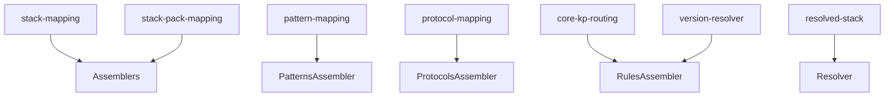

# História: Domain Layer — Mappings e Constantes

**ID:** STORY-006

## 1. Dependências

| Blocked By | Blocks |
| :--- | :--- |
| STORY-003 | STORY-007, STORY-009, STORY-010, STORY-011, STORY-012, STORY-013, STORY-014 |

## 2. Regras Transversais Aplicáveis

| ID | Título |
| :--- | :--- |
| RULE-001 | Compatibilidade de output |
| RULE-006 | Feature gating |
| RULE-014 | Version resolver fallback |

## 3. Descrição

Como **desenvolvedor do ia-dev-environment**, eu quero ter todos os módulos de mapeamento e constantes do domain layer migrados para TypeScript, garantindo que os dados de referência que controlam a geração condicional de artefatos sejam idênticos ao Python.

Este é o módulo mais "data-heavy" da migração. Contém 7 módulos Python com mappings estáticos que determinam quais arquivos são gerados para cada combinação de stack. Qualquer divergência aqui se propaga para todos os assemblers.

### 3.1 Módulos Python de Origem

| Módulo Python | Módulo TypeScript | Linhas |
| :--- | :--- | :--- |
| `domain/stack_mapping.py` | `src/domain/stack-mapping.ts` | 264 |
| `domain/stack_pack_mapping.py` | `src/domain/stack-pack-mapping.ts` | 25 |
| `domain/pattern_mapping.py` | `src/domain/pattern-mapping.ts` | 62 |
| `domain/protocol_mapping.py` | `src/domain/protocol-mapping.ts` | 82 |
| `domain/core_kp_routing.py` | `src/domain/core-kp-routing.ts` | 65 |
| `domain/version_resolver.py` | `src/domain/version-resolver.ts` | 27 |
| `domain/resolved_stack.py` | `src/domain/resolved-stack.ts` | 23 |

### 3.2 stack-mapping.ts (264 linhas)

Mappings centrais:
- `LANGUAGE_COMMANDS`: 8 combinações (language, build_tool) → {compile_cmd, build_cmd, test_cmd, coverage_cmd, file_extension, build_file, package_manager}
- `FRAMEWORK_PORTS`: 10 framework → porta padrão
- `FRAMEWORK_HEALTH_PATHS`: 10 framework → health check path
- `FRAMEWORK_LANGUAGE_RULES`: 15 framework → languages válidas
- `NATIVE_SUPPORTED_FRAMEWORKS`: Set com quarkus, spring-boot
- `VALID_INTERFACE_TYPES`: 10 tipos de interface
- `VALID_ARCHITECTURE_STYLES`: Estilos válidos
- Helpers: `getHookTemplateKey()`, `getSettingsLangKey()`, `getDatabaseSettingsKey()`, `getCacheSettingsKey()`, `getStackPackName()`

### 3.3 pattern-mapping.ts

- `UNIVERSAL_PATTERNS`: architectural, data
- `ARCHITECTURE_PATTERNS`: Map de architecture style → categorias de pattern
- `EVENT_DRIVEN_PATTERNS`: saga, outbox, event sourcing, dead-letter-queue
- `selectPatterns()`: Deduplica e ordena patterns
- `selectPatternFiles()`: Busca .md files em diretórios de patterns

### 3.4 protocol-mapping.ts

- `INTERFACE_PROTOCOL_MAP`: interface type → protocol name
- `deriveProtocols()`: Extrai protocolos únicos de interfaces
- `deriveProtocolFiles()`: Carrega .md files por protocolo
- Filtragem broker-specific para messaging

### 3.5 core-kp-routing.ts

- `CORE_TO_KP_MAPPING`: 11 rotas estáticas (clean-code → coding-standards, etc.)
- `CONDITIONAL_CORE_KP`: 1 rota condicional (cloud-native para non-library)
- `getActiveRoutes()`: Retorna rotas aplicáveis baseadas em config

### 3.6 version-resolver.ts

- `findVersionDir(basePath, version)`: Resolve diretório versionado com fallback exact → major.x

### 3.7 resolved-stack.ts

- Interface `ResolvedStack`: build_cmd, test_cmd, compile_cmd, coverage_cmd, base_image, health_path, default_port, package_manager, file_extension, build_file, native_supported, project_type, protocols

## 4. Definições de Qualidade Locais

### DoR Local (Definition of Ready)

- [ ] Todos os 7 módulos Python lidos integralmente
- [ ] Models (STORY-003) disponíveis para tipagem
- [ ] Valores de todos os mappings confirmados contra código Python

### DoD Local (Definition of Done)

- [ ] Todos os 7 módulos migrados com tipos TypeScript
- [ ] Todos os mappings com valores idênticos ao Python
- [ ] Todas as funções helper implementadas com mesma assinatura
- [ ] `findVersionDir` com fallback exact → major.x
- [ ] Testes unitários para cada mapping e helper function

### Global Definition of Done (DoD)

- **Cobertura:** ≥ 95% Line Coverage, ≥ 90% Branch Coverage
- **Testes Automatizados:** Unitários com vitest
- **Relatório de Cobertura:** vitest coverage lcov + text
- **Documentação:** JSDoc em exports públicos
- **Persistência:** N/A
- **Performance:** N/A

## 5. Contratos de Dados (Data Contract)

**ResolvedStack:**

| Campo | Tipo | Descrição |
| :--- | :--- | :--- |
| `buildCmd` | `string` | Comando de build |
| `testCmd` | `string` | Comando de teste |
| `compileCmd` | `string` | Comando de compilação |
| `coverageCmd` | `string` | Comando de coverage |
| `baseImage` | `string` | Docker base image |
| `healthPath` | `string` | Health check endpoint |
| `defaultPort` | `number` | Porta padrão do framework |
| `packageManager` | `string` | Gerenciador de pacotes |
| `fileExtension` | `string` | Extensão de arquivo da linguagem |
| `buildFile` | `string` | Arquivo de build (pom.xml, etc.) |
| `nativeSupported` | `boolean` | Suporte a native build |
| `projectType` | `string` | Tipo derivado do projeto |
| `protocols` | `string[]` | Protocolos derivados |

**CoreKpRoute:**

| Campo | Tipo | Descrição |
| :--- | :--- | :--- |
| `sourceFile` | `string` | Arquivo de regra core |
| `targetKp` | `string` | Knowledge pack de destino |

## 6. Diagramas

### 6.1 Dependências entre Mappings



## 7. Critérios de Aceite (Gherkin)

```gherkin
Cenario: LANGUAGE_COMMANDS retorna comandos corretos para java-maven
  DADO que consulto LANGUAGE_COMMANDS com key "java-maven"
  QUANDO acesso os campos
  ENTÃO compile_cmd contém "mvn compile"
  E test_cmd contém "mvn test"
  E file_extension é ".java"

Cenario: selectPatterns para microservice com event_driven
  DADO que o architecture_style é "microservice" e event_driven é true
  QUANDO executo selectPatterns(style, eventDriven)
  ENTÃO os patterns incluem UNIVERSAL_PATTERNS
  E os patterns incluem microservice patterns
  E os patterns incluem EVENT_DRIVEN_PATTERNS
  E não há duplicatas

Cenario: deriveProtocols para múltiplas interfaces
  DADO que tenho interfaces [rest, grpc, event-consumer]
  QUANDO executo deriveProtocols(interfaces)
  ENTÃO os protocolos incluem "rest", "grpc", "event-driven"
  E "messaging" está presente

Cenario: findVersionDir com fallback para major.x
  DADO que existe diretório "java/21.x" mas não "java/21.0.1"
  QUANDO executo findVersionDir("java", "21.0.1")
  ENTÃO o diretório "java/21.x" é retornado

Cenario: getActiveRoutes filtra rotas condicionais
  DADO que o architecture_style é "library"
  QUANDO executo getActiveRoutes(config)
  ENTÃO a rota condicional cloud-native NÃO está incluída
  E as 11 rotas estáticas estão presentes
```

## 8. Sub-tarefas

- [ ] [Dev] Implementar `src/domain/stack-mapping.ts` com todos os mappings
- [ ] [Dev] Implementar `src/domain/stack-pack-mapping.ts`
- [ ] [Dev] Implementar `src/domain/pattern-mapping.ts` com selectPatterns
- [ ] [Dev] Implementar `src/domain/protocol-mapping.ts` com deriveProtocols
- [ ] [Dev] Implementar `src/domain/core-kp-routing.ts` com getActiveRoutes
- [ ] [Dev] Implementar `src/domain/version-resolver.ts` com findVersionDir
- [ ] [Dev] Implementar `src/domain/resolved-stack.ts` interface
- [ ] [Test] Unitário: cada mapping com snapshot dos valores
- [ ] [Test] Unitário: selectPatterns para cada architecture style
- [ ] [Test] Unitário: deriveProtocols com combinações de interfaces
- [ ] [Test] Unitário: findVersionDir com e sem fallback
- [ ] [Test] Unitário: getActiveRoutes com e sem condições
