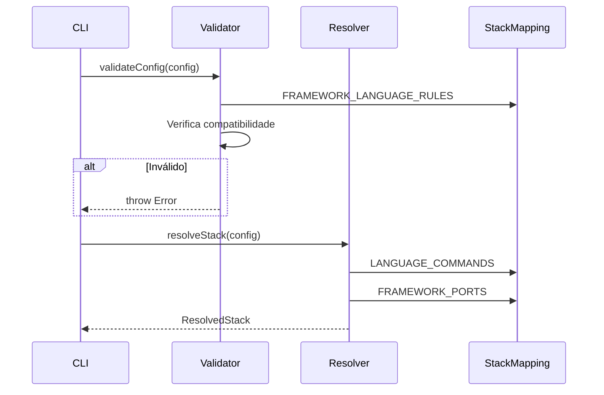

# História: Domain Layer — Validator, Resolver e Skill Registry

**ID:** STORY-007

## 1. Dependências

| Blocked By | Blocks |
| :--- | :--- |
| STORY-003, STORY-006 | STORY-009, STORY-010, STORY-011 |

## 2. Regras Transversais Aplicáveis

| ID | Título |
| :--- | :--- |
| RULE-001 | Compatibilidade de output |
| RULE-006 | Feature gating |

## 3. Descrição

Como **desenvolvedor do ia-dev-environment**, eu quero ter o validator, resolver e skill registry migrados para TypeScript, garantindo que a validação de compatibilidade, resolução de stack e registro de knowledge packs sejam idênticos ao Python.

Estes 3 módulos formam a camada de lógica de negócio que interpreta o `ProjectConfig` e produz decisões usadas pelos assemblers: quais combinações são válidas, quais valores computados usar, e quais knowledge packs incluir.

### 3.1 Módulos Python de Origem

| Módulo Python | Módulo TypeScript | Linhas |
| :--- | :--- | :--- |
| `domain/validator.py` | `src/domain/validator.ts` | 196 |
| `domain/resolver.py` | `src/domain/resolver.ts` | 135 |
| `domain/skill_registry.py` | `src/domain/skill-registry.ts` | 35 |

### 3.2 Validator

Regras de validação:
- Framework↔Language compatibility (Quarkus/Spring só em Java, Django só em Python, etc.)
- Versões mínimas: Java 17+ para Quarkus/Spring Boot 3.x, Python 3.10+ para Django 5.x
- Native build: só Quarkus e Spring Boot
- Interface types válidos (contra VALID_INTERFACE_TYPES)
- Architecture styles válidos (contra VALID_ARCHITECTURE_STYLES)
- Cross-references entre framework e language
- Funções de parse de versão: extractMajor(), extractMinor()

### 3.3 Resolver

- `resolveStack(config: ProjectConfig): ResolvedStack`
- Maps (language, build_tool) → commands, docker image, file extensions
- Maps framework → port, health path
- Derives project type from architecture + interfaces
- Derives protocols from interface types
- Retorna `ResolvedStack` frozen/readonly

### 3.4 Skill Registry

- `CORE_KNOWLEDGE_PACKS`: 11 packs (coding-standards, architecture, testing, security, compliance, api-design, observability, resilience, infrastructure, protocols, story-planning)
- `buildInfraPackRules(config: InfraConfig): string[]` — condicional: k8s (se orchestrator=kubernetes), dockerfile (se container != none), container-registry (se registry != none), terraform (se iac=terraform), crossplane (se iac=crossplane)

## 4. Definições de Qualidade Locais

### DoR Local (Definition of Ready)

- [ ] Módulos Python `validator.py`, `resolver.py`, `skill_registry.py` lidos
- [ ] Models (STORY-003) e mappings (STORY-006) disponíveis
- [ ] Todas as regras de validação listadas e confirmadas

### DoD Local (Definition of Done)

- [ ] Validator rejeita mesmas combinações inválidas que o Python
- [ ] Resolver produz mesmo `ResolvedStack` que o Python para cada config
- [ ] Skill registry retorna mesmos knowledge packs
- [ ] Version parsing (extractMajor, extractMinor) funciona para formatos comuns

### Global Definition of Done (DoD)

- **Cobertura:** ≥ 95% Line Coverage, ≥ 90% Branch Coverage
- **Testes Automatizados:** Unitários com vitest
- **Relatório de Cobertura:** vitest coverage lcov + text
- **Documentação:** JSDoc em funções públicas
- **Persistência:** N/A
- **Performance:** N/A

## 5. Contratos de Dados (Data Contract)

**resolveStack:**

| Parâmetro | Tipo | Obrigatório | Descrição |
| :--- | :--- | :--- | :--- |
| `config` | `ProjectConfig` | M | Configuração do projeto |
| retorno | `ResolvedStack` | M | Stack resolvido com valores computados |

**validateConfig (domain):**

| Parâmetro | Tipo | Obrigatório | Descrição |
| :--- | :--- | :--- | :--- |
| `config` | `ProjectConfig` | M | Configuração a validar |
| retorno | `void` | — | Lança erro se inválido |

## 6. Diagramas

### 6.1 Fluxo de Validação e Resolução



## 7. Critérios de Aceite (Gherkin)

```gherkin
Cenario: Validação rejeita Quarkus com Python
  DADO que o config tem framework "quarkus" e language "python"
  QUANDO executo validateConfig
  ENTÃO um erro é lançado indicando incompatibilidade framework-language

Cenario: Validação rejeita Java 11 com Spring Boot 3.x
  DADO que o config tem language "java" version "11" e framework "spring-boot" version "3.4"
  QUANDO executo validateConfig
  ENTÃO um erro é lançado indicando versão mínima Java 17+

Cenario: Validação aceita config válida
  DADO que o config tem framework "spring-boot" e language "java" version "21"
  QUANDO executo validateConfig
  ENTÃO nenhum erro é lançado

Cenario: Resolver produz comandos corretos para java-maven
  DADO que o config tem language "java", build_tool "maven"
  QUANDO executo resolveStack(config)
  ENTÃO buildCmd contém "mvn"
  E testCmd contém "mvn test"

Cenario: Skill registry com infra K8s
  DADO que o config tem orchestrator "kubernetes"
  QUANDO executo buildInfraPackRules(config.infrastructure)
  ENTÃO o resultado inclui "k8s"

Cenario: Skill registry sem infra
  DADO que o config tem orchestrator "none" e container "none"
  QUANDO executo buildInfraPackRules(config.infrastructure)
  ENTÃO o resultado é vazio
```

## 8. Sub-tarefas

- [ ] [Dev] Implementar `src/domain/validator.ts` com todas as regras de validação
- [ ] [Dev] Implementar `src/domain/resolver.ts` com resolveStack
- [ ] [Dev] Implementar `src/domain/skill-registry.ts` com CORE_KNOWLEDGE_PACKS e buildInfraPackRules
- [ ] [Test] Unitário: cada regra de validação (compatibilidade, versão mínima, native build)
- [ ] [Test] Unitário: resolveStack para cada combinação de language+build_tool
- [ ] [Test] Unitário: buildInfraPackRules com diferentes configs de infra
- [ ] [Test] Unitário: version parsing (extractMajor, extractMinor)
