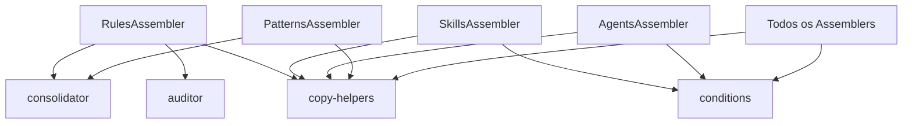

# História: Assembler Helpers

**ID:** STORY-008

## 1. Dependências

| Blocked By | Blocks |
| :--- | :--- |
| STORY-003, STORY-005 | STORY-009, STORY-010, STORY-011, STORY-012, STORY-013, STORY-014, STORY-015 |

## 2. Regras Transversais Aplicáveis

| ID | Título |
| :--- | :--- |
| RULE-001 | Compatibilidade de output |
| RULE-005 | Placeholder replacement |
| RULE-012 | Auditor thresholds |
| RULE-013 | Consolidator logic |

## 3. Descrição

Como **desenvolvedor do ia-dev-environment**, eu quero ter os módulos helper dos assemblers migrados para TypeScript, garantindo que copy, conditions, consolidation e auditing produzam resultados idênticos ao Python.

Estes 4 módulos são usados por praticamente todos os 14 assemblers. São as primitivas de manipulação de arquivos e lógica condicional compartilhada.

### 3.1 Módulos Python de Origem

| Módulo Python | Módulo TypeScript |
| :--- | :--- |
| `assembler/copy_helpers.py` | `src/assembler/copy-helpers.ts` |
| `assembler/conditions.py` | `src/assembler/conditions.ts` |
| `assembler/consolidator.py` | `src/assembler/consolidator.ts` |
| `assembler/auditor.py` | `src/assembler/auditor.ts` |

### 3.2 copy-helpers.ts

- `copyTemplateFile(src, dest, config, engine)` — copia arquivo com placeholder replacement em .md
- `copyTemplateTree(srcDir, destDir, config, engine)` — copia diretório recursivamente com placeholder replacement em .md
- `replacePlaceholdersInDir(dir, config, engine)` — aplica placeholder replacement em todos .md de um diretório
- Usa `node:fs/promises` para operações de arquivo

### 3.3 conditions.ts

- `hasInterface(config, type)` — verifica se config tem interface do tipo especificado
- `hasAnyInterface(config, types)` — verifica se config tem alguma das interfaces
- `extractInterfaceTypes(config)` — retorna lista de todos os tipos de interface

### 3.4 consolidator.ts

- `consolidateFiles(sources, dest, separator)` — merge de múltiplos arquivos em um
- `consolidateFrameworkRules(srcDir, destDir, groups)` — agrupa framework files em 3 categorias: core, data, ops
- Lógica de agrupamento baseada em sufixos/prefixos de nomes de arquivo

### 3.5 auditor.ts

- `AuditResult` — interface com fileCount, totalBytes, warnings
- `auditRulesContext(dir)` — conta arquivos e bytes no diretório de rules
- Thresholds: ≤ 10 files, ≤ 50KB total
- Retorna warnings se limites excedidos

## 4. Definições de Qualidade Locais

### DoR Local (Definition of Ready)

- [ ] Módulos Python dos 4 helpers lidos integralmente
- [ ] Template engine (STORY-005) disponível para placeholder replacement
- [ ] Models (STORY-003) disponíveis para tipagem

### DoD Local (Definition of Done)

- [ ] copyTemplateFile e copyTemplateTree produzem mesmos arquivos que Python
- [ ] hasInterface, hasAnyInterface, extractInterfaceTypes com mesma lógica
- [ ] consolidateFiles e consolidateFrameworkRules com output idêntico
- [ ] auditRulesContext com mesmos thresholds e formato de warnings
- [ ] Testes com fixtures de arquivo temporários

### Global Definition of Done (DoD)

- **Cobertura:** ≥ 95% Line Coverage, ≥ 90% Branch Coverage
- **Testes Automatizados:** Unitários com vitest
- **Relatório de Cobertura:** vitest coverage lcov + text
- **Documentação:** JSDoc em funções públicas
- **Persistência:** N/A
- **Performance:** N/A

## 5. Contratos de Dados (Data Contract)

**AuditResult:**

| Campo | Tipo | Descrição |
| :--- | :--- | :--- |
| `fileCount` | `number` | Número de arquivos no diretório |
| `totalBytes` | `number` | Total de bytes |
| `warnings` | `string[]` | Avisos se thresholds excedidos |

**copyTemplateFile:**

| Parâmetro | Tipo | Obrigatório | Descrição |
| :--- | :--- | :--- | :--- |
| `src` | `string` | M | Path do arquivo fonte |
| `dest` | `string` | M | Path do arquivo destino |
| `config` | `ProjectConfig` | M | Config para placeholders |
| `engine` | `TemplateEngine` | M | Engine para rendering |

## 6. Diagramas

### 6.1 Uso dos Helpers pelos Assemblers



## 7. Critérios de Aceite (Gherkin)

```gherkin
Cenario: copyTemplateFile substitui placeholders em .md
  DADO que tenho um arquivo .md com {project_name} no conteúdo
  QUANDO executo copyTemplateFile com config.project.name = "my-app"
  ENTÃO o arquivo destino contém "my-app" onde havia {project_name}

Cenario: copyTemplateTree preserva estrutura de diretórios
  DADO que tenho um diretório com subdiretórios e arquivos .md
  QUANDO executo copyTemplateTree
  ENTÃO a estrutura é replicada no destino
  E placeholders nos .md são substituídos

Cenario: hasInterface detecta REST
  DADO que config tem interfaces [{type: "rest"}, {type: "grpc"}]
  QUANDO executo hasInterface(config, "rest")
  ENTÃO retorna true

Cenario: auditRulesContext gera warning para excesso de arquivos
  DADO que tenho um diretório com 12 arquivos de regra
  QUANDO executo auditRulesContext(dir)
  ENTÃO warnings contém mensagem sobre excesso de 10 arquivos

Cenario: consolidateFrameworkRules agrupa em 3 categorias
  DADO que tenho arquivos com sufixos core, data e ops
  QUANDO executo consolidateFrameworkRules
  ENTÃO 3 arquivos consolidados são gerados
  E cada um contém os arquivos da categoria correspondente
```

## 8. Sub-tarefas

- [ ] [Dev] Implementar `src/assembler/copy-helpers.ts`
- [ ] [Dev] Implementar `src/assembler/conditions.ts`
- [ ] [Dev] Implementar `src/assembler/consolidator.ts`
- [ ] [Dev] Implementar `src/assembler/auditor.ts`
- [ ] [Test] Unitário: copy helpers com arquivos temporários
- [ ] [Test] Unitário: conditions com diferentes configs
- [ ] [Test] Unitário: consolidator com múltiplos arquivos
- [ ] [Test] Unitário: auditor com thresholds excedidos e não excedidos
