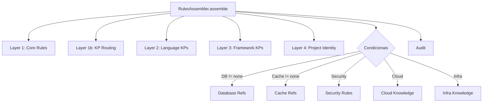

# História: RulesAssembler

**ID:** STORY-009

## 1. Dependências

| Blocked By | Blocks |
| :--- | :--- |
| STORY-006, STORY-007, STORY-008 | STORY-016 |

## 2. Regras Transversais Aplicáveis

| ID | Título |
| :--- | :--- |
| RULE-001 | Compatibilidade de output |
| RULE-005 | Placeholder replacement |
| RULE-006 | Feature gating |
| RULE-009 | Knowledge pack detection |
| RULE-012 | Auditor thresholds |
| RULE-013 | Consolidator logic |
| RULE-014 | Version resolver fallback |

## 3. Descrição

Como **desenvolvedor do ia-dev-environment**, eu quero ter o RulesAssembler migrado para TypeScript, garantindo que a geração de regras no diretório `.claude/rules/` seja idêntica ao Python.

O RulesAssembler é o maior e mais complexo assembler (540 linhas). Ele opera em 4+ layers:
1. Core rules com placeholder replacement
2. Routing de regras detalhadas para knowledge packs via `core_kp_routing`
3. Language/framework-specific knowledge packs com version resolver
4. Project identity rule com tabela de stack

### 3.1 Módulo Python de Origem

- `src/ia_dev_env/assembler/rules_assembler.py` (540 linhas)

### 3.2 Módulo TypeScript de Destino

- `src/assembler/rules-assembler.ts`

### 3.3 Layers de Geração

**Layer 1:** Copy core rules de `core-rules/*.md` para `rules/` com placeholder replacement
**Layer 1b:** Rota regras detalhadas para KPs usando `CoreKpRoute` mappings (CORE_TO_KP_MAPPING + CONDITIONAL_CORE_KP)
**Layer 2:** Copy language-specific files para coding-standards e testing KPs (common + version-specific via `findVersionDir`)
**Layer 3:** Copy framework files para stack-patterns KP (common + version-specific)
**Layer 4:** Gera `01-project-identity.md` com tabela de tech stack

**Condicionais:**
- `copyDatabaseRefs()` — se database != "none", copia SQL/NoSQL specific files
- `copyCacheRefs()` — se cache != "none", copia cache KPs
- `assembleSecurityRules()` — se security frameworks presentes
- `assembleCloudKnowledge()` — copia cloud provider files
- `assembleInfraKnowledge()` — K8s, containers, IaC files

**Auditoria:** `auditRulesContext()` após geração para verificar ≤10 files, ≤50KB

## 4. Definições de Qualidade Locais

### DoR Local (Definition of Ready)

- [ ] Módulo Python `rules_assembler.py` lido integralmente (540 linhas)
- [ ] Domain mappings (STORY-006) e helpers (STORY-008) disponíveis
- [ ] Validator/resolver (STORY-007) disponíveis
- [ ] Fixtures YAML de teste preparadas

### DoD Local (Definition of Done)

- [ ] Todas as 4+ layers implementadas com mesma lógica
- [ ] Funções condicionais (database, cache, security, cloud, infra) implementadas
- [ ] Version resolver integrado para language e framework files
- [ ] Auditoria executada após geração
- [ ] Output byte-for-byte idêntico ao Python para mesma config

### Global Definition of Done (DoD)

- **Cobertura:** ≥ 95% Line Coverage, ≥ 90% Branch Coverage
- **Testes Automatizados:** Unitários + testes de paridade com output Python
- **Relatório de Cobertura:** vitest coverage lcov + text
- **Documentação:** JSDoc em métodos públicos
- **Persistência:** N/A
- **Performance:** N/A

## 5. Contratos de Dados (Data Contract)

**RulesAssembler.assemble:**

| Parâmetro | Tipo | Obrigatório | Descrição |
| :--- | :--- | :--- | :--- |
| `config` | `ProjectConfig` | M | Configuração do projeto |
| `outputDir` | `string` | M | Diretório de saída |
| `resourcesDir` | `string` | M | Diretório de resources |
| `engine` | `TemplateEngine` | M | Template engine |
| retorno | `{ files: string[]; warnings: string[] }` | M | Arquivos gerados e avisos |

## 6. Diagramas

### 6.1 Fluxo de Geração de Regras



## 7. Critérios de Aceite (Gherkin)

```gherkin
Cenario: Geração de core rules com placeholders
  DADO que tenho um config com project_name "my-app"
  QUANDO executo RulesAssembler.assemble
  ENTÃO os arquivos em rules/ contêm "my-app" onde havia {project_name}
  E todos os arquivos de core-rules/ foram copiados

Cenario: Routing de regras para knowledge packs
  DADO que tenho um config válido
  QUANDO executo RulesAssembler.assemble
  ENTÃO as 11 rotas estáticas geram arquivos nos KPs correspondentes
  E rotas condicionais são aplicadas baseadas no config

Cenario: Language KPs com version resolver
  DADO que tenho um config com language "java" version "21"
  QUANDO executo RulesAssembler.assemble
  ENTÃO arquivos common de java são copiados para coding-standards KP
  E arquivos version-specific (21.x ou exact) são copiados

Cenario: Database refs condicionais
  DADO que tenho um config com database.name "postgresql"
  QUANDO executo RulesAssembler.assemble
  ENTÃO arquivos SQL-specific são copiados para o KP de dados

Cenario: Audit gera warning para excesso
  DADO que a geração produziu 12 arquivos de regra
  QUANDO a auditoria é executada
  ENTÃO um warning é adicionado ao resultado
```

## 8. Sub-tarefas

- [ ] [Dev] Implementar `RulesAssembler` classe com método `assemble`
- [ ] [Dev] Implementar Layer 1: core rules copy
- [ ] [Dev] Implementar Layer 1b: KP routing via core_kp_routing
- [ ] [Dev] Implementar Layer 2: language-specific KPs com version resolver
- [ ] [Dev] Implementar Layer 3: framework-specific KPs com version resolver
- [ ] [Dev] Implementar Layer 4: project identity generation
- [ ] [Dev] Implementar condicionais: database, cache, security, cloud, infra
- [ ] [Dev] Integrar auditor
- [ ] [Test] Unitário: cada layer individualmente
- [ ] [Test] Unitário: cada condicional (database, cache, security, cloud, infra)
- [ ] [Test] Paridade: comparar output com Python para mesma config
